```r
knitr::opts_chunk$set(echo = T, cache = T, warning = F, message = F, tidy = T, size = "small")
rm(list = ls(all.names = TRUE))

library(dplyr)
```

```
## 
## Attaching package: 'dplyr'
```

```
## The following objects are masked from 'package:stats':
## 
##     filter, lag
```

```
## The following objects are masked from 'package:base':
## 
##     intersect, setdiff, setequal, union
```

```r
library(ggplot2)
library(gridExtra)
```

```
## 
## Attaching package: 'gridExtra'
```

```
## The following object is masked from 'package:dplyr':
## 
##     combine
```

```r
library(knitr)
library(rmarkdown)
library(survey)
```

```
## Loading required package: grid
```

```
## Loading required package: Matrix
```

```
## Loading required package: survival
```

```
## 
## Attaching package: 'survey'
```

```
## The following object is masked from 'package:graphics':
## 
##     dotchart
```

```r
library(tidyr)
```

```
## 
## Attaching package: 'tidyr'
```

```
## The following object is masked from 'package:Matrix':
## 
##     expand
```


```r
## flu-survey/code/data_prep.R
load("~/git/flu-survey/data/data_prep.RData")

## create copy of factored data
df <- dataf
```


```r
## recode variables
library(car)

## use code function for response variables
## reset the "default" level on categorical variables
code <- function(col, map, ref) {
  relevel(as.factor(map[col]), ref=ref)
}

## income - PPINCIMP
income.map <- c(rep("under $10k", 3),
                rep("$10k to $25k", 4),
                rep("$25k to $50k", 4),
                rep("$50k to $75k", 2),
                rep("$75k to $100k", 2),
                rep("$100k to $150k", 2),
                rep("over $150k", 2))
df$income <- code(dataf$PPINCIMP, income.map, "under $10k")
income.lab <- c("under $10k", "$10k to $25k", "$25k to $50k", "$50k to $75k", "$75k to $100k", "$100k to $150k", "over $150k")
df$income <- factor(df$income, levels = income.lab)

## marital status - PPMARIT
marital.map <- c("single", "partnered", "partnered", "single", "single", "single")
df$marital <- code(dataf$PPMARIT, marital.map, "single")

## employment status - PPWORK
work.map <- c(rep("unemployed", 5),
              rep("employed", 2))
df$work <- code(dataf$PPWORK, work.map, "unemployed")
```


```r
## create ggplot templates
ptext <- theme(axis.text = element_text(size = rel(0.9)), axis.text.x = element_text(angle = 45, hjust = 1))
ptext2 <- ptext + theme(axis.text.x = element_blank())
```


```r
## create survey object
options(digits = 4)
options(survey.lonely.psu = "adjust")

des <- svydesign(ids = ~1, weights = ~weight, data = df[is.na(df$weight)==F, ])
```


# Q13. Do you get the flu vaccine?


```r
## Q13. Do you get the flu vaccine?
q13 <- as.data.frame(svytable(~Q13 + PPGENDER + ppagecat + PPETHM + income + PPEDUCAT + work + marital, des, round = T))
title <- ggtitle("Q13. Do you get the flu vaccine?")
p <- ggplot(q13, aes(Q13, weight = Freq)) + ptext
p + geom_bar() + title
```

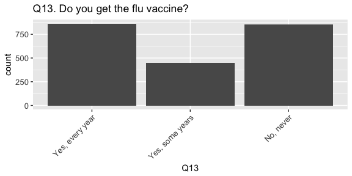<!-- -->


Significant chi-square p-values for Q13:
Age, education, ethnicity, housing type, income, marital status, metro status, region, rental status, employment status, internet 


## Ethnicity


```r
### Q13 and PPETHM: EXAMPLE ###

# chi-square: Q13 and PPETHM
svychisq(~Q13 + PPETHM, des)
```

```
## 
## 	Pearson's X^2: Rao & Scott adjustment
## 
## data:  svychisq(~Q13 + PPETHM, des)
## F = 2.6, ndf = 6.8, ddf = 15000.0, p-value = 0.01
```

```r
# glm: Q13 and PPETHM
a <- glm(Q13 ~ PPETHM, family = quasibinomial(link = "logit"), data = df, weights = weight)
summary(a)
```

```
## 
## Call:
## glm(formula = Q13 ~ PPETHM, family = quasibinomial(link = "logit"), 
##     data = df, weights = weight)
## 
## Deviance Residuals: 
##    Min      1Q  Median      3Q     Max  
## -2.407  -1.154   0.841   1.024   1.623  
## 
## Coefficients:
##                              Estimate Std. Error t value Pr(>|t|)    
## (Intercept)                    0.3312     0.0543    6.10  1.2e-09 ***
## PPETHMBlack, Non-Hispanic      0.3685     0.1444    2.55   0.0108 *  
## PPETHMHispanic                 0.3876     0.1301    2.98   0.0029 ** 
## PPETHMOther, Non-Hispanic      0.1638     0.1799    0.91   0.3627    
## PPETHM2+ Races, Non-Hispanic   0.4459     0.4172    1.07   0.2853    
## ---
## Signif. codes:  0 '***' 0.001 '**' 0.01 '*' 0.05 '.' 0.1 ' ' 1
## 
## (Dispersion parameter for quasibinomial family taken to be 0.9994)
## 
##     Null deviance: 2867.8  on 2149  degrees of freedom
## Residual deviance: 2853.4  on 2145  degrees of freedom
##   (18 observations deleted due to missingness)
## AIC: NA
## 
## Number of Fisher Scoring iterations: 4
```

```r
# what is the difference between the two above?

# weighted table
(q <- svyby(~Q13, ~PPETHM, des, svymean, na.rm = T))
```

```
##                                        PPETHM Q13Yes, every year
## White, Non-Hispanic       White, Non-Hispanic             0.4180
## Black, Non-Hispanic       Black, Non-Hispanic             0.3319
## Hispanic                             Hispanic             0.3277
## Other, Non-Hispanic       Other, Non-Hispanic             0.3787
## 2+ Races, Non-Hispanic 2+ Races, Non-Hispanic             0.3149
##                        Q13Yes, some years Q13No, never
## White, Non-Hispanic                0.1976       0.3845
## Black, Non-Hispanic                0.1863       0.4818
## Hispanic                           0.2445       0.4279
## Other, Non-Hispanic                0.2834       0.3378
## 2+ Races, Non-Hispanic             0.1483       0.5367
##                        se.Q13Yes, every year se.Q13Yes, some years
## White, Non-Hispanic                  0.01298               0.01077
## Black, Non-Hispanic                  0.03437               0.02877
## Hispanic                             0.03194               0.03021
## Other, Non-Hispanic                  0.05190               0.04735
## 2+ Races, Non-Hispanic               0.05234               0.04173
##                        se.Q13No, never
## White, Non-Hispanic            0.01306
## Black, Non-Hispanic            0.03734
## Hispanic                       0.03443
## Other, Non-Hispanic            0.05178
## 2+ Races, Non-Hispanic         0.05747
```

```r
# unweighted table
with(df, addmargins(table(Q13, PPETHM)))
```

```
##                  PPETHM
## Q13               White, Non-Hispanic Black, Non-Hispanic Hispanic
##   Yes, every year                 696                  69       80
##   Yes, some years                 293                  37       54
##   No, never                       567                  88       94
##   Sum                            1556                 194      228
##                  PPETHM
## Q13               Other, Non-Hispanic 2+ Races, Non-Hispanic  Sum
##   Yes, every year                  36                     27  908
##   Yes, some years                  28                     11  423
##   No, never                        29                     41  819
##   Sum                              93                     79 2150
```

```r
# plot: No, never
er <- geom_errorbar(aes(ymin = q[4] - q[7],
                        ymax = q[4] + q[7]), width = .25)
ggplot(q, aes(PPETHM, q[4])) + geom_point() + xlab("") + ylab("Q13No, never") + er + ggtitle(label = "") 
```

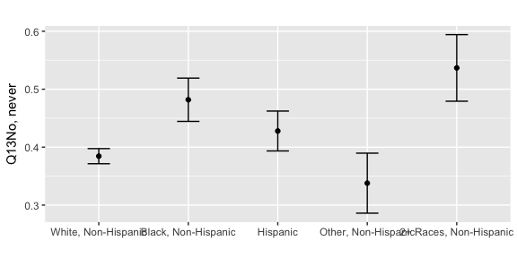<!-- -->

## Age


```r
## Q13 and ppagecat
svychisq(~Q13 + ppagecat, des)
```

```
## 
## 	Pearson's X^2: Rao & Scott adjustment
## 
## data:  svychisq(~Q13 + ppagecat, des)
## F = 14, ndf = 12, ddf = 25000, p-value <2e-16
```

```r
(q <- svyby(~Q13, ~ppagecat, des, svymean, na.rm = T))
```

```
##       ppagecat Q13Yes, every year Q13Yes, some years Q13No, never
## 18-24    18-24             0.2550            0.29193       0.4531
## 25-34    25-34             0.2405            0.28392       0.4756
## 35-44    35-44             0.3091            0.23224       0.4587
## 45-54    45-54             0.3554            0.22773       0.4169
## 55-64    55-64             0.4775            0.14615       0.3763
## 65-74    65-74             0.5832            0.13574       0.2811
## 75+        75+             0.7332            0.06169       0.2051
##       se.Q13Yes, every year se.Q13Yes, some years se.Q13No, never
## 18-24               0.03427               0.03630         0.03944
## 25-34               0.02615               0.02802         0.03111
## 35-44               0.02676               0.02454         0.02934
## 45-54               0.02576               0.02255         0.02647
## 55-64               0.02377               0.01611         0.02328
## 65-74               0.02859               0.01974         0.02623
## 75+                 0.03990               0.02170         0.03680
```

```r
a <- glm(Q13 ~ ppagecat, family = quasibinomial(link = "logit"), data = df, weights = weight)
summary(a)
```

```
## 
## Call:
## glm(formula = Q13 ~ ppagecat, family = quasibinomial(link = "logit"), 
##     data = df, weights = weight)
## 
## Deviance Residuals: 
##    Min      1Q  Median      3Q     Max  
## -2.663  -1.040   0.778   0.959   2.025  
## 
## Coefficients:
##               Estimate Std. Error t value Pr(>|t|)    
## (Intercept)     1.0722     0.1439    7.45  1.3e-13 ***
## ppagecat25-34   0.0776     0.1890    0.41   0.6813    
## ppagecat35-44  -0.2679     0.1830   -1.46   0.1433    
## ppagecat45-54  -0.4767     0.1833   -2.60   0.0094 ** 
## ppagecat55-64  -0.9824     0.1734   -5.67  1.6e-08 ***
## ppagecat65-74  -1.4081     0.1890   -7.45  1.3e-13 ***
## ppagecat75+    -2.0832     0.2535   -8.22  3.5e-16 ***
## ---
## Signif. codes:  0 '***' 0.001 '**' 0.01 '*' 0.05 '.' 0.1 ' ' 1
## 
## (Dispersion parameter for quasibinomial family taken to be 1)
## 
##     Null deviance: 2867.8  on 2149  degrees of freedom
## Residual deviance: 2686.4  on 2143  degrees of freedom
##   (18 observations deleted due to missingness)
## AIC: NA
## 
## Number of Fisher Scoring iterations: 4
```

```r
# weighted table
(q <- svyby(~Q13, ~ppagecat, des, svymean, na.rm = T))
```

```
##       ppagecat Q13Yes, every year Q13Yes, some years Q13No, never
## 18-24    18-24             0.2550            0.29193       0.4531
## 25-34    25-34             0.2405            0.28392       0.4756
## 35-44    35-44             0.3091            0.23224       0.4587
## 45-54    45-54             0.3554            0.22773       0.4169
## 55-64    55-64             0.4775            0.14615       0.3763
## 65-74    65-74             0.5832            0.13574       0.2811
## 75+        75+             0.7332            0.06169       0.2051
##       se.Q13Yes, every year se.Q13Yes, some years se.Q13No, never
## 18-24               0.03427               0.03630         0.03944
## 25-34               0.02615               0.02802         0.03111
## 35-44               0.02676               0.02454         0.02934
## 45-54               0.02576               0.02255         0.02647
## 55-64               0.02377               0.01611         0.02328
## 65-74               0.02859               0.01974         0.02623
## 75+                 0.03990               0.02170         0.03680
```

```r
# unweighted table
with(df, addmargins(table(Q13, ppagecat)))
```

```
##                  ppagecat
## Q13               18-24 25-34 35-44 45-54 55-64 65-74  75+  Sum
##   Yes, every year    45    73   102   138   238   201  111  908
##   Yes, some years    49    82    75    86    78    45    8  423
##   No, never          78   134   147   160   181    93   26  819
##   Sum               172   289   324   384   497   339  145 2150
```

```r
# plot: Yes, every year
er <- geom_errorbar(aes(ymin = q[2] - q[5],
                        ymax = q[2] + q[5]), width = .25)
ggplot(q, aes(ppagecat, q[2])) + geom_point() + xlab("") + ylab("Q13Yes, every year") + er + ggtitle(label = "") 
```

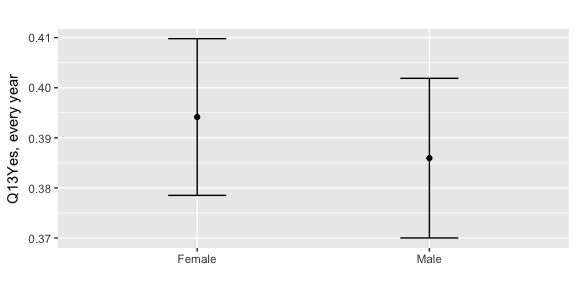<!-- -->


```r
## Q13 and ppagect4
svychisq(~Q13 + ppagect4, des)
```

```
## 
## 	Pearson's X^2: Rao & Scott adjustment
## 
## data:  svychisq(~Q13 + ppagect4, des)
## F = 25, ndf = 5.8, ddf = 13000.0, p-value <2e-16
```

```r
(q <- svyby(~Q13, ~ppagect4, des, svymean, na.rm = T))
```

```
##       ppagect4 Q13Yes, every year Q13Yes, some years Q13No, never
## 18-29    18-29             0.2452             0.3004       0.4544
## 30-44    30-44             0.2907             0.2381       0.4712
## 45-59    45-59             0.3864             0.2039       0.4097
## 60+        60+             0.5968             0.1150       0.2882
##       se.Q13Yes, every year se.Q13Yes, some years se.Q13No, never
## 18-29               0.02501               0.02697         0.02928
## 30-44               0.02184               0.02063         0.02441
## 45-59               0.02019               0.01649         0.02047
## 60+                 0.01949               0.01248         0.01815
```

```r
a <- glm(Q13 ~ ppagect4, family = quasibinomial(link = "logit"), data = df, weights = weight)
summary(a)
```

```
## 
## Call:
## glm(formula = Q13 ~ ppagect4, family = quasibinomial(link = "logit"), 
##     data = df, weights = weight)
## 
## Deviance Residuals: 
##    Min      1Q  Median      3Q     Max  
## -2.701  -1.021   0.793   0.966   2.087  
## 
## Coefficients:
##               Estimate Std. Error t value Pr(>|t|)    
## (Intercept)      1.124      0.109   10.31  < 2e-16 ***
## ppagect430-44   -0.232      0.145   -1.60     0.11    
## ppagect445-59   -0.662      0.139   -4.77  1.9e-06 ***
## ppagect460+     -1.517      0.138  -11.01  < 2e-16 ***
## ---
## Signif. codes:  0 '***' 0.001 '**' 0.01 '*' 0.05 '.' 0.1 ' ' 1
## 
## (Dispersion parameter for quasibinomial family taken to be 0.999)
## 
##     Null deviance: 2867.8  on 2149  degrees of freedom
## Residual deviance: 2700.4  on 2146  degrees of freedom
##   (18 observations deleted due to missingness)
## AIC: NA
## 
## Number of Fisher Scoring iterations: 4
```

```r
# weighted table
(q <- svyby(~Q13, ~ppagect4, des, svymean, na.rm = T))
```

```
##       ppagect4 Q13Yes, every year Q13Yes, some years Q13No, never
## 18-29    18-29             0.2452             0.3004       0.4544
## 30-44    30-44             0.2907             0.2381       0.4712
## 45-59    45-59             0.3864             0.2039       0.4097
## 60+        60+             0.5968             0.1150       0.2882
##       se.Q13Yes, every year se.Q13Yes, some years se.Q13No, never
## 18-29               0.02501               0.02697         0.02928
## 30-44               0.02184               0.02063         0.02441
## 45-59               0.02019               0.01649         0.02047
## 60+                 0.01949               0.01248         0.01815
```

```r
# unweighted table
with(df, addmargins(table(Q13, ppagect4)))
```

```
##                  ppagect4
## Q13               18-29 30-44 45-59  60+  Sum
##   Yes, every year    80   140   252  436  908
##   Yes, some years    95   111   135   82  423
##   No, never         143   216   260  200  819
##   Sum               318   467   647  718 2150
```

```r
# plot: Yes, every year
er <- geom_errorbar(aes(ymin = q[2] - q[5],
                        ymax = q[2] + q[5]), width = .25)
ggplot(q, aes(ppagect4, q[2])) + geom_point() + xlab("") + ylab("Q13Yes, every year") + er + ggtitle(label = "") 
```

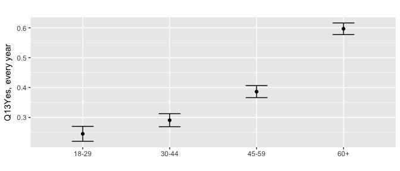<!-- -->

## Education


```r
## Q13 and PPEDUCAT
svychisq(~Q13 + PPEDUCAT, des)
```

```
## 
## 	Pearson's X^2: Rao & Scott adjustment
## 
## data:  svychisq(~Q13 + PPEDUCAT, des)
## F = 8.6, ndf = 5.7, ddf = 12000.0, p-value = 5e-09
```

```r
(q <- svyby(~Q13, ~PPEDUCAT, des, svymean, na.rm = T))
```

```
##                                                PPEDUCAT Q13Yes, every year
## Less than high school             Less than high school             0.3471
## High school                                 High school             0.4091
## Some college                               Some college             0.3234
## Bachelor_s degree or higher Bachelor_s degree or higher             0.4511
##                             Q13Yes, some years Q13No, never
## Less than high school                   0.1760       0.4769
## High school                             0.1358       0.4551
## Some college                            0.2657       0.4109
## Bachelor_s degree or higher             0.2396       0.3093
##                             se.Q13Yes, every year se.Q13Yes, some years
## Less than high school                     0.03873               0.03242
## High school                               0.02072               0.01497
## Some college                              0.01961               0.01958
## Bachelor_s degree or higher               0.01910               0.01674
##                             se.Q13No, never
## Less than high school               0.04153
## High school                         0.02121
## Some college                        0.02142
## Bachelor_s degree or higher         0.01797
```

```r
a <- glm(Q13 ~ PPEDUCAT, family = quasibinomial(link = "logit"), data = df, weights = weight)
summary(a)
```

```
## 
## Call:
## glm(formula = Q13 ~ PPEDUCAT, family = quasibinomial(link = "logit"), 
##     data = df, weights = weight)
## 
## Deviance Residuals: 
##    Min      1Q  Median      3Q     Max  
## -2.344  -1.192   0.815   1.021   1.622  
## 
## Coefficients:
##                                     Estimate Std. Error t value Pr(>|t|)
## (Intercept)                            0.632      0.132    4.79  1.8e-06
## PPEDUCATHigh school                   -0.264      0.155   -1.71   0.0874
## PPEDUCATSome college                   0.106      0.158    0.67   0.5006
## PPEDUCATBachelor_s degree or higher   -0.436      0.154   -2.83   0.0047
##                                        
## (Intercept)                         ***
## PPEDUCATHigh school                 .  
## PPEDUCATSome college                   
## PPEDUCATBachelor_s degree or higher ** 
## ---
## Signif. codes:  0 '***' 0.001 '**' 0.01 '*' 0.05 '.' 0.1 ' ' 1
## 
## (Dispersion parameter for quasibinomial family taken to be 0.999)
## 
##     Null deviance: 2867.8  on 2149  degrees of freedom
## Residual deviance: 2843.3  on 2146  degrees of freedom
##   (18 observations deleted due to missingness)
## AIC: NA
## 
## Number of Fisher Scoring iterations: 4
```

```r
# weighted table
(q <- svyby(~Q13, ~PPEDUCAT, des, svymean, na.rm = T))
```

```
##                                                PPEDUCAT Q13Yes, every year
## Less than high school             Less than high school             0.3471
## High school                                 High school             0.4091
## Some college                               Some college             0.3234
## Bachelor_s degree or higher Bachelor_s degree or higher             0.4511
##                             Q13Yes, some years Q13No, never
## Less than high school                   0.1760       0.4769
## High school                             0.1358       0.4551
## Some college                            0.2657       0.4109
## Bachelor_s degree or higher             0.2396       0.3093
##                             se.Q13Yes, every year se.Q13Yes, some years
## Less than high school                     0.03873               0.03242
## High school                               0.02072               0.01497
## Some college                              0.01961               0.01958
## Bachelor_s degree or higher               0.01910               0.01674
##                             se.Q13No, never
## Less than high school               0.04153
## High school                         0.02121
## Some college                        0.02142
## Bachelor_s degree or higher         0.01797
```

```r
# unweighted table
with(df, addmargins(table(Q13, PPEDUCAT)))
```

```
##                  PPEDUCAT
## Q13               Less than high school High school Some college
##   Yes, every year                    60         271          218
##   Yes, some years                    27          79          147
##   No, never                          73         279          239
##   Sum                               160         629          604
##                  PPEDUCAT
## Q13               Bachelor_s degree or higher  Sum
##   Yes, every year                         359  908
##   Yes, some years                         170  423
##   No, never                               228  819
##   Sum                                     757 2150
```

```r
# plot: Yes, every year
er <- geom_errorbar(aes(ymin = q[2] - q[5],
                        ymax = q[2] + q[5]), width = .25)
ggplot(q, aes(PPEDUCAT, q[2])) + geom_point() + xlab("") + ylab("Q13Yes, every year") + er + ggtitle(label = "") 
```

<!-- -->

## Housing type


```r
## Q13 and PPHOUSE
svychisq(~Q13 + PPHOUSE, des)
```

```
## 
## 	Pearson's X^2: Rao & Scott adjustment
## 
## data:  svychisq(~Q13 + PPHOUSE, des)
## F = 2.1, ndf = 7.9, ddf = 17000.0, p-value = 0.03
```

```r
(q <- svyby(~Q13, ~PPHOUSE, des, svymean, na.rm = T))
```

```
##                                                                                             PPHOUSE
## A building with 2 or more apartments                           A building with 2 or more apartments
## A mobile home                                                                         A mobile home
## A one-family house attached to one or more houses A one-family house attached to one or more houses
## A one-family house detached from any other house   A one-family house detached from any other house
## Boat, RV, van, etc.                                                             Boat, RV, van, etc.
##                                                   Q13Yes, every year
## A building with 2 or more apartments                          0.3120
## A mobile home                                                 0.3338
## A one-family house attached to one or more houses             0.3769
## A one-family house detached from any other house              0.4156
## Boat, RV, van, etc.                                           0.3887
##                                                   Q13Yes, some years
## A building with 2 or more apartments                          0.2546
## A mobile home                                                 0.2005
## A one-family house attached to one or more houses             0.1991
## A one-family house detached from any other house              0.2007
## Boat, RV, van, etc.                                           0.0000
##                                                   Q13No, never
## A building with 2 or more apartments                    0.4335
## A mobile home                                           0.4658
## A one-family house attached to one or more houses       0.4240
## A one-family house detached from any other house        0.3837
## Boat, RV, van, etc.                                     0.6113
##                                                   se.Q13Yes, every year
## A building with 2 or more apartments                            0.02633
## A mobile home                                                   0.05259
## A one-family house attached to one or more houses               0.04262
## A one-family house detached from any other house                0.01327
## Boat, RV, van, etc.                                             0.14711
##                                                   se.Q13Yes, some years
## A building with 2 or more apartments                            0.02523
## A mobile home                                                   0.04394
## A one-family house attached to one or more houses               0.03669
## A one-family house detached from any other house                0.01119
## Boat, RV, van, etc.                                             0.00000
##                                                   se.Q13No, never
## A building with 2 or more apartments                      0.02881
## A mobile home                                             0.05571
## A one-family house attached to one or more houses         0.04512
## A one-family house detached from any other house          0.01339
## Boat, RV, van, etc.                                       0.14711
```

```r
a <- glm(Q13 ~ PPHOUSE, family = quasibinomial(link = "logit"), data = df, weights = weight)
summary(a)
```

```
## 
## Call:
## glm(formula = Q13 ~ PPHOUSE, family = quasibinomial(link = "logit"), 
##     data = df, weights = weight)
## 
## Deviance Residuals: 
##    Min      1Q  Median      3Q     Max  
## -2.371  -1.176   0.812   1.007   1.670  
## 
## Coefficients:
##                                                          Estimate
## (Intercept)                                                0.7910
## PPHOUSEA mobile home                                      -0.0998
## PPHOUSEA one-family house attached to one or more houses  -0.2881
## PPHOUSEA one-family house detached from any other house   -0.4502
## PPHOUSEBoat, RV, van, etc.                                -0.3381
##                                                          Std. Error
## (Intercept)                                                  0.1107
## PPHOUSEA mobile home                                         0.2351
## PPHOUSEA one-family house attached to one or more houses     0.1989
## PPHOUSEA one-family house detached from any other house      0.1226
## PPHOUSEBoat, RV, van, etc.                                   0.5089
##                                                          t value Pr(>|t|)
## (Intercept)                                                 7.15  1.2e-12
## PPHOUSEA mobile home                                       -0.42  0.67126
## PPHOUSEA one-family house attached to one or more houses   -1.45  0.14754
## PPHOUSEA one-family house detached from any other house    -3.67  0.00025
## PPHOUSEBoat, RV, van, etc.                                 -0.66  0.50650
##                                                             
## (Intercept)                                              ***
## PPHOUSEA mobile home                                        
## PPHOUSEA one-family house attached to one or more houses    
## PPHOUSEA one-family house detached from any other house  ***
## PPHOUSEBoat, RV, van, etc.                                  
## ---
## Signif. codes:  0 '***' 0.001 '**' 0.01 '*' 0.05 '.' 0.1 ' ' 1
## 
## (Dispersion parameter for quasibinomial family taken to be 0.9994)
## 
##     Null deviance: 2867.8  on 2149  degrees of freedom
## Residual deviance: 2852.2  on 2145  degrees of freedom
##   (18 observations deleted due to missingness)
## AIC: NA
## 
## Number of Fisher Scoring iterations: 4
```

```r
# weighted table
(q <- svyby(~Q13, ~PPHOUSE, des, svymean, na.rm = T))
```

```
##                                                                                             PPHOUSE
## A building with 2 or more apartments                           A building with 2 or more apartments
## A mobile home                                                                         A mobile home
## A one-family house attached to one or more houses A one-family house attached to one or more houses
## A one-family house detached from any other house   A one-family house detached from any other house
## Boat, RV, van, etc.                                                             Boat, RV, van, etc.
##                                                   Q13Yes, every year
## A building with 2 or more apartments                          0.3120
## A mobile home                                                 0.3338
## A one-family house attached to one or more houses             0.3769
## A one-family house detached from any other house              0.4156
## Boat, RV, van, etc.                                           0.3887
##                                                   Q13Yes, some years
## A building with 2 or more apartments                          0.2546
## A mobile home                                                 0.2005
## A one-family house attached to one or more houses             0.1991
## A one-family house detached from any other house              0.2007
## Boat, RV, van, etc.                                           0.0000
##                                                   Q13No, never
## A building with 2 or more apartments                    0.4335
## A mobile home                                           0.4658
## A one-family house attached to one or more houses       0.4240
## A one-family house detached from any other house        0.3837
## Boat, RV, van, etc.                                     0.6113
##                                                   se.Q13Yes, every year
## A building with 2 or more apartments                            0.02633
## A mobile home                                                   0.05259
## A one-family house attached to one or more houses               0.04262
## A one-family house detached from any other house                0.01327
## Boat, RV, van, etc.                                             0.14711
##                                                   se.Q13Yes, some years
## A building with 2 or more apartments                            0.02523
## A mobile home                                                   0.04394
## A one-family house attached to one or more houses               0.03669
## A one-family house detached from any other house                0.01119
## Boat, RV, van, etc.                                             0.00000
##                                                   se.Q13No, never
## A building with 2 or more apartments                      0.02881
## A mobile home                                             0.05571
## A one-family house attached to one or more houses         0.04512
## A one-family house detached from any other house          0.01339
## Boat, RV, van, etc.                                       0.14711
```

```r
# unweighted table
with(df, addmargins(table(Q13, PPHOUSE)))
```

```
##                  PPHOUSE
## Q13               A building with 2 or more apartments A mobile home
##   Yes, every year                                  114            32
##   Yes, some years                                   87            18
##   No, never                                        145            43
##   Sum                                              346            93
##                  PPHOUSE
## Q13               A one-family house attached to one or more houses
##   Yes, every year                                                63
##   Yes, some years                                                27
##   No, never                                                      56
##   Sum                                                           146
##                  PPHOUSE
## Q13               A one-family house detached from any other house
##   Yes, every year                                              694
##   Yes, some years                                              291
##   No, never                                                    568
##   Sum                                                         1553
##                  PPHOUSE
## Q13               Boat, RV, van, etc.  Sum
##   Yes, every year                   5  908
##   Yes, some years                   0  423
##   No, never                         7  819
##   Sum                              12 2150
```

```r
# plot: Yes, every year
er <- geom_errorbar(aes(ymin = q[2] - q[5],
                        ymax = q[2] + q[5]), width = .25)
ggplot(q, aes(PPHOUSE, q[2])) + geom_point() + xlab("") + ylab("Q13Yes, every year") + er + ggtitle(label = "") 
```

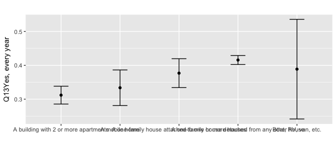<!-- -->

## Income


```r
## Q13 and income
svychisq(~Q13 + income, des)
```

```
## 
## 	Pearson's X^2: Rao & Scott adjustment
## 
## data:  svychisq(~Q13 + income, des)
## F = 4.2, ndf = 12, ddf = 26000, p-value = 1e-06
```

```r
(q <- svyby(~Q13, ~income, des, svymean, na.rm = T))
```

```
##                        income Q13Yes, every year Q13Yes, some years
## under $10k         under $10k             0.2720             0.1695
## $10k to $25k     $10k to $25k             0.3069             0.1669
## $25k to $50k     $25k to $50k             0.3757             0.1920
## $50k to $75k     $50k to $75k             0.3791             0.2177
## $75k to $100k   $75k to $100k             0.3786             0.2428
## $100k to $150k $100k to $150k             0.4425             0.2331
## over $150k         over $150k             0.5284             0.1982
##                Q13No, never se.Q13Yes, every year se.Q13Yes, some years
## under $10k           0.5584               0.05007               0.04299
## $10k to $25k         0.5262               0.03100               0.02726
## $25k to $50k         0.4323               0.02440               0.02030
## $50k to $75k         0.4033               0.02539               0.02292
## $75k to $100k        0.3786               0.02890               0.02592
## $100k to $150k       0.3243               0.02462               0.02189
## over $150k           0.2734               0.03754               0.02991
##                se.Q13No, never
## under $10k             0.05651
## $10k to $25k           0.03480
## $25k to $50k           0.02546
## $50k to $75k           0.02642
## $75k to $100k          0.03005
## $100k to $150k         0.02348
## over $150k             0.03339
```

```r
a <- glm(Q13 ~ income, family = quasibinomial(link = "logit"), data = df, weights = weight)
summary(a)
```

```
## 
## Call:
## glm(formula = Q13 ~ income, family = quasibinomial(link = "logit"), 
##     data = df, weights = weight)
## 
## Deviance Residuals: 
##    Min      1Q  Median      3Q     Max  
## -2.447  -1.181   0.792   1.002   1.975  
## 
## Coefficients:
##                      Estimate Std. Error t value Pr(>|t|)    
## (Intercept)             0.984      0.207    4.76  2.0e-06 ***
## income$10k to $25k     -0.170      0.248   -0.68    0.494    
## income$25k to $50k     -0.476      0.228   -2.09    0.037 *  
## income$50k to $75k     -0.491      0.232   -2.11    0.035 *  
## income$75k to $100k    -0.489      0.237   -2.06    0.039 *  
## income$100k to $150k   -0.753      0.229   -3.29    0.001 ** 
## incomeover $150k       -1.098      0.251   -4.38  1.3e-05 ***
## ---
## Signif. codes:  0 '***' 0.001 '**' 0.01 '*' 0.05 '.' 0.1 ' ' 1
## 
## (Dispersion parameter for quasibinomial family taken to be 1)
## 
##     Null deviance: 2867.8  on 2149  degrees of freedom
## Residual deviance: 2831.9  on 2143  degrees of freedom
##   (18 observations deleted due to missingness)
## AIC: NA
## 
## Number of Fisher Scoring iterations: 4
```

```r
# weighted table
(q <- svyby(~Q13, ~income, des, svymean, na.rm = T))
```

```
##                        income Q13Yes, every year Q13Yes, some years
## under $10k         under $10k             0.2720             0.1695
## $10k to $25k     $10k to $25k             0.3069             0.1669
## $25k to $50k     $25k to $50k             0.3757             0.1920
## $50k to $75k     $50k to $75k             0.3791             0.2177
## $75k to $100k   $75k to $100k             0.3786             0.2428
## $100k to $150k $100k to $150k             0.4425             0.2331
## over $150k         over $150k             0.5284             0.1982
##                Q13No, never se.Q13Yes, every year se.Q13Yes, some years
## under $10k           0.5584               0.05007               0.04299
## $10k to $25k         0.5262               0.03100               0.02726
## $25k to $50k         0.4323               0.02440               0.02030
## $50k to $75k         0.4033               0.02539               0.02292
## $75k to $100k        0.3786               0.02890               0.02592
## $100k to $150k       0.3243               0.02462               0.02189
## over $150k           0.2734               0.03754               0.02991
##                se.Q13No, never
## under $10k             0.05651
## $10k to $25k           0.03480
## $25k to $50k           0.02546
## $50k to $75k           0.02642
## $75k to $100k          0.03005
## $100k to $150k         0.02348
## over $150k             0.03339
```

```r
# unweighted table
with(df, addmargins(table(Q13, income)))
```

```
##                  income
## Q13               under $10k $10k to $25k $25k to $50k $50k to $75k
##   Yes, every year         24           83          178          168
##   Yes, some years         15           36           81           78
##   No, never               50          118          183          158
##   Sum                     89          237          442          404
##                  income
## Q13               $75k to $100k $100k to $150k over $150k  Sum
##   Yes, every year           131            213        111  908
##   Yes, some years            74             99         40  423
##   No, never                 106            146         58  819
##   Sum                       311            458        209 2150
```

```r
# plot: Yes, every year
er <- geom_errorbar(aes(ymin = q[2] - q[5],
                        ymax = q[2] + q[5]), width = .25)
ggplot(q, aes(income, q[2])) + geom_point() + xlab("") + ylab("Q13Yes, every year") + er + ggtitle(label = "") 
```

<!-- -->

## Marital status


```r
## Q13 and marital
svychisq(~Q13 + marital, des)
```

```
## 
## 	Pearson's X^2: Rao & Scott adjustment
## 
## data:  svychisq(~Q13 + marital, des)
## F = 12, ndf = 2, ddf = 4300, p-value = 6e-06
```

```r
(q <- svyby(~Q13, ~marital, des, svymean, na.rm = T))
```

```
##             marital Q13Yes, every year Q13Yes, some years Q13No, never
## single       single             0.3367             0.1992       0.4641
## partnered partnered             0.4315             0.2157       0.3528
##           se.Q13Yes, every year se.Q13Yes, some years se.Q13No, never
## single                  0.01729               0.01512         0.01865
## partnered               0.01448               0.01239         0.01424
```

```r
a <- glm(Q13 ~ marital, family = quasibinomial(link = "logit"), data = df, weights = weight)
summary(a)
```

```
## 
## Call:
## glm(formula = Q13 ~ marital, family = quasibinomial(link = "logit"), 
##     data = df, weights = weight)
## 
## Deviance Residuals: 
##    Min      1Q  Median      3Q     Max  
## -2.377  -1.167   0.807   1.014   1.712  
## 
## Coefficients:
##                  Estimate Std. Error t value Pr(>|t|)    
## (Intercept)        0.6780     0.0692    9.80  < 2e-16 ***
## maritalpartnered  -0.4023     0.0903   -4.46  8.7e-06 ***
## ---
## Signif. codes:  0 '***' 0.001 '**' 0.01 '*' 0.05 '.' 0.1 ' ' 1
## 
## (Dispersion parameter for quasibinomial family taken to be 0.998)
## 
##     Null deviance: 2867.8  on 2149  degrees of freedom
## Residual deviance: 2847.7  on 2148  degrees of freedom
##   (18 observations deleted due to missingness)
## AIC: NA
## 
## Number of Fisher Scoring iterations: 4
```

```r
# weighted table
(q <- svyby(~Q13, ~marital, des, svymean, na.rm = T))
```

```
##             marital Q13Yes, every year Q13Yes, some years Q13No, never
## single       single             0.3367             0.1992       0.4641
## partnered partnered             0.4315             0.2157       0.3528
##           se.Q13Yes, every year se.Q13Yes, some years se.Q13No, never
## single                  0.01729               0.01512         0.01865
## partnered               0.01448               0.01239         0.01424
```

```r
# unweighted table
with(df, addmargins(table(Q13, marital)))
```

```
##                  marital
## Q13               single partnered  Sum
##   Yes, every year    302       606  908
##   Yes, some years    160       263  423
##   No, never          374       445  819
##   Sum                836      1314 2150
```

```r
# plot: Yes, every year
er <- geom_errorbar(aes(ymin = q[2] - q[5],
                        ymax = q[2] + q[5]), width = .25)
ggplot(q, aes(marital, q[2])) + geom_point() + xlab("") + ylab("Q13Yes, every year") + er + ggtitle(label = "") 
```

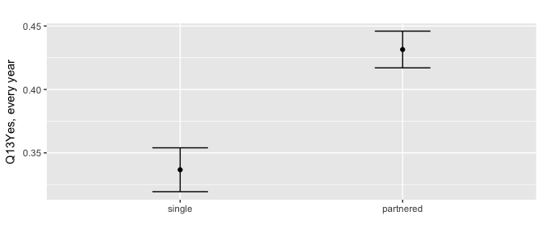<!-- -->

## Metro status


```r
## Q13 and PPMSACAT
svychisq(~Q13 + PPMSACAT, des)
```

```
## 
## 	Pearson's X^2: Rao & Scott adjustment
## 
## data:  svychisq(~Q13 + PPMSACAT, des)
## F = 3.9, ndf = 2, ddf = 4300, p-value = 0.02
```

```r
(q <- svyby(~Q13, ~PPMSACAT, des, svymean, na.rm = T))
```

```
##            PPMSACAT Q13Yes, every year Q13Yes, some years Q13No, never
## Metro         Metro             0.3887             0.2191       0.3922
## Non-Metro Non-Metro             0.3990             0.1487       0.4524
##           se.Q13Yes, every year se.Q13Yes, some years se.Q13No, never
## Metro                   0.01208               0.01063         0.01241
## Non-Metro               0.02932               0.02135         0.03035
```

```r
a <- glm(Q13 ~ PPMSACAT, family = quasibinomial(link = "logit"), data = df, weights = weight)
summary(a)
```

```
## 
## Call:
## glm(formula = Q13 ~ PPMSACAT, family = quasibinomial(link = "logit"), 
##     data = df, weights = weight)
## 
## Deviance Residuals: 
##    Min      1Q  Median      3Q     Max  
## -2.215  -1.193   0.814   1.007   1.626  
## 
## Coefficients:
##                   Estimate Std. Error t value Pr(>|t|)    
## (Intercept)         0.4529     0.0480    9.43   <2e-16 ***
## PPMSACATNon-Metro  -0.0432     0.1235   -0.35     0.73    
## ---
## Signif. codes:  0 '***' 0.001 '**' 0.01 '*' 0.05 '.' 0.1 ' ' 1
## 
## (Dispersion parameter for quasibinomial family taken to be 0.998)
## 
##     Null deviance: 2867.8  on 2149  degrees of freedom
## Residual deviance: 2867.6  on 2148  degrees of freedom
##   (18 observations deleted due to missingness)
## AIC: NA
## 
## Number of Fisher Scoring iterations: 4
```

```r
# weighted table
(q <- svyby(~Q13, ~PPMSACAT, des, svymean, na.rm = T))
```

```
##            PPMSACAT Q13Yes, every year Q13Yes, some years Q13No, never
## Metro         Metro             0.3887             0.2191       0.3922
## Non-Metro Non-Metro             0.3990             0.1487       0.4524
##           se.Q13Yes, every year se.Q13Yes, some years se.Q13No, never
## Metro                   0.01208               0.01063         0.01241
## Non-Metro               0.02932               0.02135         0.03035
```

```r
# unweighted table
with(df, addmargins(table(Q13, PPMSACAT)))
```

```
##                  PPMSACAT
## Q13               Metro Non-Metro  Sum
##   Yes, every year   772       136  908
##   Yes, some years   376        47  423
##   No, never         682       137  819
##   Sum              1830       320 2150
```

```r
# plot: Yes, every year
er <- geom_errorbar(aes(ymin = q[2] - q[5],
                        ymax = q[2] + q[5]), width = .25)
ggplot(q, aes(PPMSACAT, q[2])) + geom_point() + xlab("") + ylab("Q13Yes, every year") + er + ggtitle(label = "") 
```

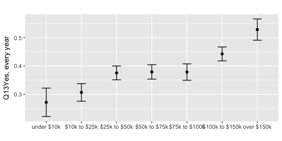<!-- -->

## Region


```r
## Q13 and ppreg9
svychisq(~Q13 + ppreg9, des)
```

```
## 
## 	Pearson's X^2: Rao & Scott adjustment
## 
## data:  svychisq(~Q13 + ppreg9, des)
## F = 2.1, ndf = 16, ddf = 34000, p-value = 0.005
```

```r
(q <- svyby(~Q13, ~ppreg9, des, svymean, na.rm = T))
```

```
##                                ppreg9 Q13Yes, every year
## East-North Central East-North Central             0.3490
## East-South Central East-South Central             0.4245
## Mid-Atlantic             Mid-Atlantic             0.4222
## Mountain                     Mountain             0.3642
## New England               New England             0.3469
## Pacific                       Pacific             0.3766
## South Atlantic         South Atlantic             0.3761
## West-North Central West-North Central             0.4793
## West-South Central West-South Central             0.4151
##                    Q13Yes, some years Q13No, never se.Q13Yes, every year
## East-North Central             0.1981       0.4529               0.02757
## East-South Central             0.1232       0.4524               0.05004
## Mid-Atlantic                   0.1941       0.3837               0.03043
## Mountain                       0.2744       0.3613               0.03898
## New England                    0.2080       0.4451               0.04674
## Pacific                        0.2850       0.3384               0.02936
## South Atlantic                 0.1728       0.4511               0.02420
## West-North Central             0.1997       0.3210               0.04271
## West-South Central             0.1987       0.3862               0.03545
##                    se.Q13Yes, some years se.Q13No, never
## East-North Central               0.02440         0.02967
## East-South Central               0.03269         0.05160
## Mid-Atlantic                     0.02489         0.03023
## Mountain                         0.03761         0.03978
## New England                      0.03999         0.04942
## Pacific                          0.02828         0.02921
## South Atlantic                   0.01952         0.02573
## West-North Central               0.03407         0.04135
## West-South Central               0.02948         0.03595
```

```r
a <- glm(Q13 ~ ppreg9, family = quasibinomial(link = "logit"), data = df, weights = weight)
summary(a)
```

```
## 
## Call:
## glm(formula = Q13 ~ ppreg9, family = quasibinomial(link = "logit"), 
##     data = df, weights = weight)
## 
## Deviance Residuals: 
##    Min      1Q  Median      3Q     Max  
## -2.290  -1.197   0.795   1.007   1.766  
## 
## Coefficients:
##                          Estimate Std. Error t value Pr(>|t|)    
## (Intercept)               0.62355    0.11869    5.25  1.6e-07 ***
## ppreg9East-South Central -0.31908    0.22439   -1.42   0.1552    
## ppreg9Mid-Atlantic       -0.30963    0.16791   -1.84   0.0653 .  
## ppreg9Mountain           -0.06657    0.19716   -0.34   0.7357    
## ppreg9New England         0.00931    0.24140    0.04   0.9692    
## ppreg9Pacific            -0.11942    0.16500   -0.72   0.4693    
## ppreg9South Atlantic     -0.11746    0.15476   -0.76   0.4480    
## ppreg9West-North Central -0.54066    0.20428   -2.65   0.0082 ** 
## ppreg9West-South Central -0.28076    0.17488   -1.61   0.1086    
## ---
## Signif. codes:  0 '***' 0.001 '**' 0.01 '*' 0.05 '.' 0.1 ' ' 1
## 
## (Dispersion parameter for quasibinomial family taken to be 1.001)
## 
##     Null deviance: 2867.8  on 2149  degrees of freedom
## Residual deviance: 2856.4  on 2141  degrees of freedom
##   (18 observations deleted due to missingness)
## AIC: NA
## 
## Number of Fisher Scoring iterations: 4
```

```r
# weighted table
(q <- svyby(~Q13, ~ppreg9, des, svymean, na.rm = T))
```

```
##                                ppreg9 Q13Yes, every year
## East-North Central East-North Central             0.3490
## East-South Central East-South Central             0.4245
## Mid-Atlantic             Mid-Atlantic             0.4222
## Mountain                     Mountain             0.3642
## New England               New England             0.3469
## Pacific                       Pacific             0.3766
## South Atlantic         South Atlantic             0.3761
## West-North Central West-North Central             0.4793
## West-South Central West-South Central             0.4151
##                    Q13Yes, some years Q13No, never se.Q13Yes, every year
## East-North Central             0.1981       0.4529               0.02757
## East-South Central             0.1232       0.4524               0.05004
## Mid-Atlantic                   0.1941       0.3837               0.03043
## Mountain                       0.2744       0.3613               0.03898
## New England                    0.2080       0.4451               0.04674
## Pacific                        0.2850       0.3384               0.02936
## South Atlantic                 0.1728       0.4511               0.02420
## West-North Central             0.1997       0.3210               0.04271
## West-South Central             0.1987       0.3862               0.03545
##                    se.Q13Yes, some years se.Q13No, never
## East-North Central               0.02440         0.02967
## East-South Central               0.03269         0.05160
## Mid-Atlantic                     0.02489         0.03023
## Mountain                         0.03761         0.03978
## New England                      0.03999         0.04942
## Pacific                          0.02828         0.02921
## South Atlantic                   0.01952         0.02573
## West-North Central               0.03407         0.04135
## West-South Central               0.02948         0.03595
```

```r
# unweighted table
with(df, addmargins(table(Q13, ppreg9)))
```

```
##                  ppreg9
## Q13               East-North Central East-South Central Mid-Atlantic
##   Yes, every year                123                 51          132
##   Yes, some years                 61                 13           57
##   No, never                      137                 44          115
##   Sum                            321                108          304
##                  ppreg9
## Q13               Mountain New England Pacific South Atlantic
##   Yes, every year       70          42     131            180
##   Yes, some years       43          24      81             72
##   No, never             65          49     105            180
##   Sum                  178         115     317            432
##                  ppreg9
## Q13               West-North Central West-South Central  Sum
##   Yes, every year                 80                 99  908
##   Yes, some years                 30                 42  423
##   No, never                       45                 79  819
##   Sum                            155                220 2150
```

```r
# plot: Yes, every year
er <- geom_errorbar(aes(ymin = q[2] - q[5],
                        ymax = q[2] + q[5]), width = .25)
ggplot(q, aes(ppreg9, q[2])) + geom_point() + xlab("") + ylab("Q13Yes, every year") + er + ggtitle(label = "") 
```

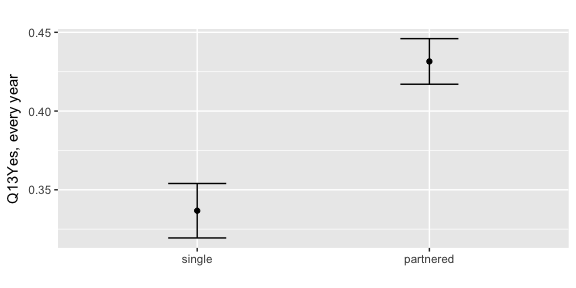<!-- -->

## Rental Status


```r
## Q13 and PPRENT
svychisq(~Q13 + PPRENT, des)
```

```
## 
## 	Pearson's X^2: Rao & Scott adjustment
## 
## data:  svychisq(~Q13 + PPRENT, des)
## F = 8.1, ndf = 4, ddf = 8600, p-value = 2e-06
```

```r
(q <- svyby(~Q13, ~PPRENT, des, svymean, na.rm = T))
```

```
##                                                                                                              PPRENT
## Occupied without payment of cash rent                                         Occupied without payment of cash rent
## Owned or being bought by you or someone in your household Owned or being bought by you or someone in your household
## Rented for cash                                                                                     Rented for cash
##                                                           Q13Yes, every year
## Occupied without payment of cash rent                                 0.3009
## Owned or being bought by you or someone in your household             0.4345
## Rented for cash                                                       0.2887
##                                                           Q13Yes, some years
## Occupied without payment of cash rent                                 0.1867
## Owned or being bought by you or someone in your household             0.1978
## Rented for cash                                                       0.2393
##                                                           Q13No, never
## Occupied without payment of cash rent                           0.5124
## Owned or being bought by you or someone in your household       0.3677
## Rented for cash                                                 0.4720
##                                                           se.Q13Yes, every year
## Occupied without payment of cash rent                                   0.05704
## Owned or being bought by you or someone in your household               0.01333
## Rented for cash                                                         0.02122
##                                                           se.Q13Yes, some years
## Occupied without payment of cash rent                                   0.05091
## Owned or being bought by you or someone in your household               0.01099
## Rented for cash                                                         0.02049
##                                                           se.Q13No, never
## Occupied without payment of cash rent                             0.06488
## Owned or being bought by you or someone in your household         0.01325
## Rented for cash                                                   0.02373
```

```r
a <- glm(Q13 ~ PPRENT, family = quasibinomial(link = "logit"), data = df, weights = weight)
summary(a)
```

```
## 
## Call:
## glm(formula = Q13 ~ PPRENT, family = quasibinomial(link = "logit"), 
##     data = df, weights = weight)
## 
## Deviance Residuals: 
##    Min      1Q  Median      3Q     Max  
## -2.522  -1.144   0.803   1.002   1.720  
## 
## Coefficients:
##                                                                 Estimate
## (Intercept)                                                       0.8430
## PPRENTOwned or being bought by you or someone in your household  -0.5795
## PPRENTRented for cash                                             0.0588
##                                                                 Std. Error
## (Intercept)                                                         0.2420
## PPRENTOwned or being bought by you or someone in your household     0.2476
## PPRENTRented for cash                                               0.2589
##                                                                 t value
## (Intercept)                                                        3.48
## PPRENTOwned or being bought by you or someone in your household   -2.34
## PPRENTRented for cash                                              0.23
##                                                                 Pr(>|t|)
## (Intercept)                                                      0.00051
## PPRENTOwned or being bought by you or someone in your household  0.01934
## PPRENTRented for cash                                            0.82043
##                                                                    
## (Intercept)                                                     ***
## PPRENTOwned or being bought by you or someone in your household *  
## PPRENTRented for cash                                              
## ---
## Signif. codes:  0 '***' 0.001 '**' 0.01 '*' 0.05 '.' 0.1 ' ' 1
## 
## (Dispersion parameter for quasibinomial family taken to be 0.9985)
## 
##     Null deviance: 2867.8  on 2149  degrees of freedom
## Residual deviance: 2826.8  on 2147  degrees of freedom
##   (18 observations deleted due to missingness)
## AIC: NA
## 
## Number of Fisher Scoring iterations: 4
```

```r
# weighted table
(q <- svyby(~Q13, ~PPRENT, des, svymean, na.rm = T))
```

```
##                                                                                                              PPRENT
## Occupied without payment of cash rent                                         Occupied without payment of cash rent
## Owned or being bought by you or someone in your household Owned or being bought by you or someone in your household
## Rented for cash                                                                                     Rented for cash
##                                                           Q13Yes, every year
## Occupied without payment of cash rent                                 0.3009
## Owned or being bought by you or someone in your household             0.4345
## Rented for cash                                                       0.2887
##                                                           Q13Yes, some years
## Occupied without payment of cash rent                                 0.1867
## Owned or being bought by you or someone in your household             0.1978
## Rented for cash                                                       0.2393
##                                                           Q13No, never
## Occupied without payment of cash rent                           0.5124
## Owned or being bought by you or someone in your household       0.3677
## Rented for cash                                                 0.4720
##                                                           se.Q13Yes, every year
## Occupied without payment of cash rent                                   0.05704
## Owned or being bought by you or someone in your household               0.01333
## Rented for cash                                                         0.02122
##                                                           se.Q13Yes, some years
## Occupied without payment of cash rent                                   0.05091
## Owned or being bought by you or someone in your household               0.01099
## Rented for cash                                                         0.02049
##                                                           se.Q13No, never
## Occupied without payment of cash rent                             0.06488
## Owned or being bought by you or someone in your household         0.01325
## Rented for cash                                                   0.02373
```

```r
# unweighted table
with(df, addmargins(table(Q13, PPRENT)))
```

```
##                  PPRENT
## Q13               Occupied without payment of cash rent
##   Yes, every year                                    24
##   Yes, some years                                    12
##   No, never                                          33
##   Sum                                                69
##                  PPRENT
## Q13               Owned or being bought by you or someone in your household
##   Yes, every year                                                       731
##   Yes, some years                                                       293
##   No, never                                                             550
##   Sum                                                                  1574
##                  PPRENT
## Q13               Rented for cash  Sum
##   Yes, every year             153  908
##   Yes, some years             118  423
##   No, never                   236  819
##   Sum                         507 2150
```

```r
# plot: Yes, every year
er <- geom_errorbar(aes(ymin = q[2] - q[5],
                        ymax = q[2] + q[5]), width = .25)
ggplot(q, aes(PPRENT, q[2])) + geom_point() + xlab("") + ylab("Q13Yes, every year") + er + ggtitle(label = "") 
```

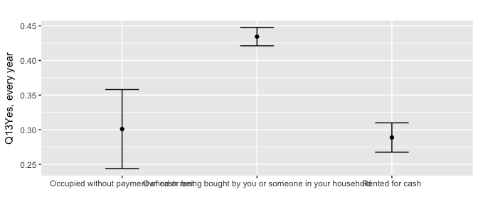<!-- -->

## Employment status


```r
## Q13 and work
svychisq(~Q13 + work, des)
```

```
## 
## 	Pearson's X^2: Rao & Scott adjustment
## 
## data:  svychisq(~Q13 + work, des)
## F = 14, ndf = 2, ddf = 4300, p-value = 1e-06
```

```r
(q <- svyby(~Q13, ~work, des, svymean, na.rm = T))
```

```
##                  work Q13Yes, every year Q13Yes, some years Q13No, never
## unemployed unemployed             0.4623             0.1754       0.3623
## employed     employed             0.3413             0.2310       0.4277
##            se.Q13Yes, every year se.Q13Yes, some years se.Q13No, never
## unemployed               0.01805               0.01446         0.01787
## employed                 0.01410               0.01278         0.01501
```

```r
a <- glm(Q13 ~ work, family = quasibinomial(link = "logit"), data = df, weights = weight)
summary(a)
```

```
## 
## Call:
## glm(formula = Q13 ~ work, family = quasibinomial(link = "logit"), 
##     data = df, weights = weight)
## 
## Deviance Residuals: 
##    Min      1Q  Median      3Q     Max  
## -2.362  -1.188   0.767   0.992   1.794  
## 
## Coefficients:
##              Estimate Std. Error t value Pr(>|t|)    
## (Intercept)     0.151      0.068    2.22    0.026 *  
## workemployed    0.506      0.090    5.62  2.1e-08 ***
## ---
## Signif. codes:  0 '***' 0.001 '**' 0.01 '*' 0.05 '.' 0.1 ' ' 1
## 
## (Dispersion parameter for quasibinomial family taken to be 0.998)
## 
##     Null deviance: 2867.8  on 2149  degrees of freedom
## Residual deviance: 2836.1  on 2148  degrees of freedom
##   (18 observations deleted due to missingness)
## AIC: NA
## 
## Number of Fisher Scoring iterations: 4
```

```r
# weighted table
(q <- svyby(~Q13, ~work, des, svymean, na.rm = T))
```

```
##                  work Q13Yes, every year Q13Yes, some years Q13No, never
## unemployed unemployed             0.4623             0.1754       0.3623
## employed     employed             0.3413             0.2310       0.4277
##            se.Q13Yes, every year se.Q13Yes, some years se.Q13No, never
## unemployed               0.01805               0.01446         0.01787
## employed                 0.01410               0.01278         0.01501
```

```r
# unweighted table
with(df, addmargins(table(Q13, work)))
```

```
##                  work
## Q13               unemployed employed  Sum
##   Yes, every year        454      454  908
##   Yes, some years        142      281  423
##   No, never              296      523  819
##   Sum                    892     1258 2150
```

```r
# plot: Yes, every year
er <- geom_errorbar(aes(ymin = q[2] - q[5],
                        ymax = q[2] + q[5]), width = .25)
ggplot(q, aes(work, q[2])) + geom_point() + xlab("") + ylab("Q13Yes, every year") + er + ggtitle(label = "") 
```

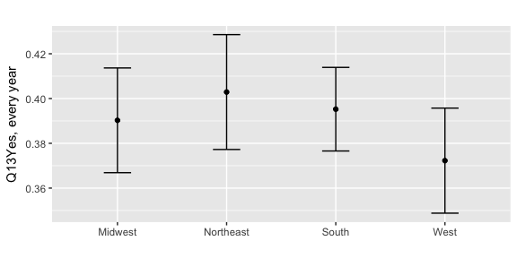<!-- -->

## Internet status


```r
## Q13 and PPNET
svychisq(~Q13 + PPNET, des)
```

```
## 
## 	Pearson's X^2: Rao & Scott adjustment
## 
## data:  svychisq(~Q13 + PPNET, des)
## F = 7.9, ndf = 2, ddf = 4300, p-value = 4e-04
```

```r
(q <- svyby(~Q13, ~PPNET, des, svymean, na.rm = T))
```

```
##     PPNET Q13Yes, every year Q13Yes, some years Q13No, never
## No     No             0.3588             0.1514       0.4898
## Yes   Yes             0.3989             0.2243       0.3767
##     se.Q13Yes, every year se.Q13Yes, some years se.Q13No, never
## No                0.02672               0.02085         0.02816
## Yes               0.01219               0.01078         0.01238
```

```r
a <- glm(Q13 ~ PPNET, family = quasibinomial(link = "logit"), data = df, weights = weight)
summary(a)
```

```
## 
## Call:
## glm(formula = Q13 ~ PPNET, family = quasibinomial(link = "logit"), 
##     data = df, weights = weight)
## 
## Deviance Residuals: 
##    Min      1Q  Median      3Q     Max  
## -2.307  -1.177   0.818   1.006   1.625  
## 
## Coefficients:
##             Estimate Std. Error t value Pr(>|t|)    
## (Intercept)   0.5804     0.0966    6.01  2.2e-09 ***
## PPNETYes     -0.1704     0.1087   -1.57     0.12    
## ---
## Signif. codes:  0 '***' 0.001 '**' 0.01 '*' 0.05 '.' 0.1 ' ' 1
## 
## (Dispersion parameter for quasibinomial family taken to be 0.998)
## 
##     Null deviance: 2867.8  on 2149  degrees of freedom
## Residual deviance: 2865.3  on 2148  degrees of freedom
##   (18 observations deleted due to missingness)
## AIC: NA
## 
## Number of Fisher Scoring iterations: 4
```

```r
# weighted table
(q <- svyby(~Q13, ~PPNET, des, svymean, na.rm = T))
```

```
##     PPNET Q13Yes, every year Q13Yes, some years Q13No, never
## No     No             0.3588             0.1514       0.4898
## Yes   Yes             0.3989             0.2243       0.3767
##     se.Q13Yes, every year se.Q13Yes, some years se.Q13No, never
## No                0.02672               0.02085         0.02816
## Yes               0.01219               0.01078         0.01238
```

```r
# unweighted table
with(df, addmargins(table(Q13, PPNET)))
```

```
##                  PPNET
## Q13                 No  Yes  Sum
##   Yes, every year  130  778  908
##   Yes, some years   49  374  423
##   No, never        172  647  819
##   Sum              351 1799 2150
```

```r
# plot: Yes, every year
er <- geom_errorbar(aes(ymin = q[2] - q[5],
                        ymax = q[2] + q[5]), width = .25)
ggplot(q, aes(PPNET, q[2])) + geom_point() + xlab("") + ylab("Q13Yes, every year") + er + ggtitle(label = "") 
```

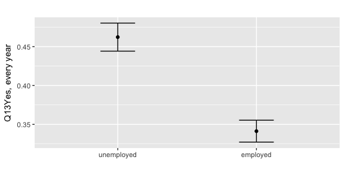<!-- -->


# TESTING


```r
## testing:

## Q13 and multiple variables
a <- glm(Q13 ~ PPETHM + PPEDUCAT, family = quasibinomial(link = "logit"), data = df, weights = weight)
summary(a)
```

```
## 
## Call:
## glm(formula = Q13 ~ PPETHM + PPEDUCAT, family = quasibinomial(link = "logit"), 
##     data = df, weights = weight)
## 
## Deviance Residuals: 
##    Min      1Q  Median      3Q     Max  
##  -2.44   -1.16    0.83    1.02    1.55  
## 
## Coefficients:
##                                     Estimate Std. Error t value Pr(>|t|)
## (Intercept)                            0.448      0.146    3.06   0.0022
## PPETHMBlack, Non-Hispanic              0.324      0.146    2.23   0.0261
## PPETHMHispanic                         0.316      0.136    2.33   0.0200
## PPETHMOther, Non-Hispanic              0.215      0.182    1.18   0.2379
## PPETHM2+ Races, Non-Hispanic           0.398      0.420    0.95   0.3435
## PPEDUCATHigh school                   -0.168      0.159   -1.05   0.2920
## PPEDUCATSome college                   0.182      0.162    1.12   0.2612
## PPEDUCATBachelor_s degree or higher   -0.334      0.161   -2.08   0.0378
##                                       
## (Intercept)                         **
## PPETHMBlack, Non-Hispanic           * 
## PPETHMHispanic                      * 
## PPETHMOther, Non-Hispanic             
## PPETHM2+ Races, Non-Hispanic          
## PPEDUCATHigh school                   
## PPEDUCATSome college                  
## PPEDUCATBachelor_s degree or higher * 
## ---
## Signif. codes:  0 '***' 0.001 '**' 0.01 '*' 0.05 '.' 0.1 ' ' 1
## 
## (Dispersion parameter for quasibinomial family taken to be 1.001)
## 
##     Null deviance: 2867.8  on 2149  degrees of freedom
## Residual deviance: 2833.2  on 2142  degrees of freedom
##   (18 observations deleted due to missingness)
## AIC: NA
## 
## Number of Fisher Scoring iterations: 4
```


# Q14. How much do you pay to get an influenza vaccine?


```r
## Q14. How much do you pay to get an influenza vaccine?
q14 <- as.data.frame(svytable(
  ~Q14 + PPGENDER + ppagect4 + PPETHM + income + PPEDUCAT + work + marital, des, round = T))

title <- ggtitle("Q14. How much do you pay to get an influenza vaccine?")
p <- ggplot(q14, aes(Q14, weight = Freq)) + ptext
p + geom_bar() + title
```

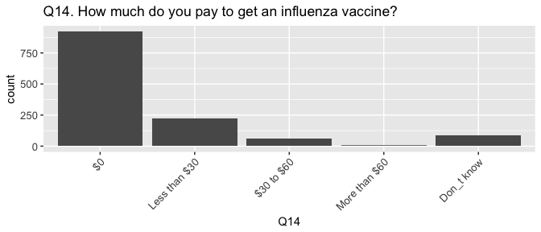<!-- -->

```r
##
#svychisq(~Q14 + Q13, des)
#svyby(~Q14, ~Q13, des, svymean, na.rm = T)
a <- glm(Q14 ~ Q13, family = quasibinomial(link = "logit"), data = df, weights = weight)
summary(a)
```

```
## 
## Call:
## glm(formula = Q14 ~ Q13, family = quasibinomial(link = "logit"), 
##     data = df, weights = weight)
## 
## Deviance Residuals: 
##    Min      1Q  Median      3Q     Max  
## -1.683  -0.780  -0.599   1.067   2.862  
## 
## Coefficients:
##                    Estimate Std. Error t value Pr(>|t|)    
## (Intercept)          -1.347      0.084  -16.04  < 2e-16 ***
## Q13Yes, some years    1.027      0.126    8.14  9.1e-16 ***
## ---
## Signif. codes:  0 '***' 0.001 '**' 0.01 '*' 0.05 '.' 0.1 ' ' 1
## 
## (Dispersion parameter for quasibinomial family taken to be 0.966)
## 
##     Null deviance: 1523.8  on 1329  degrees of freedom
## Residual deviance: 1459.4  on 1328  degrees of freedom
##   (838 observations deleted due to missingness)
## AIC: NA
## 
## Number of Fisher Scoring iterations: 4
```


# Q15. Are you more likely to get a vaccine if others around you get a vaccine?


```r
## Q15. Are you more likely to get a vaccine if others around you get a vaccine?
q15 <- as.data.frame(svytable(
  ~Q15 + PPGENDER + ppagect4 + PPETHM + income + PPEDUCAT + work + marital, des, round = T))

title <- ggtitle("Q15. Are you more likely to get a vaccine if others around you get a vaccine?")
p <- ggplot(q15, aes(Q15, weight = Freq)) + ptext
p + geom_bar() + title
```

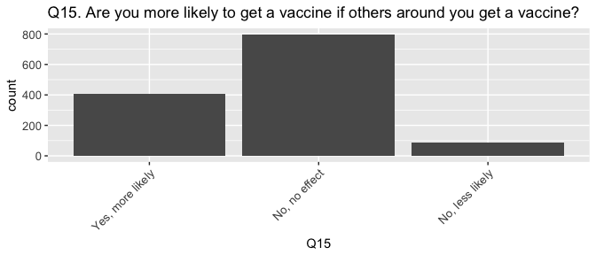<!-- -->

```r
##
#svychisq(~Q15 + Q13, des)
#svyby(~Q15, ~Q13, des, svymean, na.rm = T)
a <- glm(Q15 ~ Q13, family = quasibinomial(link = "logit"), data = df, weights = weight)
summary(a)
```

```
## 
## Call:
## glm(formula = Q15 ~ Q13, family = quasibinomial(link = "logit"), 
##     data = df, weights = weight)
## 
## Deviance Residuals: 
##    Min      1Q  Median      3Q     Max  
## -2.468  -1.238   0.734   0.857   1.425  
## 
## Coefficients:
##                    Estimate Std. Error t value Pr(>|t|)    
## (Intercept)          0.8034     0.0735   10.92   <2e-16 ***
## Q13Yes, some years  -0.0663     0.1237   -0.54     0.59    
## ---
## Signif. codes:  0 '***' 0.001 '**' 0.01 '*' 0.05 '.' 0.1 ' ' 1
## 
## (Dispersion parameter for quasibinomial family taken to be 0.9664)
## 
##     Null deviance: 1596.5  on 1328  degrees of freedom
## Residual deviance: 1596.3  on 1327  degrees of freedom
##   (839 observations deleted due to missingness)
## AIC: NA
## 
## Number of Fisher Scoring iterations: 4
```


## Q16. Are you more likely to get a vaccine if others around you do not get a vaccine?


```r
## Q16. Are you more likely to get a vaccine if others around you do not get a vaccine?
q16 <- as.data.frame(svytable(
  ~Q16 + PPGENDER + ppagect4 + PPETHM + income + PPEDUCAT + work + marital, des, round = T))

title <- ggtitle("Q16. Are you more likely to get a vaccine if others around you do not get a vaccine?")
p <- ggplot(q16, aes(Q16, weight = Freq)) + ptext
p + geom_bar() + title
```

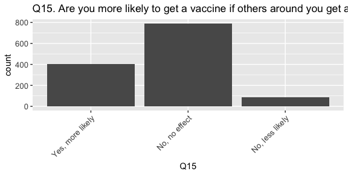<!-- -->

```r
##
#svychisq(~Q16 + Q13, des)
#svyby(~Q16, ~Q13, des, svymean, na.rm = T)
a <- glm(Q16 ~ Q13, family = quasibinomial(link = "logit"), data = df, weights = weight)
summary(a)
```

```
## 
## Call:
## glm(formula = Q16 ~ Q13, family = quasibinomial(link = "logit"), 
##     data = df, weights = weight)
## 
## Deviance Residuals: 
##    Min      1Q  Median      3Q     Max  
## -3.105   0.439   0.659   0.771   1.367  
## 
## Coefficients:
##                    Estimate Std. Error t value Pr(>|t|)    
## (Intercept)          0.8358     0.0743   11.24  < 2e-16 ***
## Q13Yes, some years   0.8518     0.1486    5.73  1.2e-08 ***
## ---
## Signif. codes:  0 '***' 0.001 '**' 0.01 '*' 0.05 '.' 0.1 ' ' 1
## 
## (Dispersion parameter for quasibinomial family taken to be 0.9663)
## 
##     Null deviance: 1434.2  on 1317  degrees of freedom
## Residual deviance: 1399.5  on 1316  degrees of freedom
##   (850 observations deleted due to missingness)
## AIC: NA
## 
## Number of Fisher Scoring iterations: 4
```

# Q17. Do you get a vaccine to protect yourself, protect others, or protect yourself and others?


```r
## Q17. Do you get a vaccine to protect yourself, protect others, or protect yourself and others?
q17 <- as.data.frame(svytable(
  ~Q17 + PPGENDER + ppagect4 + PPETHM + income + PPEDUCAT + work + marital, des, round = T))

title <- ggtitle("Q17. Do you get a vaccine to protect yourself, protect others, or protect yourself and others?")
p <- ggplot(q17, aes(Q17, weight = Freq)) + ptext
p + geom_bar() + title
```

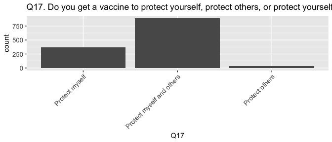<!-- -->

```r
##
#svychisq(~Q17 + Q13, des)
#svyby(~Q17, ~Q13, des, svymean, na.rm = F)
a <- glm(Q17 ~ Q13, family = quasibinomial(link = "logit"), data = df, weights = weight)
summary(a)
```

```
## 
## Call:
## glm(formula = Q17 ~ Q13, family = quasibinomial(link = "logit"), 
##     data = df, weights = weight)
## 
## Deviance Residuals: 
##    Min      1Q  Median      3Q     Max  
## -2.485  -1.244   0.678   0.824   1.417  
## 
## Coefficients:
##                    Estimate Std. Error t value Pr(>|t|)    
## (Intercept)          1.0409     0.0776   13.41   <2e-16 ***
## Q13Yes, some years  -0.2917     0.1263   -2.31    0.021 *  
## ---
## Signif. codes:  0 '***' 0.001 '**' 0.01 '*' 0.05 '.' 0.1 ' ' 1
## 
## (Dispersion parameter for quasibinomial family taken to be 0.9646)
## 
##     Null deviance: 1517.0  on 1323  degrees of freedom
## Residual deviance: 1511.9  on 1322  degrees of freedom
##   (844 observations deleted due to missingness)
## AIC: NA
## 
## Number of Fisher Scoring iterations: 4
```


# Q18. What are the reasons you would not get an influenza vaccine?


```r
## Q18. What are the reasons you would not get an influenza vaccine?

title <- ggtitle("Q18. What are the reasons you would not get an influenza vaccine?")

##
#svychisq(~Q18 + Q13, des)
#svyby(~Q18, ~Q13, des, svymean, na.rm = F)
#a <- glm(Q18 ~ Q13, family = quasibinomial(link = "logit"), data = df, weights = weight)
#summary(a)
```

# Q19. Do you have health insurance?


```r
## Q19. Do you have health insurance?
q19 <- as.data.frame(svytable(
  ~Q19 + PPGENDER + ppagect4 + PPETHM + income + PPEDUCAT + work + marital, des, round = T))

title <- ggtitle("Q19. Do you have health insurance?")
p <- ggplot(q19, aes(Q19, weight = Freq)) + ptext
p + geom_bar() + title
```

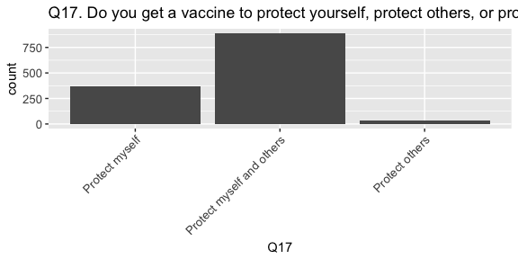<!-- -->

```r
##
svyby(~Q19, ~Q13, des, svymean, na.rm = T)
```

```
##                             Q13 Q19Yes   Q19No se.Q19Yes se.Q19No
## Yes, every year Yes, every year 0.9733 0.02674  0.006457 0.006457
## Yes, some years Yes, some years 0.9272 0.07285  0.015446 0.015446
## No, never             No, never 0.8341 0.16587  0.015354 0.015354
```

```r
svychisq(~Q19 + Q13, des)
```

```
## 
## 	Pearson's X^2: Rao & Scott adjustment
## 
## data:  svychisq(~Q19 + Q13, des)
## F = 35, ndf = 2, ddf = 4300, p-value = 1e-15
```

# Q20. How effective do you think the influenza vaccine is in protecting people from becoming sick with influenza?


```r
## Q20. How effective do you think the influenza vaccine is in protecting people from becoming sick with influenza?
q20 <- as.data.frame(svytable(
  ~Q20 + PPGENDER + ppagect4 + PPETHM + income + PPEDUCAT + work + marital, des, round = T))

title <- ggtitle("Q20. How effective do you think the influenza vaccine is in protecting people from becoming sick with influenza?")
p <- ggplot(q20, aes(Q20, weight = Freq)) + ptext
p + geom_bar() + title
```

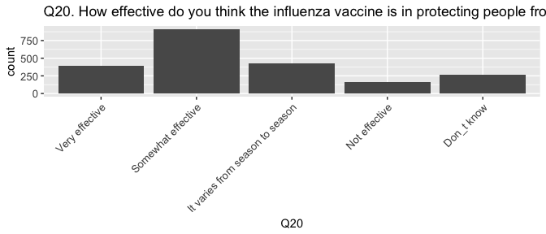<!-- -->

```r
##
svyby(~Q20, ~Q13, des, svymean, na.rm = T)
```

```
##                             Q13 Q20Very effective Q20Somewhat effective
## Yes, every year Yes, every year           0.35492                0.4562
## Yes, some years Yes, some years           0.12296                0.5516
## No, never             No, never           0.04506                0.3353
##                 Q20It varies from season to season Q20Not effective
## Yes, every year                             0.1558         0.008103
## Yes, some years                             0.2028         0.048456
## No, never                                   0.2281         0.144741
##                 Q20Don_t know se.Q20Very effective
## Yes, every year       0.02492             0.017318
## Yes, some years       0.07421             0.018461
## No, never             0.24687             0.008212
##                 se.Q20Somewhat effective
## Yes, every year                  0.01767
## Yes, some years                  0.02607
## No, never                        0.01768
##                 se.Q20It varies from season to season se.Q20Not effective
## Yes, every year                               0.01296            0.003458
## Yes, some years                               0.02010            0.012880
## No, never                                     0.01530            0.013336
##                 se.Q20Don_t know
## Yes, every year         0.005912
## Yes, some years         0.014124
## No, never               0.016944
```

```r
svychisq(~Q20 + Q13, des)
```

```
## 
## 	Pearson's X^2: Rao & Scott adjustment
## 
## data:  svychisq(~Q20 + Q13, des)
## F = 57, ndf = 7.9, ddf = 17000.0, p-value <2e-16
```

## Q21. Are influenza vaccines covered by your insurance?


```r
## Q21. Are influenza vaccines covered by your insurance?
q21 <- as.data.frame(svytable(
  ~Q21 + PPGENDER + ppagect4 + PPETHM + income + PPEDUCAT + work + marital, des, round = T))

title <- ggtitle("Q21. Are influenza vaccines covered by your health insurance?")
p <- ggplot(q21, aes(Q21, weight = Freq)) + ptext
p + geom_bar() + title
```

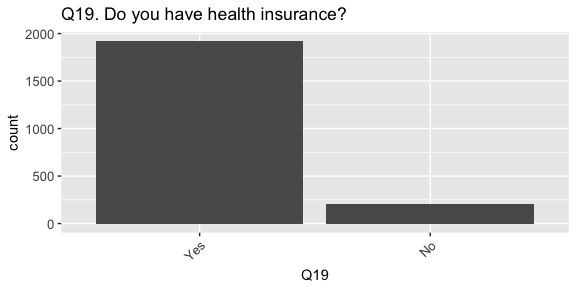<!-- -->

```r
##
svyby(~Q21, ~Q13, des, svymean, na.rm = T)
```

```
##                             Q13 Q21Yes, the full cost is paid
## Yes, every year Yes, every year                        0.8177
## Yes, some years Yes, some years                        0.6161
## No, never             No, never                        0.4216
##                 Q21Yes, but only part of the cost is paid   Q21No
## Yes, every year                                   0.06434 0.02394
## Yes, some years                                   0.12130 0.03072
## No, never                                         0.05874 0.02994
##                 Q21Don_t know se.Q21Yes, the full cost is paid
## Yes, every year       0.09399                          0.01411
## Yes, some years       0.23190                          0.02626
## No, never             0.48969                          0.01990
##                 se.Q21Yes, but only part of the cost is paid se.Q21No
## Yes, every year                                     0.008577 0.005671
## Yes, some years                                     0.018063 0.009002
## No, never                                           0.009304 0.006827
##                 se.Q21Don_t know
## Yes, every year          0.01098
## Yes, some years          0.02282
## No, never                0.02020
```

```r
svychisq(~Q21 + Q13, des)
```

```
## 
## 	Pearson's X^2: Rao & Scott adjustment
## 
## data:  svychisq(~Q21 + Q13, des)
## F = 49, ndf = 6, ddf = 13000, p-value <2e-16
```


#### Q13. Do you get the flu vaccine?
#### Q14. How much do you pay to get an influenza vaccine?
#### Q15. Are you more likely to get a vaccine if others around you get a vaccine?
#### Q16. Are you more likely to get a vaccine if others around you do not get a vaccine?
#### Q17. Do you get a vaccine to protect yourself, protect others, or protect yourself and others?
#### Q18. What are the reasons you would not get an influenza vaccine?
#### Q19. Do you have health insurance?
#### Q20. How effective do you think the influenza vaccine is in protecting people from becoming sick with influenza?
#### Q21. Are influenza vaccines covered by your insurance?

