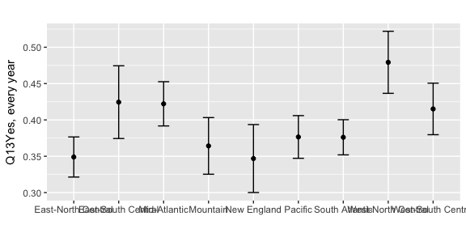
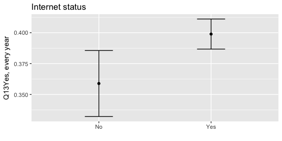
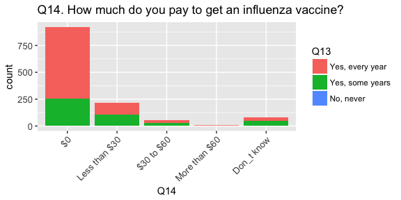
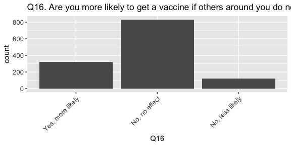
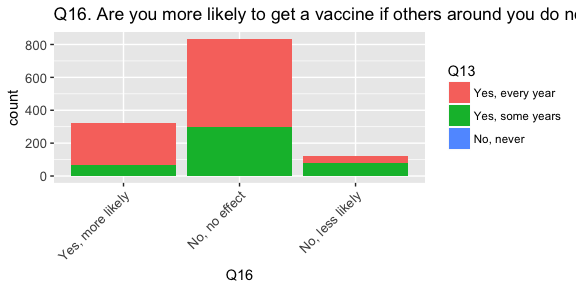
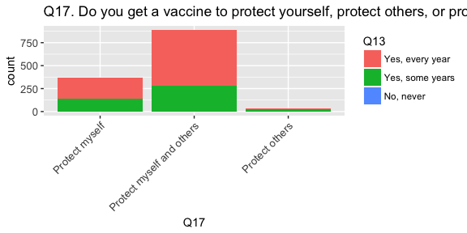
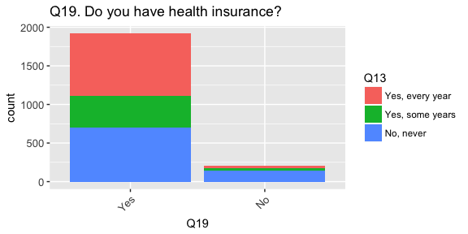
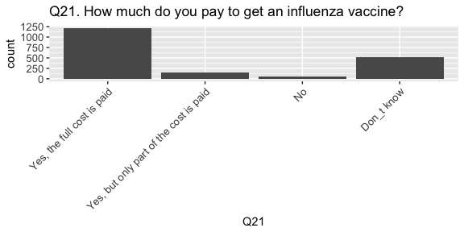
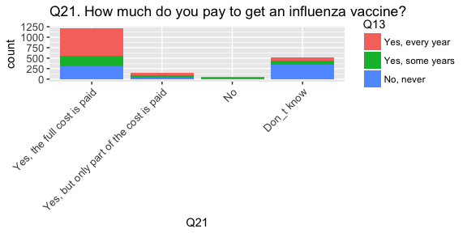

```r
library(dplyr)
library(ggplot2)
library(gridExtra)
library(knitr)
library(rmarkdown)
library(survey)
library(tidyr)

## flu-survey/code/data_prep.R
load('./data/data_prep.RData')

## subset columns
df <- dataf[, c(1,4:27, 28:33, 92:111, 429)]
names(df)
```

```
##  [1] "CaseID"        "duration"      "PPAGE"         "ppagecat"     
##  [5] "ppagect4"      "PPEDUC"        "PPEDUCAT"      "PPETHM"       
##  [9] "PPGENDER"      "PPHHHEAD"      "PPHOUSE"       "PPINCIMP"     
## [13] "PPMARIT"       "PPMSACAT"      "PPREG4"        "ppreg9"       
## [17] "PPRENT"        "PPSTATEN"      "PPT01"         "PPT25"        
## [21] "PPT612"        "PPT1317"       "PPT18OV"       "PPWORK"       
## [25] "PPNET"         "Q1"            "Q2"            "Q3"           
## [29] "Q4"            "Q5"            "Q6"            "Q13"          
## [33] "Q14"           "Q15"           "Q16"           "Q17"          
## [37] "Q18_1"         "Q18_2"         "Q18_3"         "Q18_4"        
## [41] "Q18_5"         "Q18_6"         "Q18_7"         "Q18_8"        
## [45] "Q18_9"         "Q18_10"        "Q18_11"        "Q18_otherText"
## [49] "Q19"           "Q20"           "Q21"           "weight"
```


```r
## recode variables
library(car)

## use code function for response variables
## reset the "default" level on categorical variables
code <- function(col, map, ref) {
  relevel(as.factor(map[col]), ref=ref)
}

## income - PPINCIMP
income.map <- c(rep("under $10k", 3),
                rep("$10k to $25k", 4),
                rep("$25k to $50k", 4),
                rep("$50k to $75k", 2),
                rep("$75k to $100k", 2),
                rep("$100k to $150k", 2),
                rep("over $150k", 2))
df$income <- code(dataf$PPINCIMP, income.map, "under $10k")
income.lab <- c("under $10k", "$10k to $25k", "$25k to $50k", "$50k to $75k", "$75k to $100k", "$100k to $150k", "over $150k")
df$income <- factor(df$income, levels = income.lab)

## marital status - PPMARIT
marital.map <- c("single", "partnered", "partnered", "single", "single", "single")
df$marital <- code(dataf$PPMARIT, marital.map, "single")

## employment status - PPWORK
work.map <- c(rep("unemployed", 5),
              rep("employed", 2))
df$work <- code(dataf$PPWORK, work.map, "unemployed")

## check columns
colnames(df)
```

```
##  [1] "CaseID"        "duration"      "PPAGE"         "ppagecat"     
##  [5] "ppagect4"      "PPEDUC"        "PPEDUCAT"      "PPETHM"       
##  [9] "PPGENDER"      "PPHHHEAD"      "PPHOUSE"       "PPINCIMP"     
## [13] "PPMARIT"       "PPMSACAT"      "PPREG4"        "ppreg9"       
## [17] "PPRENT"        "PPSTATEN"      "PPT01"         "PPT25"        
## [21] "PPT612"        "PPT1317"       "PPT18OV"       "PPWORK"       
## [25] "PPNET"         "Q1"            "Q2"            "Q3"           
## [29] "Q4"            "Q5"            "Q6"            "Q13"          
## [33] "Q14"           "Q15"           "Q16"           "Q17"          
## [37] "Q18_1"         "Q18_2"         "Q18_3"         "Q18_4"        
## [41] "Q18_5"         "Q18_6"         "Q18_7"         "Q18_8"        
## [45] "Q18_9"         "Q18_10"        "Q18_11"        "Q18_otherText"
## [49] "Q19"           "Q20"           "Q21"           "weight"       
## [53] "income"        "marital"       "work"
```

```r
saveRDS(df, file = './data/subset_recode.RDS')
```


```r
## ggplot templates
ptext <- theme(axis.text = element_text(size = rel(0.9)), axis.text.x = element_text(angle = 45, hjust = 1))
ptext2 <- ptext + theme(axis.text.x = element_blank())
```


```r
## create survey object
options(digits = 4)
options(survey.lonely.psu = "adjust")
des <- svydesign(ids = ~1, weights = ~weight, data = df[!is.na(df$weight), ])
```


# Q13. Do you get the flu vaccine?


```r
## Q13. Do you get the flu vaccine?
q13 <- as.data.frame(svytable(~Q13 + ppagecat + PPGENDER + PPETHM + income + PPEDUCAT + work + marital, des, round = T))

# univariate
p <- ggplot(q13, aes(Q13, weight = Freq)) + ptext
p + geom_bar() + ggtitle("Q13. Do you get the flu vaccine?")
```

<!-- -->

```r
# raw count
with(df, addmargins(table(Q13)))
```

```
## Q13
## Yes, every year Yes, some years       No, never             Sum 
##             908             423             819            2150
```

```r
# weighted count
as.data.frame(svytable(~Q13, des, round = T))
```

```
##               Q13 Freq
## 1 Yes, every year  837
## 2 Yes, some years  447
## 3       No, never  860
```


Significant p-values for Q13:
Age, education, ethnicity, housing type, income, marital status, metro status, region, rental status, employment status, internet 


## Ethnicity


```r
### Q13 and PPETHM: EXAMPLE

# chi-square: Q13 and PPETHM
svychisq(~Q13 + PPETHM, des)
```

```
## 
## 	Pearson's X^2: Rao & Scott adjustment
## 
## data:  svychisq(~Q13 + PPETHM, des)
## F = 2.6, ndf = 6.8, ddf = 15000.0, p-value = 0.01
```

```r
# glm: Q13 and PPETHM
a <- glm(Q13 ~ PPETHM, family = quasibinomial(link = "logit"), data = df, weights = weight)
summary(a)
```

```
## 
## Call:
## glm(formula = Q13 ~ PPETHM, family = quasibinomial(link = "logit"), 
##     data = df, weights = weight)
## 
## Deviance Residuals: 
##    Min      1Q  Median      3Q     Max  
## -2.407  -1.154   0.841   1.024   1.623  
## 
## Coefficients:
##                              Estimate Std. Error t value Pr(>|t|)    
## (Intercept)                    0.3312     0.0543    6.10  1.2e-09 ***
## PPETHMBlack, Non-Hispanic      0.3685     0.1444    2.55   0.0108 *  
## PPETHMHispanic                 0.3876     0.1301    2.98   0.0029 ** 
## PPETHMOther, Non-Hispanic      0.1638     0.1799    0.91   0.3627    
## PPETHM2+ Races, Non-Hispanic   0.4459     0.4172    1.07   0.2853    
## ---
## Signif. codes:  0 '***' 0.001 '**' 0.01 '*' 0.05 '.' 0.1 ' ' 1
## 
## (Dispersion parameter for quasibinomial family taken to be 0.9994)
## 
##     Null deviance: 2867.8  on 2149  degrees of freedom
## Residual deviance: 2853.4  on 2145  degrees of freedom
##   (18 observations deleted due to missingness)
## AIC: NA
## 
## Number of Fisher Scoring iterations: 4
```

```r
# unweighted table
as.data.frame(with(df, addmargins(table(PPETHM, Q13))))
```

```
##                    PPETHM             Q13 Freq
## 1     White, Non-Hispanic Yes, every year  696
## 2     Black, Non-Hispanic Yes, every year   69
## 3                Hispanic Yes, every year   80
## 4     Other, Non-Hispanic Yes, every year   36
## 5  2+ Races, Non-Hispanic Yes, every year   27
## 6                     Sum Yes, every year  908
## 7     White, Non-Hispanic Yes, some years  293
## 8     Black, Non-Hispanic Yes, some years   37
## 9                Hispanic Yes, some years   54
## 10    Other, Non-Hispanic Yes, some years   28
## 11 2+ Races, Non-Hispanic Yes, some years   11
## 12                    Sum Yes, some years  423
## 13    White, Non-Hispanic       No, never  567
## 14    Black, Non-Hispanic       No, never   88
## 15               Hispanic       No, never   94
## 16    Other, Non-Hispanic       No, never   29
## 17 2+ Races, Non-Hispanic       No, never   41
## 18                    Sum       No, never  819
## 19    White, Non-Hispanic             Sum 1556
## 20    Black, Non-Hispanic             Sum  194
## 21               Hispanic             Sum  228
## 22    Other, Non-Hispanic             Sum   93
## 23 2+ Races, Non-Hispanic             Sum   79
## 24                    Sum             Sum 2150
```

```r
# weighted proportions
(q <- svyby(~Q13, ~PPETHM, des, svymean, na.rm = T))
```

```
##                                        PPETHM Q13Yes, every year
## White, Non-Hispanic       White, Non-Hispanic             0.4180
## Black, Non-Hispanic       Black, Non-Hispanic             0.3319
## Hispanic                             Hispanic             0.3277
## Other, Non-Hispanic       Other, Non-Hispanic             0.3787
## 2+ Races, Non-Hispanic 2+ Races, Non-Hispanic             0.3149
##                        Q13Yes, some years Q13No, never
## White, Non-Hispanic                0.1976       0.3845
## Black, Non-Hispanic                0.1863       0.4818
## Hispanic                           0.2445       0.4279
## Other, Non-Hispanic                0.2834       0.3378
## 2+ Races, Non-Hispanic             0.1483       0.5367
##                        se.Q13Yes, every year se.Q13Yes, some years
## White, Non-Hispanic                  0.01298               0.01077
## Black, Non-Hispanic                  0.03437               0.02877
## Hispanic                             0.03194               0.03021
## Other, Non-Hispanic                  0.05190               0.04735
## 2+ Races, Non-Hispanic               0.05234               0.04173
##                        se.Q13No, never
## White, Non-Hispanic            0.01306
## Black, Non-Hispanic            0.03734
## Hispanic                       0.03443
## Other, Non-Hispanic            0.05178
## 2+ Races, Non-Hispanic         0.05747
```

```r
# plot: Q13. No, never
er <- geom_errorbar(aes(ymin = q[4] - q[7],
                        ymax = q[4] + q[7]), width = .25)
ggplot(q, aes(PPETHM, q[4])) + geom_point() + xlab("") + ylab("Q13No, never") + er + ggtitle(label = "") 
```

<!-- -->

## Gender


```r
## Q13 and PPGENDER
svychisq(~Q13 + PPGENDER, des)
```

```
## 
## 	Pearson's X^2: Rao & Scott adjustment
## 
## data:  svychisq(~Q13 + PPGENDER, des)
## F = 0.88, ndf = 2, ddf = 4300, p-value = 0.4
```

```r
a <- glm(Q13 ~ PPGENDER, family = quasibinomial(link = "logit"), data = df, weights = weight)
summary(a)
```

```
## 
## Call:
## glm(formula = Q13 ~ PPGENDER, family = quasibinomial(link = "logit"), 
##     data = df, weights = weight)
## 
## Deviance Residuals: 
##    Min      1Q  Median      3Q     Max  
## -2.223  -1.196   0.809   1.008   1.613  
## 
## Coefficients:
##              Estimate Std. Error t value Pr(>|t|)    
## (Intercept)    0.4299     0.0611    7.03  2.7e-12 ***
## PPGENDERMale   0.0345     0.0886    0.39      0.7    
## ---
## Signif. codes:  0 '***' 0.001 '**' 0.01 '*' 0.05 '.' 0.1 ' ' 1
## 
## (Dispersion parameter for quasibinomial family taken to be 0.998)
## 
##     Null deviance: 2867.8  on 2149  degrees of freedom
## Residual deviance: 2867.6  on 2148  degrees of freedom
##   (18 observations deleted due to missingness)
## AIC: NA
## 
## Number of Fisher Scoring iterations: 4
```

```r
# unweighted table
as.data.frame(with(df, addmargins(table(PPGENDER, Q13))))
```

```
##    PPGENDER             Q13 Freq
## 1    Female Yes, every year  460
## 2      Male Yes, every year  448
## 3       Sum Yes, every year  908
## 4    Female Yes, some years  227
## 5      Male Yes, some years  196
## 6       Sum Yes, some years  423
## 7    Female       No, never  408
## 8      Male       No, never  411
## 9       Sum       No, never  819
## 10   Female             Sum 1095
## 11     Male             Sum 1055
## 12      Sum             Sum 2150
```

```r
# weighted props
(q <- svyby(~Q13, ~PPGENDER, des, svymean, na.rm = T))
```

```
##        PPGENDER Q13Yes, every year Q13Yes, some years Q13No, never
## Female   Female             0.3942             0.2178       0.3881
## Male       Male             0.3859             0.1984       0.4156
##        se.Q13Yes, every year se.Q13Yes, some years se.Q13No, never
## Female               0.01565               0.01359         0.01591
## Male                 0.01594               0.01356         0.01663
```

```r
# plot: Yes, every year
er <- geom_errorbar(aes(ymin = q[2] - q[5],
                        ymax = q[2] + q[5]), width = .25)
ggplot(q, aes(PPGENDER, q[2])) + geom_point() + xlab("") + ylab("Q13Yes, every year") + er + ggtitle(label = "")
```

<!-- -->

## Age


```r
## Q13 and ppagecat
svychisq(~Q13 + ppagecat, des)
```

```
## 
## 	Pearson's X^2: Rao & Scott adjustment
## 
## data:  svychisq(~Q13 + ppagecat, des)
## F = 14, ndf = 12, ddf = 25000, p-value <2e-16
```

```r
a <- glm(Q13 ~ ppagecat, family = quasibinomial(link = "logit"), data = df, weights = weight)
summary(a)
```

```
## 
## Call:
## glm(formula = Q13 ~ ppagecat, family = quasibinomial(link = "logit"), 
##     data = df, weights = weight)
## 
## Deviance Residuals: 
##    Min      1Q  Median      3Q     Max  
## -2.663  -1.040   0.778   0.959   2.025  
## 
## Coefficients:
##               Estimate Std. Error t value Pr(>|t|)    
## (Intercept)     1.0722     0.1439    7.45  1.3e-13 ***
## ppagecat25-34   0.0776     0.1890    0.41   0.6813    
## ppagecat35-44  -0.2679     0.1830   -1.46   0.1433    
## ppagecat45-54  -0.4767     0.1833   -2.60   0.0094 ** 
## ppagecat55-64  -0.9824     0.1734   -5.67  1.6e-08 ***
## ppagecat65-74  -1.4081     0.1890   -7.45  1.3e-13 ***
## ppagecat75+    -2.0832     0.2535   -8.22  3.5e-16 ***
## ---
## Signif. codes:  0 '***' 0.001 '**' 0.01 '*' 0.05 '.' 0.1 ' ' 1
## 
## (Dispersion parameter for quasibinomial family taken to be 1)
## 
##     Null deviance: 2867.8  on 2149  degrees of freedom
## Residual deviance: 2686.4  on 2143  degrees of freedom
##   (18 observations deleted due to missingness)
## AIC: NA
## 
## Number of Fisher Scoring iterations: 4
```

```r
# weighted props
(q <- svyby(~Q13, ~ppagecat, des, svymean, na.rm = T))
```

```
##       ppagecat Q13Yes, every year Q13Yes, some years Q13No, never
## 18-24    18-24             0.2550            0.29193       0.4531
## 25-34    25-34             0.2405            0.28392       0.4756
## 35-44    35-44             0.3091            0.23224       0.4587
## 45-54    45-54             0.3554            0.22773       0.4169
## 55-64    55-64             0.4775            0.14615       0.3763
## 65-74    65-74             0.5832            0.13574       0.2811
## 75+        75+             0.7332            0.06169       0.2051
##       se.Q13Yes, every year se.Q13Yes, some years se.Q13No, never
## 18-24               0.03427               0.03630         0.03944
## 25-34               0.02615               0.02802         0.03111
## 35-44               0.02676               0.02454         0.02934
## 45-54               0.02576               0.02255         0.02647
## 55-64               0.02377               0.01611         0.02328
## 65-74               0.02859               0.01974         0.02623
## 75+                 0.03990               0.02170         0.03680
```

```r
# unweighted table
as.data.frame(with(df, addmargins(table(ppagecat, Q13))))
```

```
##    ppagecat             Q13 Freq
## 1     18-24 Yes, every year   45
## 2     25-34 Yes, every year   73
## 3     35-44 Yes, every year  102
## 4     45-54 Yes, every year  138
## 5     55-64 Yes, every year  238
## 6     65-74 Yes, every year  201
## 7       75+ Yes, every year  111
## 8       Sum Yes, every year  908
## 9     18-24 Yes, some years   49
## 10    25-34 Yes, some years   82
## 11    35-44 Yes, some years   75
## 12    45-54 Yes, some years   86
## 13    55-64 Yes, some years   78
## 14    65-74 Yes, some years   45
## 15      75+ Yes, some years    8
## 16      Sum Yes, some years  423
## 17    18-24       No, never   78
## 18    25-34       No, never  134
## 19    35-44       No, never  147
## 20    45-54       No, never  160
## 21    55-64       No, never  181
## 22    65-74       No, never   93
## 23      75+       No, never   26
## 24      Sum       No, never  819
## 25    18-24             Sum  172
## 26    25-34             Sum  289
## 27    35-44             Sum  324
## 28    45-54             Sum  384
## 29    55-64             Sum  497
## 30    65-74             Sum  339
## 31      75+             Sum  145
## 32      Sum             Sum 2150
```

```r
# plot: Yes, every year
er <- geom_errorbar(aes(ymin = q[2] - q[5],
                        ymax = q[2] + q[5]), width = .25)
ggplot(q, aes(ppagecat, q[2])) + geom_point() + xlab("") + ylab("Q13Yes, every year") + er + ggtitle(label = "")
```

<!-- -->


## Education


```r
## Q13 and PPEDUCAT
svychisq(~Q13 + PPEDUCAT, des)
```

```
## 
## 	Pearson's X^2: Rao & Scott adjustment
## 
## data:  svychisq(~Q13 + PPEDUCAT, des)
## F = 8.6, ndf = 5.7, ddf = 12000.0, p-value = 5e-09
```

```r
a <- glm(Q13 ~ PPEDUCAT, family = quasibinomial(link = "logit"), data = df, weights = weight)
summary(a)
```

```
## 
## Call:
## glm(formula = Q13 ~ PPEDUCAT, family = quasibinomial(link = "logit"), 
##     data = df, weights = weight)
## 
## Deviance Residuals: 
##    Min      1Q  Median      3Q     Max  
## -2.344  -1.192   0.815   1.021   1.622  
## 
## Coefficients:
##                                     Estimate Std. Error t value Pr(>|t|)
## (Intercept)                            0.632      0.132    4.79  1.8e-06
## PPEDUCATHigh school                   -0.264      0.155   -1.71   0.0874
## PPEDUCATSome college                   0.106      0.158    0.67   0.5006
## PPEDUCATBachelor_s degree or higher   -0.436      0.154   -2.83   0.0047
##                                        
## (Intercept)                         ***
## PPEDUCATHigh school                 .  
## PPEDUCATSome college                   
## PPEDUCATBachelor_s degree or higher ** 
## ---
## Signif. codes:  0 '***' 0.001 '**' 0.01 '*' 0.05 '.' 0.1 ' ' 1
## 
## (Dispersion parameter for quasibinomial family taken to be 0.999)
## 
##     Null deviance: 2867.8  on 2149  degrees of freedom
## Residual deviance: 2843.3  on 2146  degrees of freedom
##   (18 observations deleted due to missingness)
## AIC: NA
## 
## Number of Fisher Scoring iterations: 4
```

```r
# weighted table
(q <- svyby(~Q13, ~PPEDUCAT, des, svymean, na.rm = T))
```

```
##                                                PPEDUCAT Q13Yes, every year
## Less than high school             Less than high school             0.3471
## High school                                 High school             0.4091
## Some college                               Some college             0.3234
## Bachelor_s degree or higher Bachelor_s degree or higher             0.4511
##                             Q13Yes, some years Q13No, never
## Less than high school                   0.1760       0.4769
## High school                             0.1358       0.4551
## Some college                            0.2657       0.4109
## Bachelor_s degree or higher             0.2396       0.3093
##                             se.Q13Yes, every year se.Q13Yes, some years
## Less than high school                     0.03873               0.03242
## High school                               0.02072               0.01497
## Some college                              0.01961               0.01958
## Bachelor_s degree or higher               0.01910               0.01674
##                             se.Q13No, never
## Less than high school               0.04153
## High school                         0.02121
## Some college                        0.02142
## Bachelor_s degree or higher         0.01797
```

```r
# unweighted table
as.data.frame(with(df, addmargins(table(PPEDUCAT, Q13))))
```

```
##                       PPEDUCAT             Q13 Freq
## 1        Less than high school Yes, every year   60
## 2                  High school Yes, every year  271
## 3                 Some college Yes, every year  218
## 4  Bachelor_s degree or higher Yes, every year  359
## 5                          Sum Yes, every year  908
## 6        Less than high school Yes, some years   27
## 7                  High school Yes, some years   79
## 8                 Some college Yes, some years  147
## 9  Bachelor_s degree or higher Yes, some years  170
## 10                         Sum Yes, some years  423
## 11       Less than high school       No, never   73
## 12                 High school       No, never  279
## 13                Some college       No, never  239
## 14 Bachelor_s degree or higher       No, never  228
## 15                         Sum       No, never  819
## 16       Less than high school             Sum  160
## 17                 High school             Sum  629
## 18                Some college             Sum  604
## 19 Bachelor_s degree or higher             Sum  757
## 20                         Sum             Sum 2150
```

```r
# plot: Yes, every year
er <- geom_errorbar(aes(ymin = q[2] - q[5],
                        ymax = q[2] + q[5]), width = .25)
ggplot(q, aes(PPEDUCAT, q[2])) + geom_point() + xlab("") + ylab("Q13Yes, every year") + er + ggtitle(label = "")
```

<!-- -->

## Housing type


## Income


```r
## Q13 and income
svychisq(~Q13 + income, des)
```

```
## 
## 	Pearson's X^2: Rao & Scott adjustment
## 
## data:  svychisq(~Q13 + income, des)
## F = 4.2, ndf = 12, ddf = 26000, p-value = 1e-06
```

```r
a <- glm(Q13 ~ income, family = quasibinomial(link = "logit"), data = df, weights = weight)
summary(a)
```

```
## 
## Call:
## glm(formula = Q13 ~ income, family = quasibinomial(link = "logit"), 
##     data = df, weights = weight)
## 
## Deviance Residuals: 
##    Min      1Q  Median      3Q     Max  
## -2.447  -1.181   0.792   1.002   1.975  
## 
## Coefficients:
##                      Estimate Std. Error t value Pr(>|t|)    
## (Intercept)             0.984      0.207    4.76  2.0e-06 ***
## income$10k to $25k     -0.170      0.248   -0.68    0.494    
## income$25k to $50k     -0.476      0.228   -2.09    0.037 *  
## income$50k to $75k     -0.491      0.232   -2.11    0.035 *  
## income$75k to $100k    -0.489      0.237   -2.06    0.039 *  
## income$100k to $150k   -0.753      0.229   -3.29    0.001 ** 
## incomeover $150k       -1.098      0.251   -4.38  1.3e-05 ***
## ---
## Signif. codes:  0 '***' 0.001 '**' 0.01 '*' 0.05 '.' 0.1 ' ' 1
## 
## (Dispersion parameter for quasibinomial family taken to be 1)
## 
##     Null deviance: 2867.8  on 2149  degrees of freedom
## Residual deviance: 2831.9  on 2143  degrees of freedom
##   (18 observations deleted due to missingness)
## AIC: NA
## 
## Number of Fisher Scoring iterations: 4
```

```r
# weighted table
(q <- svyby(~Q13, ~income, des, svymean, na.rm = T))
```

```
##                        income Q13Yes, every year Q13Yes, some years
## under $10k         under $10k             0.2720             0.1695
## $10k to $25k     $10k to $25k             0.3069             0.1669
## $25k to $50k     $25k to $50k             0.3757             0.1920
## $50k to $75k     $50k to $75k             0.3791             0.2177
## $75k to $100k   $75k to $100k             0.3786             0.2428
## $100k to $150k $100k to $150k             0.4425             0.2331
## over $150k         over $150k             0.5284             0.1982
##                Q13No, never se.Q13Yes, every year se.Q13Yes, some years
## under $10k           0.5584               0.05007               0.04299
## $10k to $25k         0.5262               0.03100               0.02726
## $25k to $50k         0.4323               0.02440               0.02030
## $50k to $75k         0.4033               0.02539               0.02292
## $75k to $100k        0.3786               0.02890               0.02592
## $100k to $150k       0.3243               0.02462               0.02189
## over $150k           0.2734               0.03754               0.02991
##                se.Q13No, never
## under $10k             0.05651
## $10k to $25k           0.03480
## $25k to $50k           0.02546
## $50k to $75k           0.02642
## $75k to $100k          0.03005
## $100k to $150k         0.02348
## over $150k             0.03339
```

```r
# unweighted table
as.data.frame(with(df, addmargins(table(income, Q13))))
```

```
##            income             Q13 Freq
## 1      under $10k Yes, every year   24
## 2    $10k to $25k Yes, every year   83
## 3    $25k to $50k Yes, every year  178
## 4    $50k to $75k Yes, every year  168
## 5   $75k to $100k Yes, every year  131
## 6  $100k to $150k Yes, every year  213
## 7      over $150k Yes, every year  111
## 8             Sum Yes, every year  908
## 9      under $10k Yes, some years   15
## 10   $10k to $25k Yes, some years   36
## 11   $25k to $50k Yes, some years   81
## 12   $50k to $75k Yes, some years   78
## 13  $75k to $100k Yes, some years   74
## 14 $100k to $150k Yes, some years   99
## 15     over $150k Yes, some years   40
## 16            Sum Yes, some years  423
## 17     under $10k       No, never   50
## 18   $10k to $25k       No, never  118
## 19   $25k to $50k       No, never  183
## 20   $50k to $75k       No, never  158
## 21  $75k to $100k       No, never  106
## 22 $100k to $150k       No, never  146
## 23     over $150k       No, never   58
## 24            Sum       No, never  819
## 25     under $10k             Sum   89
## 26   $10k to $25k             Sum  237
## 27   $25k to $50k             Sum  442
## 28   $50k to $75k             Sum  404
## 29  $75k to $100k             Sum  311
## 30 $100k to $150k             Sum  458
## 31     over $150k             Sum  209
## 32            Sum             Sum 2150
```

```r
# plot: Yes, every year
er <- geom_errorbar(aes(ymin = q[2] - q[5],
                        ymax = q[2] + q[5]), width = .25)
ggplot(q, aes(income, q[2])) + geom_point() + xlab("") + ylab("Q13Yes, every year") + er + ggtitle(label = "") 
```

<!-- -->

## Marital status


```r
## Q13 and marital
svychisq(~Q13 + marital, des)
```

```
## 
## 	Pearson's X^2: Rao & Scott adjustment
## 
## data:  svychisq(~Q13 + marital, des)
## F = 12, ndf = 2, ddf = 4300, p-value = 6e-06
```

```r
a <- glm(Q13 ~ marital, family = quasibinomial(link = "logit"), data = df, weights = weight)
summary(a)
```

```
## 
## Call:
## glm(formula = Q13 ~ marital, family = quasibinomial(link = "logit"), 
##     data = df, weights = weight)
## 
## Deviance Residuals: 
##    Min      1Q  Median      3Q     Max  
## -2.377  -1.167   0.807   1.014   1.712  
## 
## Coefficients:
##                  Estimate Std. Error t value Pr(>|t|)    
## (Intercept)        0.6780     0.0692    9.80  < 2e-16 ***
## maritalpartnered  -0.4023     0.0903   -4.46  8.7e-06 ***
## ---
## Signif. codes:  0 '***' 0.001 '**' 0.01 '*' 0.05 '.' 0.1 ' ' 1
## 
## (Dispersion parameter for quasibinomial family taken to be 0.998)
## 
##     Null deviance: 2867.8  on 2149  degrees of freedom
## Residual deviance: 2847.7  on 2148  degrees of freedom
##   (18 observations deleted due to missingness)
## AIC: NA
## 
## Number of Fisher Scoring iterations: 4
```

```r
# unweighted table
as.data.frame(with(df, addmargins(table(marital, Q13))))
```

```
##      marital             Q13 Freq
## 1     single Yes, every year  302
## 2  partnered Yes, every year  606
## 3        Sum Yes, every year  908
## 4     single Yes, some years  160
## 5  partnered Yes, some years  263
## 6        Sum Yes, some years  423
## 7     single       No, never  374
## 8  partnered       No, never  445
## 9        Sum       No, never  819
## 10    single             Sum  836
## 11 partnered             Sum 1314
## 12       Sum             Sum 2150
```

```r
# weighted table
(q <- svyby(~Q13, ~marital, des, svymean, na.rm = T))
```

```
##             marital Q13Yes, every year Q13Yes, some years Q13No, never
## single       single             0.3367             0.1992       0.4641
## partnered partnered             0.4315             0.2157       0.3528
##           se.Q13Yes, every year se.Q13Yes, some years se.Q13No, never
## single                  0.01729               0.01512         0.01865
## partnered               0.01448               0.01239         0.01424
```

```r
# plot: Yes, every year
er <- geom_errorbar(aes(ymin = q[2] - q[5],
                        ymax = q[2] + q[5]), width = .25)
ggplot(q, aes(marital, q[2])) + geom_point() + xlab("") + ylab("Q13Yes, every year") + er + ggtitle(label = "") 
```

<!-- -->

## Metro status


```r
## Q13 and PPMSACAT
svychisq(~Q13 + PPMSACAT, des)
```

```
## 
## 	Pearson's X^2: Rao & Scott adjustment
## 
## data:  svychisq(~Q13 + PPMSACAT, des)
## F = 3.9, ndf = 2, ddf = 4300, p-value = 0.02
```

```r
a <- glm(Q13 ~ PPMSACAT, family = quasibinomial(link = "logit"), data = df, weights = weight)
summary(a)
```

```
## 
## Call:
## glm(formula = Q13 ~ PPMSACAT, family = quasibinomial(link = "logit"), 
##     data = df, weights = weight)
## 
## Deviance Residuals: 
##    Min      1Q  Median      3Q     Max  
## -2.215  -1.193   0.814   1.007   1.626  
## 
## Coefficients:
##                   Estimate Std. Error t value Pr(>|t|)    
## (Intercept)         0.4529     0.0480    9.43   <2e-16 ***
## PPMSACATNon-Metro  -0.0432     0.1235   -0.35     0.73    
## ---
## Signif. codes:  0 '***' 0.001 '**' 0.01 '*' 0.05 '.' 0.1 ' ' 1
## 
## (Dispersion parameter for quasibinomial family taken to be 0.998)
## 
##     Null deviance: 2867.8  on 2149  degrees of freedom
## Residual deviance: 2867.6  on 2148  degrees of freedom
##   (18 observations deleted due to missingness)
## AIC: NA
## 
## Number of Fisher Scoring iterations: 4
```

```r
# unweighted table
as.data.frame(with(df, addmargins(table(PPMSACAT, Q13))))
```

```
##     PPMSACAT             Q13 Freq
## 1      Metro Yes, every year  772
## 2  Non-Metro Yes, every year  136
## 3        Sum Yes, every year  908
## 4      Metro Yes, some years  376
## 5  Non-Metro Yes, some years   47
## 6        Sum Yes, some years  423
## 7      Metro       No, never  682
## 8  Non-Metro       No, never  137
## 9        Sum       No, never  819
## 10     Metro             Sum 1830
## 11 Non-Metro             Sum  320
## 12       Sum             Sum 2150
```

```r
# weighted table
(q <- svyby(~Q13, ~PPMSACAT, des, svymean, na.rm = T))
```

```
##            PPMSACAT Q13Yes, every year Q13Yes, some years Q13No, never
## Metro         Metro             0.3887             0.2191       0.3922
## Non-Metro Non-Metro             0.3990             0.1487       0.4524
##           se.Q13Yes, every year se.Q13Yes, some years se.Q13No, never
## Metro                   0.01208               0.01063         0.01241
## Non-Metro               0.02932               0.02135         0.03035
```

```r
# plot: Yes, every year
er <- geom_errorbar(aes(ymin = q[2] - q[5],
                        ymax = q[2] + q[5]), width = .25)
ggplot(q, aes(PPMSACAT, q[2])) + geom_point() + xlab("") + ylab("Q13Yes, every year") + er + ggtitle(label = "")
```

<!-- -->

## Region


```r
## Q13 and region4 and region9
svychisq(~Q13 + PPREG4, des)
```

```
## 
## 	Pearson's X^2: Rao & Scott adjustment
## 
## data:  svychisq(~Q13 + PPREG4, des)
## F = 3.5, ndf = 6, ddf = 13000, p-value = 0.002
```

```r
svychisq(~Q13 + ppreg9, des)
```

```
## 
## 	Pearson's X^2: Rao & Scott adjustment
## 
## data:  svychisq(~Q13 + ppreg9, des)
## F = 2.1, ndf = 16, ddf = 34000, p-value = 0.005
```

```r
a <- glm(Q13 ~ PPREG4, family = quasibinomial(link = "logit"), data = df, weights = weight)
summary(a)
```

```
## 
## Call:
## glm(formula = Q13 ~ PPREG4, family = quasibinomial(link = "logit"), 
##     data = df, weights = weight)
## 
## Deviance Residuals: 
##    Min      1Q  Median      3Q     Max  
## -2.265  -1.189   0.812   1.007   1.636  
## 
## Coefficients:
##                 Estimate Std. Error t value Pr(>|t|)    
## (Intercept)       0.4462     0.0957    4.66  3.4e-06 ***
## PPREG4Northeast  -0.0528     0.1407   -0.38     0.71    
## PPREG4South      -0.0208     0.1201   -0.17     0.86    
## PPREG4West        0.0764     0.1332    0.57     0.57    
## ---
## Signif. codes:  0 '***' 0.001 '**' 0.01 '*' 0.05 '.' 0.1 ' ' 1
## 
## (Dispersion parameter for quasibinomial family taken to be 0.999)
## 
##     Null deviance: 2867.8  on 2149  degrees of freedom
## Residual deviance: 2866.7  on 2146  degrees of freedom
##   (18 observations deleted due to missingness)
## AIC: NA
## 
## Number of Fisher Scoring iterations: 4
```

```r
b <- glm(Q13 ~ ppreg9, family = quasibinomial(link = "logit"), data = df, weights = weight)
summary(b)
```

```
## 
## Call:
## glm(formula = Q13 ~ ppreg9, family = quasibinomial(link = "logit"), 
##     data = df, weights = weight)
## 
## Deviance Residuals: 
##    Min      1Q  Median      3Q     Max  
## -2.290  -1.197   0.795   1.007   1.766  
## 
## Coefficients:
##                          Estimate Std. Error t value Pr(>|t|)    
## (Intercept)               0.62355    0.11869    5.25  1.6e-07 ***
## ppreg9East-South Central -0.31908    0.22439   -1.42   0.1552    
## ppreg9Mid-Atlantic       -0.30963    0.16791   -1.84   0.0653 .  
## ppreg9Mountain           -0.06657    0.19716   -0.34   0.7357    
## ppreg9New England         0.00931    0.24140    0.04   0.9692    
## ppreg9Pacific            -0.11942    0.16500   -0.72   0.4693    
## ppreg9South Atlantic     -0.11746    0.15476   -0.76   0.4480    
## ppreg9West-North Central -0.54066    0.20428   -2.65   0.0082 ** 
## ppreg9West-South Central -0.28076    0.17488   -1.61   0.1086    
## ---
## Signif. codes:  0 '***' 0.001 '**' 0.01 '*' 0.05 '.' 0.1 ' ' 1
## 
## (Dispersion parameter for quasibinomial family taken to be 1.001)
## 
##     Null deviance: 2867.8  on 2149  degrees of freedom
## Residual deviance: 2856.4  on 2141  degrees of freedom
##   (18 observations deleted due to missingness)
## AIC: NA
## 
## Number of Fisher Scoring iterations: 4
```

```r
# unweighted table
as.data.frame(with(df, addmargins(table(PPREG4, Q13))))
```

```
##       PPREG4             Q13 Freq
## 1    Midwest Yes, every year  203
## 2  Northeast Yes, every year  174
## 3      South Yes, every year  330
## 4       West Yes, every year  201
## 5        Sum Yes, every year  908
## 6    Midwest Yes, some years   91
## 7  Northeast Yes, some years   81
## 8      South Yes, some years  127
## 9       West Yes, some years  124
## 10       Sum Yes, some years  423
## 11   Midwest       No, never  182
## 12 Northeast       No, never  164
## 13     South       No, never  303
## 14      West       No, never  170
## 15       Sum       No, never  819
## 16   Midwest             Sum  476
## 17 Northeast             Sum  419
## 18     South             Sum  760
## 19      West             Sum  495
## 20       Sum             Sum 2150
```

```r
with(df, addmargins(table(Q13, ppreg9)))
```

```
##                  ppreg9
## Q13               East-North Central East-South Central Mid-Atlantic
##   Yes, every year                123                 51          132
##   Yes, some years                 61                 13           57
##   No, never                      137                 44          115
##   Sum                            321                108          304
##                  ppreg9
## Q13               Mountain New England Pacific South Atlantic
##   Yes, every year       70          42     131            180
##   Yes, some years       43          24      81             72
##   No, never             65          49     105            180
##   Sum                  178         115     317            432
##                  ppreg9
## Q13               West-North Central West-South Central  Sum
##   Yes, every year                 80                 99  908
##   Yes, some years                 30                 42  423
##   No, never                       45                 79  819
##   Sum                            155                220 2150
```

```r
# weighted table
(q <- svyby(~Q13, ~PPREG4, des, svymean, na.rm = T))
```

```
##              PPREG4 Q13Yes, every year Q13Yes, some years Q13No, never
## Midwest     Midwest             0.3903             0.1986       0.4111
## Northeast Northeast             0.4029             0.1977       0.3994
## South         South             0.3952             0.1739       0.4309
## West           West             0.3723             0.2813       0.3464
##           se.Q13Yes, every year se.Q13Yes, some years se.Q13No, never
## Midwest                 0.02339               0.01986         0.02426
## Northeast               0.02565               0.02116         0.02585
## South                   0.01867               0.01488         0.01947
## West                    0.02346               0.02261         0.02355
```

```r
(q2 <- svyby(~Q13, ~ppreg9, des, svymean, na.rm = T))
```

```
##                                ppreg9 Q13Yes, every year
## East-North Central East-North Central             0.3490
## East-South Central East-South Central             0.4245
## Mid-Atlantic             Mid-Atlantic             0.4222
## Mountain                     Mountain             0.3642
## New England               New England             0.3469
## Pacific                       Pacific             0.3766
## South Atlantic         South Atlantic             0.3761
## West-North Central West-North Central             0.4793
## West-South Central West-South Central             0.4151
##                    Q13Yes, some years Q13No, never se.Q13Yes, every year
## East-North Central             0.1981       0.4529               0.02757
## East-South Central             0.1232       0.4524               0.05004
## Mid-Atlantic                   0.1941       0.3837               0.03043
## Mountain                       0.2744       0.3613               0.03898
## New England                    0.2080       0.4451               0.04674
## Pacific                        0.2850       0.3384               0.02936
## South Atlantic                 0.1728       0.4511               0.02420
## West-North Central             0.1997       0.3210               0.04271
## West-South Central             0.1987       0.3862               0.03545
##                    se.Q13Yes, some years se.Q13No, never
## East-North Central               0.02440         0.02967
## East-South Central               0.03269         0.05160
## Mid-Atlantic                     0.02489         0.03023
## Mountain                         0.03761         0.03978
## New England                      0.03999         0.04942
## Pacific                          0.02828         0.02921
## South Atlantic                   0.01952         0.02573
## West-North Central               0.03407         0.04135
## West-South Central               0.02948         0.03595
```

```r
# plot: Yes, every year
er <- geom_errorbar(aes(ymin = q[2] - q[5],
                        ymax = q[2] + q[5]), width = .25)
ggplot(q, aes(PPREG4, q[2])) + geom_point() + xlab("") + ylab("Q13Yes, every year") + er + ggtitle(label = "") 
```

<!-- -->

```r
er2 <- geom_errorbar(aes(ymin = q2[2] - q2[5],
                        ymax = q2[2] + q2[5]), width = .25)
ggplot(q2, aes(ppreg9, q2[2])) + geom_point() + xlab("") + ylab("Q13Yes, every year") + er2 + ggtitle(label = "") 
```

<!-- -->

## Rental Status


## Employment status


```r
## Q13 and work
svychisq(~Q13 + work, des)
```

```
## 
## 	Pearson's X^2: Rao & Scott adjustment
## 
## data:  svychisq(~Q13 + work, des)
## F = 14, ndf = 2, ddf = 4300, p-value = 1e-06
```

```r
a <- glm(Q13 ~ work, family = quasibinomial(link = "logit"), data = df, weights = weight)
summary(a)
```

```
## 
## Call:
## glm(formula = Q13 ~ work, family = quasibinomial(link = "logit"), 
##     data = df, weights = weight)
## 
## Deviance Residuals: 
##    Min      1Q  Median      3Q     Max  
## -2.362  -1.188   0.767   0.992   1.794  
## 
## Coefficients:
##              Estimate Std. Error t value Pr(>|t|)    
## (Intercept)     0.151      0.068    2.22    0.026 *  
## workemployed    0.506      0.090    5.62  2.1e-08 ***
## ---
## Signif. codes:  0 '***' 0.001 '**' 0.01 '*' 0.05 '.' 0.1 ' ' 1
## 
## (Dispersion parameter for quasibinomial family taken to be 0.998)
## 
##     Null deviance: 2867.8  on 2149  degrees of freedom
## Residual deviance: 2836.1  on 2148  degrees of freedom
##   (18 observations deleted due to missingness)
## AIC: NA
## 
## Number of Fisher Scoring iterations: 4
```

```r
# unweighted table
as.data.frame(with(df, addmargins(table(work, Q13))))
```

```
##          work             Q13 Freq
## 1  unemployed Yes, every year  454
## 2    employed Yes, every year  454
## 3         Sum Yes, every year  908
## 4  unemployed Yes, some years  142
## 5    employed Yes, some years  281
## 6         Sum Yes, some years  423
## 7  unemployed       No, never  296
## 8    employed       No, never  523
## 9         Sum       No, never  819
## 10 unemployed             Sum  892
## 11   employed             Sum 1258
## 12        Sum             Sum 2150
```

```r
# weighted table
(q <- svyby(~Q13, ~work, des, svymean, na.rm = T))
```

```
##                  work Q13Yes, every year Q13Yes, some years Q13No, never
## unemployed unemployed             0.4623             0.1754       0.3623
## employed     employed             0.3413             0.2310       0.4277
##            se.Q13Yes, every year se.Q13Yes, some years se.Q13No, never
## unemployed               0.01805               0.01446         0.01787
## employed                 0.01410               0.01278         0.01501
```

```r
# plot: Yes, every year
er <- geom_errorbar(aes(ymin = q[2] - q[5],
                        ymax = q[2] + q[5]), width = .25)
ggplot(q, aes(work, q[2])) + geom_point() + xlab("") + ylab("Q13Yes, every year") + er + ggtitle(label = "") 
```

<!-- -->

## Internet status


```r
## Q13 and PPNET
svychisq(~Q13 + PPNET, des)
```

```
## 
## 	Pearson's X^2: Rao & Scott adjustment
## 
## data:  svychisq(~Q13 + PPNET, des)
## F = 7.9, ndf = 2, ddf = 4300, p-value = 4e-04
```

```r
a <- glm(Q13 ~ PPNET, family = quasibinomial(link = "logit"), data = df, weights = weight)
summary(a)
```

```
## 
## Call:
## glm(formula = Q13 ~ PPNET, family = quasibinomial(link = "logit"), 
##     data = df, weights = weight)
## 
## Deviance Residuals: 
##    Min      1Q  Median      3Q     Max  
## -2.307  -1.177   0.818   1.006   1.625  
## 
## Coefficients:
##             Estimate Std. Error t value Pr(>|t|)    
## (Intercept)   0.5804     0.0966    6.01  2.2e-09 ***
## PPNETYes     -0.1704     0.1087   -1.57     0.12    
## ---
## Signif. codes:  0 '***' 0.001 '**' 0.01 '*' 0.05 '.' 0.1 ' ' 1
## 
## (Dispersion parameter for quasibinomial family taken to be 0.998)
## 
##     Null deviance: 2867.8  on 2149  degrees of freedom
## Residual deviance: 2865.3  on 2148  degrees of freedom
##   (18 observations deleted due to missingness)
## AIC: NA
## 
## Number of Fisher Scoring iterations: 4
```

```r
# unweighted table
as.data.frame(with(df, addmargins(table(PPNET, Q13))))
```

```
##    PPNET             Q13 Freq
## 1     No Yes, every year  130
## 2    Yes Yes, every year  778
## 3    Sum Yes, every year  908
## 4     No Yes, some years   49
## 5    Yes Yes, some years  374
## 6    Sum Yes, some years  423
## 7     No       No, never  172
## 8    Yes       No, never  647
## 9    Sum       No, never  819
## 10    No             Sum  351
## 11   Yes             Sum 1799
## 12   Sum             Sum 2150
```

```r
# weighted table
(q <- svyby(~Q13, ~PPNET, des, svymean, na.rm = T))
```

```
##     PPNET Q13Yes, every year Q13Yes, some years Q13No, never
## No     No             0.3588             0.1514       0.4898
## Yes   Yes             0.3989             0.2243       0.3767
##     se.Q13Yes, every year se.Q13Yes, some years se.Q13No, never
## No                0.02672               0.02085         0.02816
## Yes               0.01219               0.01078         0.01238
```

```r
# plot: Yes, every year
er <- geom_errorbar(aes(ymin = q[2] - q[5],
                        ymax = q[2] + q[5]), width = .25)
ggplot(q, aes(PPNET, q[2])) + geom_point() + xlab("") + ylab("Q13Yes, every year") + er + ggtitle(label = "Internet status")
```

<!-- -->


# Q14. How much do you pay to get an influenza vaccine?


```r
## Q14. How much do you pay to get an influenza vaccine?
q14 <- as.data.frame(svytable(~Q14 + Q13 + ppagecat + PPGENDER + PPETHM + PPEDUCAT, des, round = T))

# univariate
title <- ggtitle("Q14. How much do you pay to get an influenza vaccine?")
p <- ggplot(q14, aes(Q14, weight = Freq)) + ptext
p + geom_bar() + title
```

<!-- -->

```r
# counts
with(df, addmargins(table(Q14)))
```

```
## Q14
##            $0 Less than $30    $30 to $60 More than $60    Don_t know 
##           970           222            54             4            80 
##           Sum 
##          1330
```

```r
# bivariate
ggplot(q14, aes(Q14, fill = Q13, weight = Freq)) + ptext + geom_bar() + title
```

<!-- -->


```r
## Q14 by Q13: vaccination status
#head(df[c('CaseID','Q13','Q14')])
#nrow(df)

## drop NAs from variables of interest
df_sub <- df[!is.na(df$Q14) & !is.na(df$Q13), ]
head(df_sub[c('CaseID','Q13','Q14')])
```

```
##   CaseID             Q13           Q14
## 1      2 Yes, every year    Don_t know
## 3      4 Yes, every year            $0
## 4      5 Yes, some years Less than $30
## 5      6 Yes, every year            $0
## 6      7 Yes, some years            $0
## 8      9 Yes, every year            $0
```

```r
nrow(df_sub)
```

```
## [1] 1330
```

```r
## count
with(df_sub, addmargins(table(Q14, Q13)))
```

```
##                Q13
## Q14             Yes, every year Yes, some years No, never  Sum
##   $0                        723             247         0  970
##   Less than $30             118             104         0  222
##   $30 to $60                 28              26         0   54
##   More than $60               4               0         0    4
##   Don_t know                 34              46         0   80
##   Sum                       907             423         0 1330
```

```r
## drop where too few observations
#df_sub <- df_sub[!df_sub$Q14=="More than $60" & !df_sub$Q13=="No, never", ]
df_sub <- df_sub[!df_sub$Q14=="More than $60", ]
nrow(df_sub)
```

```
## [1] 1326
```

```r
## drop unused levels
df_sub <- droplevels(df_sub)

## updated count
with(df_sub, addmargins(table(Q14, Q13)))
```

```
##                Q13
## Q14             Yes, every year Yes, some years  Sum
##   $0                        723             247  970
##   Less than $30             118             104  222
##   $30 to $60                 28              26   54
##   Don_t know                 34              46   80
##   Sum                       903             423 1326
```

```r
## update survey object
options(digits = 4)
options(survey.lonely.psu = "adjust")
des14 <- svydesign(ids = ~1, weights = ~weight, data = df_sub)

## weighted table
#svytable(~Q14 + Q13, des14, round = T)  # weighted counts
svyby(~Q13, ~Q14, des14, svymean, na.rm.all = T)
```

```
##                         Q14 Q13Yes, every year Q13Yes, some years
## $0                       $0             0.7192             0.2808
## Less than $30 Less than $30             0.5167             0.4833
## $30 to $60       $30 to $60             0.4652             0.5348
## Don_t know       Don_t know             0.3578             0.6422
##               se.Q13Yes, every year se.Q13Yes, some years
## $0                          0.01592               0.01592
## Less than $30               0.03654               0.03654
## $30 to $60                  0.07151               0.07151
## Don_t know                  0.05539               0.05539
```

```r
svychisq(~Q14 + Q13, des14)
```

```
## 
## 	Pearson's X^2: Rao & Scott adjustment
## 
## data:  svychisq(~Q14 + Q13, des14)
## F = 22, ndf = 3, ddf = 4000, p-value = 4e-14
```

```r
a <- glm(Q13 ~ Q14, family = quasibinomial(link = "logit"), data = df_sub, weights = weight)
summary(a)
```

```
## 
## Call:
## glm(formula = Q13 ~ Q14, family = quasibinomial(link = "logit"), 
##     data = df_sub, weights = weight)
## 
## Deviance Residuals: 
##    Min      1Q  Median      3Q     Max  
## -1.851  -0.854  -0.690   1.098   2.568  
## 
## Coefficients:
##                  Estimate Std. Error t value Pr(>|t|)    
## (Intercept)        -0.941      0.072  -13.05  < 2e-16 ***
## Q14Less than $30    0.874      0.152    5.75  1.1e-08 ***
## Q14$30 to $60       1.080      0.271    3.99  6.9e-05 ***
## Q14Don_t know       1.526      0.237    6.43  1.8e-10 ***
## ---
## Signif. codes:  0 '***' 0.001 '**' 0.01 '*' 0.05 '.' 0.1 ' ' 1
## 
## (Dispersion parameter for quasibinomial family taken to be 0.9669)
## 
##     Null deviance: 1654.8  on 1325  degrees of freedom
## Residual deviance: 1581.4  on 1322  degrees of freedom
## AIC: NA
## 
## Number of Fisher Scoring iterations: 4
```


# Q20. How effective do you think the influenza vaccine is in protecting people from becoming sick with influenza?


```r
## Q20. How effective do you think the influenza vaccine is in protecting people from becoming sick with influenza?
q20 <- as.data.frame(svytable(~Q20 + Q13 + ppagecat + PPGENDER + PPETHM + PPEDUCAT, des, round = T))

# univariate
title <- ggtitle("Q20. How effective do you think the influenza vaccine is in protecting people from becoming sick with influenza?")
ggplot(q20, aes(Q20, weight = Freq)) + ptext + geom_bar() + title
```

<!-- -->

```r
# counts
with(df, addmargins(table(Q20)))
```

```
## Q20
##                  Very effective              Somewhat effective 
##                             383                             961 
## It varies from season to season                   Not effective 
##                             433                             144 
##                      Don_t know                             Sum 
##                             228                            2149
```

```r
# bivariate
ggplot(q20, aes(Q20, fill = Q13, weight = Freq)) + ptext + geom_bar() + title
```

<!-- -->


```r
## Q20 by Q13: vaccination status
#head(df[c('CaseID','Q13','Q20')])
#nrow(df)

## drop NAs from variables of interest
df_sub <- df[!is.na(df$Q20) & !is.na(df$Q13), ]
head(df_sub[c('CaseID','Q13','Q20')])
```

```
##   CaseID             Q13                             Q20
## 1      2 Yes, every year                      Don_t know
## 3      4 Yes, every year                  Very effective
## 4      5 Yes, some years It varies from season to season
## 5      6 Yes, every year              Somewhat effective
## 6      7 Yes, some years It varies from season to season
## 7      8       No, never              Somewhat effective
```

```r
nrow(df_sub)
```

```
## [1] 2144
```

```r
## count
with(df_sub, addmargins(table(Q20, Q13)))
```

```
##                                  Q13
## Q20                               Yes, every year Yes, some years
##   Very effective                              304              45
##   Somewhat effective                          435             240
##   It varies from season to season             141              94
##   Not effective                                 6              16
##   Don_t know                                   19              27
##   Sum                                         905             422
##                                  Q13
## Q20                               No, never  Sum
##   Very effective                         34  383
##   Somewhat effective                    285  960
##   It varies from season to season       198  433
##   Not effective                         120  142
##   Don_t know                            180  226
##   Sum                                   817 2144
```

```r
## update survey object
options(digits = 4)
options(survey.lonely.psu = "adjust")
des20 <- svydesign(ids = ~1, weights = ~weight, data = df_sub)

## weighted table
svyby(~Q13, ~Q20, des20, svymean, na.rm = T)
```

```
##                                                             Q20
## Very effective                                   Very effective
## Somewhat effective                           Somewhat effective
## It varies from season to season It varies from season to season
## Not effective                                     Not effective
## Don_t know                                           Don_t know
##                                 Q13Yes, every year Q13Yes, some years
## Very effective                             0.75960             0.1411
## Somewhat effective                         0.41580             0.2694
## It varies from season to season            0.31195             0.2176
## Not effective                              0.04424             0.1418
## Don_t know                                 0.07811             0.1247
##                                 Q13No, never se.Q13Yes, every year
## Very effective                       0.09934               0.02506
## Somewhat effective                   0.31475               0.01684
## It varies from season to season      0.47042               0.02355
## Not effective                        0.81398               0.01856
## Don_t know                           0.79721               0.01814
##                                 se.Q13Yes, some years se.Q13No, never
## Very effective                                0.02089         0.01751
## Somewhat effective                            0.01567         0.01642
## It varies from season to season               0.02106         0.02554
## Not effective                                 0.03540         0.03832
## Don_t know                                    0.02320         0.02798
```

```r
# chisq
svychisq(~Q20 + Q13, des20)
```

```
## 
## 	Pearson's X^2: Rao & Scott adjustment
## 
## data:  svychisq(~Q20 + Q13, des20)
## F = 57, ndf = 7.9, ddf = 17000.0, p-value <2e-16
```

```r
a <- glm(Q13 ~ Q20, family = quasibinomial(link = "logit"), data = df_sub, weights = weight)
summary(a)
```

```
## 
## Call:
## glm(formula = Q13 ~ Q20, family = quasibinomial(link = "logit"), 
##     data = df_sub, weights = weight)
## 
## Deviance Residuals: 
##    Min      1Q  Median      3Q     Max  
## -3.237  -1.038   0.377   0.897   2.720  
## 
## Coefficients:
##                                    Estimate Std. Error t value Pr(>|t|)
## (Intercept)                          -1.150      0.119    -9.7   <2e-16
## Q20Somewhat effective                 1.491      0.136    10.9   <2e-16
## Q20It varies from season to season    1.942      0.159    12.2   <2e-16
## Q20Not effective                      4.223      0.411    10.3   <2e-16
## Q20Don_t know                         3.619      0.257    14.1   <2e-16
##                                       
## (Intercept)                        ***
## Q20Somewhat effective              ***
## Q20It varies from season to season ***
## Q20Not effective                   ***
## Q20Don_t know                      ***
## ---
## Signif. codes:  0 '***' 0.001 '**' 0.01 '*' 0.05 '.' 0.1 ' ' 1
## 
## (Dispersion parameter for quasibinomial family taken to be 0.9987)
## 
##     Null deviance: 2856.7  on 2143  degrees of freedom
## Residual deviance: 2386.3  on 2139  degrees of freedom
## AIC: NA
## 
## Number of Fisher Scoring iterations: 5
```


# Q15. Are you more likely to get a vaccine if others around you get a vaccine?


```r
## Q15. Are you more likely to get a vaccine if others around you get a vaccine?
q15 <- as.data.frame(svytable(
  ~Q15 + Q13 + PPGENDER + ppagecat + PPETHM + income + PPEDUCAT, des, round = T))

# univariate
title <- ggtitle("Q15. Are you more likely to get a vaccine if others around you get a vaccine?")
p <- ggplot(q15, aes(Q15, weight = Freq)) + ptext
p + geom_bar() + title
```

<!-- -->

```r
# bivariate
ggplot(q15, aes(Q15, fill = Q13, weight = Freq)) + ptext + geom_bar() + title
```

<!-- -->


```r
## Q15 by Q13: vaccination status
#head(df[c('CaseID','Q13','Q15')])
#nrow(df)

## drop NAs from variables of interest
df_sub <- df[!is.na(df$Q15) & !is.na(df$Q13), ]
head(df_sub[c('CaseID','Q13','Q15')])
```

```
##   CaseID             Q13           Q15
## 1      2 Yes, every year No, no effect
## 3      4 Yes, every year No, no effect
## 4      5 Yes, some years No, no effect
## 5      6 Yes, every year No, no effect
## 6      7 Yes, some years No, no effect
## 8      9 Yes, every year No, no effect
```

```r
nrow(df_sub)
```

```
## [1] 1329
```

```r
## count
with(df_sub, addmargins(table(Q15, Q13)))
```

```
##                   Q13
## Q15                Yes, every year Yes, some years No, never  Sum
##   Yes, more likely             254             127         0  381
##   No, no effect                620             258         0  878
##   No, less likely               33              37         0   70
##   Sum                          907             422         0 1329
```

```r
## drop unused levels
df_sub <- droplevels(df_sub)

## updated count
with(df_sub, addmargins(table(Q15, Q13)))
```

```
##                   Q13
## Q15                Yes, every year Yes, some years  Sum
##   Yes, more likely             254             127  381
##   No, no effect                620             258  878
##   No, less likely               33              37   70
##   Sum                          907             422 1329
```

```r
## update survey object
options(digits = 4)
options(survey.lonely.psu = "adjust")
des15 <- svydesign(ids = ~1, weights = ~weight, data = df_sub)

## weighted table
#svytable(~Q15 + Q13, des15, round = T)  # weighted counts
svyby(~Q13, ~Q15, des15, svymean, na.rm.all = T)
```

```
##                               Q15 Q13Yes, every year Q13Yes, some years
## Yes, more likely Yes, more likely             0.6418             0.3582
## No, no effect       No, no effect             0.6813             0.3187
## No, less likely   No, less likely             0.4305             0.5695
##                  se.Q13Yes, every year se.Q13Yes, some years
## Yes, more likely               0.02698               0.02698
## No, no effect                  0.01704               0.01704
## No, less likely                0.06219               0.06219
```

```r
svychisq(~Q15 + Q13, des15)
```

```
## 
## 	Pearson's X^2: Rao & Scott adjustment
## 
## data:  svychisq(~Q15 + Q13, des15)
## F = 8.6, ndf = 2, ddf = 2600, p-value = 2e-04
```

```r
a <- glm(Q13 ~ Q15, family = quasibinomial(link = "logit"), data = df_sub, weights = weight)
summary(a)
```

```
## 
## Call:
## glm(formula = Q13 ~ Q15, family = quasibinomial(link = "logit"), 
##     data = df_sub, weights = weight)
## 
## Deviance Residuals: 
##    Min      1Q  Median      3Q     Max  
## -1.772  -0.872  -0.738   1.247   2.308  
## 
## Coefficients:
##                    Estimate Std. Error t value Pr(>|t|)    
## (Intercept)          -0.583      0.102   -5.71  1.4e-08 ***
## Q15No, no effect     -0.177      0.127   -1.40  0.16303    
## Q15No, less likely    0.863      0.238    3.63  0.00029 ***
## ---
## Signif. codes:  0 '***' 0.001 '**' 0.01 '*' 0.05 '.' 0.1 ' ' 1
## 
## (Dispersion parameter for quasibinomial family taken to be 0.9671)
## 
##     Null deviance: 1657.1  on 1328  degrees of freedom
## Residual deviance: 1636.4  on 1326  degrees of freedom
## AIC: NA
## 
## Number of Fisher Scoring iterations: 4
```

# Q16. Are you more likely to get a vaccine if others around you do not get a vaccine?


```r
## Q16. Are you more likely to get a vaccine if others around you do not get a vaccine?
q16 <- as.data.frame(svytable(
  ~Q16 + Q13 + PPGENDER + ppagecat + PPETHM + income + PPEDUCAT, des, round = T))

# univariate
title <- ggtitle("Q16. Are you more likely to get a vaccine if others around you do not get a vaccine?")
p <- ggplot(q16, aes(Q16, weight = Freq)) + ptext
p + geom_bar() + title
```

<!-- -->

```r
# counts
with(df, addmargins(table(Q16)))
```

```
## Q16
## Yes, more likely    No, no effect  No, less likely              Sum 
##              313              904              101             1318
```

```r
# bivariate
ggplot(q16, aes(Q16, fill = Q13, weight = Freq)) + ptext + geom_bar() + title
```

<!-- -->


```r
## Q16 by Q13: vaccination status
#head(df[c('CaseID','Q13','Q16')])
#nrow(df)

## drop NAs from variables of interest
df_sub <- df[!is.na(df$Q16) & !is.na(df$Q13), ]
head(df_sub[c('CaseID','Q13','Q16')])
```

```
##   CaseID             Q13           Q16
## 1      2 Yes, every year No, no effect
## 3      4 Yes, every year No, no effect
## 4      5 Yes, some years No, no effect
## 5      6 Yes, every year No, no effect
## 6      7 Yes, some years No, no effect
## 8      9 Yes, every year No, no effect
```

```r
nrow(df_sub)
```

```
## [1] 1318
```

```r
## count
with(df_sub, addmargins(table(Q16, Q13)))
```

```
##                   Q13
## Q16                Yes, every year Yes, some years No, never  Sum
##   Yes, more likely             252              61         0  313
##   No, no effect                610             294         0  904
##   No, less likely               37              64         0  101
##   Sum                          899             419         0 1318
```

```r
## drop unused levels
df_sub <- droplevels(df_sub)

## updated count
with(df_sub, addmargins(table(Q16, Q13)))
```

```
##                   Q13
## Q16                Yes, every year Yes, some years  Sum
##   Yes, more likely             252              61  313
##   No, no effect                610             294  904
##   No, less likely               37              64  101
##   Sum                          899             419 1318
```

```r
## update survey object
options(digits = 4)
options(survey.lonely.psu = "adjust")
des16 <- svydesign(ids = ~1, weights = ~weight, data = df_sub)

## weighted table
#svytable(~Q16 + Q13, des16, round = T)  # weighted counts
svyby(~Q13, ~Q16, des16, svymean, na.rm.all = T)
```

```
##                               Q16 Q13Yes, every year Q13Yes, some years
## Yes, more likely Yes, more likely             0.7838             0.2162
## No, no effect       No, no effect             0.6459             0.3541
## No, less likely   No, less likely             0.3363             0.6637
##                  se.Q13Yes, every year se.Q13Yes, some years
## Yes, more likely               0.02617               0.02617
## No, no effect                  0.01726               0.01726
## No, less likely                0.04951               0.04951
```

```r
svychisq(~Q16 + Q13, des16)
```

```
## 
## 	Pearson's X^2: Rao & Scott adjustment
## 
## data:  svychisq(~Q16 + Q13, des16)
## F = 30, ndf = 2, ddf = 2600, p-value = 1e-13
```

```r
a <- glm(Q13 ~ Q16, family = quasibinomial(link = "logit"), data = df_sub, weights = weight)
summary(a)
```

```
## 
## Call:
## glm(formula = Q13 ~ Q16, family = quasibinomial(link = "logit"), 
##     data = df_sub, weights = weight)
## 
## Deviance Residuals: 
##    Min      1Q  Median      3Q     Max  
## -2.194  -0.862  -0.727   1.171   2.820  
## 
## Coefficients:
##                    Estimate Std. Error t value Pr(>|t|)    
## (Intercept)          -1.288      0.134   -9.64  < 2e-16 ***
## Q16No, no effect      0.687      0.151    4.54  6.2e-06 ***
## Q16No, less likely    1.968      0.233    8.43  < 2e-16 ***
## ---
## Signif. codes:  0 '***' 0.001 '**' 0.01 '*' 0.05 '.' 0.1 ' ' 1
## 
## (Dispersion parameter for quasibinomial family taken to be 0.967)
## 
##     Null deviance: 1643.9  on 1317  degrees of freedom
## Residual deviance: 1568.5  on 1315  degrees of freedom
## AIC: NA
## 
## Number of Fisher Scoring iterations: 4
```


# Q17. Do you get a vaccine to protect yourself, protect others, or protect yourself and others?


```r
## Q17. Do you get a vaccine to protect yourself, protect others, or protect yourself and others?
q17 <- as.data.frame(svytable(
  ~Q17 + Q13 + PPGENDER + ppagecat + PPETHM + income + PPEDUCAT, des, round = T))

title <- ggtitle("Q17. Do you get a vaccine to protect yourself, protect others, or protect yourself and others?")
p <- ggplot(q17, aes(Q17, weight = Freq)) + ptext
p + geom_bar() + title
```

<!-- -->

```r
# counts
with(df, addmargins(table(Q17)))
```

```
## Q17
##            Protect myself Protect myself and others 
##                       381                       921 
##            Protect others                       Sum 
##                        22                      1324
```

```r
# bivariate
ggplot(q17, aes(Q17, fill = Q13, weight = Freq)) + ptext + geom_bar() + title
```

<!-- -->


```r
## Q17 by Q13: vaccination status
#head(df[c('CaseID','Q13','Q17')])
#nrow(df)

## drop NAs from variables of interest
df_sub <- df[!is.na(df$Q17) & !is.na(df$Q13), ]
head(df_sub[c('CaseID','Q13','Q17')])
```

```
##   CaseID             Q13                       Q17
## 1      2 Yes, every year Protect myself and others
## 3      4 Yes, every year Protect myself and others
## 4      5 Yes, some years            Protect myself
## 5      6 Yes, every year Protect myself and others
## 6      7 Yes, some years            Protect others
## 8      9 Yes, every year            Protect myself
```

```r
nrow(df_sub)
```

```
## [1] 1324
```

```r
## count
with(df_sub, addmargins(table(Q17, Q13)))
```

```
##                            Q13
## Q17                         Yes, every year Yes, some years No, never  Sum
##   Protect myself                        243             138         0  381
##   Protect myself and others             653             268         0  921
##   Protect others                          6              16         0   22
##   Sum                                   902             422         0 1324
```

```r
## drop unused levels
df_sub <- droplevels(df_sub)

## updated count
with(df_sub, addmargins(table(Q17, Q13)))
```

```
##                            Q13
## Q17                         Yes, every year Yes, some years  Sum
##   Protect myself                        243             138  381
##   Protect myself and others             653             268  921
##   Protect others                          6              16   22
##   Sum                                   902             422 1324
```

```r
## update survey object
options(digits = 4)
options(survey.lonely.psu = "adjust")
des17 <- svydesign(ids = ~1, weights = ~weight, data = df_sub)

## weighted table
#svytable(~Q17 + Q13, des17, round = T)  # weighted counts
svyby(~Q13, ~Q17, des17, svymean, na.rm.all = T)
```

```
##                                                 Q17 Q13Yes, every year
## Protect myself                       Protect myself             0.6022
## Protect myself and others Protect myself and others             0.6825
## Protect others                       Protect others             0.2623
##                           Q13Yes, some years se.Q13Yes, every year
## Protect myself                        0.3978               0.02723
## Protect myself and others             0.3175               0.01686
## Protect others                        0.7377               0.09824
##                           se.Q13Yes, some years
## Protect myself                          0.02723
## Protect myself and others               0.01686
## Protect others                          0.09824
```

```r
svychisq(~Q17 + Q13, des17)
```

```
## 
## 	Pearson's X^2: Rao & Scott adjustment
## 
## data:  svychisq(~Q17 + Q13, des17)
## F = 10, ndf = 2, ddf = 2600, p-value = 3e-05
```

```r
a <- glm(Q13 ~ Q17, family = quasibinomial(link = "logit"), data = df_sub, weights = weight)
summary(a)
```

```
## 
## Call:
## glm(formula = Q13 ~ Q17, family = quasibinomial(link = "logit"), 
##     data = df_sub, weights = weight)
## 
## Deviance Residuals: 
##    Min      1Q  Median      3Q     Max  
## -2.213  -0.883  -0.750   1.226   2.440  
## 
## Coefficients:
##                              Estimate Std. Error t value Pr(>|t|)    
## (Intercept)                    -0.414      0.106   -3.91  9.5e-05 ***
## Q17Protect myself and others   -0.351      0.127   -2.75  0.00598 ** 
## Q17Protect others               1.449      0.434    3.34  0.00087 ***
## ---
## Signif. codes:  0 '***' 0.001 '**' 0.01 '*' 0.05 '.' 0.1 ' ' 1
## 
## (Dispersion parameter for quasibinomial family taken to be 0.9654)
## 
##     Null deviance: 1650.5  on 1323  degrees of freedom
## Residual deviance: 1625.2  on 1321  degrees of freedom
## AIC: NA
## 
## Number of Fisher Scoring iterations: 4
```


# Q19. Do you have health insurance?


```r
## Q19. Do you have health insurance?
q19 <- as.data.frame(svytable(
  ~Q19 + Q13 + PPGENDER + ppagecat + PPETHM + income + PPEDUCAT, des, round = T))

# univariate
title <- ggtitle("Q19. Do you have health insurance?")
p <- ggplot(q19, aes(Q19, weight = Freq)) + ptext
p + geom_bar() + title
```

<!-- -->

```r
# counts
with(df, addmargins(table(Q19)))
```

```
## Q19
##  Yes   No  Sum 
## 1994  154 2148
```

```r
# bivariate
ggplot(q19, aes(Q19, fill = Q13, weight = Freq)) + ptext + geom_bar() + title
```

<!-- -->


```r
## Q19 by Q13: vaccination status
#head(df[c('CaseID','Q13','Q19')])
#nrow(df)

## drop NAs from variables of interest
df_sub <- df[!is.na(df$Q19) & !is.na(df$Q13), ]
head(df_sub[c('CaseID','Q13','Q19')])
```

```
##   CaseID             Q13 Q19
## 1      2 Yes, every year Yes
## 3      4 Yes, every year Yes
## 4      5 Yes, some years Yes
## 5      6 Yes, every year Yes
## 6      7 Yes, some years Yes
## 7      8       No, never Yes
```

```r
nrow(df_sub)
```

```
## [1] 2144
```

```r
## count
with(df_sub, addmargins(table(Q19, Q13)))
```

```
##      Q13
## Q19   Yes, every year Yes, some years No, never  Sum
##   Yes             887             396       708 1991
##   No               19              24       110  153
##   Sum             906             420       818 2144
```

```r
## drop unused levels
df_sub <- droplevels(df_sub)

## updated count
with(df_sub, addmargins(table(Q19, Q13)))
```

```
##      Q13
## Q19   Yes, every year Yes, some years No, never  Sum
##   Yes             887             396       708 1991
##   No               19              24       110  153
##   Sum             906             420       818 2144
```

```r
## update survey object
options(digits = 4)
options(survey.lonely.psu = "adjust")
des19 <- svydesign(ids = ~1, weights = ~weight, data = df_sub)

## weighted table
#svytable(~Q19 + Q13, des19, round = T)  # weighted counts
svyby(~Q13, ~Q19, des19, svymean, na.rm.all = T)
```

```
##     Q19 Q13Yes, every year Q13Yes, some years Q13No, never
## Yes Yes             0.4184             0.2119       0.3696
## No   No             0.1131             0.1638       0.7231
##     se.Q13Yes, every year se.Q13Yes, some years se.Q13No, never
## Yes               0.01176               0.01002         0.01171
## No                0.02636               0.03314         0.03905
```

```r
svychisq(~Q19 + Q13, des19)
```

```
## 
## 	Pearson's X^2: Rao & Scott adjustment
## 
## data:  svychisq(~Q19 + Q13, des19)
## F = 35, ndf = 2, ddf = 4300, p-value = 1e-15
```

```r
a <- glm(Q13 ~ Q19, family = quasibinomial(link = "logit"), data = df_sub, weights = weight)
summary(a)
```

```
## 
## Call:
## glm(formula = Q13 ~ Q19, family = quasibinomial(link = "logit"), 
##     data = df_sub, weights = weight)
## 
## Deviance Residuals: 
##    Min      1Q  Median      3Q     Max  
## -2.843  -1.149   0.728   1.024   1.677  
## 
## Coefficients:
##             Estimate Std. Error t value Pr(>|t|)    
## (Intercept)    0.329      0.046    7.16  1.1e-12 ***
## Q19No          1.730      0.229    7.55  6.5e-14 ***
## ---
## Signif. codes:  0 '***' 0.001 '**' 0.01 '*' 0.05 '.' 0.1 ' ' 1
## 
## (Dispersion parameter for quasibinomial family taken to be 0.9965)
## 
##     Null deviance: 2855.4  on 2143  degrees of freedom
## Residual deviance: 2773.3  on 2142  degrees of freedom
## AIC: NA
## 
## Number of Fisher Scoring iterations: 4
```


# Q21. Are influenza vaccines covered by your insurance?


```r
## Q21. Are influenza vaccines covered by your insurance?
### subset by Q19 = Yes
q21 <- as.data.frame(svytable(~Q21 + Q13 + ppagecat + PPGENDER + PPETHM + PPEDUCAT, des, round = T))

# univariate
title <- ggtitle("Q21. How much do you pay to get an influenza vaccine?")
p <- ggplot(q21, aes(Q21, weight = Freq)) + ptext
p + geom_bar() + title
```

<!-- -->

```r
# counts
with(df, addmargins(table(Q21)))
```

```
## Q21
##             Yes, the full cost is paid 
##                                   1282 
## Yes, but only part of the cost is paid 
##                                    153 
##                                     No 
##                                     55 
##                             Don_t know 
##                                    500 
##                                    Sum 
##                                   1990
```

```r
# bivariate
ggplot(q21, aes(Q21, fill = Q13, weight = Freq)) + ptext + geom_bar() + title
```

<!-- -->


```r
## Q21 by Q13: vaccination status
#head(df[c('CaseID','Q13','Q21')])
#nrow(df)

## drop NAs from variables of interest
df_sub <- df[!is.na(df$Q21) & !is.na(df$Q13), ]
head(df_sub[c('CaseID','Q13','Q21')])
```

```
##   CaseID             Q13                                    Q21
## 1      2 Yes, every year                             Don_t know
## 3      4 Yes, every year             Yes, the full cost is paid
## 4      5 Yes, some years Yes, but only part of the cost is paid
## 5      6 Yes, every year                             Don_t know
## 6      7 Yes, some years             Yes, the full cost is paid
## 7      8       No, never             Yes, the full cost is paid
```

```r
nrow(df_sub)
```

```
## [1] 1988
```

```r
## count
with(df_sub, addmargins(table(Q21, Q13)))
```

```
##                                         Q13
## Q21                                      Yes, every year Yes, some years
##   Yes, the full cost is paid                         731             249
##   Yes, but only part of the cost is paid              61              47
##   No                                                  19              13
##   Don_t know                                          75              86
##   Sum                                                886             395
##                                         Q13
## Q21                                      No, never  Sum
##   Yes, the full cost is paid                   301 1281
##   Yes, but only part of the cost is paid        44  152
##   No                                            23   55
##   Don_t know                                   339  500
##   Sum                                          707 1988
```

```r
## drop unused levels
df_sub <- droplevels(df_sub)

## updated count
with(df_sub, addmargins(table(Q21, Q13)))
```

```
##                                         Q13
## Q21                                      Yes, every year Yes, some years
##   Yes, the full cost is paid                         731             249
##   Yes, but only part of the cost is paid              61              47
##   No                                                  19              13
##   Don_t know                                          75              86
##   Sum                                                886             395
##                                         Q13
## Q21                                      No, never  Sum
##   Yes, the full cost is paid                   301 1281
##   Yes, but only part of the cost is paid        44  152
##   No                                            23   55
##   Don_t know                                   339  500
##   Sum                                          707 1988
```

```r
## update survey object
options(digits = 4)
options(survey.lonely.psu = "adjust")
des21 <- svydesign(ids = ~1, weights = ~weight, data = df_sub)

## weighted table
#svytable(~Q21 + Q13, des21, round = T)  # weighted counts
svyby(~Q13, ~Q21, des21, svymean, na.rm.all = T)
```

```
##                                                                           Q21
## Yes, the full cost is paid                         Yes, the full cost is paid
## Yes, but only part of the cost is paid Yes, but only part of the cost is paid
## No                                                                         No
## Don_t know                                                         Don_t know
##                                        Q13Yes, every year
## Yes, the full cost is paid                         0.5448
## Yes, but only part of the cost is paid             0.3625
## No                                                 0.3633
## Don_t know                                         0.1461
##                                        Q13Yes, some years Q13No, never
## Yes, the full cost is paid                         0.2074       0.2478
## Yes, but only part of the cost is paid             0.3455       0.2920
## No                                                 0.2357       0.4010
## Don_t know                                         0.1822       0.6717
##                                        se.Q13Yes, every year
## Yes, the full cost is paid                           0.01499
## Yes, but only part of the cost is paid               0.04132
## No                                                   0.06977
## Don_t know                                           0.01668
##                                        se.Q13Yes, some years
## Yes, the full cost is paid                           0.01242
## Yes, but only part of the cost is paid               0.04324
## No                                                   0.06140
## Don_t know                                           0.01852
##                                        se.Q13No, never
## Yes, the full cost is paid                     0.01316
## Yes, but only part of the cost is paid         0.04009
## No                                             0.07143
## Don_t know                                     0.02239
```

```r
svychisq(~Q21 + Q13, des21)
```

```
## 
## 	Pearson's X^2: Rao & Scott adjustment
## 
## data:  svychisq(~Q21 + Q13, des21)
## F = 49, ndf = 6, ddf = 12000, p-value <2e-16
```

```r
a <- glm(Q13 ~ Q21, family = quasibinomial(link = "logit"), data = df_sub, weights = weight)
summary(a)
```

```
## 
## Call:
## glm(formula = Q13 ~ Q21, family = quasibinomial(link = "logit"), 
##     data = df_sub, weights = weight)
## 
## Deviance Residuals: 
##    Min      1Q  Median      3Q     Max  
## -3.091  -1.007   0.487   1.030   2.021  
## 
## Coefficients:
##                                           Estimate Std. Error t value
## (Intercept)                                -0.1795     0.0569   -3.16
## Q21Yes, but only part of the cost is paid   0.7439     0.1805    4.12
## Q21No                                       0.7404     0.2867    2.58
## Q21Don_t know                               1.9449     0.1350   14.41
##                                           Pr(>|t|)    
## (Intercept)                                 0.0016 ** 
## Q21Yes, but only part of the cost is paid  3.9e-05 ***
## Q21No                                       0.0099 ** 
## Q21Don_t know                              < 2e-16 ***
## ---
## Signif. codes:  0 '***' 0.001 '**' 0.01 '*' 0.05 '.' 0.1 ' ' 1
## 
## (Dispersion parameter for quasibinomial family taken to be 0.975)
## 
##     Null deviance: 2630.5  on 1987  degrees of freedom
## Residual deviance: 2368.0  on 1984  degrees of freedom
## AIC: NA
## 
## Number of Fisher Scoring iterations: 4
```


# Q18. What are the reasons you would not get an influenza vaccine?


```r
## Q18. What are the reasons you would not get an influenza vaccine?
title <- ggtitle("Q18. What are the reasons you would not get an influenza vaccine?")
```


```r
## Q18 by Q13: vaccination status
## drop NAs from variables of interest
df_sub <- df[!is.na(df$Q18_1) & !is.na(df$Q13), ]
#head(df_sub[c('CaseID','Q13','Q18_1')])
nrow(df_sub)
```

```
## [1] 1242
```

```r
## count for Q18_1
with(df_sub, addmargins(table(Q18_1, Q13)))
```

```
##      Q13
## Q18_1 Yes, every year Yes, some years No, never  Sum
##   Yes               0              61        49  110
##   No                0             362       770 1132
##   Sum               0             423       819 1242
```

```r
## drop unused levels
df_sub <- droplevels(df_sub)

## updated counts for all Q18
with(df_sub, addmargins(table(Q18_1, Q13)))
```

```
##      Q13
## Q18_1 Yes, some years No, never  Sum
##   Yes              61        49  110
##   No              362       770 1132
##   Sum             423       819 1242
```

```r
with(df_sub, addmargins(table(Q18_2, Q13)))
```

```
##      Q13
## Q18_2 Yes, some years No, never  Sum
##   Yes             143       196  339
##   No              280       623  903
##   Sum             423       819 1242
```

```r
with(df_sub, addmargins(table(Q18_3, Q13)))
```

```
##      Q13
## Q18_3 Yes, some years No, never  Sum
##   Yes              75       203  278
##   No              348       616  964
##   Sum             423       819 1242
```

```r
with(df_sub, addmargins(table(Q18_4, Q13)))
```

```
##      Q13
## Q18_4 Yes, some years No, never  Sum
##   Yes              14        29   43
##   No              409       790 1199
##   Sum             423       819 1242
```

```r
with(df_sub, addmargins(table(Q18_5, Q13)))
```

```
##      Q13
## Q18_5 Yes, some years No, never  Sum
##   Yes              65       219  284
##   No              358       600  958
##   Sum             423       819 1242
```

```r
with(df_sub, addmargins(table(Q18_6, Q13)))
```

```
##      Q13
## Q18_6 Yes, some years No, never  Sum
##   Yes              23        35   58
##   No              400       784 1184
##   Sum             423       819 1242
```

```r
with(df_sub, addmargins(table(Q18_7, Q13)))
```

```
##      Q13
## Q18_7 Yes, some years No, never  Sum
##   Yes              70       196  266
##   No              353       623  976
##   Sum             423       819 1242
```

```r
with(df_sub, addmargins(table(Q18_8, Q13)))
```

```
##      Q13
## Q18_8 Yes, some years No, never  Sum
##   Yes             183       181  364
##   No              240       638  878
##   Sum             423       819 1242
```

```r
with(df_sub, addmargins(table(Q18_9, Q13)))
```

```
##      Q13
## Q18_9 Yes, some years No, never  Sum
##   Yes              10        16   26
##   No              413       803 1216
##   Sum             423       819 1242
```

```r
## update survey object
options(digits = 4)
options(survey.lonely.psu = "adjust")
des18 <- svydesign(ids = ~1, weights = ~weight, data = df_sub)

## weighted tables
svyby(~Q13, ~Q18_1, des18, svymean, na.rm.all = T)
```

```
##     Q18_1 Q13Yes, some years Q13No, never se.Q13Yes, some years
## Yes   Yes             0.5400       0.4600               0.05164
## No     No             0.3204       0.6796               0.01490
##     se.Q13No, never
## Yes         0.05164
## No          0.01490
```

```r
svyby(~Q13, ~Q18_2, des18, svymean, na.rm.all = T)
```

```
##     Q18_2 Q13Yes, some years Q13No, never se.Q13Yes, some years
## Yes   Yes              0.434        0.566               0.02893
## No     No              0.311        0.689               0.01655
##     se.Q13No, never
## Yes         0.02893
## No          0.01655
```

```r
svyby(~Q13, ~Q18_3, des18, svymean, na.rm.all = T)
```

```
##     Q18_3 Q13Yes, some years Q13No, never se.Q13Yes, some years
## Yes   Yes             0.2519       0.7481               0.02715
## No     No             0.3653       0.6347               0.01670
##     se.Q13No, never
## Yes         0.02715
## No          0.01670
```

```r
svyby(~Q13, ~Q18_4, des18, svymean, na.rm.all = T)
```

```
##     Q18_4 Q13Yes, some years Q13No, never se.Q13Yes, some years
## Yes   Yes             0.3538       0.6462               0.08066
## No     No             0.3415       0.6585               0.01469
##     se.Q13No, never
## Yes         0.08066
## No          0.01469
```

```r
svyby(~Q13, ~Q18_5, des18, svymean, na.rm.all = T)
```

```
##     Q18_5 Q13Yes, some years Q13No, never se.Q13Yes, some years
## Yes   Yes             0.2215       0.7785               0.02573
## No     No             0.3756       0.6244               0.01687
##     se.Q13No, never
## Yes         0.02573
## No          0.01687
```

```r
svyby(~Q13, ~Q18_6, des18, svymean, na.rm.all = T)
```

```
##     Q18_6 Q13Yes, some years Q13No, never se.Q13Yes, some years
## Yes   Yes             0.4037       0.5963               0.06903
## No     No             0.3393       0.6607               0.01481
##     se.Q13No, never
## Yes         0.06903
## No          0.01481
```

```r
svyby(~Q13, ~Q18_7, des18, svymean, na.rm.all = T)
```

```
##     Q18_7 Q13Yes, some years Q13No, never se.Q13Yes, some years
## Yes   Yes             0.2620       0.7380               0.02941
## No     No             0.3658       0.6342               0.01656
##     se.Q13No, never
## Yes         0.02941
## No          0.01656
```

```r
svyby(~Q13, ~Q18_8, des18, svymean, na.rm.all = T)
```

```
##     Q18_8 Q13Yes, some years Q13No, never se.Q13Yes, some years
## Yes   Yes             0.4800       0.5200               0.02797
## No     No             0.2854       0.7146               0.01662
##     se.Q13No, never
## Yes         0.02797
## No          0.01662
```

```r
svyby(~Q13, ~Q18_9, des18, svymean, na.rm.all = T)
```

```
##     Q18_9 Q13Yes, some years Q13No, never se.Q13Yes, some years
## Yes   Yes             0.4334       0.5666               0.10243
## No     No             0.3395       0.6605               0.01459
##     se.Q13No, never
## Yes         0.10243
## No          0.01459
```

```r
svychisq(~Q18_9 + Q13, des18)
```

```
## 
## 	Pearson's X^2: Rao & Scott adjustment
## 
## data:  svychisq(~Q18_9 + Q13, des18)
## F = 0.9, ndf = 1, ddf = 1200, p-value = 0.3
```

```r
#a <- glm(Q13 ~ Q18_1, family = quasibinomial(link = "logit"), data = df_sub, weights = weight)
#summary(a)
```


# Regression model


```r
# write out data before fitting models

saveRDS(object = df, file = './data/data_for_models.RDS')
```


```r
# Q13
library(MASS)
library(broom)
m <- polr(Q13 ~ Q1, weights = df$weight, data = df, Hess=TRUE)
summary(m)
```

```
## Call:
## polr(formula = Q13 ~ Q1, data = df, weights = df$weight, Hess = TRUE)
## 
## Coefficients:
##      Value Std. Error t value
## Q1No 0.864     0.0971    8.89
## 
## Intercepts:
##                                 Value  Std. Error t value
## Yes, every year|Yes, some years -0.261  0.049     -5.285 
## Yes, some years|No, never        0.617  0.051     12.118 
## 
## Residual Deviance: 4451.06 
## AIC: 4457.06 
## (24 observations deleted due to missingness)
```

```r
#exp(m$coefficients)
#coef(summary(m))

danresults <- tidy(coef(summary(m)))
danresults$OR <- exp(danresults$Value)
danresults$ORupper <- exp(danresults$Value + 1.96*danresults$Std..Error)
danresults$ORlower <- exp(danresults$Value - 1.96*danresults$Std..Error)
danresults
```

```
##                         .rownames   Value Std..Error t.value     OR
## 1                            Q1No  0.8637    0.09714   8.891 2.3718
## 2 Yes, every year|Yes, some years -0.2609    0.04936  -5.285 0.7704
## 3       Yes, some years|No, never  0.6170    0.05092  12.118 1.8534
##   ORupper ORlower
## 1  2.8692  1.9606
## 2  0.8486  0.6994
## 3  2.0479  1.6774
```

Q13. Do you get the flu vaccine?
Q14. How much do you pay to get an influenza vaccine?
Q15. Are you more likely to get a vaccine if others around you get a vaccine?
Q16. Are you more likely to get a vaccine if others around you do not get a vaccine?
Q17. Do you get a vaccine to protect yourself, protect others, or protect yourself and others?
Q18. What are the reasons you would not get an influenza vaccine?
Q19. Do you have health insurance?
Q20. How effective do you think the influenza vaccine is in protecting people from becoming sick with influenza?
Q21. Are influenza vaccines covered by your insurance?
