# analysis summary


```r
## Create survey object.

options(digits = 4)
options(survey.lonely.psu = "adjust")

# need to subset data
des <- svydesign(ids = ~1, weights = ~weight, data = df[is.na(df$weight) == F, ])
```

## Q1. Before receiving this survey, did you know influenza is different from the stomach flu?


```r
# default survey plot
plot(svytable(~Q1 + PPGENDER, des))
```

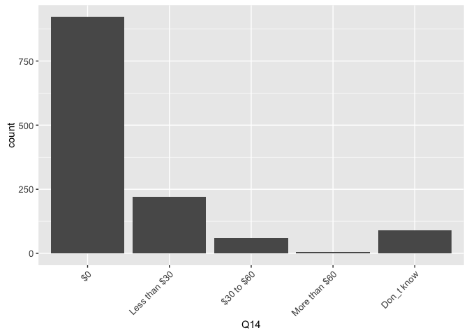<!-- -->

```r
# save weighted data frame
q1 <- as.data.frame(svytable(~Q1 + PPGENDER + ppagect4 + PPETHM + income + PPEDUCAT + work + marital, des, round = T))

# create ggplot templates
ptext <- theme(axis.text = element_text(size = rel(0.9)), axis.text.x = element_text(angle = 45, hjust = 1))
p <- ggplot(q1, aes(Q1, weight = Freq)) + ptext

# univarate plot
(all <- p + geom_bar())
```

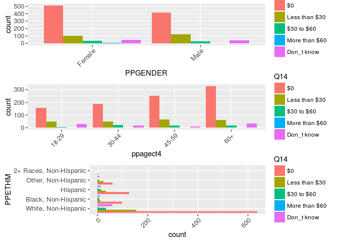<!-- -->

```r
#svytable(~Q1 + PPGENDER, des, round = T)
(gen <- p + aes(PPGENDER, fill = Q1) + geom_bar(position = "dodge"))
```

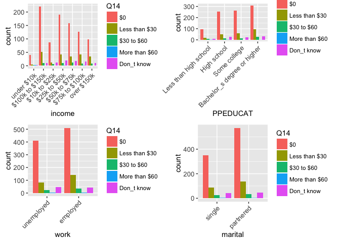<!-- -->

```r
#svytable(~Q1 + ppagect4, des, round = T)
(age <- p + aes(ppagect4, fill = Q1) + geom_bar(position = "dodge"))
```

<!-- -->

```r
#svytable(~Q1 + PPETHM, des, round = T)
(eth <- p + aes(PPETHM, fill = Q1) + coord_flip() + geom_bar(position = "dodge"))
```

<!-- -->

```r
#svytable(~Q1 + income, des, round = T)
(inc <- p + ptext + aes(income, fill = Q1) + geom_bar(position = "dodge"))
```

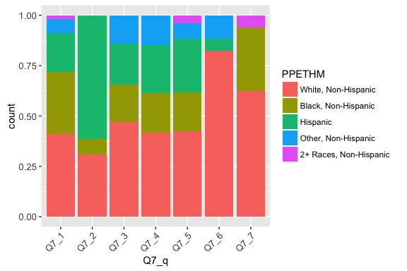<!-- -->

```r
#svytable(~Q1 + PPEDUCAT, des, round = T)
(edu <- p + aes(PPEDUCAT, fill = Q1) + geom_bar(position = "dodge"))
```

<!-- -->

```r
#svytable(~Q1 + work, des, round = T)
(wor <- p + aes(work, fill = Q1) + geom_bar(position = "dodge"))
```

<!-- -->

```r
#svytable(~Q1 + marital, des, round = T)
(mar <- p + aes(marital, fill = Q1) + geom_bar(position = "dodge"))
```

<!-- -->

```r
#grid.arrange(all, gen, age, eth)
#grid.arrange(inc, edu, wor, mar)
```


## Q2. Have you had an illness with influenza-like symptoms since August 2015?


```r
q2 <- as.data.frame(svytable(~Q2 + PPGENDER + ppagect4 + PPETHM + income + PPEDUCAT + work + marital, des, round = T))

p <- ggplot(q2, aes(Q2, weight = Freq)) + ptext
all <- p + geom_bar()

#svytable(~Q2 + PPGENDER, des, round = T)
gen <- p + aes(PPGENDER, fill = Q2) + geom_bar(position = "dodge")
#svytable(~Q2 + ppagect4, des, round = T)
age <- p + aes(ppagect4, fill = Q2) + geom_bar(position = "dodge")
#svytable(~Q2 + PPETHM, des, round = T)
eth <- p + aes(PPETHM, fill = Q2) + geom_bar(position = "dodge")
#svytable(~Q2 + income, des, round = T)
inc <- p + ptext + aes(income, fill = Q2) + geom_bar(position = "dodge")
#svytable(~Q2 + PPEDUCAT, des, round = T)
edu <- p + ptext + aes(PPEDUCAT, fill = Q2) + geom_bar(position = "dodge")
#svytable(~Q2 + work, des, round = T)
wor <- p + aes(work, fill = Q2) + geom_bar(position = "dodge")
#svytable(~Q2 + marital, des, round = T)
mar <- p + aes(marital, fill = Q2) + geom_bar(position = "dodge")

grid.arrange(all, gen, age, eth)
```

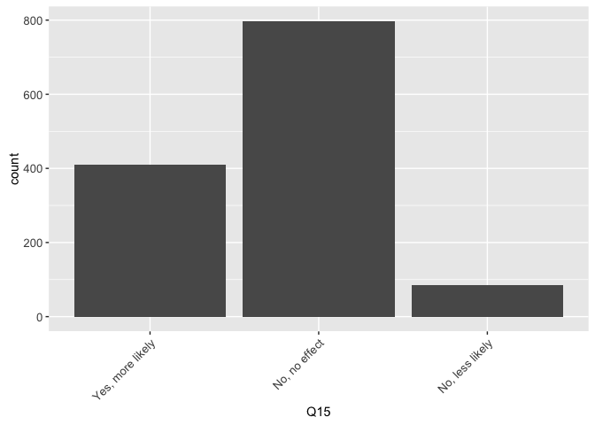<!-- -->

```r
grid.arrange(inc, edu, wor, mar)
```

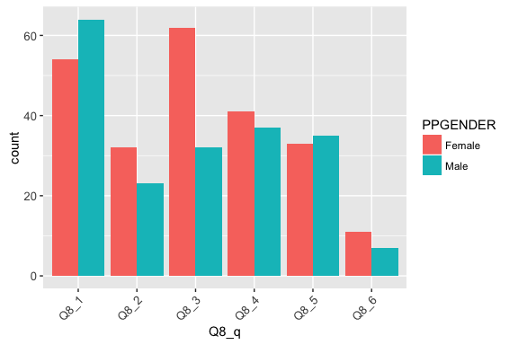<!-- -->

### Examine the % of US adults sick with ILI last year by sex, ethnicity, and age. Do a survey-corrected chi-square test for independence.


```r
## % of US adults sick last year with ILI by sex
# ggplot method
gen <- svyby(~Q2, ~PPGENDER, des, svymean, na.rm = T)
svychisq(~Q2 + PPGENDER, des)
```

```
## 
## 	Pearson's X^2: Rao & Scott adjustment
## 
## data:  svychisq(~Q2 + PPGENDER, des)
## F = 6.3, ndf = 1, ddf = 2200, p-value = 0.01
```

```r
ggplot(gen, aes(PPGENDER, Q2Yes)) + geom_point() + xlab("sex") + ylab("% sick") +
  geom_errorbar(aes(ymin = Q2Yes - se.Q2Yes, ymax = Q2Yes + se.Q2Yes), width = .25) +
  ggtitle(label = "% of adults sick last year with ILI by sex") 
```

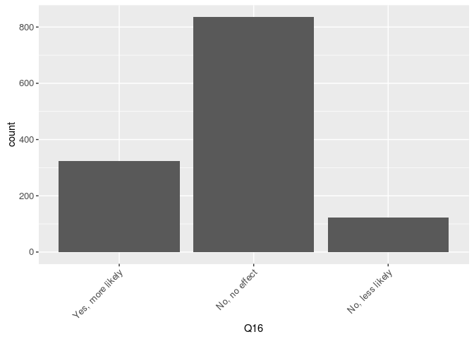<!-- -->

```r
## % of US adults sick last year with ILI by age
age <- svyby(~Q2, ~ppagecat, des, svymean, na.rm = T)
svychisq(~Q2 + ppagecat, des)
```

```
## 
## 	Pearson's X^2: Rao & Scott adjustment
## 
## data:  svychisq(~Q2 + ppagecat, des)
## F = 2.1, ndf = 5.8, ddf = 13000.0, p-value = 0.06
```

```r
qplot(x = age$ppagecat, y = age$Q2Yes, data = age, xlab = "age", ylab = "% sick") + geom_errorbar(aes(x = ppagecat, ymin = Q2Yes - se.Q2Yes, ymax = Q2Yes + se.Q2Yes), width = .25) + ggtitle(label = "% of adults sick last year with ILI by age")
```

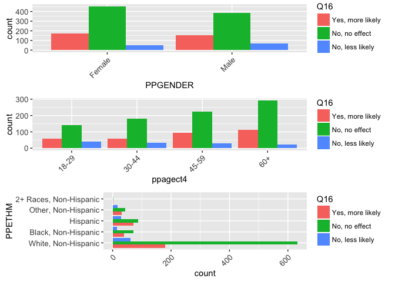<!-- -->

```r
## % of US adults sick last year with ILI by ethnicity
eth <- svyby(~Q2, ~PPETHM, des, svymean, na.rm = T)
svychisq(~Q2 + PPETHM, des)
```

```
## 
## 	Pearson's X^2: Rao & Scott adjustment
## 
## data:  svychisq(~Q2 + PPETHM, des)
## F = 4.3, ndf = 3.4, ddf = 7400.0, p-value = 0.003
```

```r
qplot(x = eth$PPETHM, y = eth$Q2Yes, data = eth, xlab = "ethnicity", ylab = "% sick") + geom_errorbar(aes(x = PPETHM, ymin = Q2Yes - se.Q2Yes, ymax = Q2Yes + se.Q2Yes), width = .25) + ggtitle(label = "% of adults sick last year with ILI by ethnicity")
```

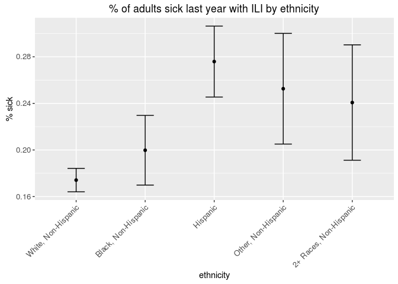<!-- -->

```r
## by income
inc <- svyby(~Q2, ~PPINCIMP, des, svymean, na.rm = T)
ggplot(inc, aes(PPINCIMP, Q2Yes)) + geom_point() + xlab("income") + ylab("% sick") + coord_flip() +
  geom_errorbar(aes(ymin = Q2Yes - se.Q2Yes, ymax = Q2Yes + se.Q2Yes), width = .25) +
  ggtitle(label = "% of adults sick last year with ILI by income") 
```

<!-- -->


## Q3. Has any other person in your household had an illness with influenza like symptoms since August 2015?


```r
q3 <- as.data.frame(svytable(~Q3 + PPGENDER + ppagect4 + PPETHM + income + PPEDUCAT + work + marital, des, round = T))

p <- ggplot(q3, aes(Q3, weight = Freq)) + ptext
(all <- p + geom_bar())
```

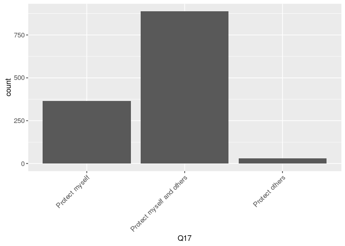<!-- -->

```r
#svytable(~Q + PPGENDER, des, round = T)
```


## Q4. Does your job require you to have a lot of contact with the public?


```r
q4 <- as.data.frame(svytable(~Q4 + PPGENDER + ppagect4 + PPETHM + income + PPEDUCAT + work + marital, des, round = T))

p <- ggplot(q4, aes(Q4, weight = Freq)) + ptext
all <- p + geom_bar()

gen <- p + aes(PPGENDER, fill = Q4) + geom_bar(position = "dodge")
age <- p + aes(ppagect4, fill = Q4) + geom_bar(position = "dodge")
eth <- p + aes(PPETHM, fill = Q4) + geom_bar(position = "dodge")
inc <- p + aes(income, fill = Q4) + geom_bar(position = "dodge")

grid.arrange(gen, age, eth)
```

<!-- -->

```r
inc
```

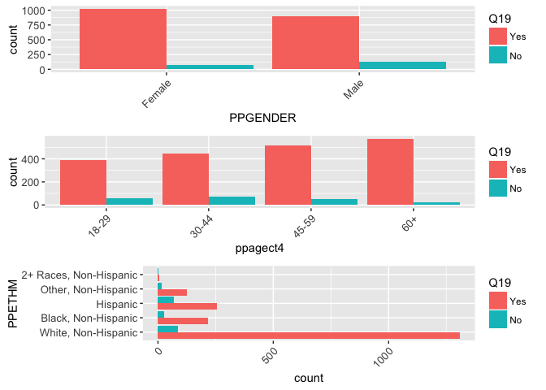<!-- -->


## Q5. Do you have a car that you can use to travel to work?


```r
q5 <- as.data.frame(svytable(~Q5 + PPGENDER + ppagect4 + PPETHM + income + PPEDUCAT + work + marital, des, round = T))

p <- ggplot(q5, aes(Q5, weight = Freq)) + ptext
(all <- p + geom_bar())
```

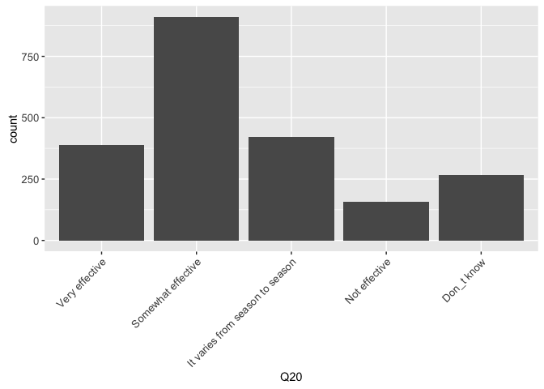<!-- -->

```r
#svytable(~Q + PPGENDER, des, round = T)
```


## Q6. Do you regularly use public transportation?


```r
q6 <- as.data.frame(svytable(~Q6 + PPGENDER + ppagect4 + PPETHM + income + PPEDUCAT + work + marital, des, round = T))

p <- ggplot(q6, aes(Q6, weight = Freq)) + ptext
p + geom_bar()
```

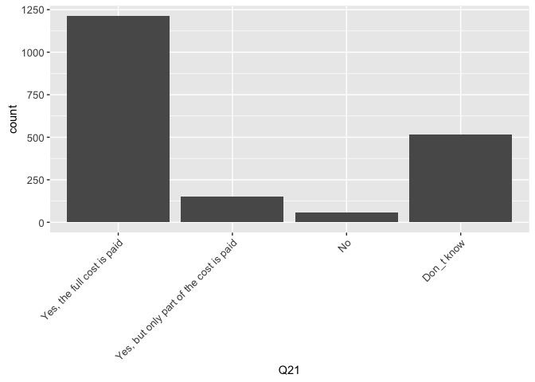<!-- -->

```r
#svytable(~Q + PPGENDER, des, round = T)
gen <- p + aes(PPGENDER, fill = Q6) + geom_bar(position = "dodge")
age <- p + aes(ppagect4, fill = Q6) + geom_bar(position = "dodge")
eth <- p + aes(PPETHM, fill = Q6) + geom_bar(position = "dodge")
inc <- p + aes(income, fill = Q6) + geom_bar(position = "dodge")
edu <- p + aes(PPEDUCAT, fill = Q6) + geom_bar(position = "dodge")
wor <- p + aes(work, fill = Q6) + geom_bar(position = "dodge")
mar <- p + aes(marital, fill = Q6) + geom_bar(position = "dodge")
# add metro status

#grid.arrange(all, gen, age, eth)
#grid.arrange(inc, edu, wor, mar)
```


# PICK UP HERE

## Q7. What types of public transportation do you regularly use?
## Q8. For what types of activities do you regularly use public transportation?
## Q9. Do other members of your household regularly use public transportation?


```r
q9 <- as.data.frame(svytable(
  ~Q9 + PPGENDER + ppagect4 + PPETHM + income + PPEDUCAT + work + marital, des, round = T))

p <- ggplot(q9, aes(Q9, weight = Freq))
(all <- p + geom_bar())
```

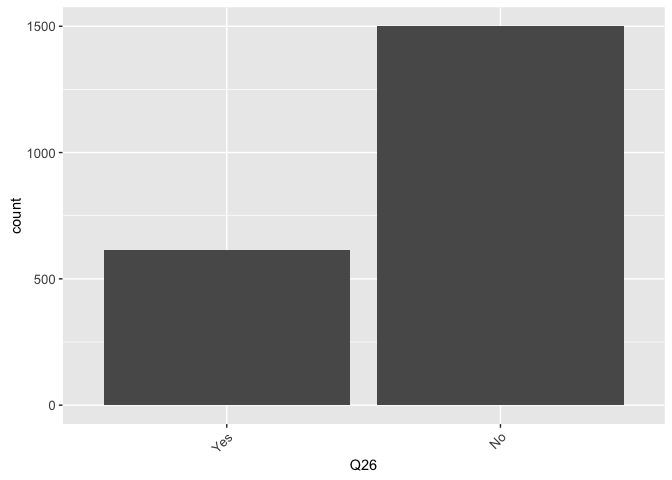<!-- -->

```r
#svytable(~Q + PPGENDER, des, round = T)
```
## Q10. What types of public transportation do other members of your household regularly use?
## Q11. How do you rate your risk of getting influenza if you visited each of the following locations?
## Q12. Which of the following actions do you take to avoid getting sick?
## Q13. Do you get the flu vaccine?


```r
q13 <- as.data.frame(svytable(
  ~Q13 + PPGENDER + ppagect4 + PPETHM + income + PPEDUCAT + work + marital, des, round = T))

p <- ggplot(q13, aes(Q13, weight = Freq))
all <- p + geom_bar()

#svytable(~Q + PPGENDER, des, round = T)
ge <- p + aes(PPGENDER, fill = Q13) + geom_bar(position = "dodge")
ag <- p + aes(ppagect4, fill = Q13) + geom_bar(position = "dodge")
et <- p + aes(PPETHM, fill = Q13) + geom_bar(position = "dodge")
inc <- p + aes(income, fill = Q13) + geom_bar(position = "dodge")
ed <- p + aes(PPEDUCAT, fill = Q13) + geom_bar(position = "dodge")
wo <- p + aes(work, fill = Q13) + geom_bar(position = "dodge")
ma <- p + aes(marital, fill = Q13) + geom_bar(position = "dodge")

grid.arrange(all, ge, ag, et, nrow = 2)
```

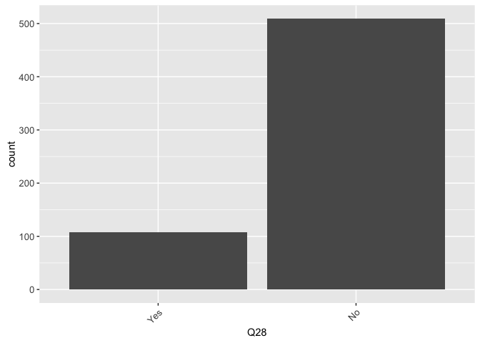<!-- -->

```r
grid.arrange(inc, ed, wo, ma, nrow = 2)
```

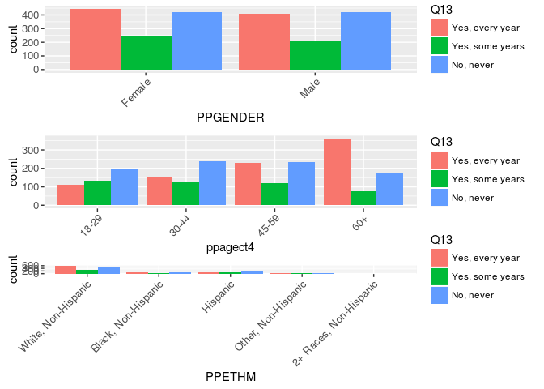<!-- -->

## Q14. How much do you pay to get an influenza vaccine?


```r
q14 <- as.data.frame(svytable(
  ~Q14 + PPGENDER + ppagect4 + PPETHM + income + PPEDUCAT + work + marital, des, round = T))

p <- ggplot(q14, aes(Q14, weight = Freq))
all <- p + geom_bar()

#svytable(~Q + PPGENDER, des, round = T)
ge <- p + aes(PPGENDER, fill = Q14) + geom_bar(position = "dodge")
ag <- p + aes(ppagect4, fill = Q14) + geom_bar(position = "dodge")
et <- p + aes(PPETHM, fill = Q14) + geom_bar(position = "dodge")
inc <- p + aes(income, fill = Q14) + geom_bar(position = "dodge")
ed <- p + aes(PPEDUCAT, fill = Q14) + geom_bar(position = "dodge")
wo <- p + aes(work, fill = Q14) + geom_bar(position = "dodge")
ma <- p + aes(marital, fill = Q14) + geom_bar(position = "dodge")

grid.arrange(all, ge, ag, et, nrow = 2)
```

<!-- -->

```r
grid.arrange(inc, ed, wo, ma, nrow = 2)
```

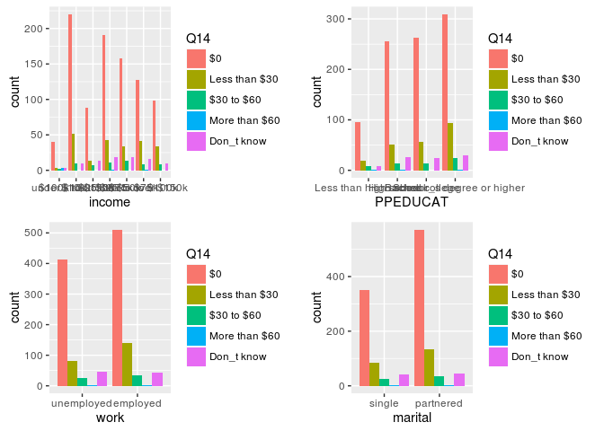<!-- -->

## Q15. Are you more likely to get a vaccine if others around you get a vaccine?


```r
q15 <- as.data.frame(svytable(
  ~Q15 + PPGENDER + ppagect4 + PPETHM + income + PPEDUCAT + work + marital, des, round = T))

p <- ggplot(q15, aes(Q15, weight = Freq))
all <- p + geom_bar()

#svytable(~Q + PPGENDER, des, round = T)
ge <- p + aes(PPGENDER, fill = Q15) + geom_bar(position = "dodge")
ag <- p + aes(ppagect4, fill = Q15) + geom_bar(position = "dodge")
et <- p + aes(PPETHM, fill = Q15) + geom_bar(position = "dodge")
inc <- p + aes(income, fill = Q15) + geom_bar(position = "dodge")
ed <- p + aes(PPEDUCAT, fill = Q15) + geom_bar(position = "dodge")
wo <- p + aes(work, fill = Q15) + geom_bar(position = "dodge")
ma <- p + aes(marital, fill = Q15) + geom_bar(position = "dodge")

grid.arrange(all, ge, ag, et, nrow = 2)
```

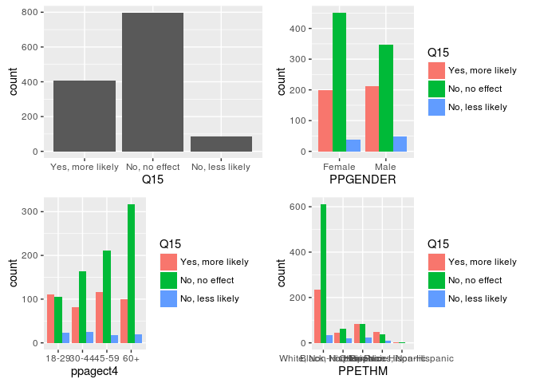<!-- -->

```r
grid.arrange(inc, ed, wo, ma, nrow = 2)
```

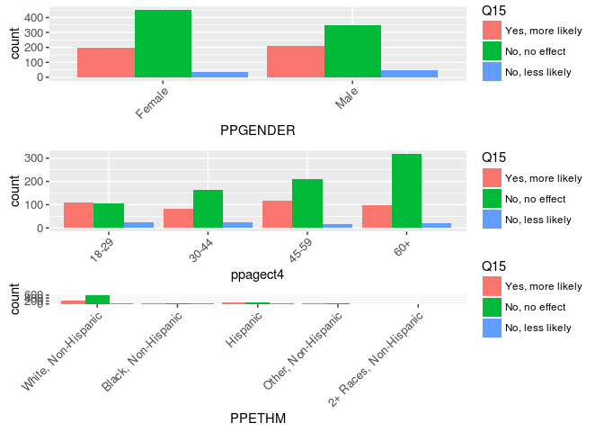<!-- -->


## Q16. Are you more likely to get a vaccine if others around you do not get a vaccine?


```r
q16 <- as.data.frame(svytable(
  ~Q16 + PPGENDER + ppagect4 + PPETHM + income + PPEDUCAT + work + marital, des, round = T))

p <- ggplot(q16, aes(Q16, weight = Freq))
all <- p + geom_bar()

#svytable(~Q + PPGENDER, des, round = T)
ge <- p + aes(PPGENDER, fill = Q16) + geom_bar(position = "dodge")
ag <- p + aes(ppagect4, fill = Q16) + geom_bar(position = "dodge")
et <- p + aes(PPETHM, fill = Q16) + geom_bar(position = "dodge")
inc <- p + aes(income, fill = Q16) + geom_bar(position = "dodge")
ed <- p + aes(PPEDUCAT, fill = Q16) + geom_bar(position = "dodge")
wo <- p + aes(work, fill = Q16) + geom_bar(position = "dodge")
ma <- p + aes(marital, fill = Q16) + geom_bar(position = "dodge")

grid.arrange(all, ge, ag, et, nrow = 2)
```

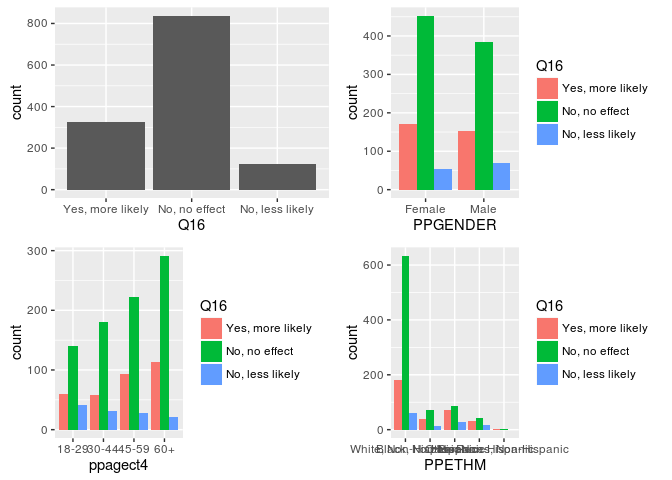<!-- -->

```r
grid.arrange(inc, ed, wo, ma, nrow = 2)
```

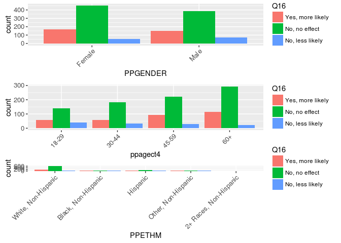<!-- -->


## Q17. Do you get a vaccine to protect yourself, protect others, or protect yourself and others?


```r
q17 <- as.data.frame(svytable(
  ~Q17 + PPGENDER + ppagect4 + PPETHM + income + PPEDUCAT + work + marital, des, round = T))

p <- ggplot(q17, aes(Q17, weight = Freq))
all <- p + geom_bar()

#svytable(~Q + PPGENDER, des, round = T)
ge <- p + aes(PPGENDER, fill = Q17) + geom_bar(position = "dodge")
ag <- p + aes(ppagect4, fill = Q17) + geom_bar(position = "dodge")
et <- p + aes(PPETHM, fill = Q17) + geom_bar(position = "dodge")
inc <- p + aes(income, fill = Q17) + geom_bar(position = "dodge")
ed <- p + aes(PPEDUCAT, fill = Q17) + geom_bar(position = "dodge")
wo <- p + aes(work, fill = Q17) + geom_bar(position = "dodge")
ma <- p + aes(marital, fill = Q17) + geom_bar(position = "dodge")

grid.arrange(all, ge, ag, et)
```

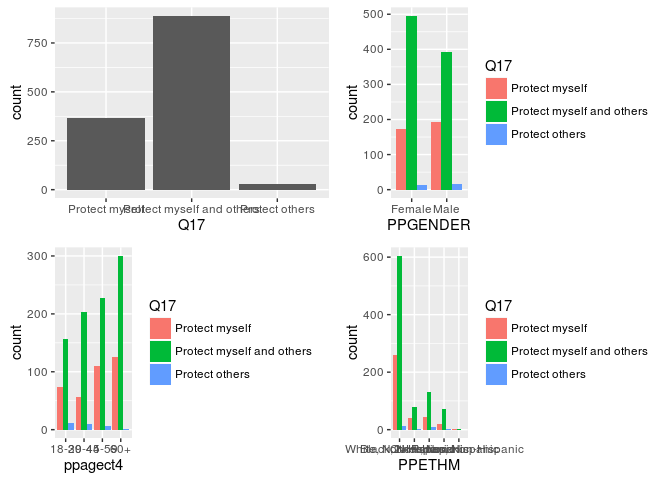<!-- -->

```r
grid.arrange(inc, ed, wo, ma)
```

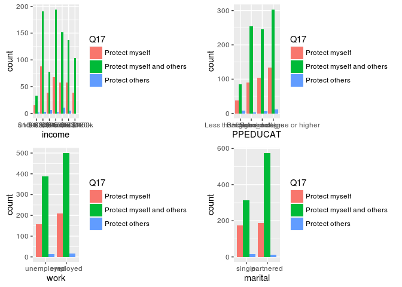<!-- -->

## Q18. What are the reasons you would not get an influenza vaccine?
## Q19. Do you have health insurance?


```r
q19 <- as.data.frame(svytable(
  ~Q19 + PPGENDER + ppagect4 + PPETHM + income + PPEDUCAT + work + marital, des, round = T))

p <- ggplot(q19, aes(Q19, weight = Freq))
all <- p + geom_bar()

#svytable(~Q + PPGENDER, des, round = T)
ge <- p + aes(PPGENDER, fill = Q19) + geom_bar(position = "dodge")
ag <- p + aes(ppagect4, fill = Q19) + geom_bar(position = "dodge")
et <- p + aes(PPETHM, fill = Q19) + geom_bar(position = "dodge")
inc <- p + aes(income, fill = Q19) + geom_bar(position = "dodge")
ed <- p + aes(PPEDUCAT, fill = Q19) + geom_bar(position = "dodge")
wo <- p + aes(work, fill = Q19) + geom_bar(position = "dodge")
ma <- p + aes(marital, fill = Q19) + geom_bar(position = "dodge")

grid.arrange(all, ge, ag, et)
```

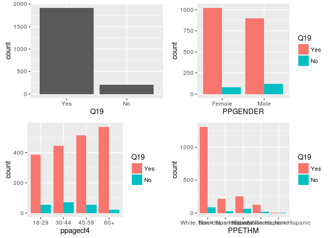<!-- -->

```r
grid.arrange(inc, ed, wo, ma)
```

<!-- -->

## Q20. How effective do you think the influenza vaccine is in protecting people from becoming sick with influenza?


```r
q20 <- as.data.frame(svytable(
  ~Q20 + PPGENDER + ppagect4 + PPETHM + income + PPEDUCAT + work + marital, des, round = T))

p <- ggplot(q20, aes(Q20, weight = Freq))
all <- p + geom_bar()

#svytable(~Q + PPGENDER, des, round = T)
ge <- p + aes(PPGENDER, fill = Q20) + geom_bar(position = "dodge")
ag <- p + aes(ppagect4, fill = Q20) + geom_bar(position = "dodge")
et <- p + aes(PPETHM, fill = Q20) + geom_bar(position = "dodge")
inc <- p + aes(income, fill = Q20) + geom_bar(position = "dodge")
ed <- p + aes(PPEDUCAT, fill = Q20) + geom_bar(position = "dodge")
wo <- p + aes(work, fill = Q20) + geom_bar(position = "dodge")
ma <- p + aes(marital, fill = Q20) + geom_bar(position = "dodge")

grid.arrange(all, ge, ag, et, nrow = 2)
```

<!-- -->

```r
grid.arrange(inc, ed, wo, ma, nrow = 2)
```

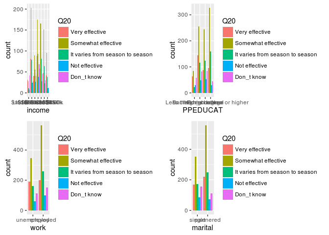<!-- -->

## Q21. Are influenza vaccines covered by your health insurance?


```r
q21 <- as.data.frame(svytable(
  ~Q21 + PPGENDER + ppagect4 + PPETHM + income + PPEDUCAT + work + marital, des, round = T))

p <- ggplot(q21, aes(Q21, weight = Freq))
(all <- p + geom_bar())
```

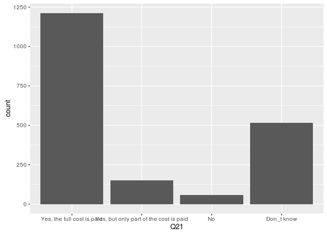<!-- -->


## Q22. Do you do any of the following when you have influenza symptoms?
## Q23. Which of the following actions do you take when you have influenza symptoms to avoid someone else from getting sick?
## Q24. What sources of information do you recall hearing or seeing about influenza outbreaks?
## Q25. If you received information from the news, internet or other public media that there was an influenza outbreak in your community would you do any of the following?
## Q26. Does your household have children?


```r
q26 <- as.data.frame(svytable(
  ~Q26 + PPGENDER + ppagect4 + PPETHM + income + PPEDUCAT + work + marital, des, round = T))

p <- ggplot(q26, aes(Q26, weight = Freq))
(all <- p + geom_bar())
```

<!-- -->

## Q27. What actions do you take when a child in your household has influenza symptoms?
## Q28. Are you a single parent?


```r
q28 <- as.data.frame(svytable(
  ~Q28 + PPGENDER + ppagect4 + PPETHM + income + PPEDUCAT + work + marital, des, round = T))

p <- ggplot(q28, aes(Q28, weight = Freq))
(all <- p + geom_bar())
```

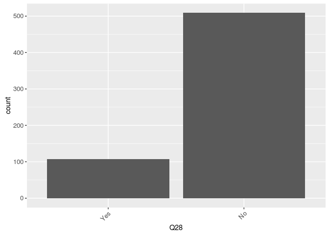<!-- -->

## Q29. How do you care for a sick child? (married parent)
## Q30. How do you care for a sick child? (single parent)
## Q31. How many hours of screen time (time spent watching television, a computer, smartphone, iPad, etc.) do you spend each day on average when you are not sick? Enter 0 if none
## Q32. How many hours of screen time do you spend each day on average when you are sick? Enter 0 if none
## Q33. How many people, including yourself, reside in your household?


## TEMPLATE ##

```r
# q <- as.data.frame(svytable(
#   ~Q + PPGENDER + ppagect4 + PPETHM + income + PPEDUCAT + work + marital, des, round = T))
# 
# p <- ggplot(q, aes(Q, weight = Freq))
# 
# all <- p + geom_bar()
# #svytable(~Q + PPGENDER, des, round = T)
# ge <- p + aes(PPGENDER, fill = Q) + geom_bar(position = "dodge")
# ag <- p + aes(ppagect4, fill = Q) + geom_bar(position = "dodge")
# et <- p + aes(PPETHM, fill = Q) + geom_bar(position = "dodge")
# inc <- p + aes(income, fill = Q) + geom_bar(position = "dodge")
# ed <- p + aes(PPEDUCAT, fill = Q) + geom_bar(position = "dodge")
# wo <- p + aes(work, fill = Q) + geom_bar(position = "dodge")
# ma <- p + aes(marital, fill = Q) + geom_bar(position = "dodge")
# 
# grid.arrange(all, ge, ag, et, nrow = 2)
# grid.arrange(inc, ed, wo, ma, nrow = 2)
```


