# Behavior part 1: Transportation

Questions 7, 8, 9, 10.
Transportation behavior.


## Q7. What types of public transportation do you regularly use?


```
## 'data.frame':	324 obs. of  19 variables:
##  $ CaseID      : int  2 5 15 18 23 44 53 69 72 75 ...
##  $ PPGENDER    : Factor w/ 2 levels "Female","Male": 1 2 2 2 1 1 2 1 1 2 ...
##  $ PPAGE       : int  18 56 50 33 65 70 55 22 25 55 ...
##  $ ppagecat    : Factor w/ 7 levels "18-24","25-34",..: 1 5 4 2 6 6 5 1 2 5 ...
##  $ PPETHM      : Factor w/ 5 levels "White, Non-Hispanic",..: 1 1 1 2 3 1 3 3 5 1 ...
##  $ PPINCIMP    : Ord.factor w/ 19 levels "Less than $5,000"<..: 19 16 10 1 6 1 16 14 17 8 ...
##  $ PPEDUC      : Factor w/ 14 levels "No formal education",..: 9 14 9 9 10 6 12 10 10 9 ...
##  $ PPEDUCAT    : Factor w/ 4 levels "Less than high school",..: 2 4 2 2 3 1 4 3 3 2 ...
##  $ work        : Factor w/ 2 levels "unemployed","employed": 1 2 2 1 1 1 2 2 1 1 ...
##  $ marital     : Factor w/ 2 levels "single","partnered": 1 2 1 1 2 1 1 1 1 1 ...
##  $ PPMSACAT    : Factor w/ 2 levels "Metro","Non-Metro": 1 1 1 1 1 1 1 1 1 1 ...
##  $ ppreg9      : Factor w/ 9 levels "East-North Central",..: 3 4 7 3 3 1 3 1 6 1 ...
##  $ PPSTATEN    : Factor w/ 51 levels "AK","AL","AR",..: 32 4 46 39 35 16 32 15 5 23 ...
##  $ PPHOUSE     : Factor w/ 5 levels "A building with 2 or more apartments",..: 4 4 1 1 1 4 1 4 4 1 ...
##  $ PPNET       : Factor w/ 2 levels "No","Yes": 2 2 2 1 1 2 1 2 2 1 ...
##  $ Q7_otherText: Factor w/ 15 levels "bike,walk","car",..: NA NA NA NA NA NA NA NA NA NA ...
##  $ weight      : num  1.314 0.646 0.799 1.642 1.223 ...
##  $ Q7_q        : Factor w/ 7 levels "Airplane","Bus",..: 2 2 2 2 2 2 2 2 2 2 ...
##  $ Q7_r        : chr  "Yes" "Yes" "Yes" "Yes" ...
```

Gender, age, ethnicity, income, education

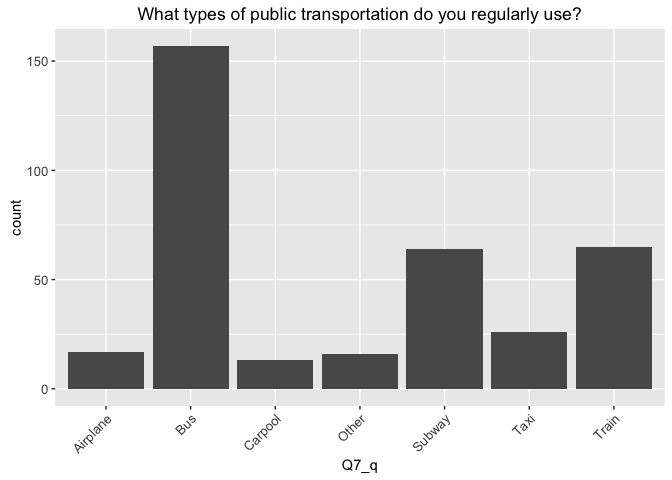<!-- -->

<!-- -->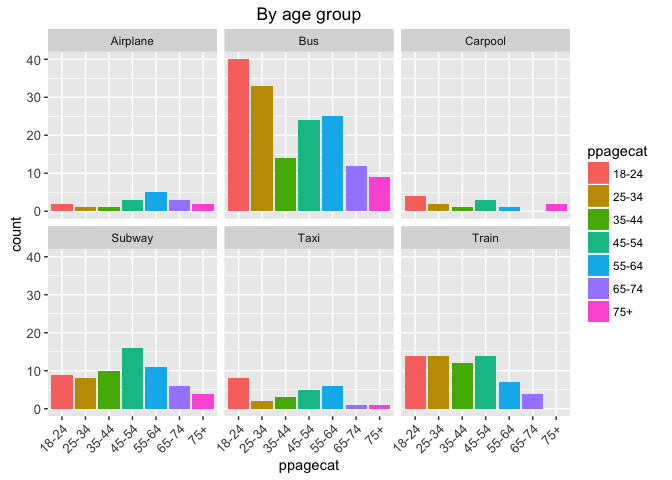<!-- -->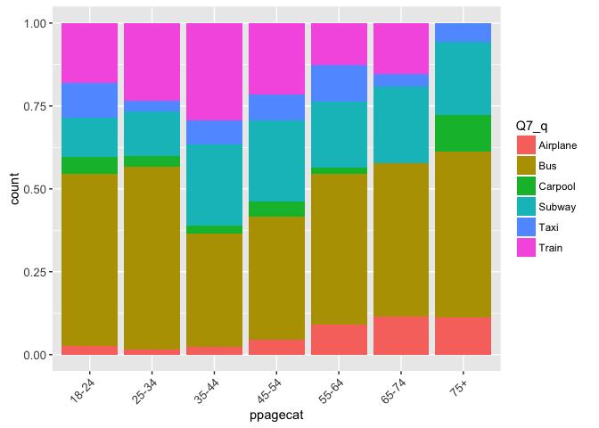<!-- --><!-- -->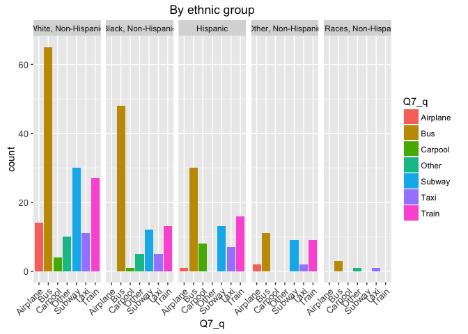<!-- --><!-- -->

Employment status, marital status, metro status, region, state of residency, housing status, internet availability


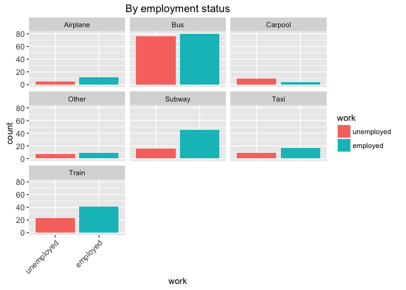<!-- --><!-- --><!-- --><!-- -->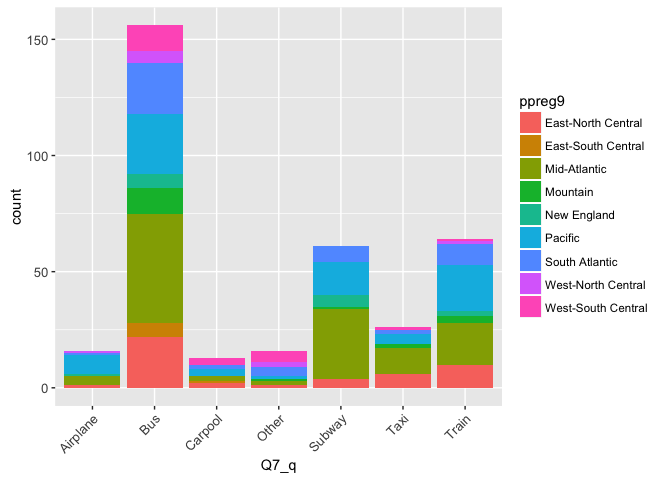<!-- -->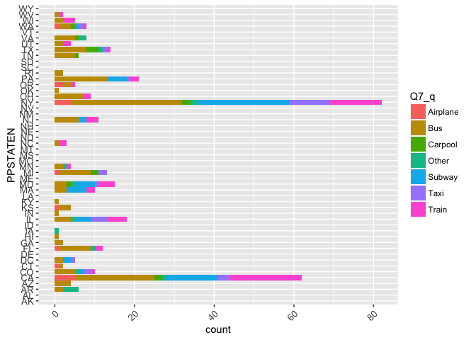<!-- -->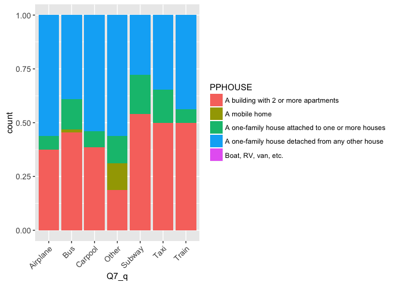<!-- --><!-- -->


## Q8. For what types of activities do you regularly use public transportation?


```
## 'data.frame':	383 obs. of  19 variables:
##  $ CaseID      : int  5 15 32 53 69 149 157 162 168 191 ...
##  $ PPGENDER    : Factor w/ 2 levels "Female","Male": 2 2 2 2 1 1 2 1 2 2 ...
##  $ PPAGE       : int  56 50 27 55 22 26 48 25 31 25 ...
##  $ ppagecat    : Factor w/ 7 levels "18-24","25-34",..: 5 4 2 5 1 2 4 2 2 2 ...
##  $ PPETHM      : Factor w/ 5 levels "White, Non-Hispanic",..: 1 1 5 3 3 5 2 1 4 1 ...
##  $ PPINCIMP    : Ord.factor w/ 19 levels "Less than $5,000"<..: 16 10 11 16 14 8 7 17 14 8 ...
##  $ PPEDUC      : Factor w/ 14 levels "No formal education",..: 14 9 13 12 10 12 12 13 14 9 ...
##  $ PPEDUCAT    : Factor w/ 4 levels "Less than high school",..: 4 2 4 4 3 4 4 4 4 2 ...
##  $ work        : Factor w/ 2 levels "unemployed","employed": 2 2 2 2 2 2 2 2 2 2 ...
##  $ marital     : Factor w/ 2 levels "single","partnered": 2 1 2 1 1 1 1 2 1 1 ...
##  $ PPMSACAT    : Factor w/ 2 levels "Metro","Non-Metro": 1 1 1 1 1 1 1 1 1 1 ...
##  $ ppreg9      : Factor w/ 9 levels "East-North Central",..: 4 7 3 3 1 1 3 3 6 6 ...
##  $ PPSTATEN    : Factor w/ 51 levels "AK","AL","AR",..: 4 46 39 32 15 23 35 35 5 48 ...
##  $ PPHOUSE     : Factor w/ 5 levels "A building with 2 or more apartments",..: 4 1 1 1 4 4 1 1 1 4 ...
##  $ PPNET       : Factor w/ 2 levels "No","Yes": 2 2 2 1 2 1 2 2 2 2 ...
##  $ Q8_otherText: Factor w/ 19 levels "church, adult ed",..: NA NA NA NA NA NA NA NA NA NA ...
##  $ weight      : num  0.646 0.799 0.384 1.264 1.813 ...
##  $ Q8_q        : Factor w/ 6 levels "Other","Recreation",..: 6 6 6 6 6 6 6 6 6 6 ...
##  $ Q8_r        : chr  "Yes" "Yes" "Yes" "Yes" ...
```

Gender, age, ethnicity, income, education

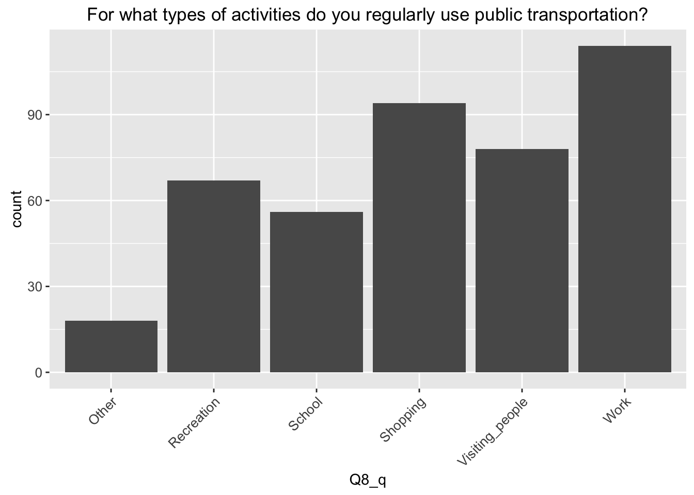<!-- -->

<!-- --><!-- --><!-- -->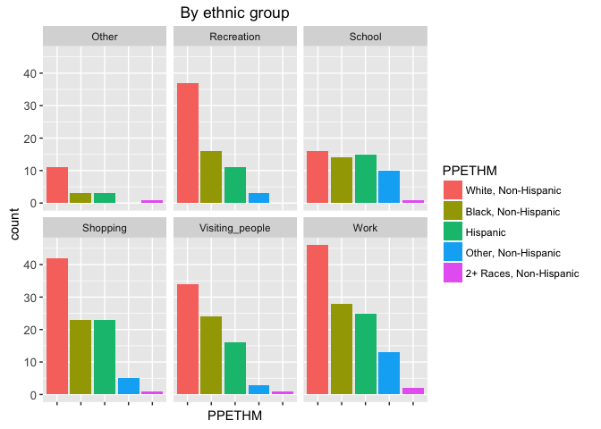<!-- -->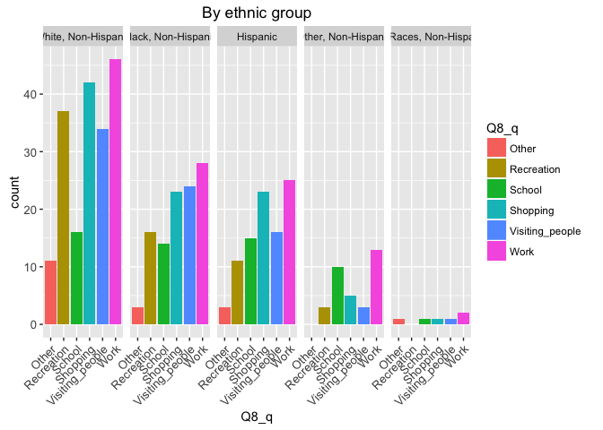<!-- -->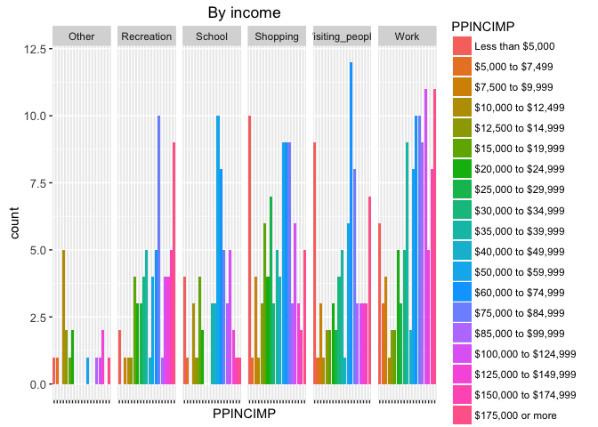<!-- -->

Employment status, marital status, metro status, region, state of residency, housing status, internet availability


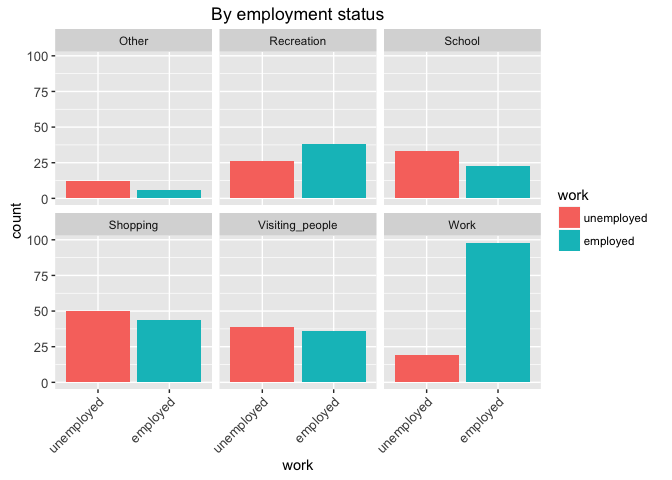<!-- -->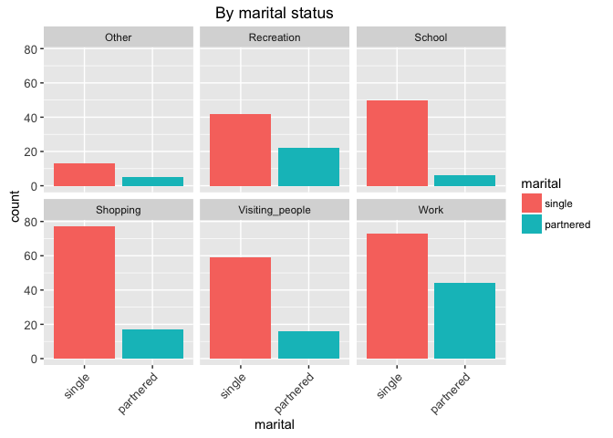<!-- --><!-- --><!-- --><!-- --><!-- --><!-- -->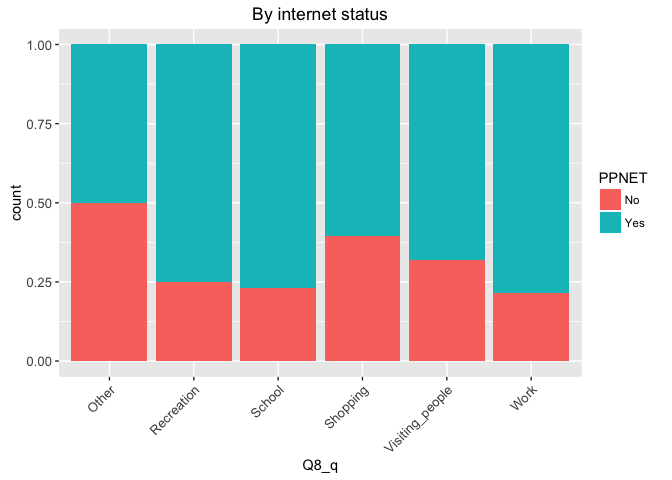<!-- -->


## Q9. Do other members of your household regularly use public transportation?

<!-- -->


## Q10. What types of public transportation do other members of your household regularly use?


```
## 'data.frame':	308 obs. of  19 variables:
##  $ CaseID       : int  26 44 61 69 72 127 137 145 162 177 ...
##  $ PPGENDER     : Factor w/ 2 levels "Female","Male": 1 1 1 1 1 1 1 2 1 1 ...
##  $ PPAGE        : int  37 70 45 22 25 75 59 21 25 31 ...
##  $ ppagecat     : Factor w/ 7 levels "18-24","25-34",..: 3 6 4 1 2 7 5 1 2 2 ...
##  $ PPETHM       : Factor w/ 5 levels "White, Non-Hispanic",..: 1 1 1 3 5 2 2 1 1 1 ...
##  $ PPINCIMP     : Ord.factor w/ 19 levels "Less than $5,000"<..: 13 1 16 14 17 14 1 13 17 18 ...
##  $ PPEDUC       : Factor w/ 14 levels "No formal education",..: 11 6 9 10 10 4 1 10 13 12 ...
##  $ PPEDUCAT     : Factor w/ 4 levels "Less than high school",..: 3 1 2 3 3 1 1 3 4 4 ...
##  $ work         : Factor w/ 2 levels "unemployed","employed": 2 1 2 2 1 1 1 2 2 2 ...
##  $ marital      : Factor w/ 2 levels "single","partnered": 2 1 2 1 1 1 1 1 2 2 ...
##  $ PPMSACAT     : Factor w/ 2 levels "Metro","Non-Metro": 2 1 1 1 1 1 1 1 1 1 ...
##  $ ppreg9       : Factor w/ 9 levels "East-North Central",..: 1 1 3 1 6 3 9 4 3 6 ...
##  $ PPSTATEN     : Factor w/ 51 levels "AK","AL","AR",..: 16 16 35 15 5 35 3 45 35 48 ...
##  $ PPHOUSE      : Factor w/ 5 levels "A building with 2 or more apartments",..: 4 4 4 4 4 1 4 4 1 4 ...
##  $ PPNET        : Factor w/ 2 levels "No","Yes": 2 2 2 2 2 2 1 2 2 2 ...
##  $ Q10_otherText: Factor w/ 10 levels "car","ferry",..: NA NA NA NA NA NA NA NA NA 10 ...
##  $ weight       : num  0.935 0.957 0.845 1.813 0.446 ...
##  $ Q10_q        : Factor w/ 8 levels "Airplane","Bus",..: 2 2 2 2 2 2 2 2 2 2 ...
##  $ Q10_r        : chr  "Yes" "Yes" "Yes" "Yes" ...
```

Gender, age, ethnicity, income, education

<!-- -->

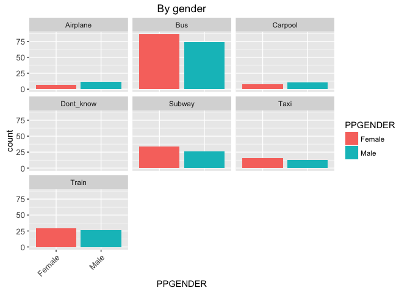<!-- -->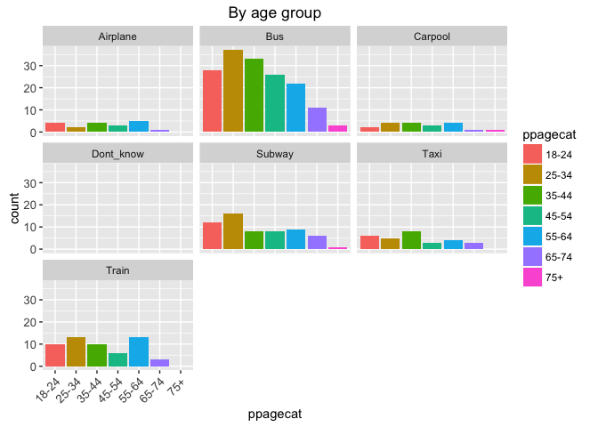<!-- -->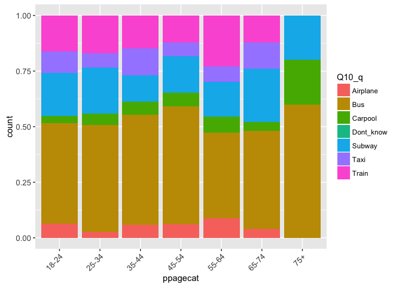<!-- --><!-- --><!-- --><!-- -->

Employment status, marital status, metro status, region, state of residency, housing status, internet availability


<!-- --><!-- -->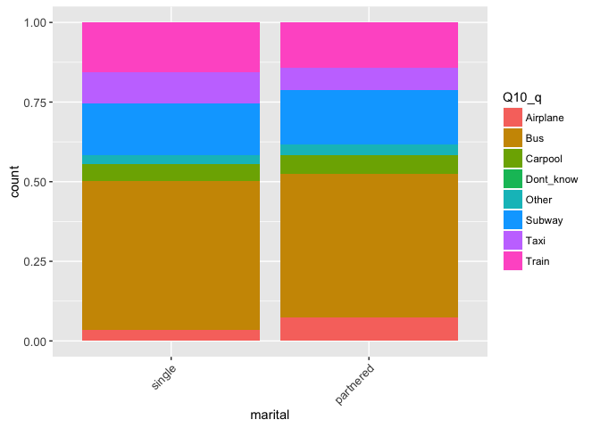<!-- -->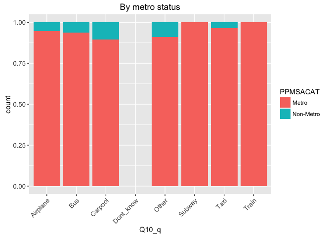<!-- -->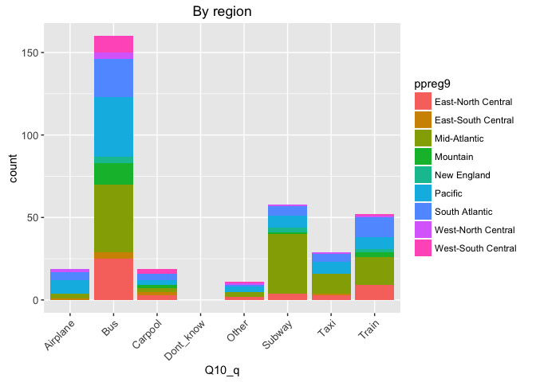<!-- -->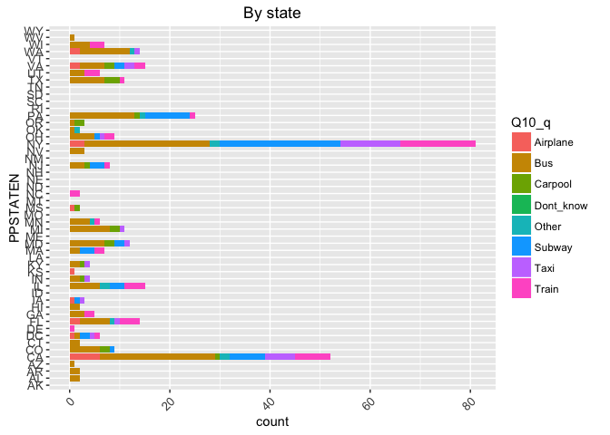<!-- --><!-- --><!-- -->


