# Behavior part 2: Perceived risk

Questions 11, 20.
Perceived risk.


```r
## Create survey object.
options(digits = 4)
options(survey.lonely.psu = "adjust")

des <- svydesign(ids = ~1, weights = ~weight, data = df[is.na(df$weight)==F, ])
```


## Q11. How do you rate your risk of getting influenza if you visited each of the following locations?


```r
# subset question data, rename columns, gather into single column
q11_df <- df %>%
  select(CaseID, PPGENDER, PPAGE, ppagecat, PPETHM, PPINCIMP, PPEDUC, PPEDUCAT,
         work, PPWORK, marital, PPMARIT, PPMSACAT, ppreg9, PPSTATEN, PPHOUSE, PPRENT, PPNET,
         Q11_1:Q11_11, weight) %>%
  rename(Work = Q11_1,
         Schools = Q11_2,
         Day_care = Q11_3,
         Stores = Q11_4,
         Restaurants = Q11_5,
         Libraries = Q11_6,
         Hospitals = Q11_7,
         Doctors_office = Q11_8,
         Public_transp = Q11_9,
         Family_friends = Q11_10,
         Other = Q11_11) %>%
  gather(Q11_q, Q11_r, Work:Other, na.rm = T) %>%
  mutate(Q11_q = as.factor(Q11_q))

# survey design
options(digits = 4)
options(survey.lonely.psu = "adjust")
des11 <- svydesign(ids = ~1, weights = ~weight, data = q11_df[is.na(q11_df$weight)==F, ])
```

### Gender, age, ethnicity, income


```r
# weighted data frame
q11 <- data.frame(svytable(~Q11_q + Q11_r + PPGENDER + ppagecat + PPETHM + PPINCIMP, des11, round = T))

# plot templates
title <- ggtitle("How do you rate your risk of getting influenza if you visited each of the following locations?")

## main plot
p <- ggplot(q11, aes(Q11_q, weight = Freq)) + ptext
p + geom_bar(position = 'fill') + aes(fill = Q11_r) + title
```

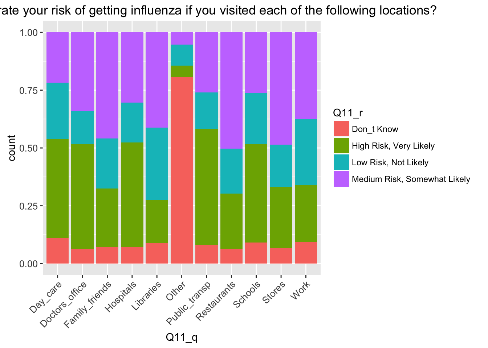<!-- -->


```r
# plot2: exclude 'Don_t know' response
p2 <- ggplot(q11[q11$Q11_r != "Don_t Know", ], aes(Q11_q, weight = Freq)) + ptext
p2 + geom_bar(position = "fill") + aes(Q11_q, fill = Q11_r)
```

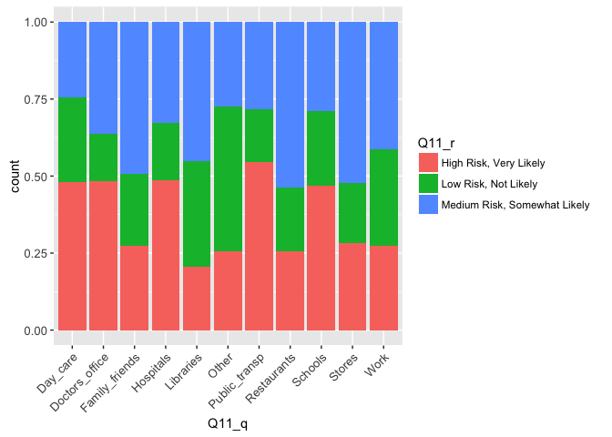<!-- -->

```r
p2 + geom_bar() + aes(Q11_r, fill = Q11_r) + facet_wrap(~Q11_q) + ptext2
```

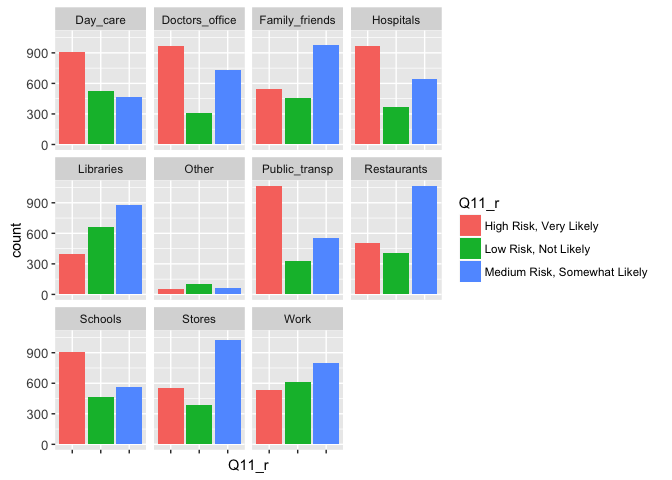<!-- -->

```r
p2 + geom_bar() + aes(Q11_q, fill = Q11_q) + facet_wrap(~Q11_r) + ptext2
```

<!-- -->

```r
# select 'High Risk' response only?
#px <- ggplot(q11[q11$Q11_r == "High Risk", ], aes(weight = Freq)) + ptext

# by gender
p2 + geom_bar() + aes(PPGENDER, fill = Q11_r) + facet_wrap(~Q11_q) + ggtitle("By gender")
```

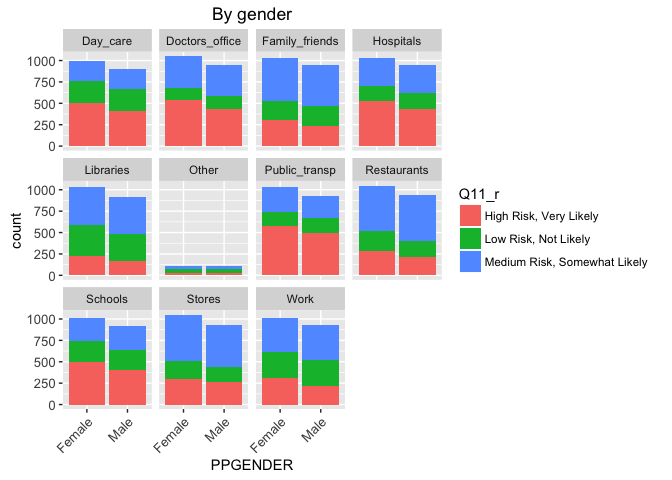<!-- -->

```r
p2 + geom_bar(position = "fill") + aes(PPGENDER, fill = Q11_r) + facet_wrap(~Q11_q)
```

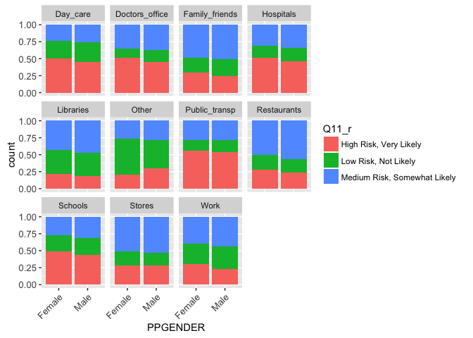<!-- -->

```r
p2 + geom_bar() + aes(Q11_q, fill = PPGENDER) + facet_wrap(~Q11_r)
```

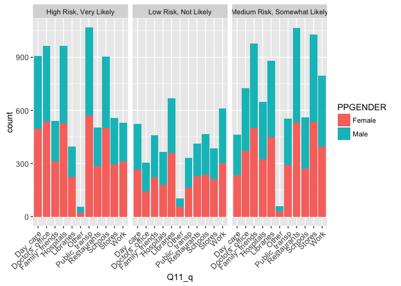<!-- -->

```r
p2 + geom_bar(position = 'fill') + aes(Q11_q, fill = PPGENDER) + facet_wrap(~Q11_r) + ggtitle("By gender")
```

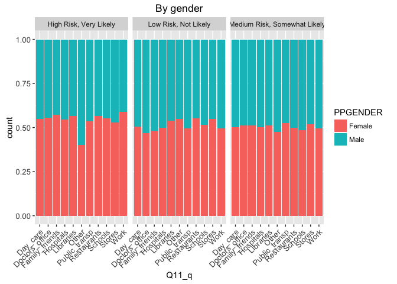<!-- -->

```r
p2 + geom_bar() + aes(PPGENDER, fill = PPGENDER) + facet_grid(Q11_q~Q11_r) + coord_flip() + ptext2
```

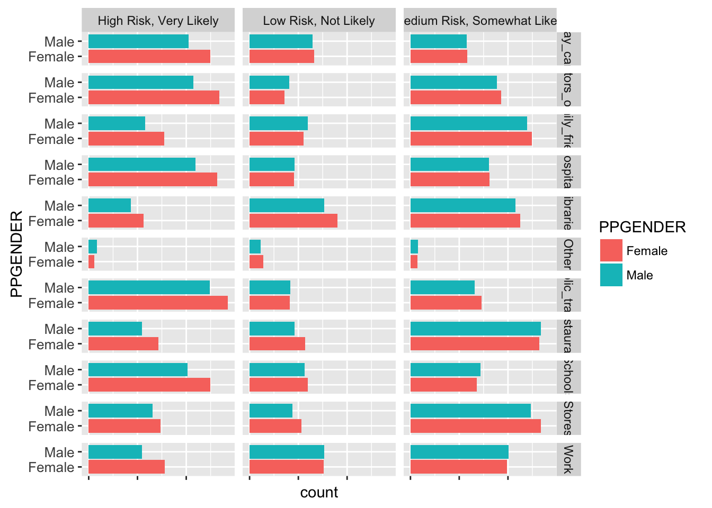<!-- -->

```r
# age boxplot
# need to subset by group
svyboxplot(PPAGE~Q11_q, des11, main = "Age boxplot per response")
```

<!-- -->

```r
# by age group
p2 + geom_bar() + aes(ppagecat, fill = Q11_r) + facet_wrap(~Q11_q) + ggtitle("By age group")
```

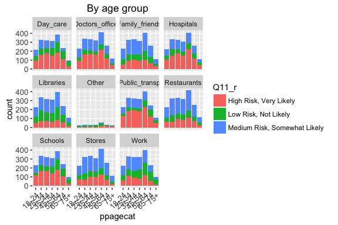<!-- -->

```r
p2 + geom_bar(position = "fill") + aes(ppagecat, fill = Q11_r) + facet_wrap(~Q11_q)
```

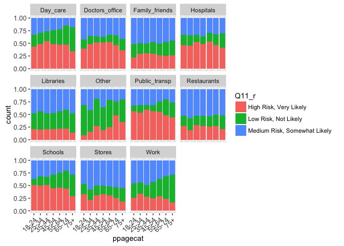<!-- -->

```r
p2 + geom_bar() + aes(Q11_q, fill = ppagecat) + facet_wrap(~Q11_r)
```

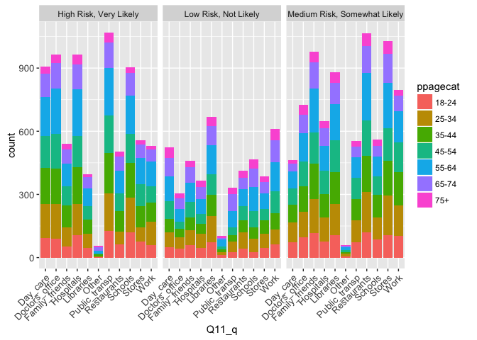<!-- -->

```r
p2 + geom_bar(position = 'fill') + aes(Q11_q, fill = ppagecat) + facet_wrap(~Q11_r) + ggtitle("By age group")
```

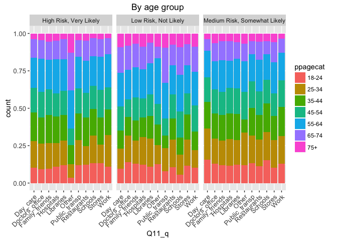<!-- -->

```r
p2 + geom_bar() + aes(ppagecat, fill = ppagecat) + facet_grid(Q11_q~Q11_r) + ptext2
```

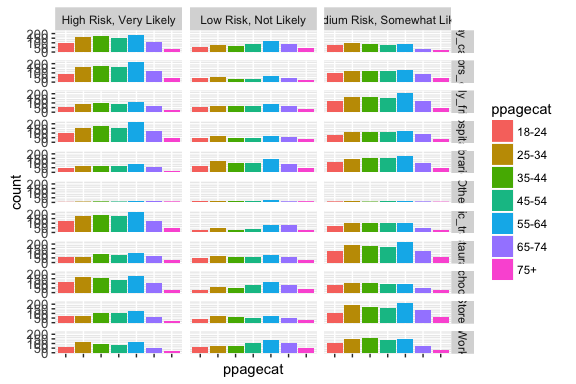<!-- -->

```r
# by ethnic group
p2 + geom_bar() + aes(PPETHM, fill = Q11_r) + facet_wrap(~Q11_q) + ggtitle("By ethnic group")
```

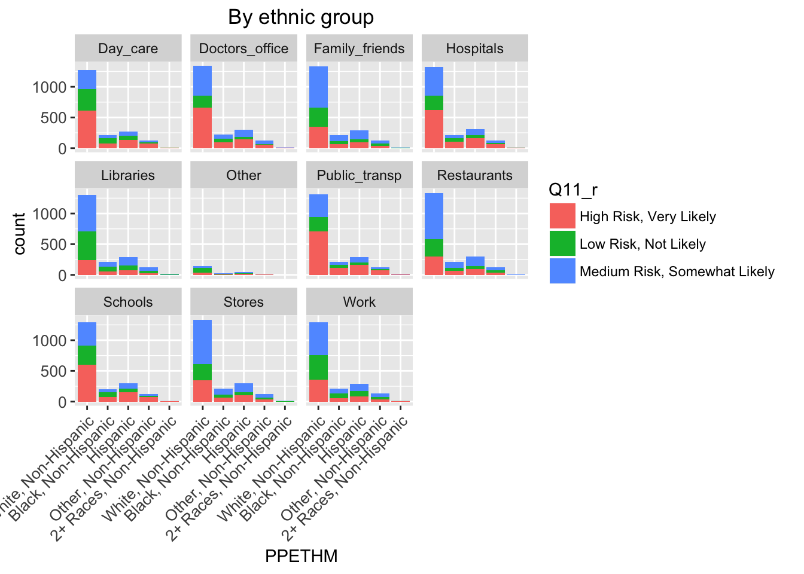<!-- -->

```r
p2 + geom_bar(position = "fill") + aes(PPETHM, fill = Q11_r) + facet_wrap(~Q11_q)
```

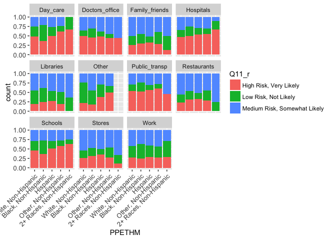<!-- -->

```r
p2 + geom_bar() + aes(Q11_q, fill = PPETHM) + facet_wrap(~Q11_r)
```

<!-- -->

```r
p2 + geom_bar(position = 'fill') + aes(Q11_q, fill = PPETHM) + facet_wrap(~Q11_r) + ggtitle("By ethnic group")
```

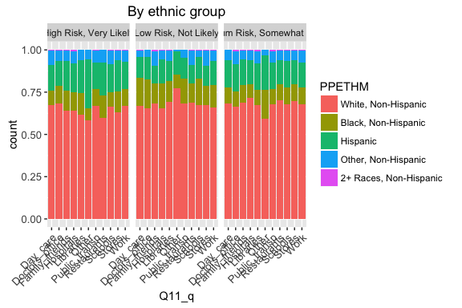<!-- -->

```r
p2 + geom_bar() + aes(PPETHM, fill = PPETHM) + facet_grid(Q11_q~Q11_r) + ptext2
```

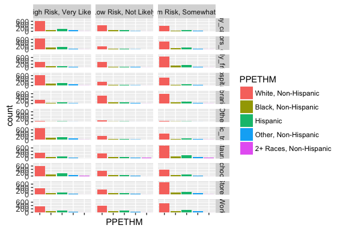<!-- -->

```r
p2 + geom_bar() + aes(Q11_r, fill = Q11_r) + facet_grid(Q11_q~PPETHM) + ptext2
```

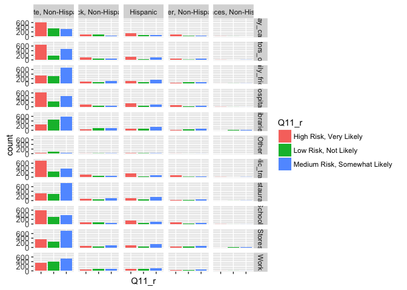<!-- -->

```r
# by income
p2 + geom_bar() + aes(PPINCIMP, fill = Q11_r) + facet_wrap(~Q11_q) + ggtitle("By income") + ptext2
```

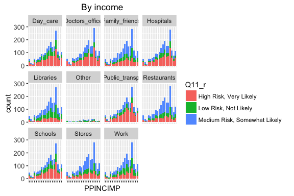<!-- -->

```r
p2 + geom_bar(position = "fill") + aes(PPINCIMP, fill = Q11_r) + facet_wrap(~Q11_q) + ptext2
```

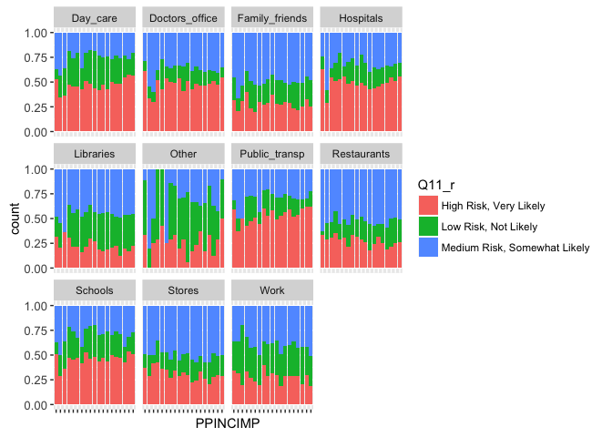<!-- -->

```r
p2 + geom_bar() + aes(Q11_q, fill = PPINCIMP) + facet_wrap(~Q11_r)
```

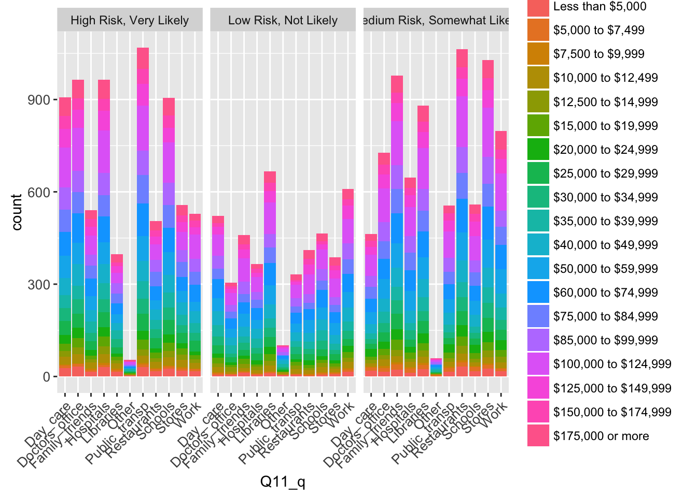<!-- -->

```r
p2 + geom_bar(position = 'fill') + aes(Q11_q, fill = PPINCIMP) + facet_wrap(~Q11_r) + ggtitle("By income group")
```

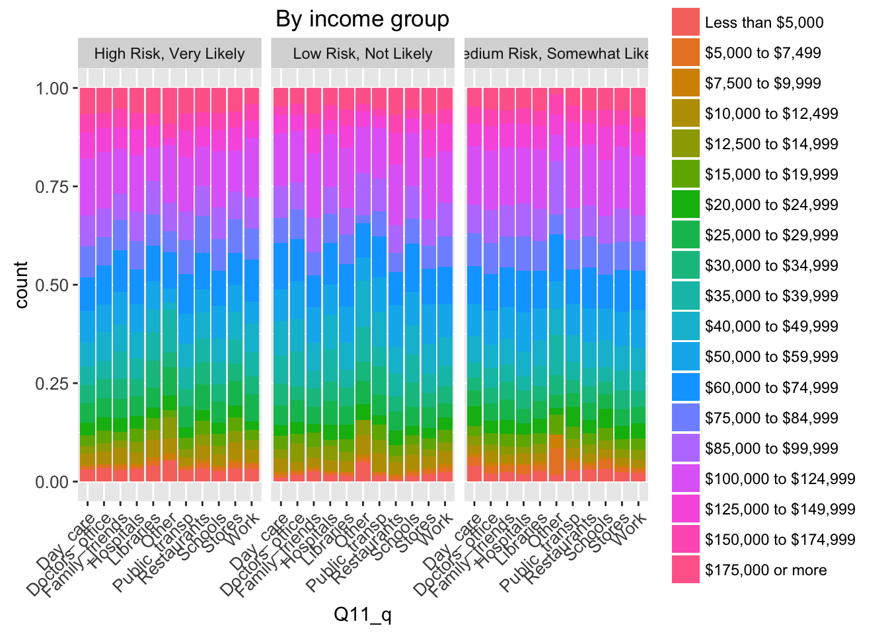<!-- -->

```r
p2 + geom_bar() + aes(PPINCIMP, fill = PPINCIMP) + facet_grid(Q11_q~Q11_r) + ptext2
```

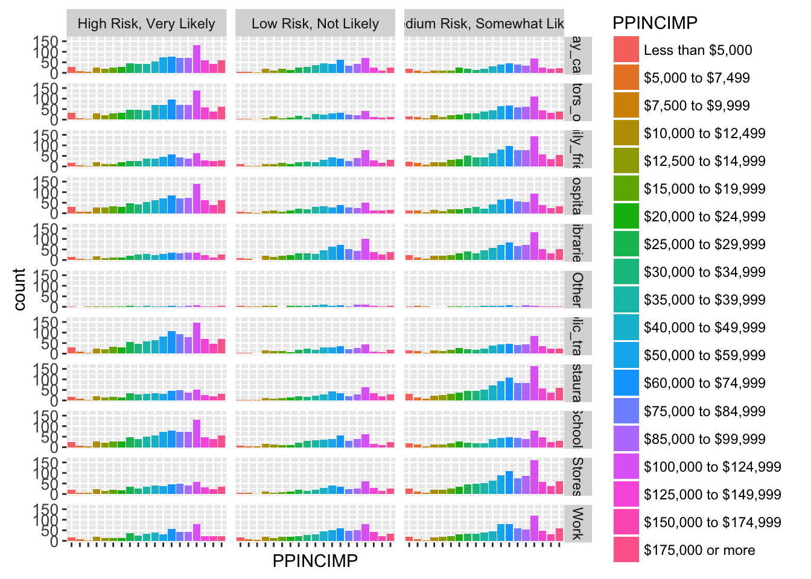<!-- -->

### Education, work, marital status


```r
# update weighted data frame
q11.2 <- data.frame(svytable(~Q11_q + Q11_r + PPEDUC + PPEDUCAT + work + PPWORK + marital + PPMARIT, des11, round = T))

# restate plots
p3 <- ggplot(q11.2[q11.2$Q11_r != "Don_t Know", ], aes(Q11_q, weight = Freq)) + ptext
```


```r
# by education
p3 + geom_bar() + aes(PPEDUCAT, fill = Q11_r) + facet_wrap(~Q11_q) + ggtitle("By education")
```

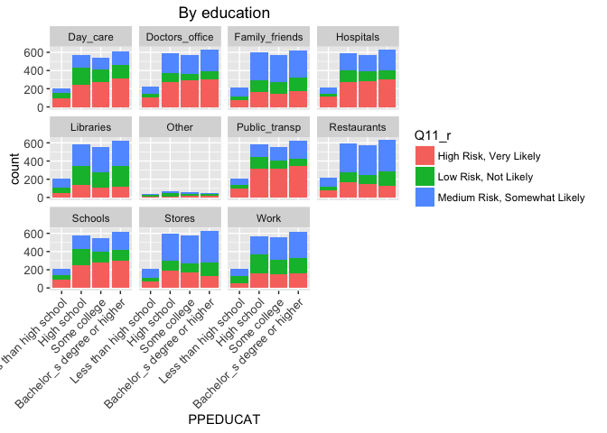<!-- -->

```r
p3 + geom_bar(position = "fill") + aes(PPEDUCAT, fill = Q11_r) + facet_wrap(~Q11_q)
```

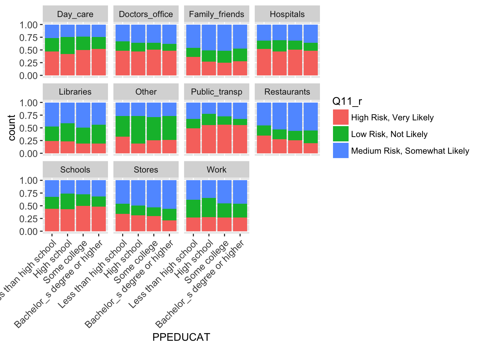<!-- -->

```r
p3 + geom_bar() + aes(Q11_q, fill = PPEDUCAT) + facet_wrap(~Q11_r)
```

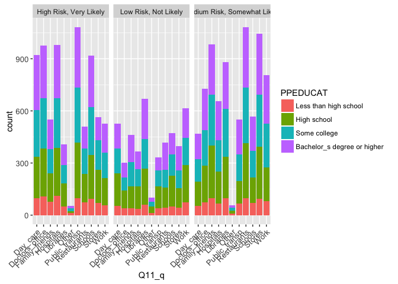<!-- -->

```r
p3 + geom_bar(position = 'fill') + aes(Q11_q, fill = PPEDUCAT) + facet_wrap(~Q11_r) + ggtitle("By education")
```

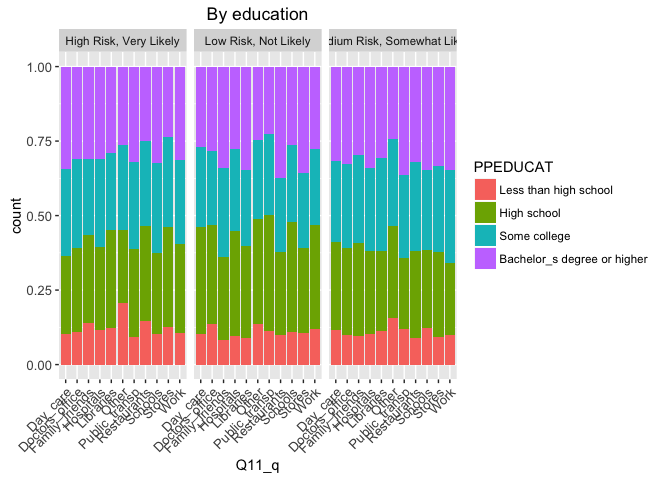<!-- -->

```r
p3 + geom_bar() + aes(PPEDUCAT, fill = PPEDUCAT) + facet_grid(Q11_q~Q11_r) + ptext2
```

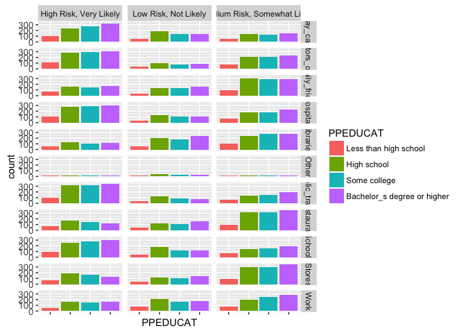<!-- -->

```r
p3 + geom_bar() + aes(Q11_r, fill = Q11_r) + facet_grid(Q11_q~PPEDUCAT) + ptext2
```

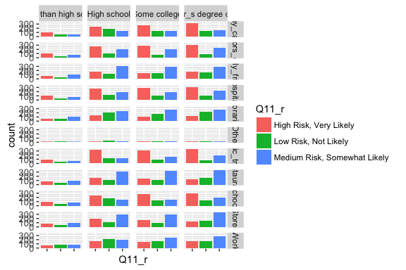<!-- -->

```r
# by work
p3 + geom_bar() + aes(work, fill = Q11_r) + facet_wrap(~Q11_q) + ggtitle("By employment status")
```

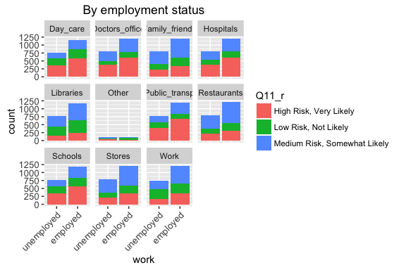<!-- -->

```r
p3 + geom_bar(position = "fill") + aes(work, fill = Q11_r) + facet_wrap(~Q11_q)
```

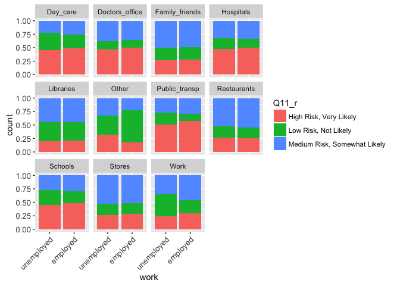<!-- -->

```r
# by marital
p3 + geom_bar() + aes(marital, fill = Q11_r) + facet_wrap(~Q11_q) + ggtitle("By marital status")
```

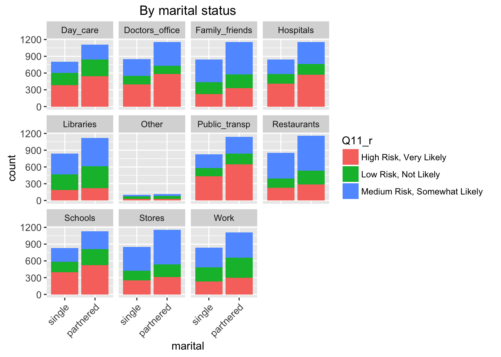<!-- -->

```r
p3 + geom_bar(position = "fill") + aes(marital, fill = Q11_r) + facet_wrap(~Q11_q)
```

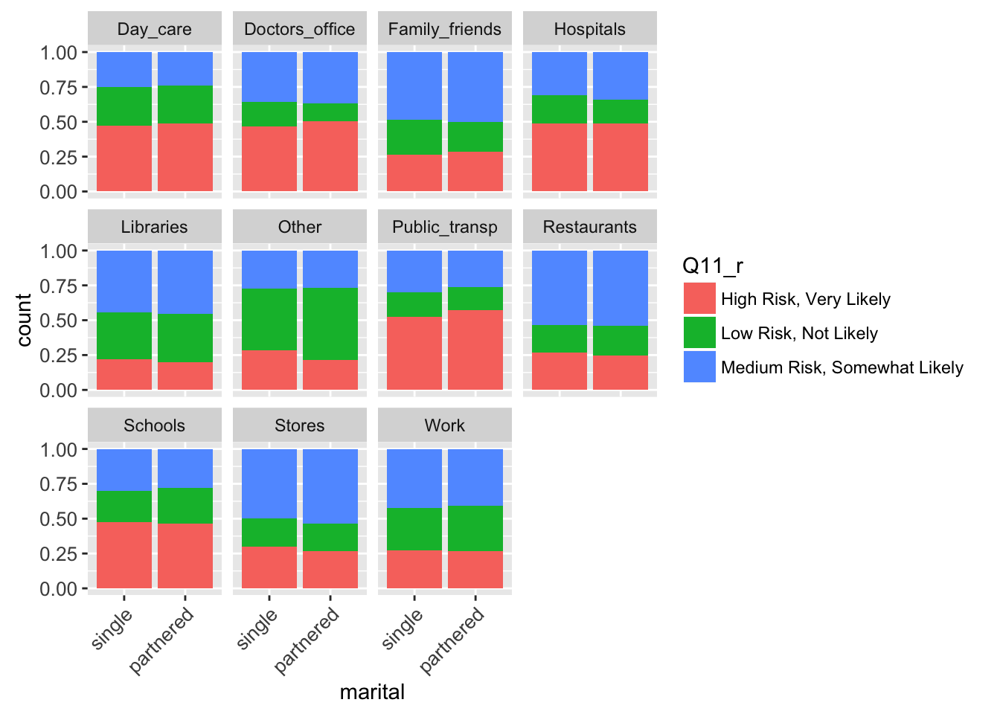<!-- -->

### Metro status, region, state, house type, housing status, internet availability


```r
# update weighted data frame
q11.3 <- data.frame(svytable(~Q11_q + Q11_r + PPMSACAT + ppreg9 + PPSTATEN + PPHOUSE + PPRENT + PPNET, des11, round = T))

# restate plots
p4 <- ggplot(q11.3[q11.3$Q11_r != "Don_t Know", ], aes(Q11_q, weight = Freq)) + ptext
```


```r
# by metro status
p4 + geom_bar(position = "fill") + aes(Q11_r, fill = PPMSACAT) + facet_wrap(~Q11_q) + ggtitle("By metro status")
```

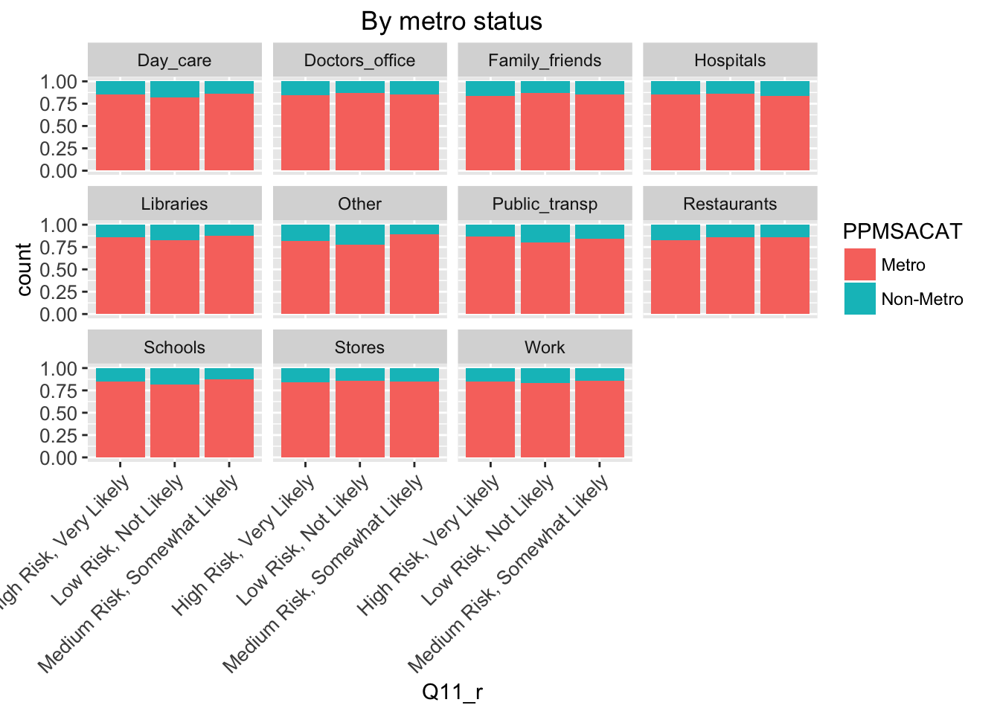<!-- -->

```r
p4 + geom_bar(position = "fill") + aes(PPMSACAT, fill = Q11_r) + facet_wrap(~Q11_q)
```

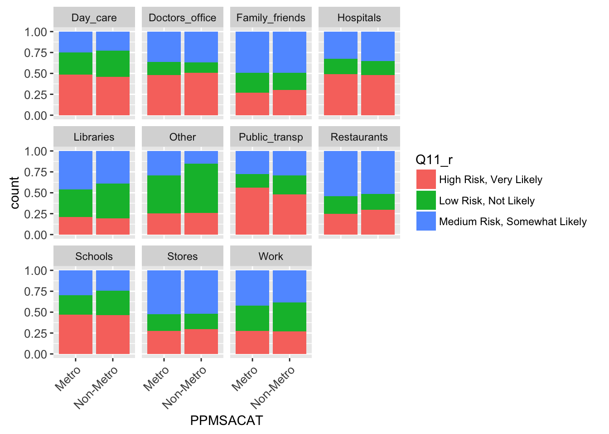<!-- -->

```r
# by region
p4 + geom_bar(position = "fill") + aes(Q11_r, fill = ppreg9) + facet_wrap(~Q11_q) + ggtitle("By region")
```

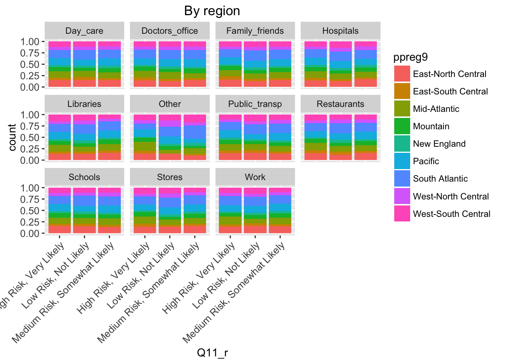<!-- -->

```r
p4 + geom_bar() + aes(ppreg9, fill = Q11_r) + facet_wrap(~Q11_q) + ggtitle("By region")
```

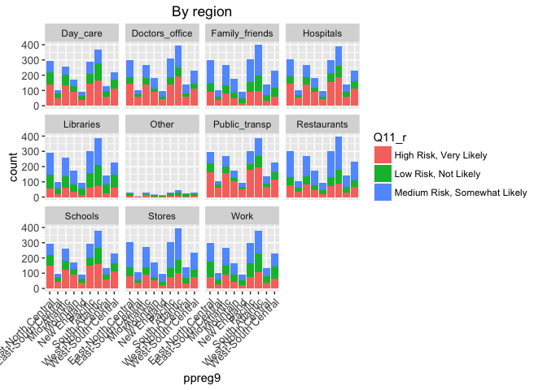<!-- -->

```r
# by state
p4 + geom_bar() + aes(Q11_r, fill = PPSTATEN) + facet_wrap(~Q11_q) + ggtitle("By state")
```

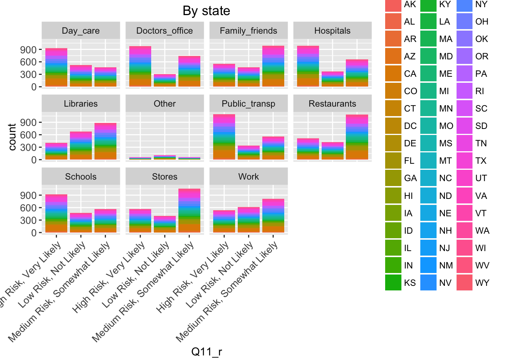<!-- -->

```r
p4 + geom_bar() + aes(PPSTATEN, fill = Q11_q) + coord_flip() + ggtitle("By state")
```

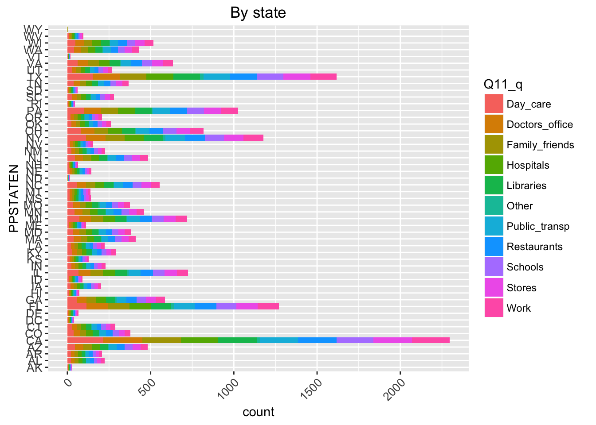<!-- -->

```r
# by house type
p4 + geom_bar(position = "fill") + aes(Q11_r, fill = PPHOUSE) + facet_wrap(~Q11_q)
```

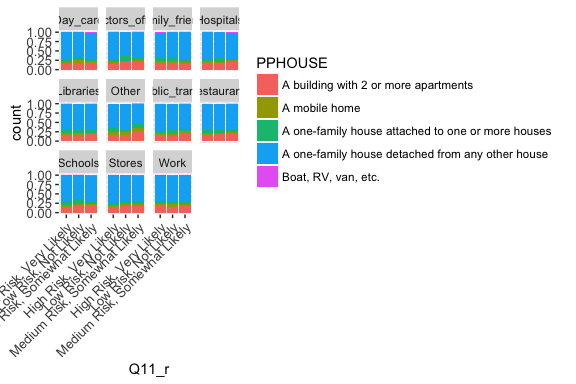<!-- -->

```r
p4 + geom_bar(position = "fill") + aes(fill = PPHOUSE) + ggtitle("By house type")
```

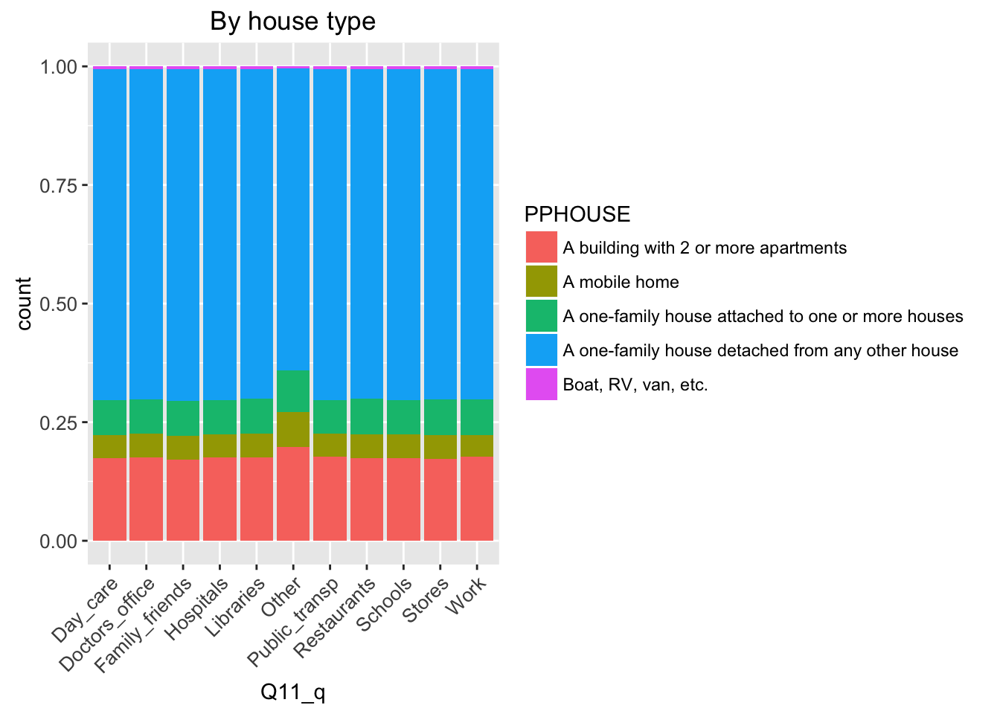<!-- -->

```r
# housing status
p4 + geom_bar(position = "fill") + aes(Q11_r, fill = PPHOUSE) + facet_wrap(~Q11_q)
```

<!-- -->

```r
p4 + geom_bar() + aes(PPHOUSE, fill = Q11_r) + facet_wrap(~Q11_q) + ggtitle("By housing")
```

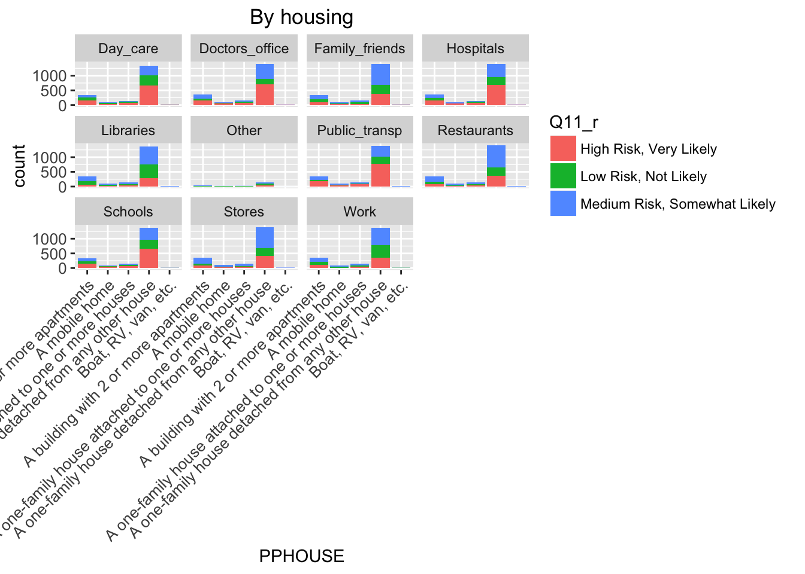<!-- -->

```r
# by internet availability
p4 + geom_bar(position = "fill") + aes(Q11_r, fill = PPNET) + facet_wrap(~Q11_q)
```

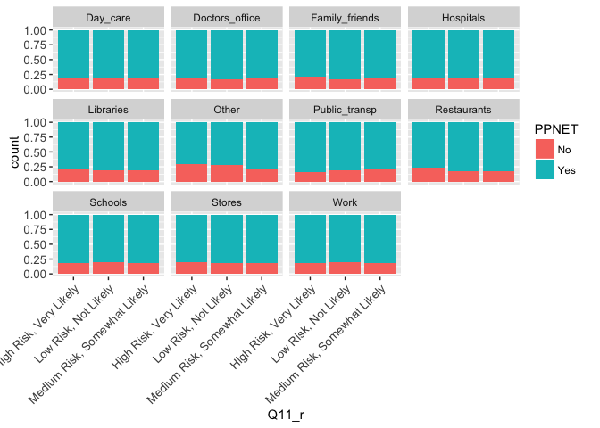<!-- -->

```r
p4 + geom_bar(position = "fill") + aes(PPNET, fill = Q11_r) + facet_wrap(~Q11_q) + ggtitle("By internet availability")
```

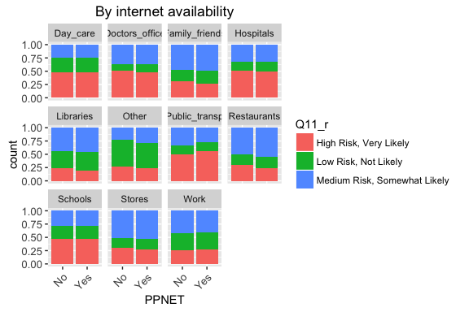<!-- -->


## Q20. How effective do you think the influenza vaccine is in protecting people from becoming sick with influenza?

### Gender, age, ethnicity, income


