# Behavior part 3: Flu actions

Questions 12, 22, 23, 31, 32.
Behaviors related to flu.


```r
## Create survey object.
options(digits = 4)
options(survey.lonely.psu = "adjust")

des <- svydesign(ids = ~1, weights = ~weight, data = df[is.na(df$weight)==F, ])
```


## Q12. Which of the following actions do you take to avoid getting sick?


```r
# subset question data, rename columns, gather into single column
q12_df <- df %>%
  select(CaseID, PPGENDER, PPAGE, ppagecat, PPETHM, PPINCIMP, PPEDUC, PPEDUCAT,
         work, PPWORK, marital, PPMARIT, PPMSACAT, ppreg9, PPSTATEN, PPHOUSE, PPRENT, PPNET, Q12_1:Q12_15, weight) %>%
  gather(Q12_q, Q12_r, Q12_1:Q12_15, na.rm = T) %>%
  mutate(Q12_q = as.factor(Q12_q))

# survey design
options(digits = 4)
options(survey.lonely.psu = "adjust")
des12 <- svydesign(ids = ~1, weights = ~weight, data = q12_df[is.na(q12_df$weight)==F, ])
```

### Gender, age, ethnicity, income


```r
# weighted data frame
q12 <- data.frame(svytable(~Q12_q + Q12_r + PPGENDER + ppagecat + PPETHM + PPINCIMP, des12, round = T))

# plot templates
title <- ggtitle("Which of the following actions do you take to avoid getting sick?")

## main plot
p <- ggplot(q12, aes(Q12_q, weight = Freq)) + ptext
p + geom_bar(position = 'fill') + aes(fill = Q12_r) + title
```

<!-- -->


```r
p2 <- ggplot(q12, aes(Q12_q, weight = Freq)) + ptext
p2 + geom_bar(position = "fill") + aes(Q12_q, fill = Q12_r)
```

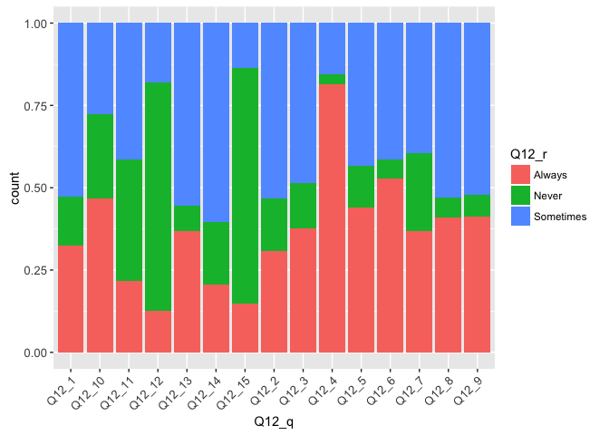<!-- -->

```r
p2 + geom_bar() + aes(Q12_r, fill = Q12_r) + facet_wrap(~Q12_q) + ptext2
```

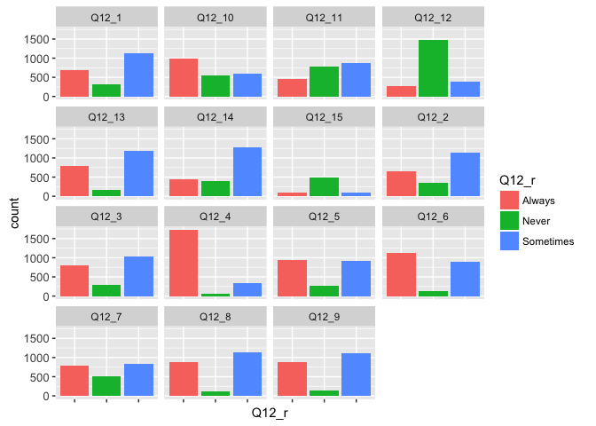<!-- -->

```r
p2 + geom_bar() + aes(Q12_q, fill = Q12_q) + facet_wrap(~Q12_r) + ptext2
```

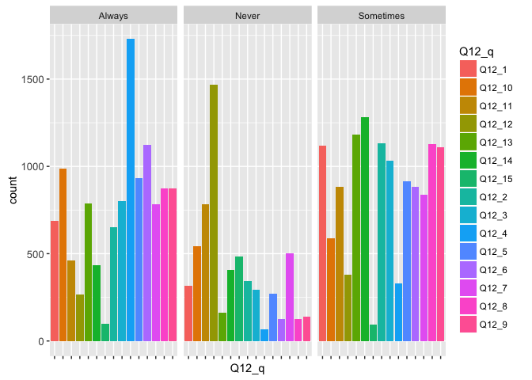<!-- -->

```r
# by gender
p2 + geom_bar() + aes(PPGENDER, fill = Q12_r) + facet_wrap(~Q12_q) + ggtitle("By gender")
```

<!-- -->

```r
p2 + geom_bar(position = "fill") + aes(PPGENDER, fill = Q12_r) + facet_wrap(~Q12_q)
```

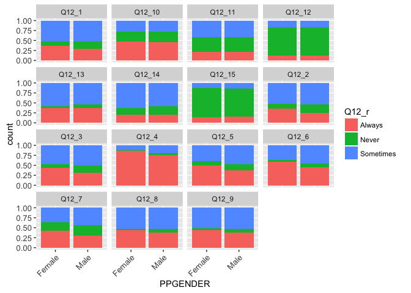<!-- -->

```r
p2 + geom_bar() + aes(Q12_q, fill = PPGENDER) + facet_wrap(~Q12_r)
```

<!-- -->

```r
p2 + geom_bar(position = 'fill') + aes(Q12_q, fill = PPGENDER) + facet_wrap(~Q12_r) + ggtitle("By gender")
```

<!-- -->

```r
p2 + geom_bar() + aes(PPGENDER, fill = PPGENDER) + facet_grid(Q12_q~Q12_r) + coord_flip() + ptext2
```

<!-- -->

```r
# by age group
p2 + geom_bar() + aes(ppagecat, fill = Q12_r) + facet_wrap(~Q12_q) + ggtitle("By age group")
```

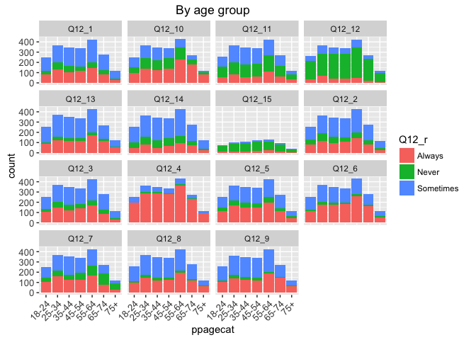<!-- -->

```r
p2 + geom_bar(position = "fill") + aes(ppagecat, fill = Q12_r) + facet_wrap(~Q12_q)
```

<!-- -->

```r
p2 + geom_bar() + aes(Q12_q, fill = ppagecat) + facet_wrap(~Q12_r)
```

<!-- -->

```r
p2 + geom_bar(position = 'fill') + aes(Q12_q, fill = ppagecat) + facet_wrap(~Q12_r) + ggtitle("By age group")
```

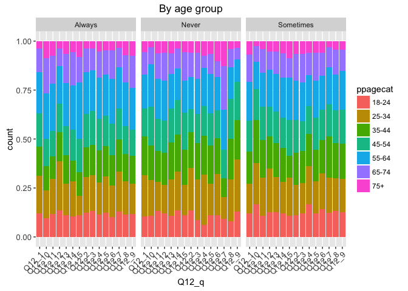<!-- -->

```r
p2 + geom_bar() + aes(ppagecat, fill = ppagecat) + facet_grid(Q12_q~Q12_r) + ptext2
```

<!-- -->

```r
# by ethnic group
p2 + geom_bar() + aes(PPETHM, fill = Q12_r) + facet_wrap(~Q12_q) + ggtitle("By ethnic group")
```

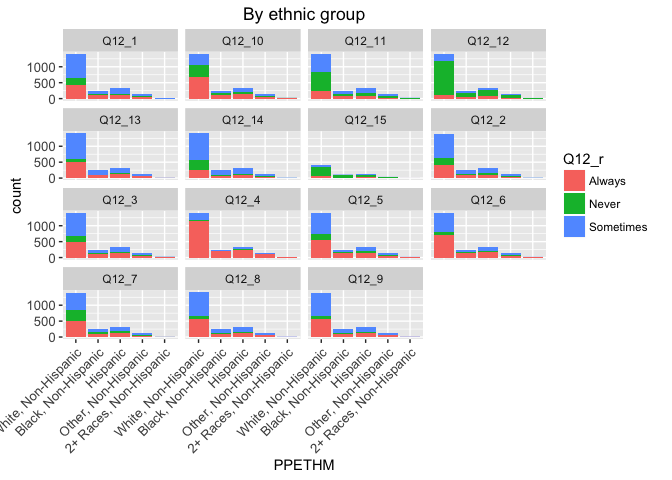<!-- -->

```r
p2 + geom_bar(position = "fill") + aes(PPETHM, fill = Q12_r) + facet_wrap(~Q12_q)
```

<!-- -->

```r
p2 + geom_bar() + aes(Q12_q, fill = PPETHM) + facet_wrap(~Q12_r)
```

<!-- -->

```r
p2 + geom_bar(position = 'fill') + aes(Q12_q, fill = PPETHM) + facet_wrap(~Q12_r) + ggtitle("By ethnic group")
```

<!-- -->

```r
p2 + geom_bar() + aes(PPETHM, fill = PPETHM) + facet_grid(Q12_q~Q12_r) + ptext2
```

<!-- -->

```r
p2 + geom_bar() + aes(Q12_r, fill = Q12_r) + facet_grid(Q12_q~PPETHM) + ptext2
```

<!-- -->

```r
# by income
p2 + geom_bar() + aes(PPINCIMP, fill = Q12_r) + facet_wrap(~Q12_q) + ggtitle("By income") + ptext2
```

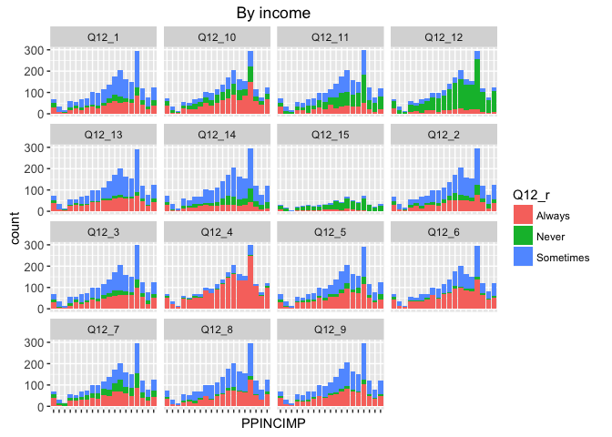<!-- -->

```r
p2 + geom_bar(position = "fill") + aes(PPINCIMP, fill = Q12_r) + facet_wrap(~Q12_q) + ptext2
```

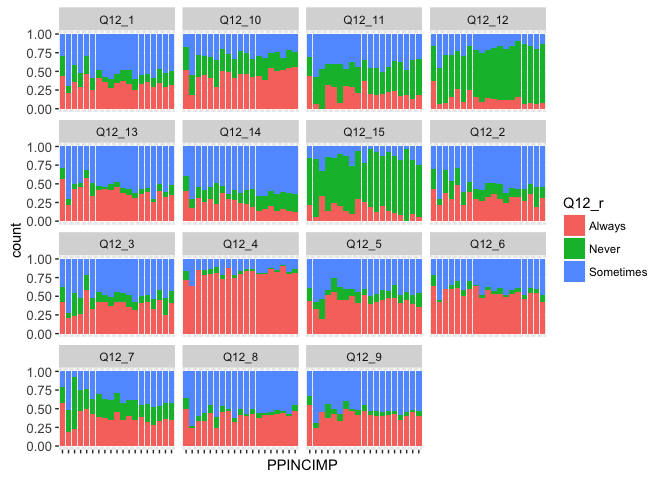<!-- -->

```r
p2 + geom_bar() + aes(Q12_q, fill = PPINCIMP) + facet_wrap(~Q12_r)
```

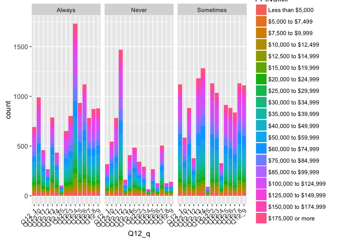<!-- -->

```r
p2 + geom_bar(position = 'fill') + aes(Q12_q, fill = PPINCIMP) + facet_wrap(~Q12_r) + ggtitle("By income group")
```

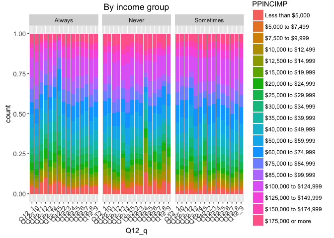<!-- -->

```r
p2 + geom_bar() + aes(PPINCIMP, fill = PPINCIMP) + facet_grid(Q12_q~Q12_r) + ptext2
```

<!-- -->

### Education, work, marital status


```r
# update weighted data frame
q12.2 <- data.frame(svytable(~Q12_q + Q12_r + PPEDUC + PPEDUCAT + work + PPWORK + marital + PPMARIT, des12, round = T))

# restate plots
p3 <- ggplot(q12.2, aes(Q12_q, weight = Freq)) + ptext
```


```r
# by education
p3 + geom_bar() + aes(PPEDUCAT, fill = Q12_r) + facet_wrap(~Q12_q) + ggtitle("By education")
```

<!-- -->

```r
p3 + geom_bar(position = "fill") + aes(PPEDUCAT, fill = Q12_r) + facet_wrap(~Q12_q)
```

<!-- -->

```r
p3 + geom_bar() + aes(Q12_q, fill = PPEDUCAT) + facet_wrap(~Q12_r)
```

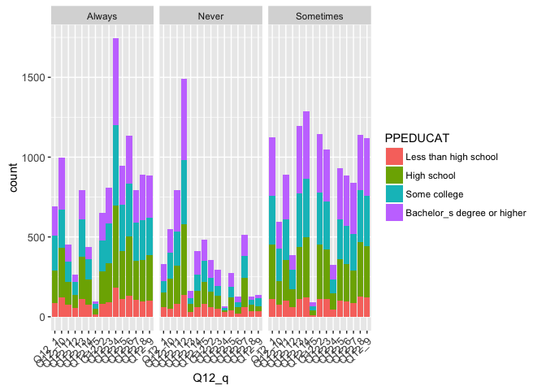<!-- -->

```r
p3 + geom_bar(position = "fill") + aes(Q12_q, fill = PPEDUCAT) + facet_wrap(~Q12_r) + ggtitle("By education")
```

<!-- -->

```r
p3 + geom_bar() + aes(PPEDUCAT, fill = PPEDUCAT) + facet_grid(Q12_q~Q12_r) + ptext2
```

<!-- -->

```r
p3 + geom_bar() + aes(Q12_r, fill = Q12_r) + facet_grid(Q12_q~PPEDUCAT) + ptext2
```

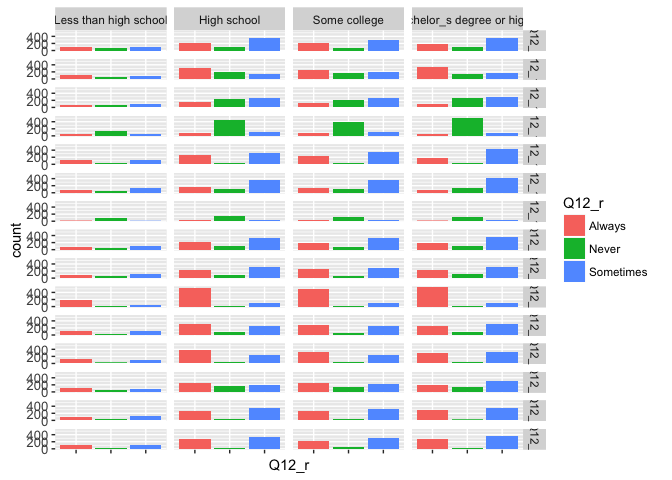<!-- -->

```r
# by work
p3 + geom_bar() + aes(work, fill = Q12_r) + facet_wrap(~Q12_q) + ggtitle("By employment status")
```

<!-- -->

```r
p3 + geom_bar(position = "fill") + aes(work, fill = Q12_r) + facet_wrap(~Q12_q)
```

<!-- -->

```r
# by marital
p3 + geom_bar() + aes(marital, fill = Q12_r) + facet_wrap(~Q12_q) + ggtitle("By marital status")
```

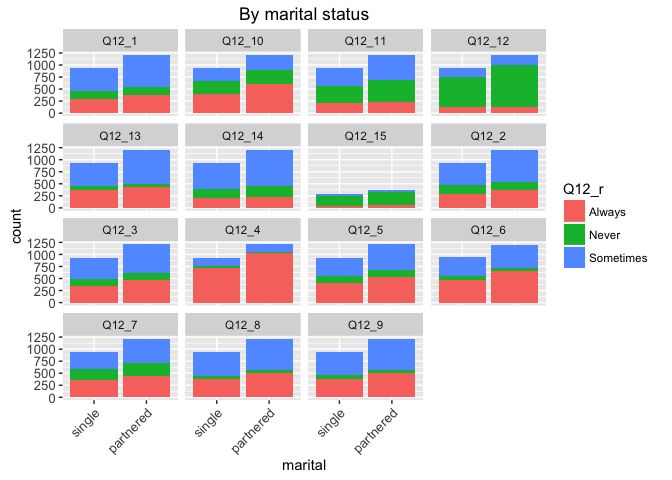<!-- -->

```r
p3 + geom_bar(position = "fill") + aes(marital, fill = Q12_r) + facet_wrap(~Q12_q)
```

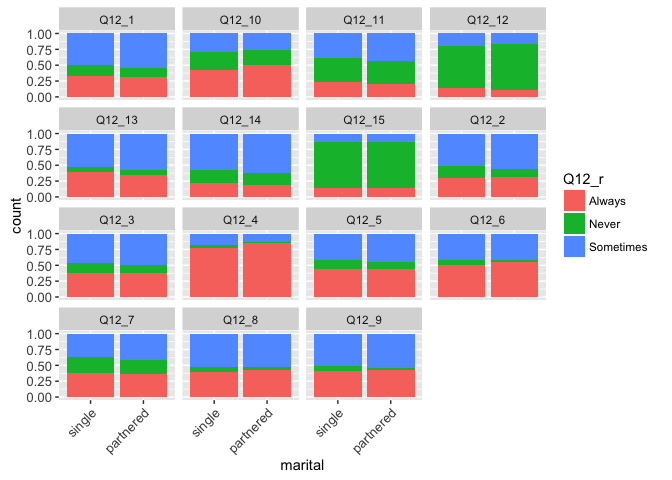<!-- -->

### Metro status, region, state, house type, housing status, internet availability


```r
# update weighted data frame
q12.3 <- data.frame(svytable(~Q12_q + Q12_r + PPMSACAT + ppreg9 + PPSTATEN + PPHOUSE + PPRENT + PPNET, des12, round = T))

# restate plots
p4 <- ggplot(q12.3, aes(Q12_q, weight = Freq)) + ptext
```


```r
# by metro status
p4 + geom_bar(position = "fill") + aes(Q12_r, fill = PPMSACAT) + facet_wrap(~Q12_q) + ggtitle("By metro status")
```

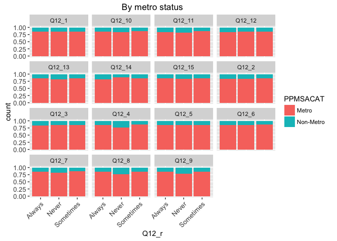<!-- -->

```r
p4 + geom_bar(position = "fill") + aes(PPMSACAT, fill = Q12_r) + facet_wrap(~Q12_q)
```

<!-- -->

```r
# by region
p4 + geom_bar(position = "fill") + aes(Q12_r, fill = ppreg9) + facet_wrap(~Q12_q) + ggtitle("By region")
```

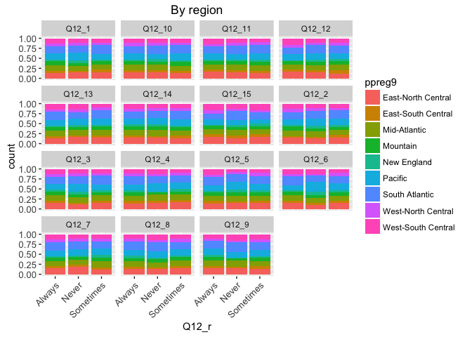<!-- -->

```r
p4 + geom_bar() + aes(ppreg9, fill = Q12_r) + facet_wrap(~Q12_q) + ggtitle("By region")
```

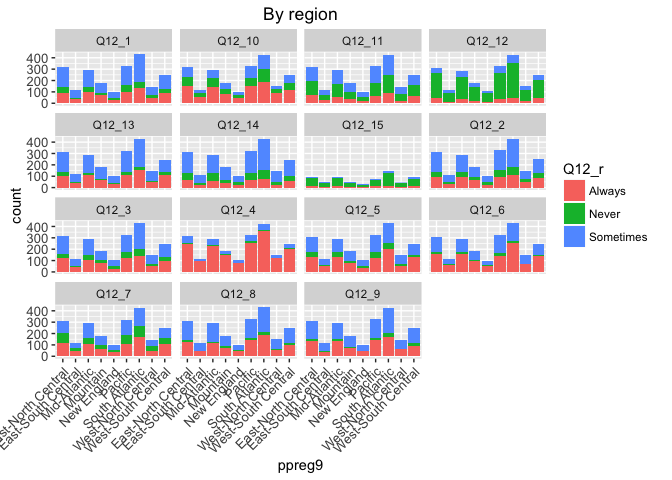<!-- -->

```r
# by state
p4 + geom_bar() + aes(Q12_r, fill = PPSTATEN) + facet_wrap(~Q12_q) + ggtitle("By state")
```

<!-- -->

```r
p4 + geom_bar() + aes(PPSTATEN, fill = Q12_q) + coord_flip() + ggtitle("By state")
```

<!-- -->

```r
# by house type
p4 + geom_bar(position = "fill") + aes(Q12_r, fill = PPHOUSE) + facet_wrap(~Q12_q)
```

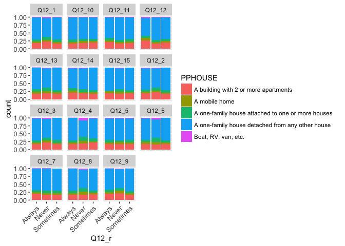<!-- -->

```r
p4 + geom_bar(position = "fill") + aes(fill = PPHOUSE) + ggtitle("By house type")
```

<!-- -->

```r
# housing status
p4 + geom_bar(position = "fill") + aes(Q12_r, fill = PPHOUSE) + facet_wrap(~Q12_q)
```

<!-- -->

```r
p4 + geom_bar() + aes(PPHOUSE, fill = Q12_r) + facet_wrap(~Q12_q) + ggtitle("By housing")
```

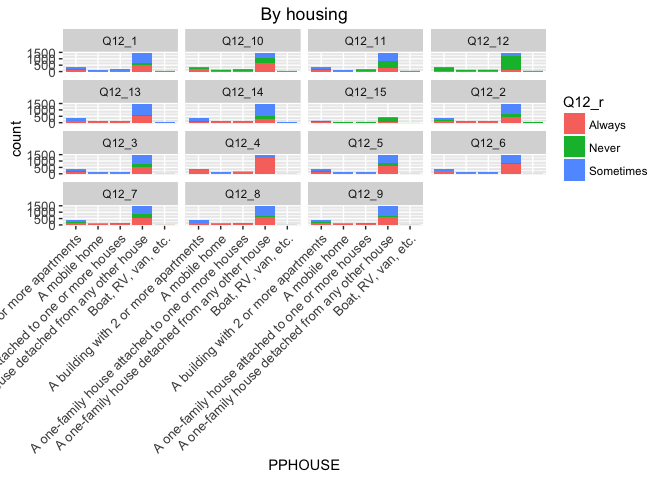<!-- -->

```r
# by internet availability
p4 + geom_bar(position = "fill") + aes(Q12_r, fill = PPNET) + facet_wrap(~Q12_q)
```

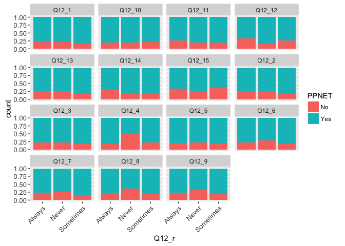<!-- -->

```r
p4 + geom_bar(position = "fill") + aes(PPNET, fill = Q12_r) + facet_wrap(~Q12_q) + ggtitle("By internet availability")
```

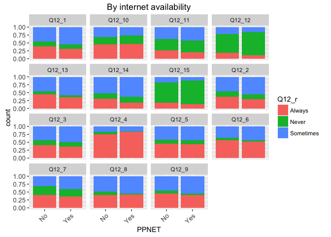<!-- -->


## Q22. Do you do any of the following when you have influenza symptoms?


```r
# subset question data, rename columns, gather into single column
q22_df <- df %>%
  select(CaseID, PPGENDER, PPAGE, ppagecat, PPETHM, PPINCIMP, PPEDUC, PPEDUCAT,
         work, PPWORK, marital, PPMARIT, PPMSACAT, ppreg9, PPSTATEN, PPHOUSE, PPRENT, PPNET, Q22_1:Q22_9, weight) %>%
  gather(Q22_q, Q22_r, Q22_1:Q22_9, na.rm = T) %>%
  mutate(Q22_q = as.factor(Q22_q))

# survey design
options(digits = 4)
options(survey.lonely.psu = "adjust")
des22 <- svydesign(ids = ~1, weights = ~weight, data = q22_df[is.na(q22_df$weight)==F, ])
```

### Gender, age, ethnicity, income


```r
# weighted data frame
q22 <- data.frame(svytable(~Q22_q + Q22_r + PPGENDER + ppagecat + PPETHM + PPINCIMP, des22, round = T))

# plot templates
title <- ggtitle("Do you do any of the following when you have influenza symptoms?")

## main plot
p <- ggplot(q22, aes(Q22_q, weight = Freq)) + ptext
p + geom_bar(position = 'fill') + aes(fill = Q22_r) + title
```

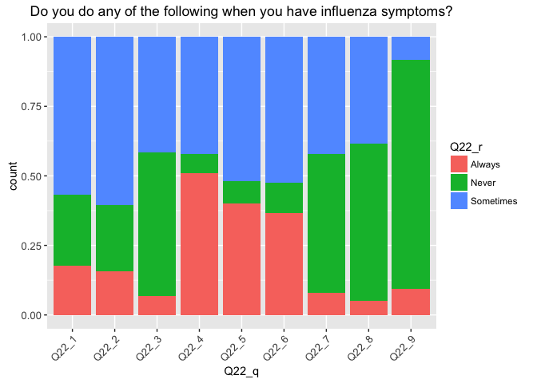<!-- -->


```r
p2 <- ggplot(q22, aes(Q22_q, weight = Freq)) + ptext
p2 + geom_bar(position = "fill") + aes(Q22_q, fill = Q22_r)
```

<!-- -->

```r
p2 + geom_bar() + aes(Q22_r, fill = Q22_r) + facet_wrap(~Q22_q) + ptext2
```

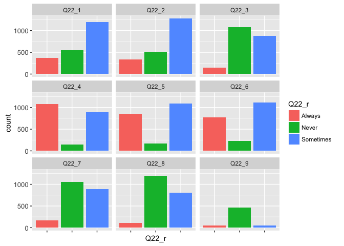<!-- -->

```r
p2 + geom_bar() + aes(Q22_q, fill = Q22_q) + facet_wrap(~Q22_r) + ptext2
```

<!-- -->

```r
# by gender
p2 + geom_bar() + aes(PPGENDER, fill = Q22_r) + facet_wrap(~Q22_q) + ggtitle("By gender")
```

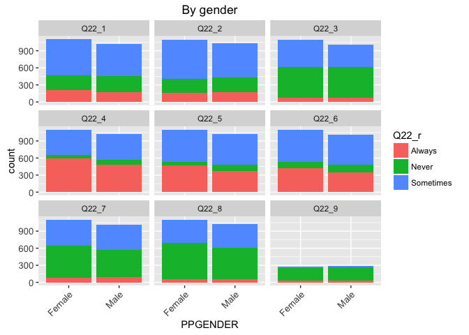<!-- -->

```r
p2 + geom_bar(position = "fill") + aes(PPGENDER, fill = Q22_r) + facet_wrap(~Q22_q)
```

<!-- -->

```r
p2 + geom_bar() + aes(Q22_q, fill = PPGENDER) + facet_wrap(~Q22_r)
```

<!-- -->

```r
p2 + geom_bar(position = 'fill') + aes(Q22_q, fill = PPGENDER) + facet_wrap(~Q22_r) + ggtitle("By gender")
```

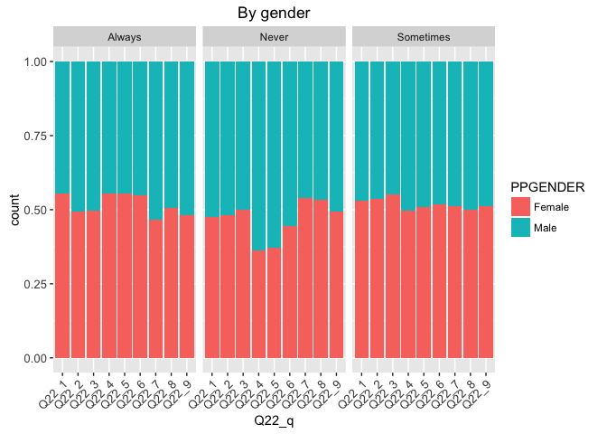<!-- -->

```r
p2 + geom_bar() + aes(PPGENDER, fill = PPGENDER) + facet_grid(Q22_q~Q22_r) + coord_flip() + ptext2
```

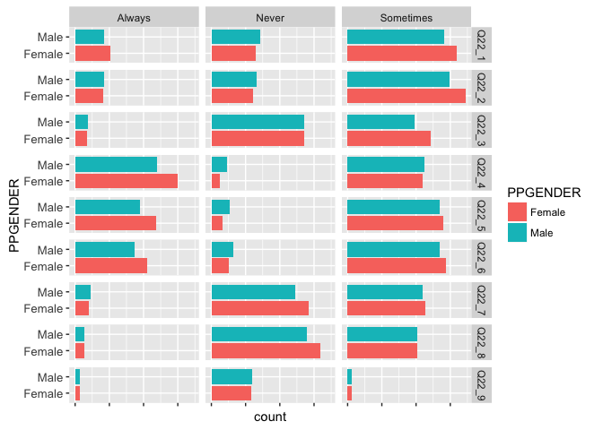<!-- -->

```r
# by age group
p2 + geom_bar() + aes(ppagecat, fill = Q22_r) + facet_wrap(~Q22_q) + ggtitle("By age group")
```

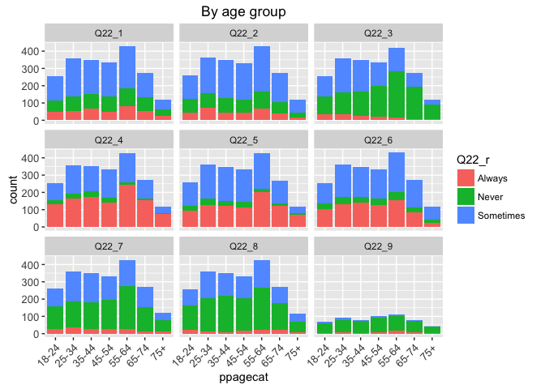<!-- -->

```r
p2 + geom_bar(position = "fill") + aes(ppagecat, fill = Q22_r) + facet_wrap(~Q22_q)
```

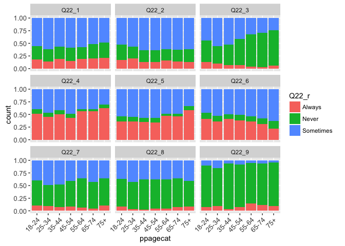<!-- -->

```r
p2 + geom_bar() + aes(Q22_q, fill = ppagecat) + facet_wrap(~Q22_r)
```

<!-- -->

```r
p2 + geom_bar(position = 'fill') + aes(Q22_q, fill = ppagecat) + facet_wrap(~Q22_r) + ggtitle("By age group")
```

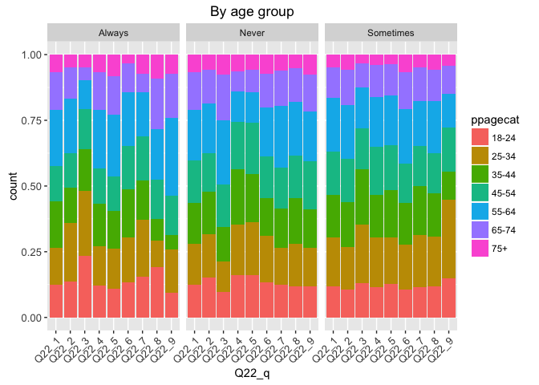<!-- -->

```r
p2 + geom_bar() + aes(ppagecat, fill = ppagecat) + facet_grid(Q22_q~Q22_r) + ptext2
```

<!-- -->

```r
# by ethnic group
p2 + geom_bar() + aes(PPETHM, fill = Q22_r) + facet_wrap(~Q22_q) + ggtitle("By ethnic group")
```

<!-- -->

```r
p2 + geom_bar(position = "fill") + aes(PPETHM, fill = Q22_r) + facet_wrap(~Q22_q)
```

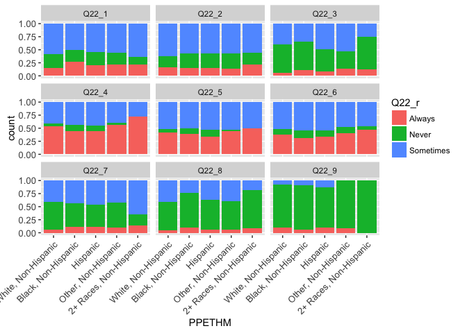<!-- -->

```r
p2 + geom_bar() + aes(Q22_q, fill = PPETHM) + facet_wrap(~Q22_r)
```

<!-- -->

```r
p2 + geom_bar(position = 'fill') + aes(Q22_q, fill = PPETHM) + facet_wrap(~Q22_r) + ggtitle("By ethnic group")
```

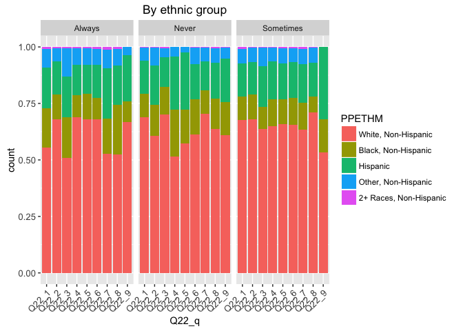<!-- -->

```r
p2 + geom_bar() + aes(PPETHM, fill = PPETHM) + facet_grid(Q22_q~Q22_r) + ptext2
```

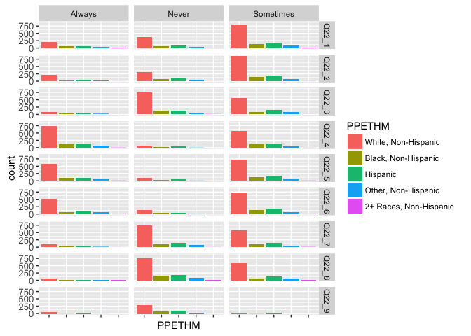<!-- -->

```r
p2 + geom_bar() + aes(Q22_r, fill = Q22_r) + facet_grid(Q22_q~PPETHM) + ptext2
```

<!-- -->

```r
# by income
p2 + geom_bar() + aes(PPINCIMP, fill = Q22_r) + facet_wrap(~Q22_q) + ggtitle("By income") + ptext2
```

<!-- -->

```r
p2 + geom_bar(position = "fill") + aes(PPINCIMP, fill = Q22_r) + facet_wrap(~Q22_q) + ptext2
```

<!-- -->

```r
p2 + geom_bar() + aes(Q22_q, fill = PPINCIMP) + facet_wrap(~Q22_r)
```

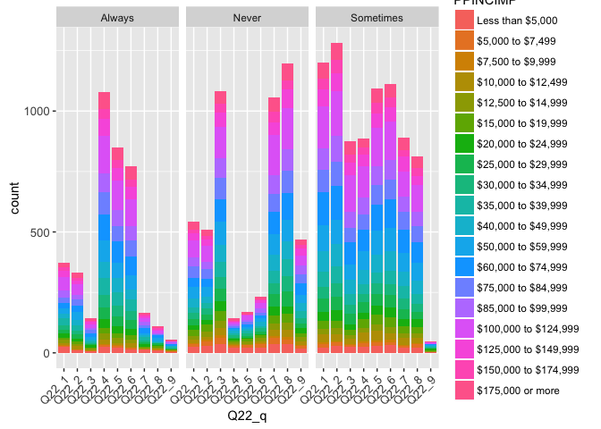<!-- -->

```r
p2 + geom_bar(position = 'fill') + aes(Q22_q, fill = PPINCIMP) + facet_wrap(~Q22_r) + ggtitle("By income group")
```

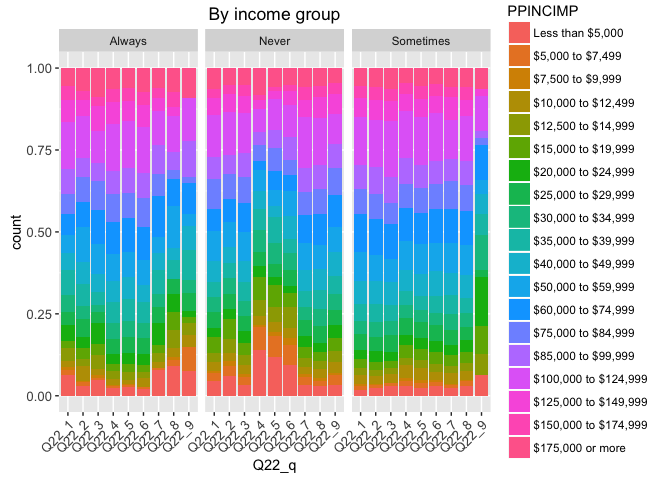<!-- -->

```r
p2 + geom_bar() + aes(PPINCIMP, fill = PPINCIMP) + facet_grid(Q22_q~Q22_r) + ptext2
```

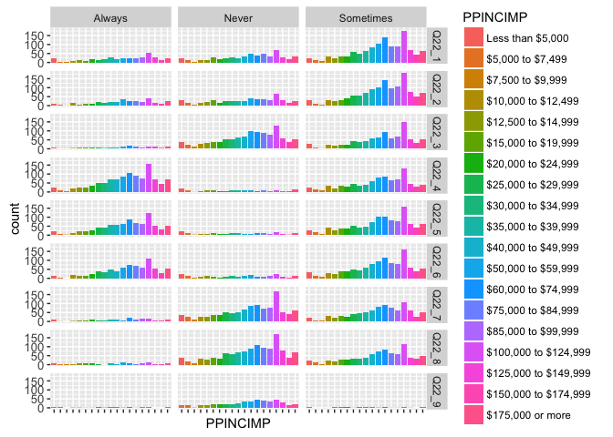<!-- -->

### Education, work, marital status


```r
# update weighted data frame
q22.2 <- data.frame(svytable(~Q22_q + Q22_r + PPEDUC + PPEDUCAT + work + PPWORK + marital + PPMARIT, des22, round = T))

# restate plots
p3 <- ggplot(q22.2, aes(Q22_q, weight = Freq)) + ptext
```


```r
# by education
p3 + geom_bar() + aes(PPEDUCAT, fill = Q22_r) + facet_wrap(~Q22_q) + ggtitle("By education")
```

<!-- -->

```r
p3 + geom_bar(position = "fill") + aes(PPEDUCAT, fill = Q22_r) + facet_wrap(~Q22_q)
```

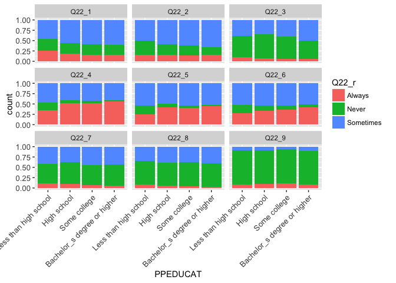<!-- -->

```r
p3 + geom_bar() + aes(Q22_q, fill = PPEDUCAT) + facet_wrap(~Q22_r)
```

<!-- -->

```r
p3 + geom_bar(position = "fill") + aes(Q22_q, fill = PPEDUCAT) + facet_wrap(~Q22_r) + ggtitle("By education")
```

<!-- -->

```r
p3 + geom_bar() + aes(PPEDUCAT, fill = PPEDUCAT) + facet_grid(Q22_q~Q22_r) + ptext2
```

<!-- -->

```r
p3 + geom_bar() + aes(Q22_r, fill = Q22_r) + facet_grid(Q22_q~PPEDUCAT) + ptext2
```

<!-- -->

```r
# by work
p3 + geom_bar() + aes(work, fill = Q22_r) + facet_wrap(~Q22_q) + ggtitle("By employment status")
```

<!-- -->

```r
p3 + geom_bar(position = "fill") + aes(work, fill = Q22_r) + facet_wrap(~Q22_q)
```

<!-- -->

```r
# by marital
p3 + geom_bar() + aes(marital, fill = Q22_r) + facet_wrap(~Q22_q) + ggtitle("By marital status")
```

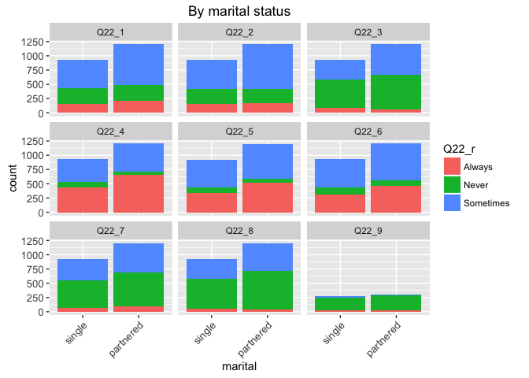<!-- -->

```r
p3 + geom_bar(position = "fill") + aes(marital, fill = Q22_r) + facet_wrap(~Q22_q)
```

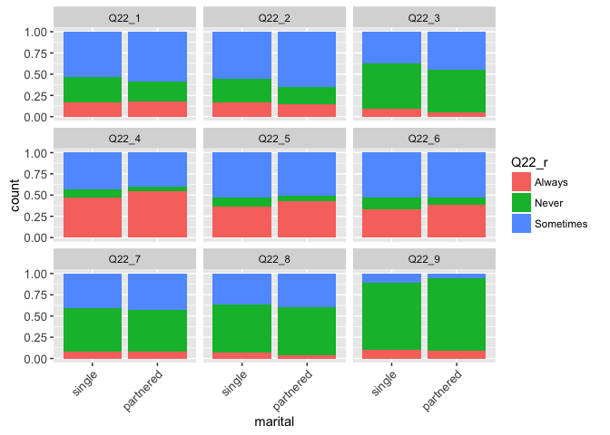<!-- -->

### Metro status, region, state, house type, housing status, internet availability


```r
# update weighted data frame
q22.3 <- data.frame(svytable(~Q22_q + Q22_r + PPMSACAT + ppreg9 + PPSTATEN + PPHOUSE + PPRENT + PPNET, des22, round = T))

# restate plots
p4 <- ggplot(q22.3, aes(Q22_q, weight = Freq)) + ptext
```


```r
# by metro status
p4 + geom_bar(position = "fill") + aes(Q22_r, fill = PPMSACAT) + facet_wrap(~Q22_q) + ggtitle("By metro status")
```

<!-- -->

```r
p4 + geom_bar(position = "fill") + aes(PPMSACAT, fill = Q22_r) + facet_wrap(~Q22_q)
```

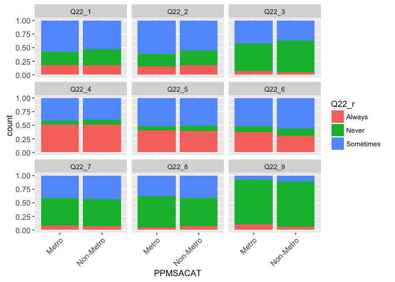<!-- -->

```r
# by region
p4 + geom_bar(position = "fill") + aes(Q22_r, fill = ppreg9) + facet_wrap(~Q22_q) + ggtitle("By region")
```

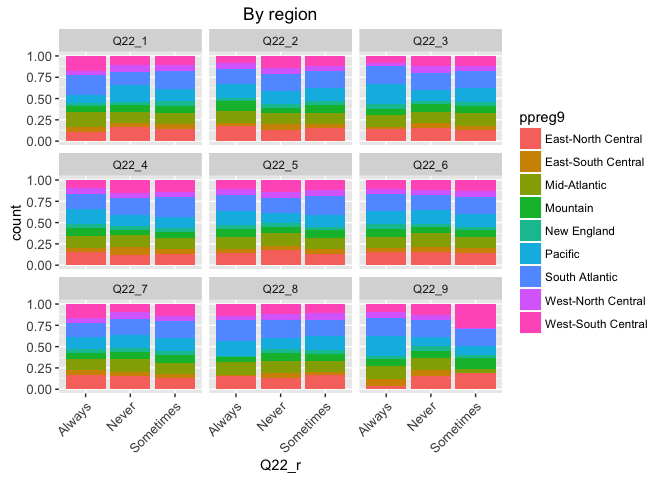<!-- -->

```r
p4 + geom_bar() + aes(ppreg9, fill = Q22_r) + facet_wrap(~Q22_q) + ggtitle("By region")
```

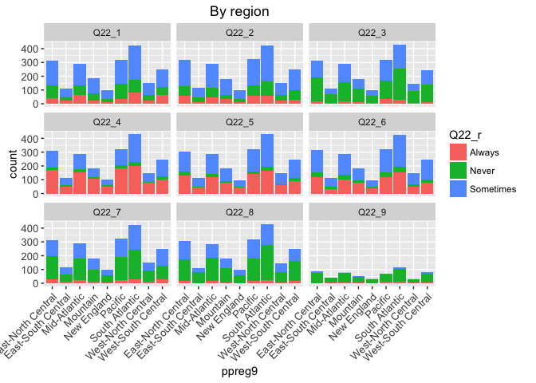<!-- -->

```r
# by state
p4 + geom_bar() + aes(Q22_r, fill = PPSTATEN) + facet_wrap(~Q22_q) + ggtitle("By state")
```

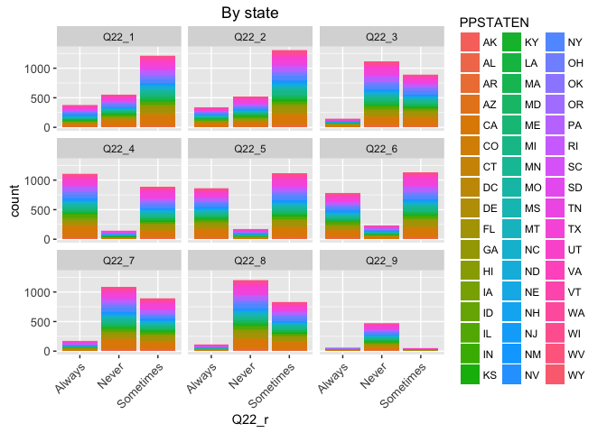<!-- -->

```r
p4 + geom_bar() + aes(PPSTATEN, fill = Q22_q) + coord_flip() + ggtitle("By state")
```

<!-- -->

```r
# by house type
p4 + geom_bar(position = "fill") + aes(Q22_r, fill = PPHOUSE) + facet_wrap(~Q22_q)
```

<!-- -->

```r
p4 + geom_bar(position = "fill") + aes(fill = PPHOUSE) + ggtitle("By house type")
```

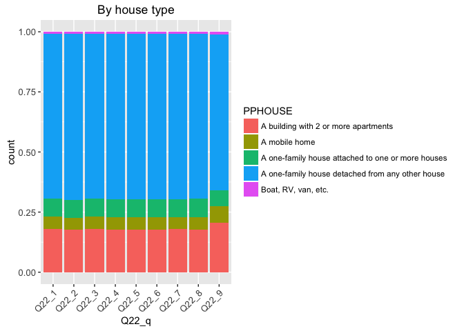<!-- -->

```r
# housing status
p4 + geom_bar(position = "fill") + aes(Q22_r, fill = PPHOUSE) + facet_wrap(~Q22_q)
```

<!-- -->

```r
p4 + geom_bar() + aes(PPHOUSE, fill = Q22_r) + facet_wrap(~Q22_q) + ggtitle("By housing")
```

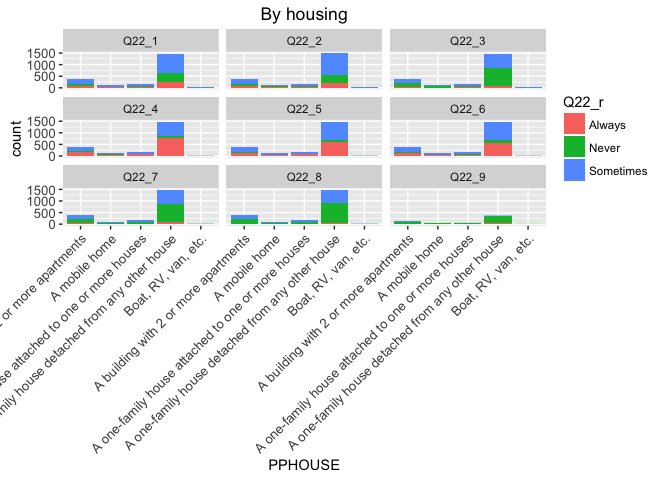<!-- -->

```r
# by internet availability
p4 + geom_bar(position = "fill") + aes(Q22_r, fill = PPNET) + facet_wrap(~Q22_q)
```

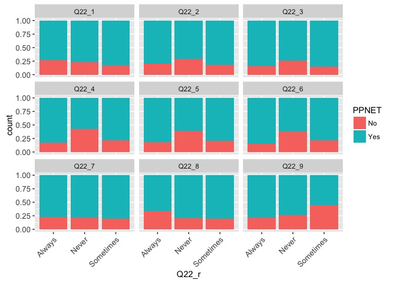<!-- -->

```r
p4 + geom_bar(position = "fill") + aes(PPNET, fill = Q22_r) + facet_wrap(~Q22_q) + ggtitle("By internet availability")
```

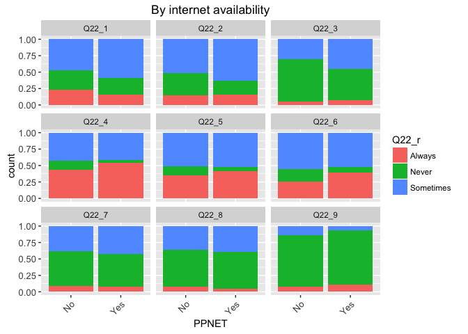<!-- -->


## Q23. Which of the following actions do you take when you have influenza symptoms to avoid someone else from getting sick?


```r
# subset question data, rename columns, gather into single column
q23_df <- df %>%
  select(CaseID, PPGENDER, PPAGE, ppagecat, PPETHM, PPINCIMP, PPEDUC, PPEDUCAT,
         work, PPWORK, marital, PPMARIT, PPMSACAT, ppreg9, PPSTATEN, PPHOUSE, PPRENT, PPNET, Q23_1:Q23_11, weight) %>%
  gather(Q23_q, Q23_r, Q23_1:Q23_11, na.rm = T) %>%
  mutate(Q23_q = as.factor(Q23_q))

# survey design
options(digits = 4)
options(survey.lonely.psu = "adjust")
des23 <- svydesign(ids = ~1, weights = ~weight, data = q23_df[is.na(q23_df$weight)==F, ])
```

### Gender, age, ethnicity, income


```r
# weighted data frame
q23 <- data.frame(svytable(~Q23_q + Q23_r + PPGENDER + ppagecat + PPETHM + PPINCIMP, des23, round = T))

# plot templates
title <- ggtitle("Which of the following actions do you take when you have influenza symptoms to avoid someone else from getting sick?")

## main plot
p <- ggplot(q23, aes(Q23_q, weight = Freq)) + ptext
p + geom_bar(position = 'fill') + aes(fill = Q23_r) + title
```

<!-- -->


```r
p2 <- ggplot(q23, aes(Q23_q, weight = Freq)) + ptext
p2 + geom_bar(position = "fill") + aes(Q23_q, fill = Q23_r)
```

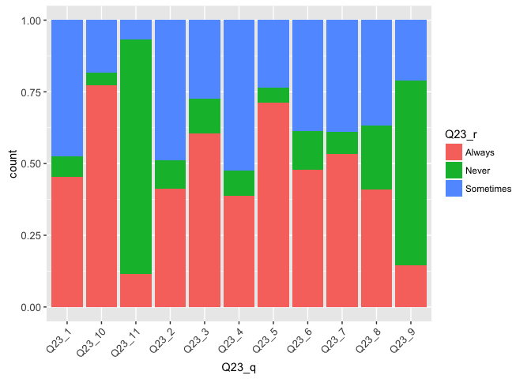<!-- -->

```r
p2 + geom_bar() + aes(Q23_r, fill = Q23_r) + facet_wrap(~Q23_q) + ptext2
```

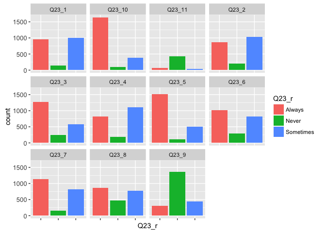<!-- -->

```r
p2 + geom_bar() + aes(Q23_q, fill = Q23_q) + facet_wrap(~Q23_r) + ptext2
```

<!-- -->

```r
# by gender
p2 + geom_bar() + aes(PPGENDER, fill = Q23_r) + facet_wrap(~Q23_q) + ggtitle("By gender")
```

<!-- -->

```r
p2 + geom_bar(position = "fill") + aes(PPGENDER, fill = Q23_r) + facet_wrap(~Q23_q)
```

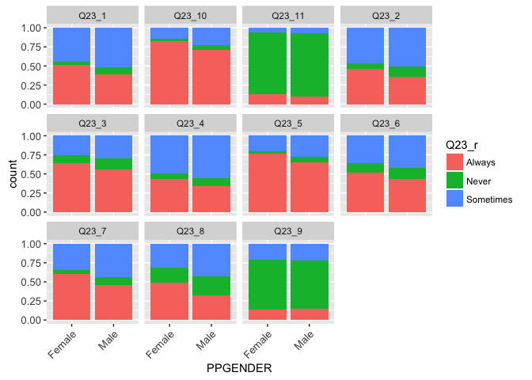<!-- -->

```r
p2 + geom_bar() + aes(Q23_q, fill = PPGENDER) + facet_wrap(~Q23_r)
```

<!-- -->

```r
p2 + geom_bar(position = 'fill') + aes(Q23_q, fill = PPGENDER) + facet_wrap(~Q23_r) + ggtitle("By gender")
```

<!-- -->

```r
p2 + geom_bar() + aes(PPGENDER, fill = PPGENDER) + facet_grid(Q23_q~Q23_r) + coord_flip() + ptext2
```

<!-- -->

```r
# by age group
p2 + geom_bar() + aes(ppagecat, fill = Q23_r) + facet_wrap(~Q23_q) + ggtitle("By age group")
```

<!-- -->

```r
p2 + geom_bar(position = "fill") + aes(ppagecat, fill = Q23_r) + facet_wrap(~Q23_q)
```

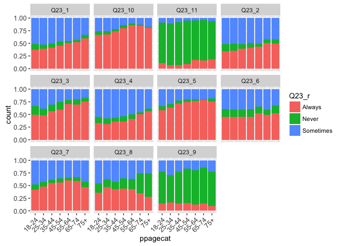<!-- -->

```r
p2 + geom_bar() + aes(Q23_q, fill = ppagecat) + facet_wrap(~Q23_r)
```

<!-- -->

```r
p2 + geom_bar(position = 'fill') + aes(Q23_q, fill = ppagecat) + facet_wrap(~Q23_r) + ggtitle("By age group")
```

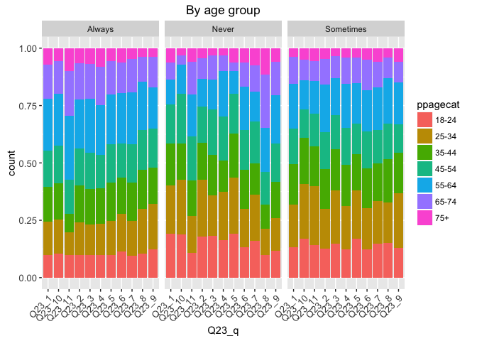<!-- -->

```r
p2 + geom_bar() + aes(ppagecat, fill = ppagecat) + facet_grid(Q23_q~Q23_r) + ptext2
```

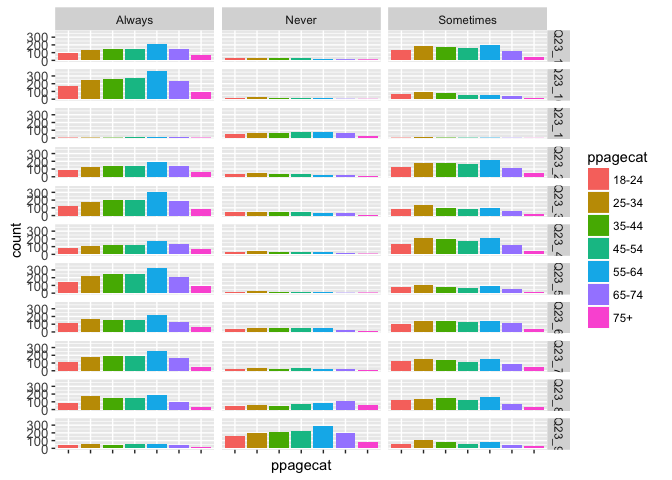<!-- -->

```r
# by ethnic group
p2 + geom_bar() + aes(PPETHM, fill = Q23_r) + facet_wrap(~Q23_q) + ggtitle("By ethnic group")
```

<!-- -->

```r
p2 + geom_bar(position = "fill") + aes(PPETHM, fill = Q23_r) + facet_wrap(~Q23_q)
```

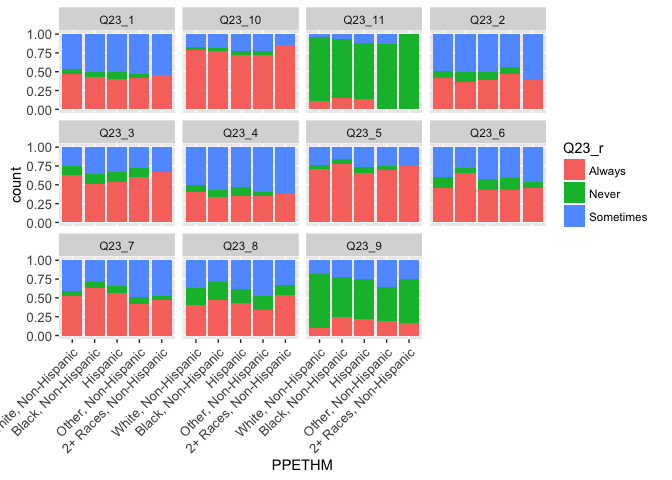<!-- -->

```r
p2 + geom_bar() + aes(Q23_q, fill = PPETHM) + facet_wrap(~Q23_r)
```

<!-- -->

```r
p2 + geom_bar(position = 'fill') + aes(Q23_q, fill = PPETHM) + facet_wrap(~Q23_r) + ggtitle("By ethnic group")
```

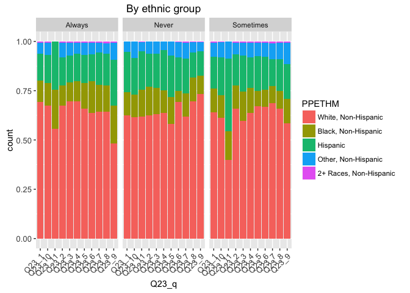<!-- -->

```r
p2 + geom_bar() + aes(PPETHM, fill = PPETHM) + facet_grid(Q23_q~Q23_r) + ptext2
```

<!-- -->

```r
p2 + geom_bar() + aes(Q23_r, fill = Q23_r) + facet_grid(Q23_q~PPETHM) + ptext2
```

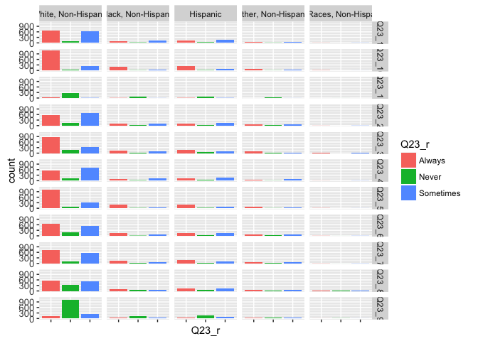<!-- -->

```r
# by income
p2 + geom_bar() + aes(PPINCIMP, fill = Q23_r) + facet_wrap(~Q23_q) + ggtitle("By income") + ptext2
```

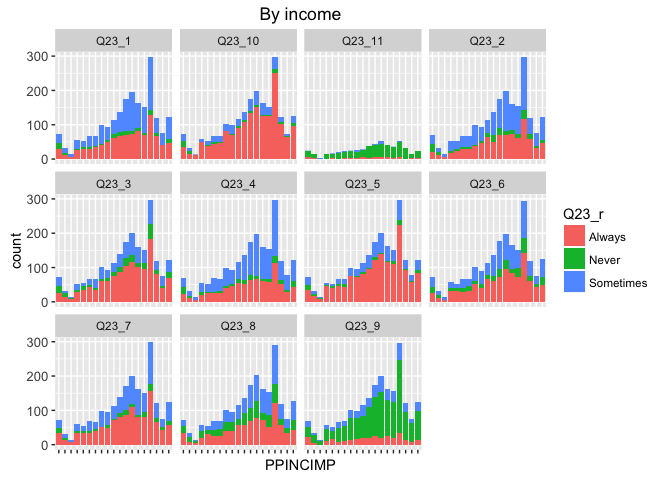<!-- -->

```r
p2 + geom_bar(position = "fill") + aes(PPINCIMP, fill = Q23_r) + facet_wrap(~Q23_q) + ptext2
```

<!-- -->

```r
p2 + geom_bar() + aes(Q23_q, fill = PPINCIMP) + facet_wrap(~Q23_r)
```

<!-- -->

```r
p2 + geom_bar(position = 'fill') + aes(Q23_q, fill = PPINCIMP) + facet_wrap(~Q23_r) + ggtitle("By income group")
```

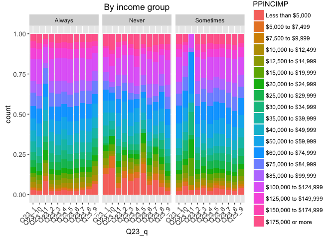<!-- -->

```r
p2 + geom_bar() + aes(PPINCIMP, fill = PPINCIMP) + facet_grid(Q23_q~Q23_r) + ptext2
```

<!-- -->

### Education, work, marital status


```r
# update weighted data frame
q23.2 <- data.frame(svytable(~Q23_q + Q23_r + PPEDUC + PPEDUCAT + work + PPWORK + marital + PPMARIT, des23, round = T))

# restate plots
p3 <- ggplot(q23.2, aes(Q23_q, weight = Freq)) + ptext
```


```r
# by education
p3 + geom_bar() + aes(PPEDUCAT, fill = Q23_r) + facet_wrap(~Q23_q) + ggtitle("By education")
```

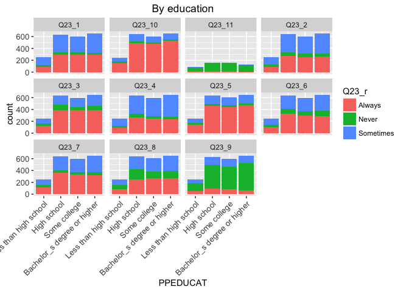<!-- -->

```r
p3 + geom_bar(position = "fill") + aes(PPEDUCAT, fill = Q23_r) + facet_wrap(~Q23_q)
```

<!-- -->

```r
p3 + geom_bar() + aes(Q23_q, fill = PPEDUCAT) + facet_wrap(~Q23_r)
```

<!-- -->

```r
p3 + geom_bar(position = "fill") + aes(Q23_q, fill = PPEDUCAT) + facet_wrap(~Q23_r) + ggtitle("By education")
```

<!-- -->

```r
p3 + geom_bar() + aes(PPEDUCAT, fill = PPEDUCAT) + facet_grid(Q23_q~Q23_r) + ptext2
```

<!-- -->

```r
p3 + geom_bar() + aes(Q23_r, fill = Q23_r) + facet_grid(Q23_q~PPEDUCAT) + ptext2
```

<!-- -->

```r
# by work
p3 + geom_bar() + aes(work, fill = Q23_r) + facet_wrap(~Q23_q) + ggtitle("By employment status")
```

<!-- -->

```r
p3 + geom_bar(position = "fill") + aes(work, fill = Q23_r) + facet_wrap(~Q23_q)
```

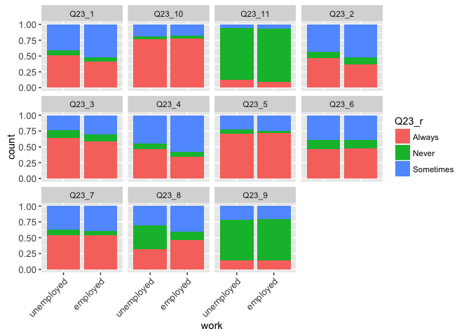<!-- -->

```r
# by marital
p3 + geom_bar() + aes(marital, fill = Q23_r) + facet_wrap(~Q23_q) + ggtitle("By marital status")
```

<!-- -->

```r
p3 + geom_bar(position = "fill") + aes(marital, fill = Q23_r) + facet_wrap(~Q23_q)
```

<!-- -->

### Metro status, region, state, house type, housing status, internet availability


```r
# update weighted data frame
q23.3 <- data.frame(svytable(~Q23_q + Q23_r + PPMSACAT + ppreg9 + PPSTATEN + PPHOUSE + PPRENT + PPNET, des23, round = T))

# restate plots
p4 <- ggplot(q23.3, aes(Q23_q, weight = Freq)) + ptext
```


```r
# by metro status
p4 + geom_bar(position = "fill") + aes(Q23_r, fill = PPMSACAT) + facet_wrap(~Q23_q) + ggtitle("By metro status")
```

<!-- -->

```r
p4 + geom_bar(position = "fill") + aes(PPMSACAT, fill = Q23_r) + facet_wrap(~Q23_q)
```

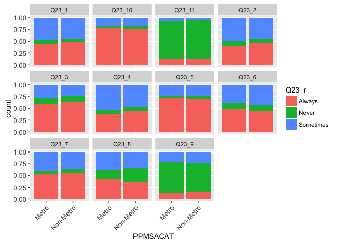<!-- -->

```r
# by region
p4 + geom_bar(position = "fill") + aes(Q23_r, fill = ppreg9) + facet_wrap(~Q23_q) + ggtitle("By region")
```

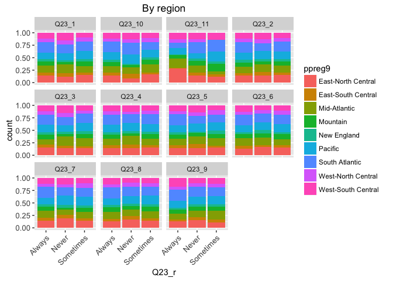<!-- -->

```r
p4 + geom_bar() + aes(ppreg9, fill = Q23_r) + facet_wrap(~Q23_q) + ggtitle("By region")
```

<!-- -->

```r
# by state
p4 + geom_bar() + aes(Q23_r, fill = PPSTATEN) + facet_wrap(~Q23_q) + ggtitle("By state")
```

<!-- -->

```r
p4 + geom_bar() + aes(PPSTATEN, fill = Q23_q) + coord_flip() + ggtitle("By state")
```

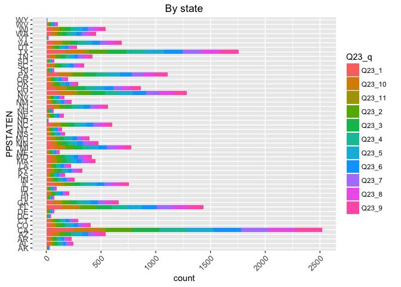<!-- -->

```r
# by house type
p4 + geom_bar(position = "fill") + aes(Q23_r, fill = PPHOUSE) + facet_wrap(~Q23_q)
```

<!-- -->

```r
p4 + geom_bar(position = "fill") + aes(fill = PPHOUSE) + ggtitle("By house type")
```

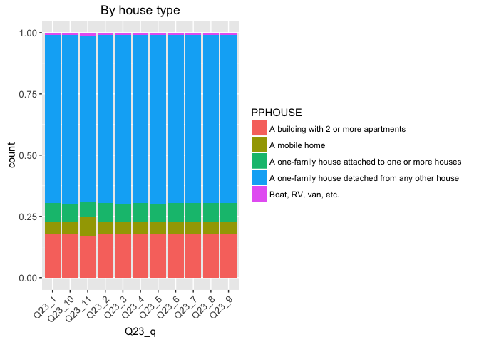<!-- -->

```r
# housing status
p4 + geom_bar(position = "fill") + aes(Q23_r, fill = PPHOUSE) + facet_wrap(~Q23_q)
```

<!-- -->

```r
p4 + geom_bar() + aes(PPHOUSE, fill = Q23_r) + facet_wrap(~Q23_q) + ggtitle("By housing")
```

<!-- -->

```r
# by internet availability
p4 + geom_bar(position = "fill") + aes(Q23_r, fill = PPNET) + facet_wrap(~Q23_q)
```

<!-- -->

```r
p4 + geom_bar(position = "fill") + aes(PPNET, fill = Q23_r) + facet_wrap(~Q23_q) + ggtitle("By internet availability")
```

<!-- -->


## Q31. How many hours of screen time (time spent watching television, a computer, smartphone, iPad, etc.) do you spend each day on average when you are not sick? Enter 0 if none


## Q32. How many hours of screen time do you spend each day on average when you are sick? Enter 0 if none


