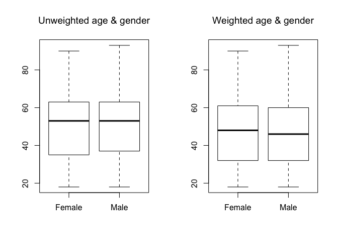
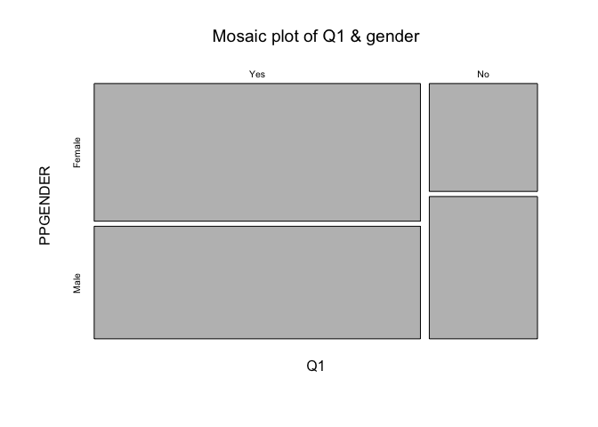
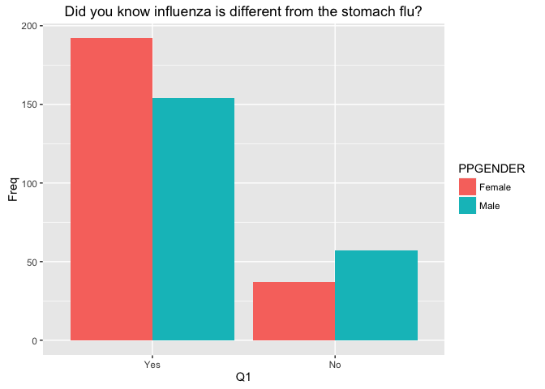
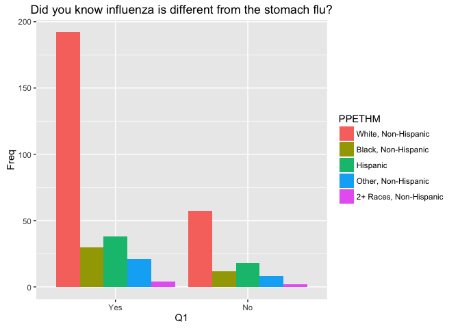
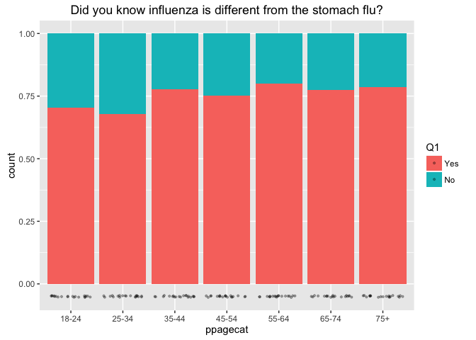
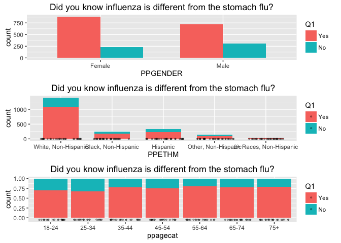
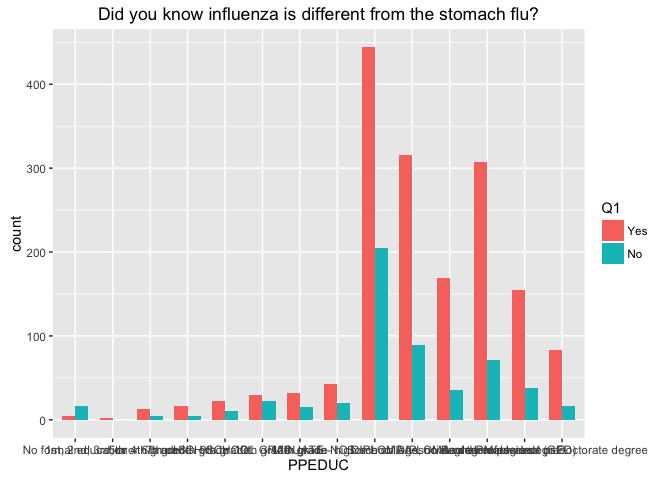
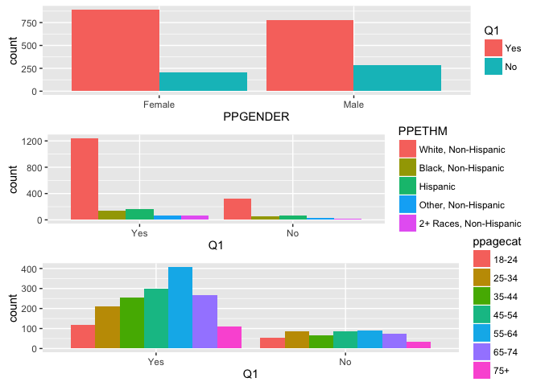

# pre-analysis


```r
## Load data
load("~/git/flu-survey/data/cleaning2.RData")  # dat = original, dataf = renamed columns
load("~/git/flu-survey/data/recoding.RData")  # datar = regrouped variables

df <- datar  # regrouped data set
```


```r
# Survey package: http://faculty.washington.edu/tlumley/survey-jsm-nup.pdf

## Create survey object
options(digits = 4)
options(survey.lonely.psu = "adjust")

des <- svydesign(ids = ~1, weights = ~weight, data = df[is.na(df$weight) == F, ])  # nest?

# ids = ~1 specifies independent sampling
```

### Ex: Unweighted vs. weighted survey data
See unwtd/wtd frequency tables from original report.


```r
# unwtd count for gender
svyby(~CaseID, ~PPGENDER, des, unwtd.count)
```

```
##        PPGENDER counts se
## Female   Female   1097  0
## Male       Male   1071  0
```

```r
# wtd gender
as.data.frame(svytable(~PPGENDER, design = des))
```

```
##   PPGENDER Freq
## 1   Female 1122
## 2     Male 1046
```

```r
# unwtd count for ethnicity
svyby(~CaseID, ~PPETHM, des, unwtd.count)
```

```
##                                        PPETHM counts se
## White, Non-Hispanic       White, Non-Hispanic   1568  0
## Black, Non-Hispanic       Black, Non-Hispanic    195  0
## Hispanic                             Hispanic    232  0
## Other, Non-Hispanic       Other, Non-Hispanic     93  0
## 2+ Races, Non-Hispanic 2+ Races, Non-Hispanic     80  0
```

```r
# wtd ethnicity
as.data.frame(svytable(~PPETHM, design = des))
```

```
##                   PPETHM    Freq
## 1    White, Non-Hispanic 1410.46
## 2    Black, Non-Hispanic  253.06
## 3               Hispanic  332.38
## 4    Other, Non-Hispanic  144.39
## 5 2+ Races, Non-Hispanic   27.71
```

```r
# unwtd count for age group
svyby(~CaseID, ~ppagecat, des, unwtd.count)
```

```
##       ppagecat counts se
## 18-24    18-24    172  0
## 25-34    25-34    300  0
## 35-44    35-44    327  0
## 45-54    45-54    386  0
## 55-64    55-64    498  0
## 65-74    65-74    340  0
## 75+        75+    145  0
```

```r
# wtd age group
as.data.frame(svytable(~ppagecat, design = des))
```

```
##   ppagecat  Freq
## 1    18-24 254.5
## 2    25-34 380.9
## 3    35-44 369.6
## 4    45-54 341.2
## 5    55-64 429.8
## 6    65-74 274.7
## 7      75+ 117.4
```

```r
# age plots
opar <- par(mfrow = c(1,2))
hist(df$PPAGE, main = "Unweighted age", ylim=c(0,300))
svyhist(~PPAGE, des, main = "Weighted age", probability = F, ylim=c(0,300))
```

<!-- -->

```r
# age and gender
boxplot(PPAGE~PPGENDER, df, main = "Unweighted age & gender")
svyboxplot(PPAGE~PPGENDER, des, main = "Weighted age & gender")
```

<!-- -->

```r
par(opar)
```

### Ex tables: Q1 by gender


```r
# unwtd count
ftable(svyby(~CaseID, ~Q1+PPGENDER, des, unwtd.count))
```

```
##                 PPGENDER Female   Male
##                          counts counts
## Q1                                    
## Yes unwtd.count             888    776
##     SE                        0      0
## No  unwtd.count             205    283
##     SE                        0      0
```

```r
# same as
with(df, table(Q1, PPGENDER))
```

```
##      PPGENDER
## Q1    Female Male
##   Yes    888  776
##   No     205  283
```

```r
# wtd count
svytable(~Q1 + PPGENDER, design = des)
```

```
##      PPGENDER
## Q1    Female  Male
##   Yes  886.9 725.0
##   No   230.5 304.1
```

```r
# wtd count (rounded)
svytable(~Q1 + PPGENDER, design = des, round = T)
```

```
##      PPGENDER
## Q1    Female Male
##   Yes    887  725
##   No     231  304
```

```r
# unwtd proportion
with(df, prop.table(table(Q1, PPGENDER), margin = 1))
```

```
##      PPGENDER
## Q1    Female   Male
##   Yes 0.5337 0.4663
##   No  0.4201 0.5799
```

```r
# wtd proportion
ftable(svyby(~PPGENDER, ~Q1, design = des, FUN = svymean, na.rm = T))
```

```
##              PPGENDERFemale PPGENDERMale
## Q1                                      
## Yes svymean         0.55021      0.44979
##     SE              0.01309      0.01309
## No  svymean         0.43121      0.56879
##     SE              0.02435      0.02435
```

### Ex plots


```r
# default mosaic plot
plot(svytable(~Q1 + PPGENDER, des), main = "Mosaic plot of Q1 & gender")
```

<!-- -->

```r
# fourfold plot shows associations across a set of 2x2 tables
fourfoldplot(svytable(~Q2 + PPGENDER, des), std = "ind.max", main = "Fourfold plot of Q2 & gender")
```

<!-- -->


Demographic variables include: gender, ethnicity, age, education, income, employment, marital status, metro location, region, house type, head of household, rent status, state, internet availability


## Q1. Before receiving this survey did you know influenza is different from the stomach flu?

### Compare by gender, ethnicity, age group, education, income, region, internet availabiliy.


```r
# save svytable as data frame
q1 <- as.data.frame(svytable(~Q1 + PPGENDER + PPETHM + ppagecat, des, round = T))

# make ggplot objects
title <- ggtitle("Did you know influenza is different from the stomach flu?")
g <- ggplot(q1, aes(weight = Freq))

# plots
#svytable(~Q1 + PPGENDER, des, round = T)
(a <- g + aes(PPGENDER, fill = Q1) + geom_bar(width = 0.7, position = "dodge") + title)
```

<!-- -->

```r
#svytable(~Q1 + PPETHM, des, round = T)
(b <- g + aes(PPETHM, fill = Q1) + geom_bar(width = 0.7, position = "stack") +
  geom_point(aes(y = -0.05), size = 0.75, alpha = 0.3, position = position_jitter(h = 0.01)) + title)
```

<!-- -->

```r
#svytable(~Q1 + ppagecat, des, round = T)
(c <- g + aes(ppagecat, fill = Q1) + geom_bar(position = "fill") +
  geom_point(aes(y = -0.05), size = 0.75, alpha = 0.3, position = position_jitter(h = 0.01)) + title)
```

<!-- -->

```r
## weighted plots
grid.arrange(a, b, c)
```

<!-- -->


```r
# dataframe
q1 <- as.data.frame(svytable(~Q1 + PPEDUC + PPINCIMP + ppreg9 + PPNET, des, round = T))
g <- ggplot(q1, aes(weight = Freq))

# more plots
g + aes(PPEDUC, fill = Q1) + geom_bar(width = 0.7, position = "dodge") + title
```

<!-- -->

```r
g + aes(PPINCIMP, fill = Q1) + geom_bar(width = 0.7, position = "dodge") + title
```

<!-- -->

```r
g + aes(ppreg9, fill = Q1) + geom_bar(width = 0.7, position = "dodge") + title
```

<!-- -->

```r
g + aes(PPNET, fill = Q1) + geom_bar(width = 0.7, position = "dodge") + title
```

<!-- -->

### Compare to unweighted plots.


```r
## unweighted plots
q <- ggplot(df[!is.na(df$Q1), ])

with(df, table(PPGENDER, Q1))
```

```
##         Q1
## PPGENDER Yes  No
##   Female 888 205
##   Male   776 283
```

```r
d <- q + geom_bar(aes(PPGENDER, fill = Q1), position = "dodge")
with(df, table(PPETHM, Q1))
```

```
##                         Q1
## PPETHM                    Yes   No
##   White, Non-Hispanic    1235  322
##   Black, Non-Hispanic     143   50
##   Hispanic                161   69
##   Other, Non-Hispanic      63   29
##   2+ Races, Non-Hispanic   62   18
```

```r
e <- q + geom_bar(aes(Q1, fill = PPETHM), position = "dodge")
with(df, table(ppagecat, Q1))
```

```
##         Q1
## ppagecat Yes  No
##    18-24 117  55
##    25-34 209  85
##    35-44 256  66
##    45-54 298  86
##    55-64 406  90
##    65-74 267  73
##    75+   111  33
```

```r
f <- q + geom_bar(aes(Q1, fill = ppagecat), position = "dodge")

# unweighted
grid.arrange(d, e, f)
```

<!-- -->

### Examine the % of US adults sick with ILI last year by gender, ethnicity, and age. Do a survey-corrected chi-square test for independence.


```r
## % of US adults sick last year with ILI by gender
sex <- svyby(formula = ~Q2, by = ~PPGENDER, design = des, FUN = svymean, na.rm = T)
svychisq(~Q2 + PPGENDER, design = des)
```

```
## 
## 	Pearson's X^2: Rao & Scott adjustment
## 
## data:  svychisq(~Q2 + PPGENDER, design = des)
## F = 6.3, ndf = 1, ddf = 2200, p-value = 0.01
```

```r
qplot(x = sex$PPGENDER, y = sex$Q2Yes, data = sex, xlab = "sex", ylab = "% sick") + geom_errorbar(aes(x = PPGENDER, ymin = Q2Yes - se.Q2Yes, ymax = Q2Yes + se.Q2Yes), width = .25) + ggtitle(label = "% of adults sick last year with ILI by sex")
```

<!-- -->

```r
## % of US adults sick last year with ILI by ethnicity
eth <- svyby(formula = ~Q2, by = ~PPETHM, design = des, FUN = svymean, na.rm = T)
svychisq(~Q2 + PPETHM, design = des)
```

```
## 
## 	Pearson's X^2: Rao & Scott adjustment
## 
## data:  svychisq(~Q2 + PPETHM, design = des)
## F = 4.3, ndf = 3.4, ddf = 7400.0, p-value = 0.003
```

```r
qplot(x = eth$PPETHM, y = eth$Q2Yes, data = eth, xlab = "ethnicity", ylab = "% sick") + geom_errorbar(aes(x = PPETHM, ymin = Q2Yes - se.Q2Yes, ymax = Q2Yes + se.Q2Yes), width = .25) + ggtitle(label = "% of adults sick last year with ILI by ethnicity")
```

<!-- -->

```r
## % of US adults sick last year with ILI by age
age <- svyby(formula = ~Q2, by = ~ppagecat, design = des, FUN = svymean, na.rm = T)
svychisq(~Q2 + ppagecat, design = des)
```

```
## 
## 	Pearson's X^2: Rao & Scott adjustment
## 
## data:  svychisq(~Q2 + ppagecat, design = des)
## F = 2.1, ndf = 5.8, ddf = 13000.0, p-value = 0.06
```

```r
qplot(x = age$ppagecat, y = age$Q2Yes, data = age, xlab = "age", ylab = "% sick") + geom_errorbar(aes(x = ppagecat, ymin = Q2Yes - se.Q2Yes, ymax = Q2Yes + se.Q2Yes), width = .25) + ggtitle(label = "% of adults sick last year with ILI by age")
```

<!-- -->


