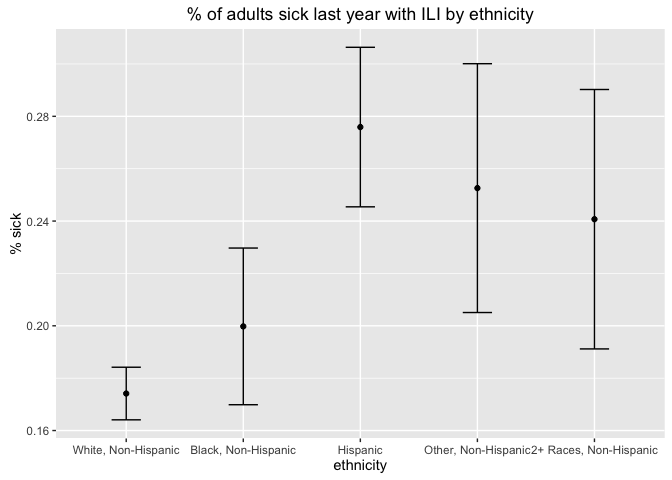
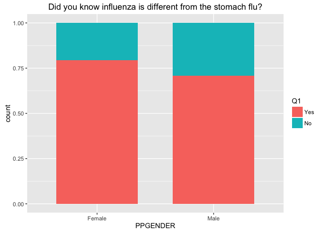
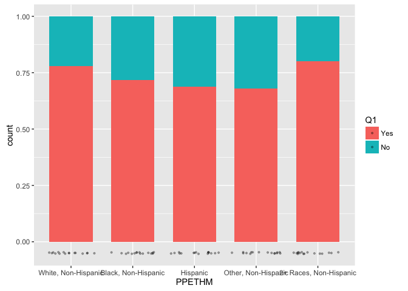
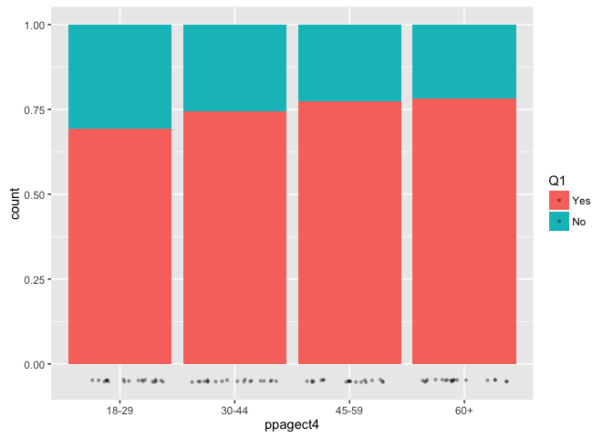
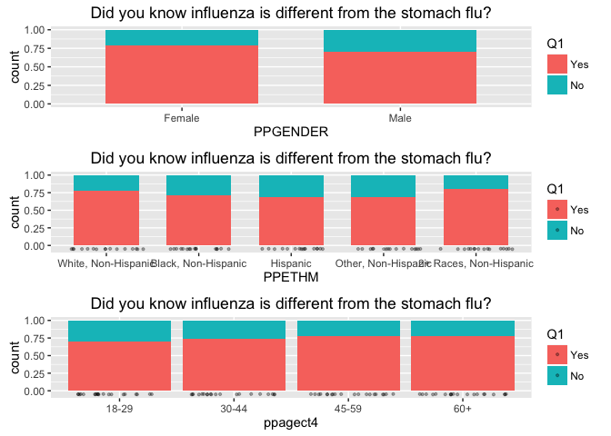

# Comparing unweighted and weighted survey data


```r
## Load data variables.
load("~/git/flu-survey/data/cleaning2.RData")
load("~/git/flu-survey/data/recoding.RData")  # load "datar"

df <- datar  # contains recoded variables
```


```r
## Create survey object.
options(digits = 4)
options(survey.lonely.psu = "adjust")
des <- svydesign(ids = ~1, weights = ~weight, data = df[is.na(df$weight) == F, ])
```

### Example of unweighted vs. weighted variables.


```r
# unweighted count for gender
svyby(~PPGENDER, ~PPGENDER, des, unwtd.count)
```

```
##        PPGENDER counts se
## Female   Female   1097  0
## Male       Male   1071  0
```

```r
# weighted gender
as.data.frame(svytable(~PPGENDER, design = des))
```

```
##   PPGENDER Freq
## 1   Female 1122
## 2     Male 1046
```

```r
# unweighted count for ethnicity
svyby(~PPGENDER, ~PPETHM, des, unwtd.count)
```

```
##                                        PPETHM counts se
## White, Non-Hispanic       White, Non-Hispanic   1568  0
## Black, Non-Hispanic       Black, Non-Hispanic    195  0
## Hispanic                             Hispanic    232  0
## Other, Non-Hispanic       Other, Non-Hispanic     93  0
## 2+ Races, Non-Hispanic 2+ Races, Non-Hispanic     80  0
```

```r
# weighted ethnicity
as.data.frame(svytable(~PPETHM, design = des))
```

```
##                   PPETHM    Freq
## 1    White, Non-Hispanic 1410.46
## 2    Black, Non-Hispanic  253.06
## 3               Hispanic  332.38
## 4    Other, Non-Hispanic  144.39
## 5 2+ Races, Non-Hispanic   27.71
```

```r
# unweighted count for age
svyby(~PPGENDER, ~ppagecat, des, unwtd.count)
```

```
##       ppagecat counts se
## 18-24    18-24    172  0
## 25-34    25-34    300  0
## 35-44    35-44    327  0
## 45-54    45-54    386  0
## 55-64    55-64    498  0
## 65-74    65-74    340  0
## 75+        75+    145  0
```

```r
# weighted age
as.data.frame(svytable(~ppagecat, design = des))
```

```
##   ppagecat  Freq
## 1    18-24 254.5
## 2    25-34 380.9
## 3    35-44 369.6
## 4    45-54 341.2
## 5    55-64 429.8
## 6    65-74 274.7
## 7      75+ 117.4
```

### Example of Q1 by gender.


```r
# unweighted count
svyby(~Q1, ~Q1+PPGENDER, des, unwtd.count)
```

```
##             Q1 PPGENDER counts se
## Yes.Female Yes   Female    888  0
## No.Female   No   Female    205  0
## Yes.Male   Yes     Male    776  0
## No.Male     No     Male    283  0
```

```r
# weighted count
as.data.frame(svytable(~Q1 + PPGENDER, design = des))
```

```
##    Q1 PPGENDER  Freq
## 1 Yes   Female 886.9
## 2  No   Female 230.5
## 3 Yes     Male 725.0
## 4  No     Male 304.1
```

```r
# weighted count (rounded)
as.data.frame(svytable(~Q1 + PPGENDER, design = des, round = T))
```

```
##    Q1 PPGENDER Freq
## 1 Yes   Female  887
## 2  No   Female  231
## 3 Yes     Male  725
## 4  No     Male  304
```

```r
# weighted %
svyby(~Q1, ~PPGENDER, design = des, FUN = svymean, na.rm = T)
```

```
##        PPGENDER  Q1Yes   Q1No se.Q1Yes se.Q1No
## Female   Female 0.7937 0.2063  0.01373 0.01373
## Male       Male 0.7045 0.2955  0.01562 0.01562
```

```r
# default survey plot
plot(svytable(~Q1 + PPGENDER, des))
```

<!-- -->

```r
## generic ggplot
# ggplot(data.frame.here, aes(Q1, Freq, fill = PPGENDER) + geom_bar(stat = 'identity', position = position_dodge())
```


## Q1. Before receiving this survey did you know influenza is different from the stomach flu?
### By demographic variables:
- gender, ethnicity, age, education, income, employment, marital status, metro location, region, house type, head of household, rent status, state, internet availability


```r
# save freq table as data.frame
q1 <- as.data.frame(svytable(
  ~Q1 + PPGENDER + PPETHM + ppagect4, design = des, round = T))

# make ggplot object
g1 <- ggplot(q1)
title <- ggtitle("Did you know influenza is different from the stomach flu?")

g1 + aes(Q1, Freq, fill = PPGENDER) + 
  geom_bar(stat = 'identity', position = position_dodge()) + title
```

<!-- -->

```r
g1 + aes(Q1, Freq, fill = PPETHM) + 
  geom_bar(stat = 'identity', position = position_dodge()) + title
```

<!-- -->

```r
g1 + aes(Q1, Freq, fill = ppagect4) + 
  geom_bar(stat = 'identity', position = position_stack()) + title
```

<!-- -->

### Examine the % of US adults sick with ILI last year by sex, ethnicity, and age. Do a survey-corrected chi-square test for independence.


```r
## % of US adults sick last year with ILI by sex
sex <- svyby(formula = ~Q2, by = ~PPGENDER, design = des, FUN = svymean, na.rm = T)
svychisq(~Q2 + PPGENDER, design = des)
```

```
## 
## 	Pearson's X^2: Rao & Scott adjustment
## 
## data:  svychisq(~Q2 + PPGENDER, design = des)
## F = 6.3, ndf = 1, ddf = 2200, p-value = 0.01
```

```r
qplot(x = sex$PPGENDER, y = sex$Q2Yes, data = sex, xlab = "sex", ylab = "% sick") + geom_errorbar(aes(x = PPGENDER, ymin = Q2Yes - se.Q2Yes, ymax = Q2Yes + se.Q2Yes), width = .25) + ggtitle(label = "% of adults sick last year with ILI by sex")
```

<!-- -->

```r
## % of US adults sick last year with ILI by ethnicity
eth <- svyby(formula = ~Q2, by = ~PPETHM, design = des, FUN = svymean, na.rm = T)
svychisq(~Q2 + PPETHM, design = des)
```

```
## 
## 	Pearson's X^2: Rao & Scott adjustment
## 
## data:  svychisq(~Q2 + PPETHM, design = des)
## F = 4.3, ndf = 3.4, ddf = 7400.0, p-value = 0.003
```

```r
qplot(x = eth$PPETHM, y = eth$Q2Yes, data = eth, xlab = "ethnicity", ylab = "% sick") + geom_errorbar(aes(x = PPETHM, ymin = Q2Yes - se.Q2Yes, ymax = Q2Yes + se.Q2Yes), width = .25) + ggtitle(label = "% of adults sick last year with ILI by ethnicity")
```

<!-- -->

```r
## % of US adults sick last year with ILI by age
age <- svyby(formula = ~Q2, by = ~ppagecat, design = des, FUN = svymean, na.rm = T)
svychisq(~Q2 + ppagecat, design = des)
```

```
## 
## 	Pearson's X^2: Rao & Scott adjustment
## 
## data:  svychisq(~Q2 + ppagecat, design = des)
## F = 2.1, ndf = 5.8, ddf = 13000.0, p-value = 0.06
```

```r
qplot(x = age$ppagecat, y = age$Q2Yes, data = age, xlab = "age", ylab = "% sick") + geom_errorbar(aes(x = ppagecat, ymin = Q2Yes - se.Q2Yes, ymax = Q2Yes + se.Q2Yes), width = .25) + ggtitle(label = "% of adults sick last year with ILI by age")
```

<!-- -->

### Simple weighted plots.


```r
## weighted bivariate plots with svytable
qtest <- as.data.frame(svytable(
  ~Q1 + PPGENDER + PPETHM + ppagect4, design = des, round = T))

p <- ggplot(qtest, aes(weight = Freq))
title <- ggtitle("Did you know influenza is different from the stomach flu?")

#svytable(~Q1 + PPGENDER, des, round = T)
(a <- p + aes(PPGENDER, fill = Q1) + geom_bar(width = 0.7, position = "fill") + title)
```

<!-- -->

```r
#svytable(~Q1 + PPETHM, des, round = T)
(b <- p + aes(PPETHM, fill = Q1) + geom_bar(width = 0.7, position = "fill") +
  geom_point(aes(y = -0.05), size = 0.75, alpha = 0.3, position = position_jitter(h = 0.01)) + title)
```

<!-- -->

```r
#svytable(~Q1 + ppagect4, des, round = T)
(c <- p + aes(ppagect4, fill = Q1) + geom_bar(position = "fill") +
  geom_point(aes(y = -0.05), size = 0.75, alpha = 0.3, position = position_jitter(h = 0.01)) + title)
```

<!-- -->

```r
grid.arrange(a, b, c)
```

<!-- -->

### Compare weighted plots to unweighted plots.


```r
## unweighted plots
q <- ggplot(df[!is.na(df$Q1), ])

with(df, table(PPGENDER, Q1))
```

```
##         Q1
## PPGENDER Yes  No
##   Female 888 205
##   Male   776 283
```

```r
a <- q + geom_bar(aes(PPGENDER, fill = Q1), position = "dodge")

with(df, table(PPETHM, Q1))
```

```
##                         Q1
## PPETHM                    Yes   No
##   White, Non-Hispanic    1235  322
##   Black, Non-Hispanic     143   50
##   Hispanic                161   69
##   Other, Non-Hispanic      63   29
##   2+ Races, Non-Hispanic   62   18
```

```r
b <- q + geom_bar(aes(Q1, fill = PPETHM), position = "dodge")

with(df, table(ppagect4, Q1))
```

```
##         Q1
## ppagect4 Yes  No
##    18-29 222  98
##    30-44 360 108
##    45-59 514 132
##    60+   568 150
```

```r
c <- q + geom_bar(aes(Q1, fill = ppagect4), position = "dodge")

grid.arrange(a, b, c)
```

<!-- -->


