# Analysis summary part 1


```r
## Create survey object.
options(digits = 4)
options(survey.lonely.psu = "adjust")

# subset data?
des <- svydesign(ids = ~1, weights = ~weight, data = df[is.na(df$weight) == 
    F, ])
```


## Overview:
- Default survey plot
- Univariate plots
- Bivariate plots: gender, age, ethnicity, income, education, work status, marital status
- Plot group means with error bars

# Survey Questions

## Q1. Before receiving this survey, did you know influenza is different from the stomach flu?


```r
# default survey plot
plot(svytable(~Q1 + PPGENDER, des))
```

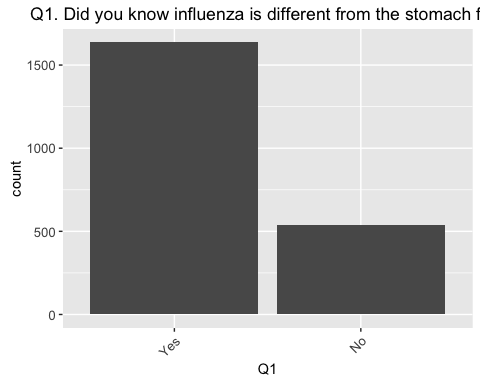<!-- -->

```r
# save weighted data frame for Q1 + variables
q1 <- data.frame(svytable(~Q1 + PPGENDER + ppagecat + ppagect4 + PPETHM + income + 
    PPEDUCAT + work + marital + PPMSACAT, des, round = T))

# ggplot objects for each question
p <- ggplot(q1, aes(Q1, weight = Freq)) + ptext
fil <- aes(fill = Q1)

# make tables with: svytable(~Q1 + PPGENDER, des, round = T)
p + geom_bar()
```

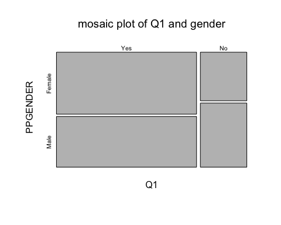<!-- -->

```r
(gen <- p + aes(fill = PPGENDER) + geom_bar(position = "dodge"))
```

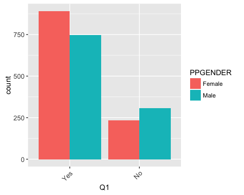<!-- -->

```r
(age <- p + aes(fill = ppagect4) + geom_bar(position = "dodge"))
```

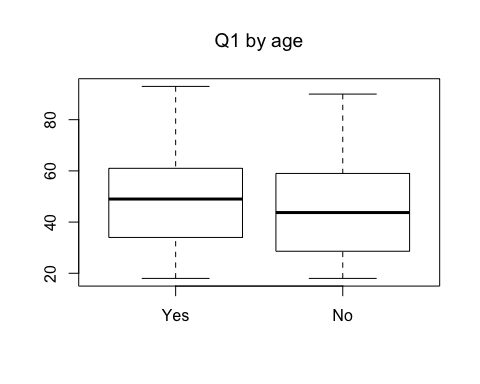<!-- -->

```r
(age2 <- p + aes(ppagecat) + fil + geom_bar(position = "stack"))
```

<!-- -->

```r
(eth <- p + peth + fil + geom_bar(position = "dodge"))
```

<!-- -->

```r
(eth2 <- p + aes(fill = PPETHM) + geom_bar(position = "fill"))
```

<!-- -->

```r
(inc <- p + pinc + fil + geom_bar(position = "stack"))
```

<!-- -->

```r
(inc2 <- p + aes(fill = income) + geom_bar(position = "dodge"))
```

<!-- -->

```r
(edu <- p + pedu + fil + geom_bar(position = "dodge"))
```

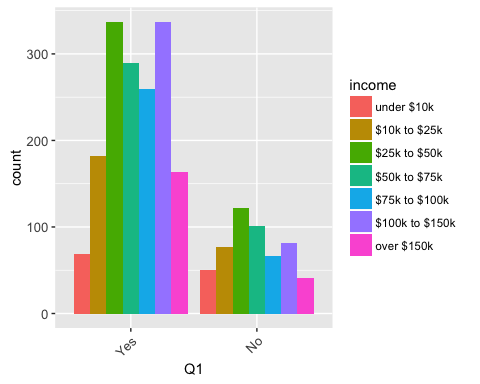<!-- -->

```r
(edu2 <- p + aes(fill = PPEDUCAT) + geom_bar(position = "dodge"))
```

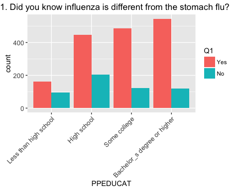<!-- -->

```r
(wor <- p + pwor + fil + geom_bar(position = "dodge"))
```

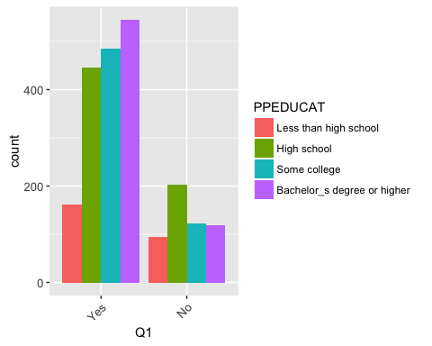<!-- -->

```r
(wor2 <- p + aes(fill = work) + geom_bar(position = "dodge"))
```

<!-- -->

```r
(mar <- p + pmar + fil + geom_bar(position = "dodge"))
```

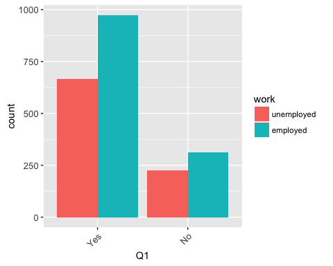<!-- -->

```r
(met <- p + aes(PPMSACAT) + fil + geom_bar(position = "dodge"))
```

<!-- -->

```r
(met2 <- p + aes(fill = PPMSACAT) + geom_bar(position = "dodge"))
```

<!-- -->

```r
# grid.arrange(gen, age, eth) grid.arrange(inc, edu, wor, mar)

# grid plots
plot(svytable(~Q1 + PPGENDER + ppagect4, des))
```

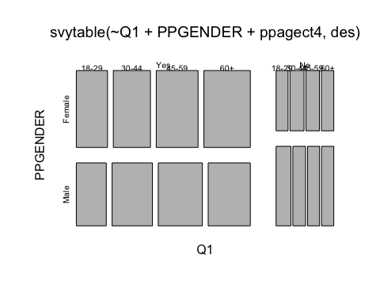<!-- -->

```r
plot(svytable(~Q1 + PPGENDER + PPETHM, des))
```

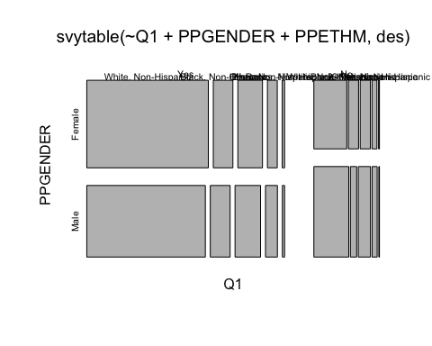<!-- -->

## Q2. Have you had an illness with influenza-like symptoms since August 2015?


```r
q2 <- data.frame(svytable(~Q2 + PPGENDER + ppagecat + ppagect4 + PPETHM + income + 
    PPEDUCAT + work + marital + PPMSACAT, des, round = T))

p <- ggplot(q2, aes(Q2, weight = Freq)) + ptext
fil <- aes(fill = Q2)

all <- p + geom_bar()
(gen <- p + pgen + fil + geom_bar(position = "dodge"))
```

<!-- -->

```r
(gen2 <- p + aes(fill = PPGENDER) + geom_bar(position = "dodge"))
```

<!-- -->

```r
(age <- p + page + fil + geom_bar(position = "dodge"))
```

<!-- -->

```r
(age2 <- p + aes(fill = ppagect4) + geom_bar(position = "dodge"))
```

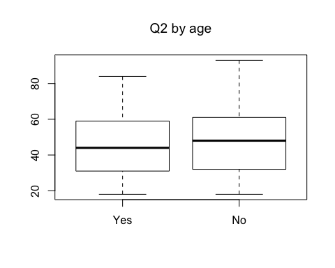<!-- -->

```r
(eth <- p + peth + fil + geom_bar(position = "stack"))
```

<!-- -->

```r
(eth2 <- p + aes(fill = PPETHM) + geom_bar(position = "fill"))
```

<!-- -->

```r
(inc <- p + pinc + fil + geom_bar(position = "stack"))
```

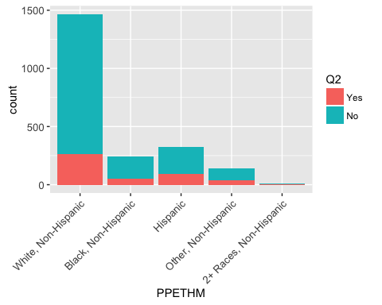<!-- -->

```r
(inc2 <- p + aes(fill = income) + geom_bar(position = "dodge"))
```

<!-- -->

```r
(edu <- p + pedu + fil + geom_bar(position = "dodge"))
```

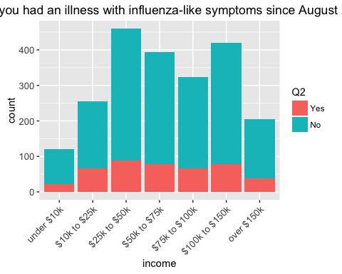<!-- -->

```r
(edu2 <- p + aes(fill = PPEDUCAT) + geom_bar(position = "dodge"))
```

<!-- -->

```r
(wor <- p + pwor + fil + geom_bar(position = "dodge"))
```

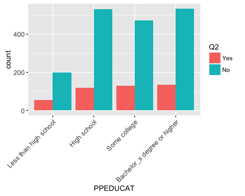<!-- -->

```r
(wor2 <- p + aes(fill = work) + geom_bar(position = "dodge"))
```

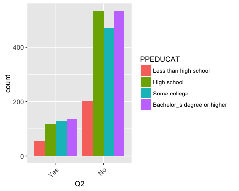<!-- -->

```r
(mar <- p + pmar + fil + geom_bar(position = "dodge"))
```

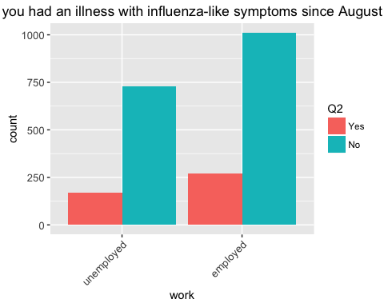<!-- -->

```r
(mar2 <- p + aes(fill = marital) + geom_bar(position = "dodge"))
```

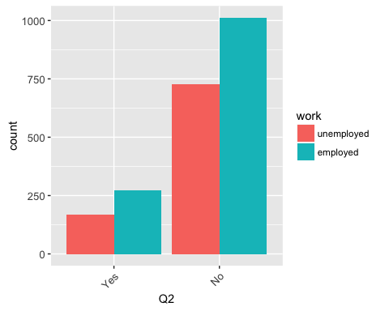<!-- -->

```r
(met <- p + aes(PPMSACAT) + fil + geom_bar(position = "dodge"))
```

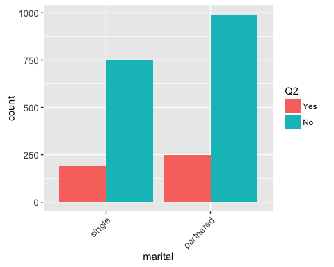<!-- -->

```r
(met2 <- p + aes(fill = PPMSACAT) + geom_bar(position = "dodge"))
```

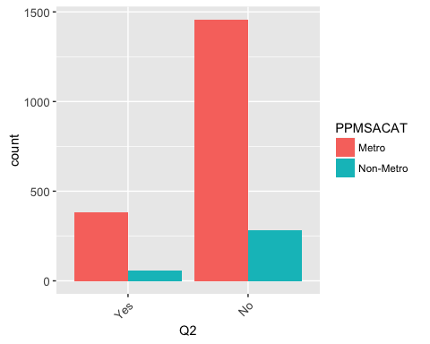<!-- -->

```r
# grid.arrange(gen, age, eth) grid.arrange(inc, edu, wor, mar)
```

#### survey example ####


### Examine the % of US adults sick with ILI last year by sex, ethnicity, and age. Do a survey-corrected chi-square test for independence.


```r
## create ggplot template
er <- geom_errorbar(aes(ymin = Q2Yes - se.Q2Yes, ymax = Q2Yes + se.Q2Yes), width = 0.25)

## % of US adults sick last year with ILI by sex
gen <- svyby(~Q2, ~PPGENDER, des, svymean, na.rm = T)
svychisq(~Q2 + PPGENDER, des)
```

```
## 
## 	Pearson's X^2: Rao & Scott adjustment
## 
## data:  svychisq(~Q2 + PPGENDER, des)
## F = 6.3, ndf = 1, ddf = 2200, p-value = 0.01
```

```r
ggplot(gen, aes(PPGENDER, Q2Yes)) + geom_point() + xlab("sex") + ylab("% sick") + 
    er + ggtitle(label = "% of adults sick last year with ILI by sex")
```

<!-- -->

```r
## % of US adults sick last year with ILI by age
age <- svyby(~Q2, ~ppagecat, des, svymean, na.rm = T)
svychisq(~Q2 + ppagecat, des)
```

```
## 
## 	Pearson's X^2: Rao & Scott adjustment
## 
## data:  svychisq(~Q2 + ppagecat, des)
## F = 2.1, ndf = 5.8, ddf = 13000.0, p-value = 0.06
```

```r
ggplot(age, aes(ppagecat, Q2Yes)) + geom_point() + xlab("age") + ylab("% sick") + 
    er + ggtitle(label = "% of adults sick last year with ILI by age")
```

<!-- -->

```r
## % of US adults sick last year with ILI by ethnicity
eth <- svyby(~Q2, ~PPETHM, des, svymean, na.rm = T)
svychisq(~Q2 + PPETHM, des)
```

```
## 
## 	Pearson's X^2: Rao & Scott adjustment
## 
## data:  svychisq(~Q2 + PPETHM, des)
## F = 4.3, ndf = 3.4, ddf = 7400.0, p-value = 0.003
```

```r
ggplot(eth, aes(PPETHM, Q2Yes)) + geom_point() + xlab("ethnicity") + ylab("% sick") + 
    ptext + er + ggtitle(label = "% of adults sick last year with ILI by ethnicity")
```

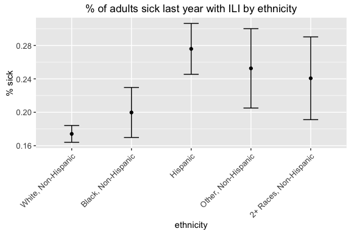<!-- -->

```r
## by income
inc <- svyby(~Q2, ~PPINCIMP, des, svymean, na.rm = T)
svychisq(~Q2 + PPINCIMP, des)
```

```
## 
## 	Pearson's X^2: Rao & Scott adjustment
## 
## data:  svychisq(~Q2 + PPINCIMP, des)
## F = 0.84, ndf = 18, ddf = 38000, p-value = 0.7
```

```r
ggplot(inc, aes(PPINCIMP, Q2Yes)) + geom_point() + xlab("income") + ylab("% sick") + 
    coord_flip() + er + ggtitle(label = "% of adults sick last year with ILI by income")
```

<!-- -->

```r
## by education
edu <- svyby(~Q2, ~PPEDUCAT, des, svymean, na.rm = T)
svychisq(~Q2 + PPEDUCAT, des)
```

```
## 
## 	Pearson's X^2: Rao & Scott adjustment
## 
## data:  svychisq(~Q2 + PPEDUCAT, des)
## F = 0.67, ndf = 2.9, ddf = 6300.0, p-value = 0.6
```

```r
ggplot(edu, aes(PPEDUCAT, Q2Yes)) + geom_point() + xlab("education") + ylab("% sick") + 
    er + ggtitle(label = "% of adults sick last year with ILI by education")
```

<!-- -->

```r
## by work status
wor <- svyby(~Q2, ~work, des, svymean, na.rm = T)
svychisq(~Q2 + work, des)
```

```
## 
## 	Pearson's X^2: Rao & Scott adjustment
## 
## data:  svychisq(~Q2 + work, des)
## F = 2.7, ndf = 1, ddf = 2200, p-value = 0.1
```

```r
ggplot(wor, aes(work, Q2Yes)) + geom_point() + xlab("work") + ylab("% sick") + 
    er + ggtitle(label = "% of adults sick last year with ILI by work")
```

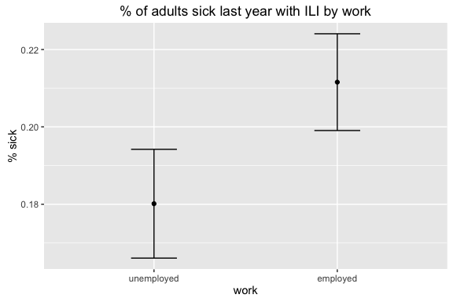<!-- -->

```r
## by marital status
mar <- svyby(~Q2, ~PPMARIT, des, svymean, na.rm = T)
svychisq(~Q2 + PPMARIT, des)
```

```
## 
## 	Pearson's X^2: Rao & Scott adjustment
## 
## data:  svychisq(~Q2 + PPMARIT, des)
## F = 0.71, ndf = 5, ddf = 11000, p-value = 0.6
```

```r
ggplot(mar, aes(PPMARIT, Q2Yes)) + geom_point() + xlab("marital status") + ylab("% sick") + 
    er + ggtitle(label = "% of adults sick last year with ILI by marital status")
```

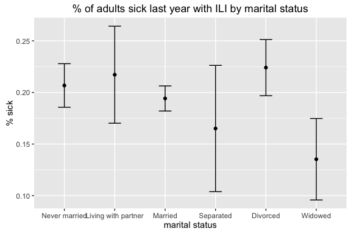<!-- -->

```r
# re-grouped marital status
mar2 <- svyby(~Q2, ~marital, des, svymean, na.rm = T)
svychisq(~Q2 + marital, des)
```

```
## 
## 	Pearson's X^2: Rao & Scott adjustment
## 
## data:  svychisq(~Q2 + marital, des)
## F = 0.094, ndf = 1, ddf = 2200, p-value = 0.8
```

```r
ggplot(mar2, aes(marital, Q2Yes)) + geom_point() + xlab("") + ylab("% sick") + 
    er + ggtitle(label = "% of adults sick last year with ILI by marital status")
```

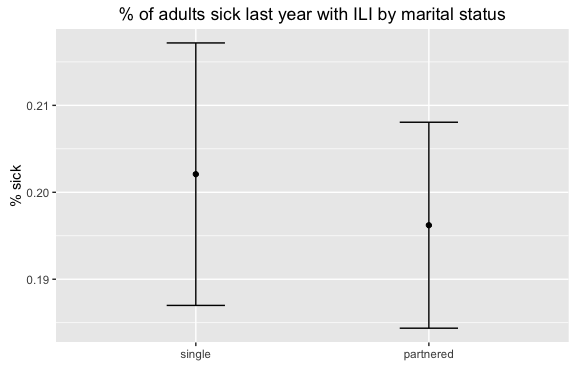<!-- -->

```r
## by metro status
met <- svyby(~Q2, ~PPMSACAT, des, svymean, na.rm = T)
svychisq(~Q2 + PPMSACAT, des)
```

```
## 
## 	Pearson's X^2: Rao & Scott adjustment
## 
## data:  svychisq(~Q2 + PPMSACAT, des)
## F = 3.1, ndf = 1, ddf = 2200, p-value = 0.08
```

```r
ggplot(met, aes(PPMSACAT, Q2Yes)) + geom_point() + xlab("metro status") + ylab("% sick") + 
    er + ggtitle(label = "% of adults sick last year with ILI by metro status")
```

<!-- -->

```r
## by region cat4
reg <- svyby(~Q2, ~PPREG4, des, svymean, na.rm = T)
svychisq(~Q2 + PPREG4, des)
```

```
## 
## 	Pearson's X^2: Rao & Scott adjustment
## 
## data:  svychisq(~Q2 + PPREG4, des)
## F = 4.5, ndf = 3, ddf = 6500, p-value = 0.004
```

```r
ggplot(reg, aes(PPREG4, Q2Yes)) + geom_point() + xlab(" ") + ylab("% sick") + 
    er + ggtitle(label = "% of adults sick last year with ILI by region")
```

<!-- -->

```r
## by region cat9
reg9 <- svyby(~Q2, ~ppreg9, des, svymean, na.rm = T)
svychisq(~Q2 + ppreg9, des)
```

```
## 
## 	Pearson's X^2: Rao & Scott adjustment
## 
## data:  svychisq(~Q2 + ppreg9, des)
## F = 2, ndf = 8, ddf = 17000, p-value = 0.04
```

```r
ggplot(reg9, aes(ppreg9, Q2Yes)) + geom_point() + xlab(" ") + ylab("% sick") + 
    ptext + er + ggtitle(label = "% of adults sick last year with ILI by region")
```

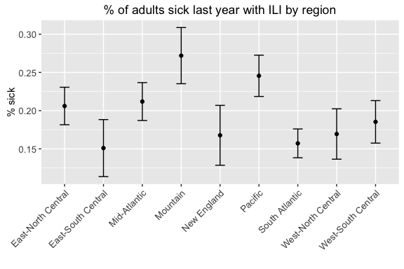<!-- -->

```r
## by state
sta <- svyby(~Q2, ~PPSTATEN, des, svymean, na.rm = T)
svychisq(~Q2 + PPSTATEN, des)
```

```
## 
## 	Pearson's X^2: Rao & Scott adjustment
## 
## data:  svychisq(~Q2 + PPSTATEN, des)
## F = 1.4, ndf = 48, ddf = 100000, p-value = 0.05
```

```r
ggplot(sta, aes(PPSTATEN, Q2Yes)) + geom_point() + xlab(" ") + ylab("% sick") + 
    ptext + coord_flip() + er + ggtitle(label = "% of adults sick last year with ILI by state")
```

<!-- -->

```r
## rent status
ren <- svyby(~Q2, ~PPRENT, des, svymean, na.rm = T)
svychisq(~Q2 + PPRENT, des)
```

```
## 
## 	Pearson's X^2: Rao & Scott adjustment
## 
## data:  svychisq(~Q2 + PPRENT, des)
## F = 2.9, ndf = 2, ddf = 4300, p-value = 0.05
```

```r
ggplot(ren, aes(PPRENT, Q2Yes)) + geom_point() + xlab(" ") + ylab("% sick") + 
    ptext + er + ggtitle(label = "% of adults sick last year with ILI by rent")
```

<!-- -->

## Q3. Has any other person in your household had an illness with influenza like symptoms since August 2015?


```r
q3 <- as.data.frame(svytable(~Q3 + ppagect4 + PPETHM + income + work + marital, 
    des, round = T))
p <- ggplot(q3, aes(Q3, weight = Freq)) + ptext
fil <- aes(fill = Q3)

p + geom_bar()
```

<!-- -->

```r
(eth <- p + peth + fil + geom_bar(position = "fill"))
```

<!-- -->

```r
(eth2 <- p + aes(fill = PPETHM) + geom_bar(position = "dodge"))
```

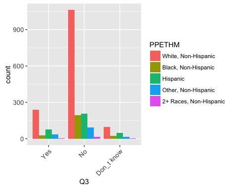<!-- -->

```r
## % sick with sick household member
svychisq(~Q2 + Q3, des)
```

```
## 
## 	Pearson's X^2: Rao & Scott adjustment
## 
## data:  svychisq(~Q2 + Q3, des)
## F = 230, ndf = 2, ddf = 4300, p-value <2e-16
```

```r
q <- svyby(~Q2, ~Q3, des, svymean, na.rm = T)
ggplot(q, aes(Q3, Q2Yes)) + geom_point() + xlab(" ") + ylab("% sick") + er + 
    ggtitle(label = "% of adults sick vs. having sick household member ")
```

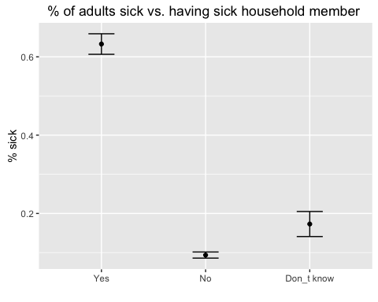<!-- -->

## Q4. Does your job require you to have a lot of contact with the public?


```r
q4 <- as.data.frame(svytable(~Q4 + Q2 + PPGENDER + ppagect4 + PPETHM + income + 
    PPEDUCAT, des, round = T))

p <- ggplot(q4, aes(Q4, weight = Freq)) + ptext
fil <- aes(fill = Q4)

all <- p + geom_bar()
gen <- p + pgen + fil + geom_bar(position = "dodge")
gen2 <- p + aes(fill = PPGENDER) + geom_bar(position = "dodge")
age <- p + page + fil + geom_bar(position = "dodge")
age2 <- p + aes(fill = ppagect4) + geom_bar(position = "dodge")
eth <- p + peth + fil + geom_bar(position = "stack")
eth2 <- p + aes(fill = PPETHM) + geom_bar(position = "fill")
inc <- p + pinc + fil + geom_bar(position = "stack")
inc2 <- p + aes(fill = income) + geom_bar(position = "dodge")
edu <- p + pedu + fil + geom_bar(position = "dodge")
edu2 <- p + aes(fill = PPEDUCAT) + geom_bar(position = "dodge")

grid.arrange(gen, age, nrow = 2)
```

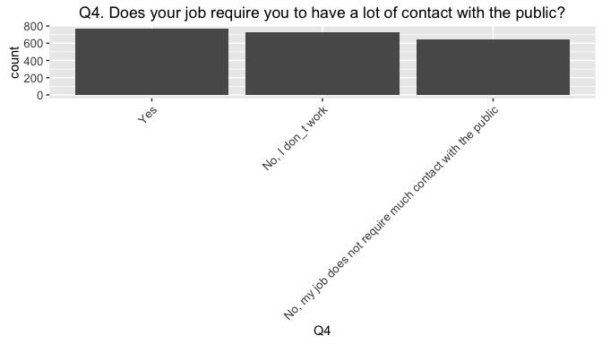<!-- -->

```r
grid.arrange(gen2, age2, nrow = 1)
```

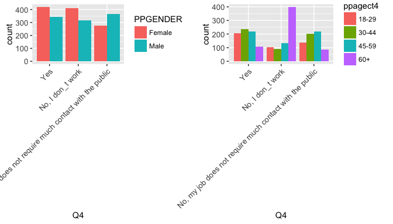<!-- -->

```r
grid.arrange(eth, eth2, nrow = 2)
```

<!-- -->

```r
grid.arrange(inc, inc2)
```

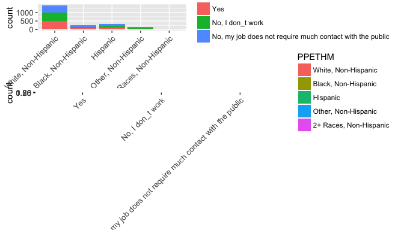<!-- -->

```r
grid.arrange(edu, edu2)
```

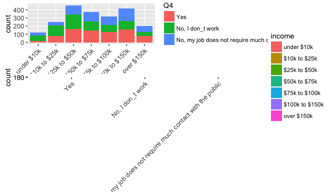<!-- -->


```r
## % sick plot
svychisq(~Q2 + Q4, des)
```

```
## 
## 	Pearson's X^2: Rao & Scott adjustment
## 
## data:  svychisq(~Q2 + Q4, des)
## F = 14, ndf = 2, ddf = 4300, p-value = 7e-07
```

```r
q <- svyby(~Q2, ~Q4, des, svymean, na.rm = T)
ggplot(q, aes(Q4, Q2Yes)) + geom_point() + xlab(" ") + ylab("% sick") + ptext + 
    er + ggtitle(label = "% of adults sick and having job with public contact ")
```

<!-- -->

```r
## look at those sick people with high-contact jobs
svytable(~Q2 + Q4, des)
```

```
##      Q4
## Q2       Yes No, I don_t work
##   Yes 203.87           125.07
##   No  569.44           604.04
##      Q4
## Q2    No, my job does not require much contact with the public
##   Yes                                                    95.43
##   No                                                    539.59
```

```r
# subset q4
psub <- ggplot(q4[q4$Q4 == "Yes", ], aes(Q4, weight = Freq)) + ptext
# being sick by gender
psub + pgen + aes(fill = Q2) + geom_bar(position = "fill") + ggtitle("People with high-contact jobs vs. being sick")
```

<!-- -->

```r
# by ethnicity
psub + peth + aes(fill = Q2) + geom_bar(position = "fill") + ggtitle("People with high-contact jobs vs. being sick")
```

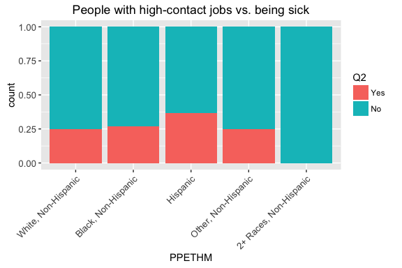<!-- -->

## Q5. Do you have a car that you can use to travel to work?


```r
q5 <- as.data.frame(svytable(~Q5 + PPGENDER + ppagect4 + PPETHM + income + PPEDUCAT, 
    des, round = T))

p <- ggplot(q5, aes(Q5, weight = Freq)) + ptext
p + geom_bar()
```

<!-- -->

## Q6. Do you regularly use public transportation?


```r
q6 <- as.data.frame(svytable(~Q6 + PPGENDER + ppagect4 + PPETHM + income + PPEDUCAT + 
    work + marital + PPMSACAT, des, round = T))

p <- ggplot(q6, aes(Q6, weight = Freq)) + ptext
fil <- aes(fill = Q6)

all <- p + geom_bar()
gen <- p + pgen + fil + geom_bar(position = "dodge")
gen2 <- p + aes(fill = PPGENDER) + geom_bar(position = "dodge")
age <- p + page + fil + geom_bar(position = "dodge")
age2 <- p + aes(fill = ppagect4) + geom_bar(position = "dodge")
eth <- p + peth + fil + geom_bar(position = "stack")
eth2 <- p + aes(fill = PPETHM) + geom_bar(position = "fill")
inc <- p + pinc + fil + geom_bar(position = "stack")
inc2 <- p + aes(fill = income) + geom_bar(position = "dodge")
met <- p + aes(PPMSACAT) + fil + geom_bar(position = "dodge")
met2 <- p + aes(fill = PPMSACAT) + geom_bar(position = "dodge")

grid.arrange(gen, age, nrow = 2)
```

<!-- -->

```r
grid.arrange(gen2, age2, nrow = 1)
```

<!-- -->

```r
grid.arrange(eth, eth2, nrow = 2)
```

<!-- -->

```r
grid.arrange(inc, inc2)
```

<!-- -->

```r
grid.arrange(met, met2)
```

<!-- -->


```r
## % sick plot
svychisq(~Q2 + Q6, des)
```

```
## 
## 	Pearson's X^2: Rao & Scott adjustment
## 
## data:  svychisq(~Q2 + Q6, des)
## F = 17, ndf = 1, ddf = 2200, p-value = 3e-05
```

```r
q <- svyby(~Q2, ~Q6, des, svymean, na.rm = T)
ggplot(q, aes(Q6, Q2Yes)) + geom_point() + xlab(" ") + ylab("% sick") + er + 
    ggtitle(label = "% of adults sick and frequent public transportation use")
```

<!-- -->

## Q7. What types of public transportation do you regularly use?


```r
# subset question data
q7df <- df %>% select(CaseID, PPGENDER, ppagect4, PPETHM, income, PPEDUCAT, 
    work, marital, ppreg9, PPMSACAT, Q2, Q7_1:Q7_7, weight) %>% gather(Q7_q, 
    Q7_r, Q7_1:Q7_7, na.rm = T) %>% group_by(Q7_q, Q7_r)

# new survey design
des7 <- svydesign(ids = ~1, weights = ~weight, data = q7df[is.na(q7df$weight) == 
    F, ])

# weighted data frame
q7 <- data.frame(svytable(~Q7_q + Q7_r + PPGENDER + ppagect4 + PPETHM + income + 
    PPEDUCAT + work + ppreg9 + PPMSACAT, des7, round = T))

# plot
p <- ggplot(q7[(q7$Q7_r) == "Yes", ], aes(Q7_q, weight = Freq)) + ptext
fil <- aes(fill = Q7_q)

p + geom_bar()
```

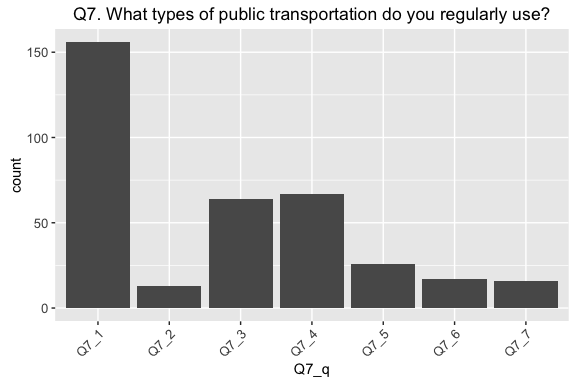<!-- -->

```r
p + aes(fill = PPGENDER) + geom_bar(position = "dodge")
```

<!-- -->

```r
p + page + fil + geom_bar(position = "dodge")
```

<!-- -->

```r
p + aes(fill = ppagect4) + geom_bar(position = "stack")
```

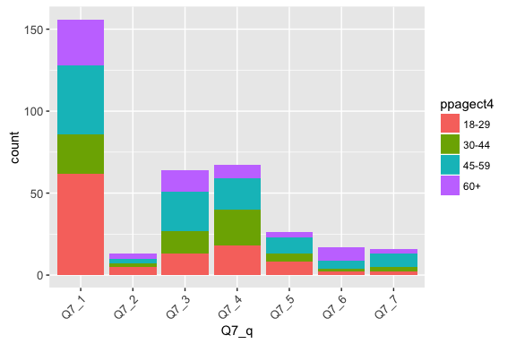<!-- -->

```r
p + peth + fil + geom_bar(position = "stack")
```

<!-- -->

```r
p + aes(fill = PPETHM) + geom_bar(position = "fill")
```

<!-- -->

```r
p + pinc + fil + geom_bar(position = "stack")
```

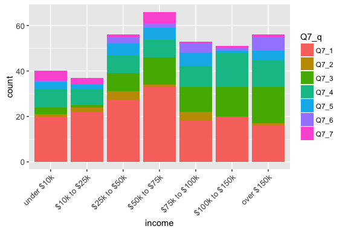<!-- -->

```r
p + aes(fill = income) + geom_bar(position = "dodge")
```

<!-- -->

```r
p + aes(PPMSACAT) + fil + geom_bar(position = "fill")
```

<!-- -->

```r
p + aes(fill = PPMSACAT) + geom_bar(position = "stack")
```

<!-- -->

```r
p + aes(fill = Q7_q) + geom_bar(position = "dodge") + facet_wrap(~ppreg9)
```

<!-- -->

## Q8. For what types of activities do you regularly use public transportation?


```r
# subset question data
q8df <- df %>% select(CaseID, PPGENDER, ppagect4, PPETHM, income, PPEDUCAT, 
    work, marital, ppreg9, PPMSACAT, Q2, Q8_1:Q8_6, weight) %>% gather(Q8_q, 
    Q8_r, Q8_1:Q8_6, na.rm = T) %>% group_by(Q8_q, Q8_r)

# new survey design
des8 <- svydesign(ids = ~1, weights = ~weight, data = q8df[is.na(q8df$weight) == 
    F, ])

# weighted data frame
q8 <- data.frame(svytable(~Q8_q + Q8_r + PPGENDER + ppagect4 + PPETHM + income + 
    PPEDUCAT + work + ppreg9 + PPMSACAT, des8, round = T))

# plot
p <- ggplot(q8[(q8$Q8_r) == "Yes", ], aes(Q8_q, weight = Freq)) + ptext
fil <- aes(fill = Q8_q)
# gender
p + geom_bar()
```

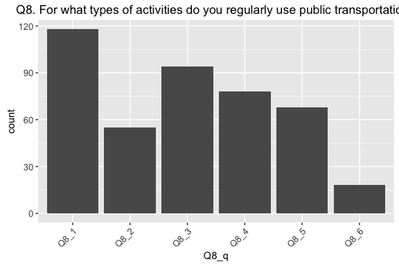<!-- -->

```r
p + aes(fill = PPGENDER) + geom_bar(position = "dodge")
```

<!-- -->

```r
# age
p + page + fil + geom_bar(position = "dodge")
```

<!-- -->

```r
p + aes(fill = ppagect4) + geom_bar(position = "stack")
```

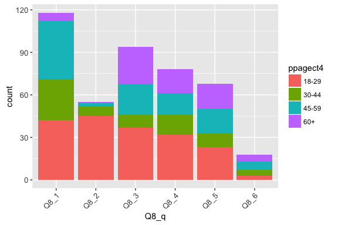<!-- -->

```r
# race
p + peth + fil + geom_bar(position = "stack")
```

<!-- -->

```r
p + aes(fill = PPETHM) + geom_bar(position = "fill")
```

<!-- -->

```r
# income
p + pinc + fil + geom_bar(position = "stack")
```

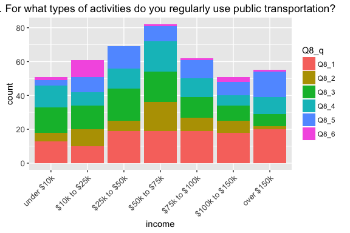<!-- -->

```r
p + aes(fill = income) + geom_bar(position = "dodge")
```

<!-- -->

```r
# metro location
p + aes(PPMSACAT) + fil + geom_bar(position = "fill")
```

<!-- -->

```r
p + aes(fill = PPMSACAT) + geom_bar(position = "stack")
```

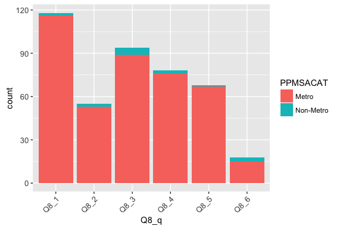<!-- -->

```r
# region
p + fil + geom_bar(position = "dodge") + facet_wrap(~ppreg9)
```

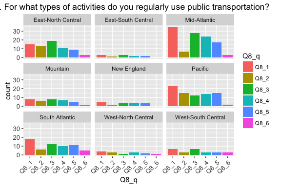<!-- -->

## Q9. Do other members of your household regularly use public transportation?


```r
q9 <- data.frame(svytable(~Q9 + PPETHM + income + PPMSACAT, des, round = T))

p <- ggplot(q9, aes(Q9, weight = Freq)) + ptext
p + geom_bar()
```

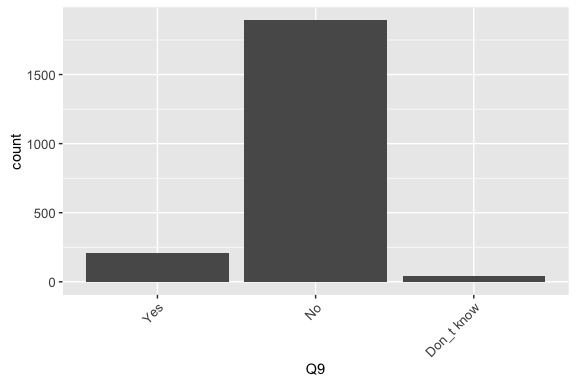<!-- -->

```r
# chisquare
svychisq(~Q15 + Q3, des)
```

```
## 
## 	Pearson's X^2: Rao & Scott adjustment
## 
## data:  svychisq(~Q15 + Q3, des)
## F = 3.2, ndf = 3.9, ddf = 8600.0, p-value = 0.01
```

## Q10. What types of public transportation do other members of your household regularly use?


```r
# subset question data
q10df <- df %>% select(CaseID, PPGENDER, ppagect4, PPETHM, income, PPEDUCAT, 
    work, marital, ppreg9, PPMSACAT, Q2, Q10_1:Q10_8, weight) %>% gather(Q10_q, 
    Q10_r, Q10_1:Q10_8, na.rm = T) %>% group_by(Q10_q, Q10_r)

# new survey design
des10 <- svydesign(ids = ~1, weights = ~weight, data = q10df[is.na(q10df$weight) == 
    F, ])

# weighted data frame
q10 <- data.frame(svytable(~Q10_q + Q10_r + PPGENDER + ppagect4 + PPETHM + income + 
    PPEDUCAT + work + ppreg9 + PPMSACAT, des10, round = T))

# plot
p <- ggplot(q10[(q10$Q10_r) == "Yes", ], aes(Q10_q, weight = Freq)) + ptext
fil <- aes(fill = Q10_q)
# gender
p + geom_bar()
```

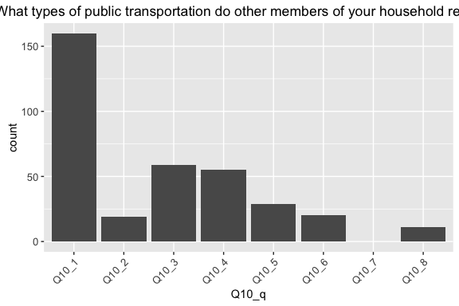<!-- -->

```r
p + aes(fill = PPGENDER) + geom_bar(position = "dodge")
```

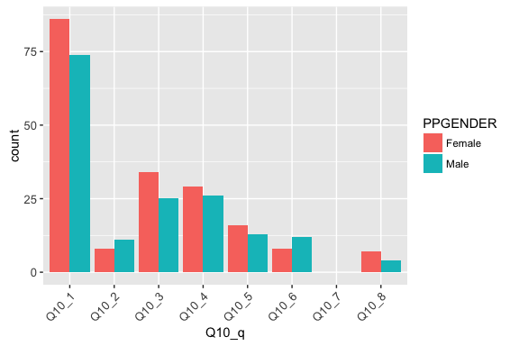<!-- -->

```r
# age
p + page + fil + geom_bar(position = "dodge")
```

<!-- -->

```r
p + aes(fill = ppagect4) + geom_bar(position = "stack")
```

<!-- -->

```r
# race
p + peth + fil + geom_bar(position = "stack")
```

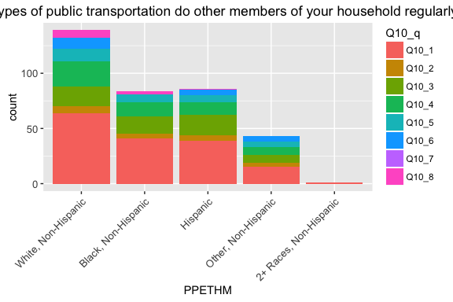<!-- -->

```r
p + aes(fill = PPETHM) + geom_bar(position = "fill")
```

<!-- -->

```r
# income
p + pinc + fil + geom_bar(position = "stack")
```

<!-- -->

```r
p + aes(fill = income) + geom_bar(position = "dodge")
```

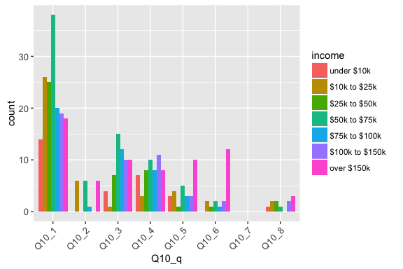<!-- -->

```r
# metro location
p + aes(PPMSACAT) + fil + geom_bar(position = "fill")
```

<!-- -->

```r
p + aes(fill = PPMSACAT) + geom_bar(position = "stack")
```

<!-- -->

```r
# region
p + fil + geom_bar(position = "dodge") + facet_wrap(~ppreg9)
```

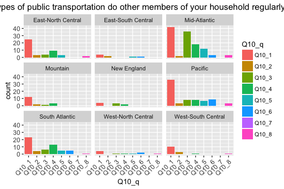<!-- -->

