# Analysis summary part 2


```r
## Create survey object.
options(digits = 4)
options(survey.lonely.psu = "adjust")

# subset data?
des <- svydesign(ids = ~1, weights = ~weight, data = df[is.na(df$weight) == 
    F, ])
```


## Q11. How do you rate your risk of getting influenza if you visited each of the following locations?


## Q12. Which of the following actions do you take to avoid getting sick?


## Q13. Do you get the flu vaccine?


```r
q13 <- as.data.frame(svytable(~Q13 + PPGENDER + ppagect4 + PPETHM + income + 
    PPEDUCAT + work + marital, des, round = T))

p <- ggplot(q13, aes(Q13, weight = Freq)) + ptext
fil <- aes(fill = Q13)

p + geom_bar()
```

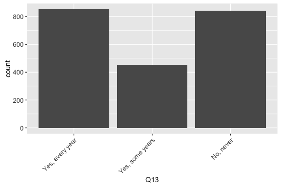<!-- -->

```r
gen <- p + pgen + fil + geom_bar(position = "dodge")
age <- p + page + fil + geom_bar(position = "dodge")
eth <- p + peth + fil + geom_bar(position = "dodge") + coord_flip()
inc <- p + pinc + fil + geom_bar(position = "dodge")
edu <- p + pedu + fil + geom_bar(position = "dodge")
wor <- p + pwor + fil + geom_bar(position = "dodge")
mar <- p + pmar + fil + geom_bar(position = "dodge")

grid.arrange(gen, age, eth)
```

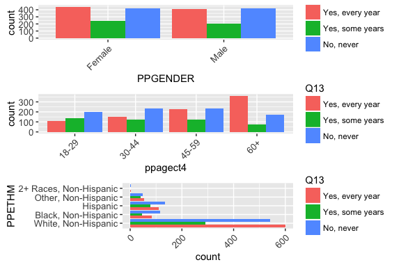<!-- -->

```r
grid.arrange(inc, edu, wor, mar)
```

<!-- -->

```r
## sick plot
svychisq(~Q2 + Q13, des)
```

```
## 
## 	Pearson's X^2: Rao & Scott adjustment
## 
## data:  svychisq(~Q2 + Q13, des)
## F = 5.9, ndf = 2, ddf = 4300, p-value = 0.003
```

```r
q <- svyby(~Q2, ~Q13, des, svymean, na.rm = T)
ggplot(q, aes(Q13, Q2Yes)) + geom_point() + xlab(" ") + ylab("% sick") + er + 
    ggtitle(label = "% of adults sick and getting flu vaccine")
```

<!-- -->

```r
# chisquare for getting flu vaccine and sick household member
svychisq(~Q15 + Q3, des)
```

```
## 
## 	Pearson's X^2: Rao & Scott adjustment
## 
## data:  svychisq(~Q15 + Q3, des)
## F = 3.2, ndf = 3.9, ddf = 8600.0, p-value = 0.01
```

## Q14. How much do you pay to get an influenza vaccine?


```r
q14 <- as.data.frame(svytable(~Q14 + PPGENDER + ppagect4 + PPETHM + income + 
    PPEDUCAT + work + marital, des, round = T))

p <- ggplot(q14, aes(Q14, weight = Freq)) + ptext
fil <- aes(fill = Q14)

p + geom_bar()
```

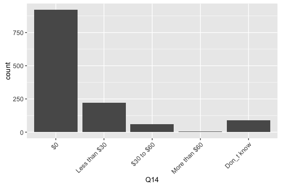<!-- -->

```r
gen <- p + pgen + fil + geom_bar(position = "dodge")
age <- p + page + fil + geom_bar(position = "dodge")
eth <- p + peth + fil + geom_bar(position = "dodge") + coord_flip()
inc <- p + pinc + fil + geom_bar(position = "dodge")
edu <- p + pedu + fil + geom_bar(position = "dodge")
wor <- p + pwor + fil + geom_bar(position = "dodge")
mar <- p + pmar + fil + geom_bar(position = "dodge")

grid.arrange(gen, age, eth)
```

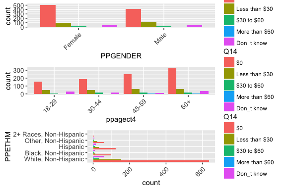<!-- -->

```r
grid.arrange(inc, edu, wor, mar)
```

<!-- -->

## Q15. Are you more likely to get a vaccine if others around you get a vaccine?


```r
# chisquare
svychisq(~Q15 + Q2, des)
```

```
## 
## 	Pearson's X^2: Rao & Scott adjustment
## 
## data:  svychisq(~Q15 + Q2, des)
## F = 2.6, ndf = 2, ddf = 4300, p-value = 0.07
```

```r
q15 <- as.data.frame(svytable(~Q15 + PPGENDER + ppagect4 + PPETHM + income + 
    PPEDUCAT + work + marital, des, round = T))

p <- ggplot(q15, aes(Q15, weight = Freq)) + ptext
fil <- aes(fill = Q15)

p + geom_bar()
```

<!-- -->

```r
gen <- p + pgen + fil + geom_bar(position = "dodge")
age <- p + page + fil + geom_bar(position = "dodge")
eth <- p + peth + fil + geom_bar(position = "dodge") + coord_flip()
inc <- p + pinc + fil + geom_bar(position = "dodge")
edu <- p + pedu + fil + geom_bar(position = "dodge")
wor <- p + pwor + fil + geom_bar(position = "dodge")
mar <- p + pmar + fil + geom_bar(position = "dodge")

grid.arrange(gen, age, eth)
```

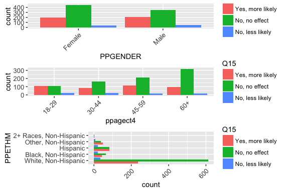<!-- -->

```r
grid.arrange(inc, edu, wor, mar)
```

<!-- -->

## Q16. Are you more likely to get a vaccine if others around you do not get a vaccine?


```r
# chisquare
svychisq(~Q16 + Q2, des)
```

```
## 
## 	Pearson's X^2: Rao & Scott adjustment
## 
## data:  svychisq(~Q16 + Q2, des)
## F = 4.8, ndf = 2, ddf = 4300, p-value = 0.008
```

```r
q16 <- as.data.frame(svytable(~Q16 + PPGENDER + ppagect4 + PPETHM + income + 
    PPEDUCAT + work + marital, des, round = T))

p <- ggplot(q16, aes(Q16, weight = Freq)) + ptext
fil <- aes(fill = Q16)

p + geom_bar()
```

<!-- -->

```r
gen <- p + pgen + fil + geom_bar(position = "dodge")
age <- p + page + fil + geom_bar(position = "dodge")
eth <- p + peth + fil + geom_bar(position = "dodge") + coord_flip()
inc <- p + pinc + fil + geom_bar(position = "dodge")
edu <- p + pedu + fil + geom_bar(position = "dodge")
wor <- p + pwor + fil + geom_bar(position = "dodge")
mar <- p + pmar + fil + geom_bar(position = "dodge")

grid.arrange(gen, age, eth)
```

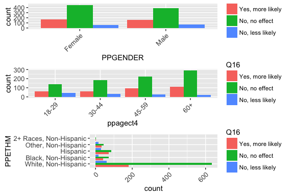<!-- -->

```r
grid.arrange(inc, edu, wor, mar)
```

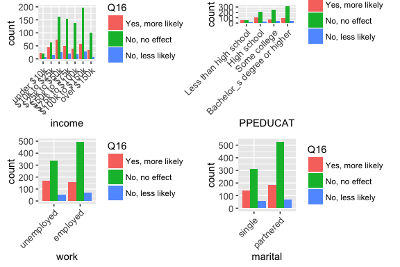<!-- -->

## Q17. Do you get a vaccine to protect yourself, protect others, or protect yourself and others?


```r
q17 <- as.data.frame(svytable(~Q17 + PPGENDER + ppagect4 + PPETHM + income + 
    PPEDUCAT + work + marital, des, round = T))

p <- ggplot(q17, aes(Q17, weight = Freq)) + ptext
fil <- aes(fill = Q17)

p + geom_bar()
```

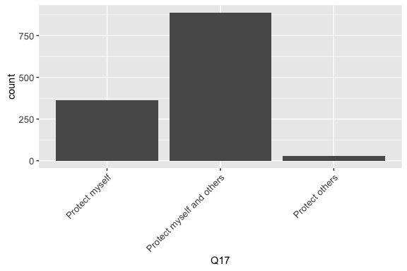<!-- -->

```r
gen <- p + pgen + fil + geom_bar(position = "dodge")
age <- p + page + fil + geom_bar(position = "dodge")
eth <- p + peth + fil + geom_bar(position = "dodge") + coord_flip()
inc <- p + pinc + fil + geom_bar(position = "dodge")
edu <- p + pedu + fil + geom_bar(position = "dodge")
wor <- p + pwor + fil + geom_bar(position = "dodge")
mar <- p + pmar + fil + geom_bar(position = "dodge")

grid.arrange(gen, age, eth)
```

<!-- -->

```r
grid.arrange(inc, edu, wor, mar)
```

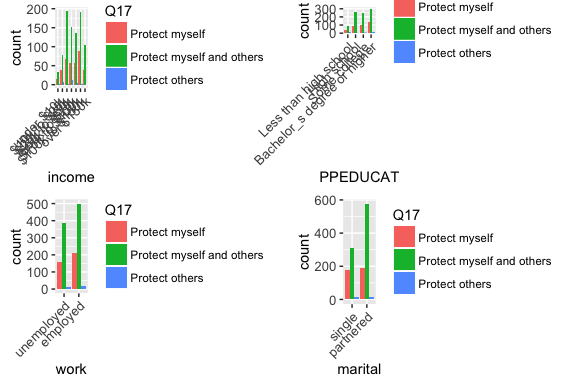<!-- -->

## Q18. What are the reasons you would not get an influenza vaccine?


## Q19. Do you have health insurance?


```r
# chisquare
svychisq(~Q19 + Q2, des)
```

```
## 
## 	Pearson's X^2: Rao & Scott adjustment
## 
## data:  svychisq(~Q19 + Q2, des)
## F = 0.16, ndf = 1, ddf = 2200, p-value = 0.7
```

```r
q19 <- as.data.frame(svytable(~Q19 + PPGENDER + ppagect4 + PPETHM + income + 
    PPEDUCAT + work + marital, des, round = T))

p <- ggplot(q19, aes(Q19, weight = Freq)) + ptext
fil <- aes(fill = Q19)

p + geom_bar()
```

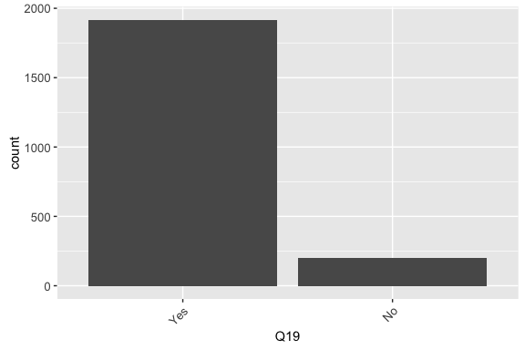<!-- -->

```r
gen <- p + pgen + fil + geom_bar(position = "dodge")
age <- p + page + fil + geom_bar(position = "dodge")
eth <- p + peth + fil + geom_bar(position = "dodge") + coord_flip()
inc <- p + pinc + fil + geom_bar(position = "dodge")
edu <- p + pedu + fil + geom_bar(position = "dodge")
wor <- p + pwor + fil + geom_bar(position = "dodge")
mar <- p + pmar + fil + geom_bar(position = "dodge")

grid.arrange(gen, age, eth)
```

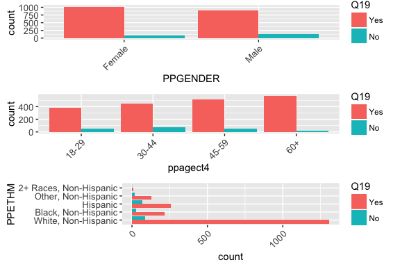<!-- -->

```r
grid.arrange(inc, edu, wor, mar)
```

<!-- -->

```r
## sick plot
q <- svyby(~Q2, ~Q19, des, svymean, na.rm = T)
ggplot(q, aes(Q19, Q2Yes)) + geom_point() + xlab(" ") + ylab("% sick") + er + 
    ggtitle(label = "% of adults sick and having health insurance ")
```

<!-- -->

## Q20. How effective do you think the influenza vaccine is in protecting people from becoming sick with influenza?


```r
q20 <- as.data.frame(svytable(~Q20 + PPGENDER + ppagect4 + PPETHM + income + 
    PPEDUCAT + work + marital, des, round = T))

p <- ggplot(q20, aes(Q20, weight = Freq)) + ptext
fil <- aes(fill = Q20)

p + geom_bar()
```

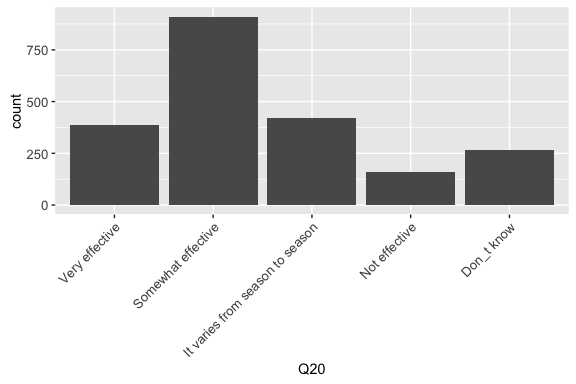<!-- -->

```r
gen <- p + pgen + fil + geom_bar(position = "dodge")
age <- p + page + fil + geom_bar(position = "dodge")
eth <- p + peth + fil + geom_bar(position = "dodge") + coord_flip()
inc <- p + pinc + fil + geom_bar(position = "dodge")
edu <- p + pedu + fil + geom_bar(position = "dodge")
wor <- p + pwor + fil + geom_bar(position = "dodge")
mar <- p + pmar + fil + geom_bar(position = "dodge")

grid.arrange(gen, age, eth)
```

<!-- -->

```r
grid.arrange(inc, edu, wor, mar)
```

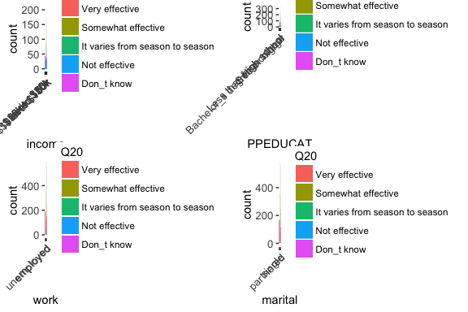<!-- -->

```r
## sick plot
svychisq(~Q2 + Q20, des)
```

```
## 
## 	Pearson's X^2: Rao & Scott adjustment
## 
## data:  svychisq(~Q2 + Q20, des)
## F = 4.4, ndf = 4, ddf = 8600, p-value = 0.002
```

```r
q <- svyby(~Q2, ~Q20, des, svymean, na.rm = T)
ggplot(q, aes(Q20, Q2Yes)) + geom_point() + xlab(" ") + ylab("% sick") + ptext + 
    er + ggtitle(label = "% of adults sick vs. perception of flu vaccine efficacy")
```

<!-- -->

