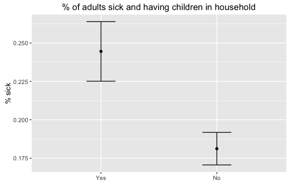
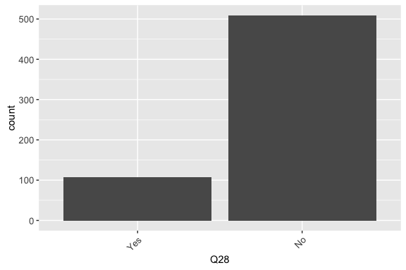

# Analysis summary part 3


```r
## Create survey object.
options(digits = 4)
options(survey.lonely.psu = "adjust")

# subset data?
des <- svydesign(ids = ~1, weights = ~weight, data = df[is.na(df$weight) == 
    F, ])
```


## Q21. Are influenza vaccines covered by your health insurance?


```r
q21 <- as.data.frame(svytable(~Q21 + PPGENDER + ppagect4 + PPETHM + income + 
    PPEDUCAT + work + marital, des, round = T))

p <- ggplot(q21, aes(Q21, weight = Freq)) + ptext
p + geom_bar()
```

<!-- -->

### Q22. Do you do any of the following when you have influenza symptoms?


### Q23. Which of the following actions do you take when you have influenza symptoms to avoid someone else from getting sick?


### Q24. What sources of information do you recall hearing or seeing about influenza outbreaks?


### Q25. If you received information from the news, internet or other public media that there was an influenza outbreak in your community would you do any of the following?


## Q26. Does your household have children?


```r
q26 <- as.data.frame(svytable(~Q26 + PPGENDER + ppagect4 + PPETHM + income + 
    PPEDUCAT + work + marital, des, round = T))

p <- ggplot(q26, aes(Q26, weight = Freq)) + ptext
p + geom_bar()
```

<!-- -->

```r
## plot means
svychisq(~Q2 + Q26, des)
```

```
## 
## 	Pearson's X^2: Rao & Scott adjustment
## 
## data:  svychisq(~Q2 + Q26, des)
## F = 9, ndf = 1, ddf = 2200, p-value = 0.003
```

```r
q <- svyby(~Q2, ~Q26, des, svymean, na.rm = T)
ggplot(q, aes(Q26, Q2Yes)) + geom_point() + xlab(" ") + ylab("% sick") + er + 
    ggtitle(label = "% of adults sick and having children in household")
```

<!-- -->

### Q27. What actions do you take when a child in your household has influenza symptoms?


## Q28. Are you a single parent?


```r
q28 <- as.data.frame(svytable(~Q28 + PPGENDER + ppagect4 + PPETHM + income + 
    PPEDUCAT + work + marital, des, round = T))

p <- ggplot(q28, aes(Q28, weight = Freq)) + ptext
p + geom_bar()
```

<!-- -->

```r
## plot means
svychisq(~Q2 + Q28, des)
```

```
## 
## 	Pearson's X^2: Rao & Scott adjustment
## 
## data:  svychisq(~Q2 + Q28, des)
## F = 2.6, ndf = 1, ddf = 2200, p-value = 0.1
```

```r
q <- svyby(~Q2, ~Q28, des, svymean, na.rm = T)
ggplot(q, aes(Q28, Q2Yes)) + geom_point() + xlab(" ") + ylab("% sick") + er + 
    ggtitle(label = "% of adults sick and being single parent")
```

<!-- -->

### Q29. How do you care for a sick child? (married parent)


### Q30. How do you care for a sick child? (single parent)


### Q31. How many hours of screen time (time spent watching television, a computer, smartphone, iPad, etc.) do you spend each day on average when you are not sick? Enter 0 if none


```r
# histogram
```

### Q32. How many hours of screen time do you spend each day on average when you are sick? Enter 0 if none


```r
# histogram
```

### Q33. How many people, including yourself, reside in your household?


```r
# histogram
```

