# Q12


```r
## Create survey object.
options(digits = 4)
options(survey.lonely.psu = "adjust")

des <- svydesign(ids = ~1, weights = ~weight, data = df[is.na(df$weight)==F, ])
```


## Q12. Which of the following actions do you take to avoid getting sick?


```r
# subset question data, rename columns, gather into single column
q12_df <- df %>%
  select(CaseID, PPGENDER, PPAGE, ppagecat, ppagect4, PPETHM, PPINCIMP, PPEDUC, PPEDUCAT,
         work, PPWORK, marital, PPMARIT, PPMSACAT, ppreg9, PPSTATEN, PPHOUSE, PPRENT, PPNET, Q12_1:Q12_15, weight) %>%
    rename("Q12_1_Avoid.touching.my.eyes" = Q12_1,
         "Q12_2_Avoid.touching.my.nose" = Q12_2,
         "Q12_3_Avoid.touching.my.mouth" =	Q12_3,
         "Q12_4_Wash.my.hands.with.soap.more.often"= Q12_4,
         "Q12_5_Use.hand.sanitizers" = Q12_5,
         "Q12_6_Clean.the.surfaces.in.my.home" =	Q12_6,
         "Q12_7_Clean.the.surfaces.at.work" = Q12_7,
         "Q12_8_Eat.nutritious.food" = Q12_8,
         "Q12_9_Get.adequate.rest" = Q12_9,
         "Q12_10_Get.recommended.vaccine" =	Q12_10,
         "Q12_11_Take.preventive.medicine" = Q12_11,
         "Q12_12_Cover.my.nose.and.mouth.with.a.surgical.mask" = Q12_12,
         "Q12_13_Avoid.contact.with.people.who.are.sick" = Q12_13,
         "Q12_14_Avoid.crowded.places" = Q12_14,
         "Q12_15_Other" = Q12_15) %>%
  gather(Q12_q, Q12_r, Q12_1_Avoid.touching.my.eyes:Q12_15_Other, na.rm = T) %>%
  mutate(Q12_r = factor(Q12_r, levels = c("Always", "Sometimes", "Never")))

# relevel
label = c("Q12_1_Avoid.touching.my.eyes", 
         "Q12_2_Avoid.touching.my.nose", 
         "Q12_3_Avoid.touching.my.mouth", 
         "Q12_4_Wash.my.hands.with.soap.more.often",
         "Q12_5_Use.hand.sanitizers",
         "Q12_6_Clean.the.surfaces.in.my.home",
         "Q12_7_Clean.the.surfaces.at.work",
         "Q12_8_Eat.nutritious.food",
         "Q12_9_Get.adequate.rest",
         "Q12_10_Get.recommended.vaccine",
         "Q12_11_Take.preventive.medicine",
         "Q12_12_Cover.my.nose.and.mouth.with.a.surgical.mask",
         "Q12_13_Avoid.contact.with.people.who.are.sick",
         "Q12_14_Avoid.crowded.places",
         "Q12_15_Other")

q12_df <- q12_df %>%
    mutate(Q12_q = factor(Q12_q, levels = label))

# survey design
options(digits = 4)
options(survey.lonely.psu = "adjust")
des12 <- svydesign(ids = ~1, weights = ~weight, data = q12_df[is.na(q12_df$weight)==F, ])
```


```r
# weighted data frame
q12 <- data.frame(svytable(~Q12_q + Q12_r + PPGENDER + ppagecat + ppagect4 + PPETHM + PPINCIMP, des12, round = T))

# plot templates
title <- ggtitle("Which of the following actions do you take to avoid getting sick?")
# descending order of labels
plabel <- scale_x_discrete(limits = rev(levels(q12$Q12_q)))

## main plot
p <- ggplot(q12, aes(Q12_q, weight = Freq)) + plabel + ptext
p + geom_bar(position = "fill") + aes(fill = Q12_r) + title + coord_flip()
```

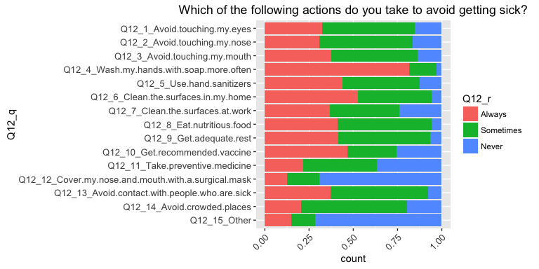<!-- -->

### Gender

```r
# p2
p2 <- ggplot(q12, aes(Q12_q, weight = Freq)) + ptext

# gender
p2 + geom_bar(position = "fill") + aes(Q12_q, fill = PPGENDER) + facet_wrap(~Q12_r) + ggtitle("By gender") + coord_flip() + plabel
```

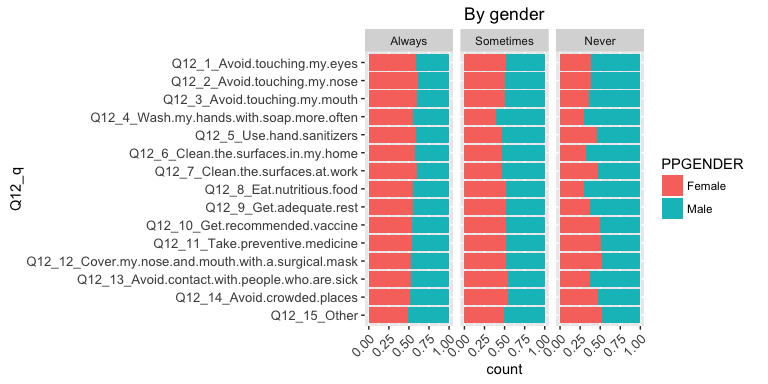<!-- -->

```r
p2 + geom_bar(position = "dodge") + aes(Q12_q, fill = PPGENDER) + facet_wrap(~Q12_r) + ggtitle("By gender") + coord_flip() + plabel
```

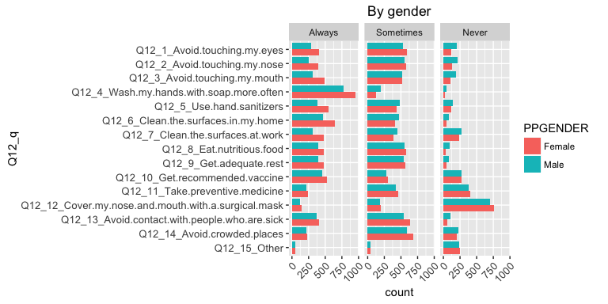<!-- -->

```r
p2 + geom_bar(position = "fill") + aes(PPGENDER, fill = Q12_r) + facet_wrap(~Q12_q) + coord_flip()
```

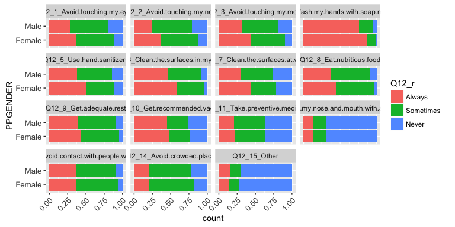<!-- -->

### Age group

```r
# by age group
p2 + geom_bar(position = "fill") + aes(Q12_q, fill = ppagect4) + facet_wrap(~Q12_r) + ggtitle("By age group") + plabel + coord_flip()
```

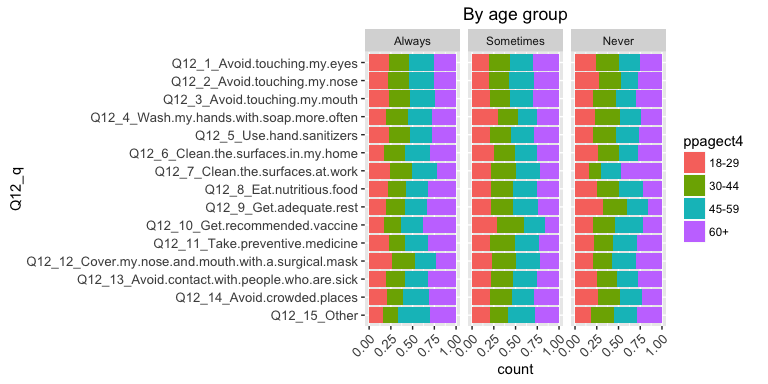<!-- -->


```r
p2 + geom_bar(position = "fill") + aes(Q12_q, fill = ppagect4) + facet_grid(Q12_r ~ .) + coord_flip() + plabel
```

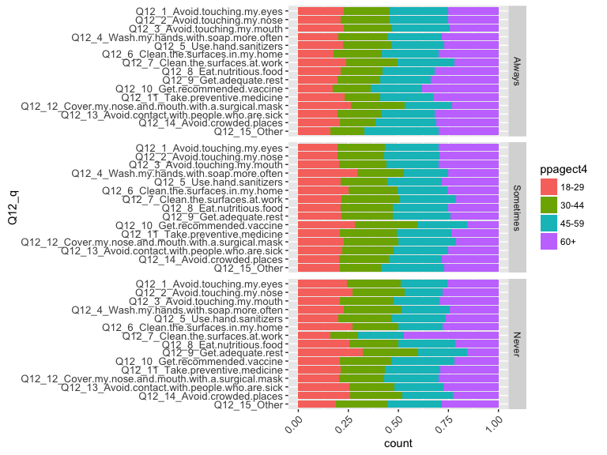<!-- -->

```r
p2 + geom_bar(position = "fill") + aes(ppagecat, fill = Q12_r) + facet_wrap(~Q12_q) 
```

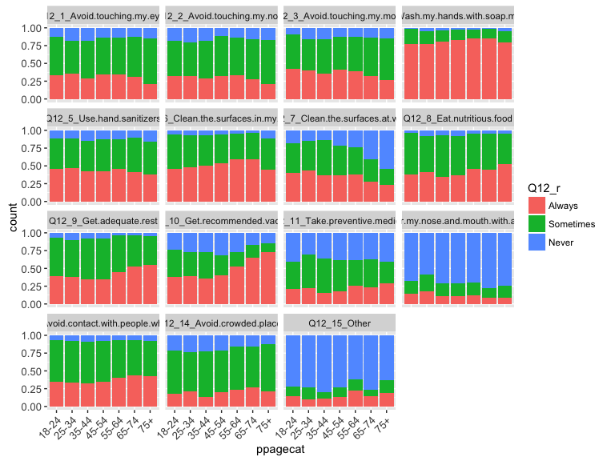<!-- -->

### Ethnicity

```r
# by ethnic group
p2 + geom_bar(position = "fill") + aes(Q12_q, fill = PPETHM) + facet_wrap(~Q12_r) + ggtitle("By ethnic group") + plabel + coord_flip()
```

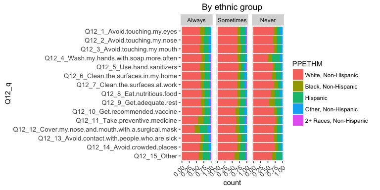<!-- -->


```r
p2 + geom_bar(position = "fill") + aes(Q12_q, fill = PPETHM) + facet_grid(Q12_r ~ .) + coord_flip() + plabel
```

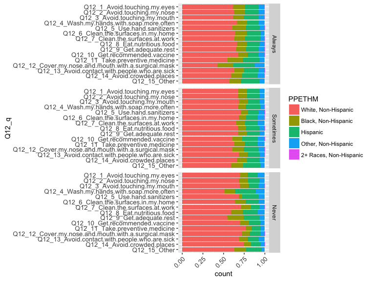<!-- -->

```r
p2 + geom_bar(position = "fill") + aes(PPETHM, fill = Q12_r) + facet_wrap(~Q12_q) 
```

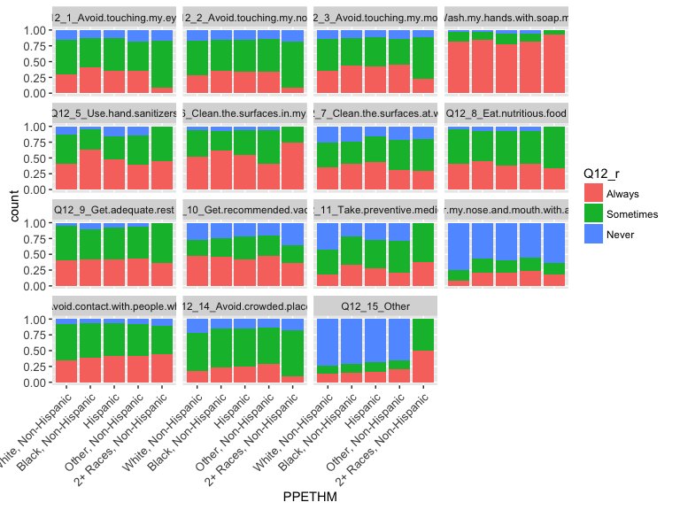<!-- -->

### Income

```r
# by income group
p2 + geom_bar(position = "fill") + aes(Q12_q, fill = PPINCIMP) + facet_wrap(~Q12_r) + ggtitle("By income group") + plabel + coord_flip() + ptext3
```

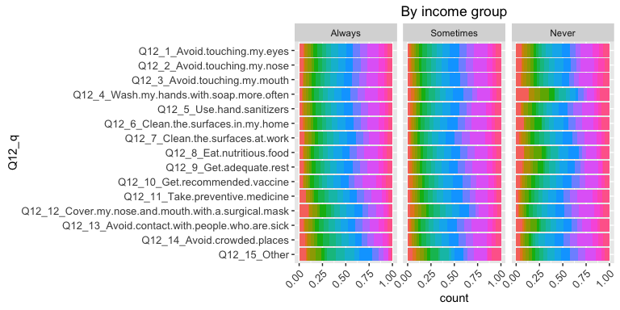<!-- -->


```r
p2 + geom_bar(position = "fill") + aes(Q12_q, fill = PPINCIMP) + facet_grid(Q12_r ~ .) + coord_flip() + plabel + ptext3
```

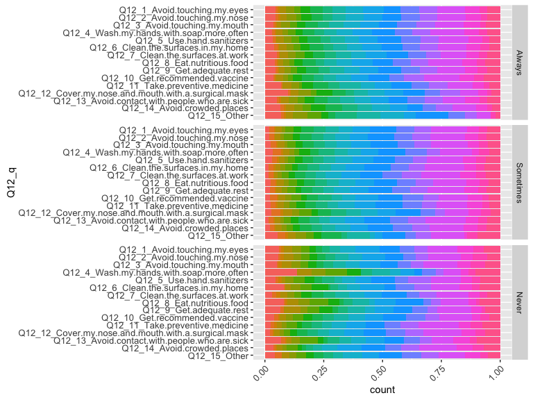<!-- -->

```r
p2 + geom_bar(position = "fill") + aes(PPINCIMP, fill = Q12_r) + facet_wrap(~Q12_q) + ptext2
```

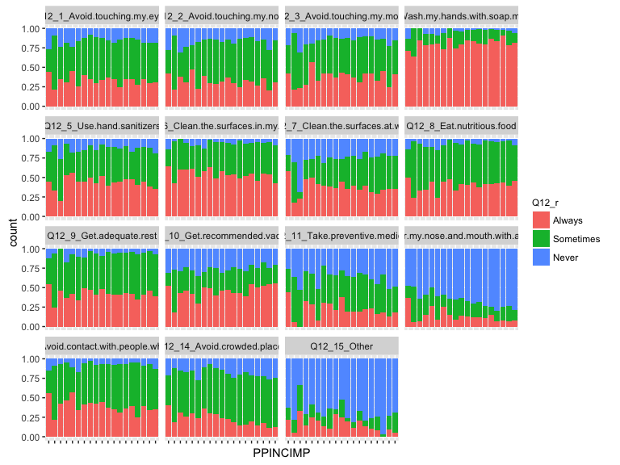<!-- -->


```r
# update weighted data frame
q12.2 <- data.frame(svytable(~Q12_q + Q12_r + PPEDUC + PPEDUCAT + work + PPWORK + marital + PPMARIT, des12, round = T))

# restate plots
p3 <- ggplot(q12.2, aes(Q12_q, weight = Freq)) + ptext

# descending order of labels
plabel <- scale_x_discrete(limits = rev(levels(q12.2$Q12_q)))
```

### Education

```r
# by education
p3 + geom_bar(position = "fill") + aes(Q12_q, fill = PPEDUCAT) + facet_wrap(~Q12_r) + ggtitle("By education") + plabel + coord_flip()
```

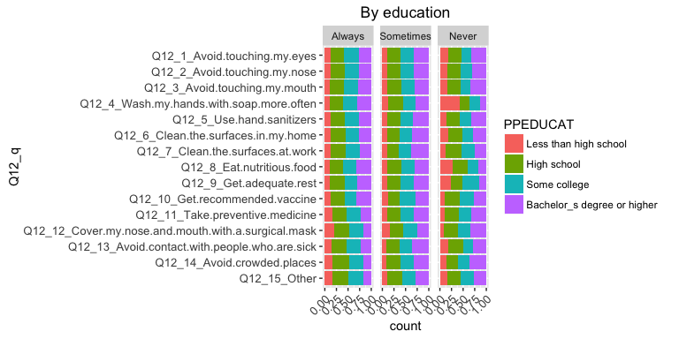<!-- -->


```r
p3 + geom_bar(position = "fill") + aes(Q12_q, fill = PPEDUCAT) + facet_grid(Q12_r ~ .) + coord_flip() + plabel #+ ptext3
```

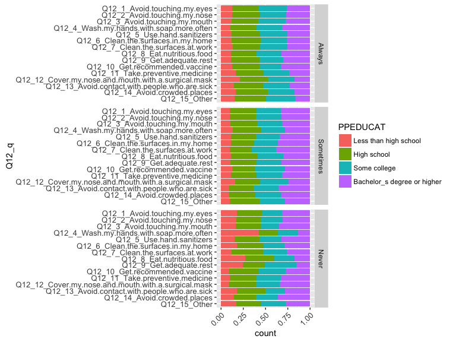<!-- -->

```r
p3 + geom_bar(position = "fill") + aes(PPEDUCAT, fill = Q12_r) + facet_wrap(~Q12_q) + ptext2 + ggtitle("By education")
```

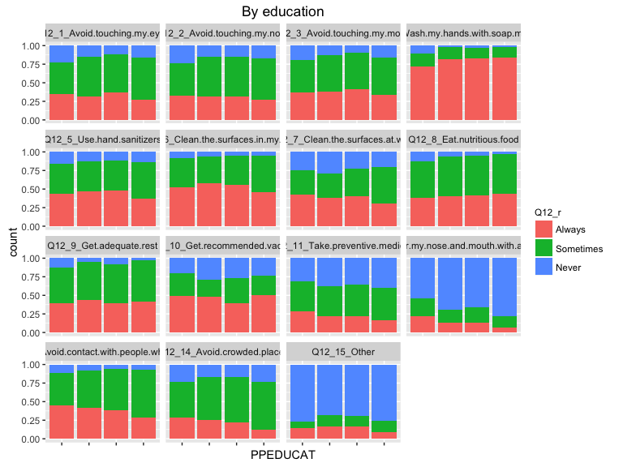<!-- -->


