# Q22-23

Questions 22, 23


```r
## Create survey object.
options(digits = 4)
options(survey.lonely.psu = "adjust")

des <- svydesign(ids = ~1, weights = ~weight, data = df[is.na(df$weight)==F, ])
```


## Q22. Do you do any of the following when you have influenza symptoms?


```r
# subset question data, rename columns, gather into single column
q22_df <- df %>%
  select(CaseID, PPGENDER, PPAGE, ppagecat, ppagect4, PPETHM, PPINCIMP, PPEDUC, PPEDUCAT,
         work, PPWORK, marital, PPMARIT, PPMSACAT, ppreg9, PPSTATEN, PPHOUSE, PPRENT, PPNET, Q22_1:Q22_9, weight) %>%
  rename("Q22_1_Go.to.a.doctor_s.office.or.medical.clinic" = Q22_1,
         "Q22_2_Decide.on.treatment.without.consulting.a.health.practitioner" = Q22_2,
         "Q22_3_Search.the.internet.for.a.treatment" = Q22_3,
         "Q22_4_Get.adequate.sleep" = Q22_4,
         "Q22_5_Eat.nutritious.food" = Q22_5,
         "Q22_6_Take-over-counter.medication.for.symptoms" = Q22_6,
         "Q22_7_Take.an.antiviral.medicine" = Q22_7,
         "Q22_8_Take.no.action.to.treat.the.illness" = Q22_8,
         "Q22_9_Other" = Q22_9) %>%
  gather(Q22_q, Q22_r, Q22_1_Go.to.a.doctor_s.office.or.medical.clinic:Q22_8_Take.no.action.to.treat.the.illness,
         na.rm = T) %>%
  mutate(Q22_q = as.factor(Q22_q))%>%
  mutate(Q22_r = factor(Q22_r, levels = c("Always", "Sometimes", "Never")))


# survey design
options(digits = 4)
options(survey.lonely.psu = "adjust")
des22 <- svydesign(ids = ~1, weights = ~weight, data = q22_df[is.na(q22_df$weight)==F, ])
```


```r
# weighted data frame
q22 <- data.frame(svytable(~Q22_q + Q22_r + PPGENDER + ppagecat + ppagect4 + PPETHM + PPINCIMP, des22, round = T))

# plot templates
title <- ggtitle("Do you do any of the following when you have influenza symptoms?")
# descending order


## main plot
p <- ggplot(q22, aes(Q22_q, weight = Freq)) + ptext
p + geom_bar(position = "fill") + aes(fill = Q22_r) + title + coord_flip()
```

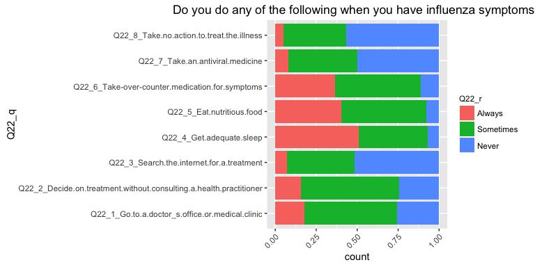<!-- -->

### Gender

```r
# p2
p2 <- ggplot(q22, aes(Q22_q, weight = Freq)) + ptext

# gender
p2 + geom_bar(position = "fill") + aes(Q22_q, fill = PPGENDER) + facet_wrap(~Q22_r) + ggtitle("By gender") + coord_flip()
```

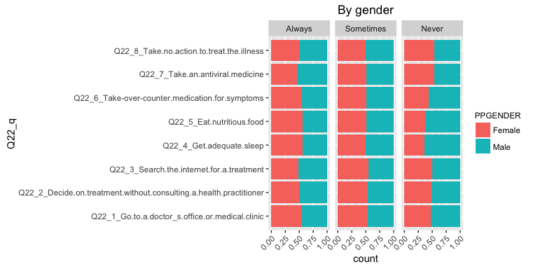<!-- -->

```r
p2 + geom_bar(position = "dodge") + aes(Q22_q, fill = PPGENDER) + facet_wrap(~Q22_r) + ggtitle("By gender") + coord_flip()
```

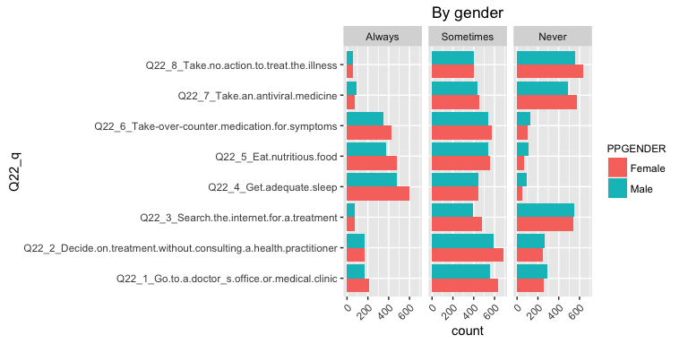<!-- -->

```r
p2 + geom_bar(position = "fill") + aes(PPGENDER, fill = Q22_r) + facet_wrap(~Q22_q) + coord_flip()
```

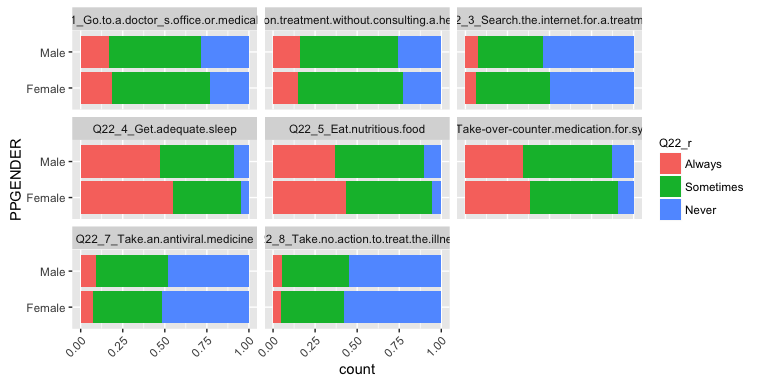<!-- -->

### Age group

```r
# by age group
p2 + geom_bar(position = "fill") + aes(Q22_q, fill = ppagect4) + facet_wrap(~Q22_r) + ggtitle("By age group") + coord_flip()
```

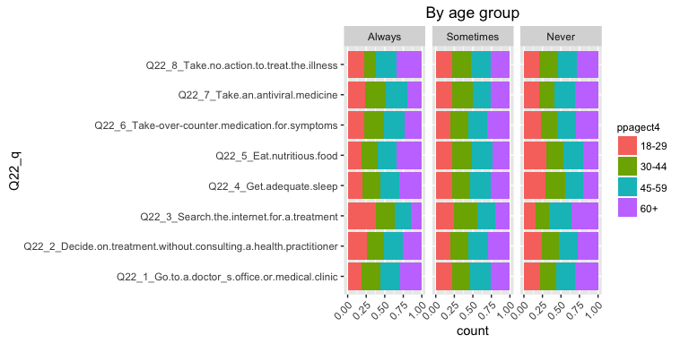<!-- -->


```r
p2 + geom_bar(position = "fill") + aes(Q22_q, fill = ppagect4) + facet_grid(Q22_r ~ .) + coord_flip()
```

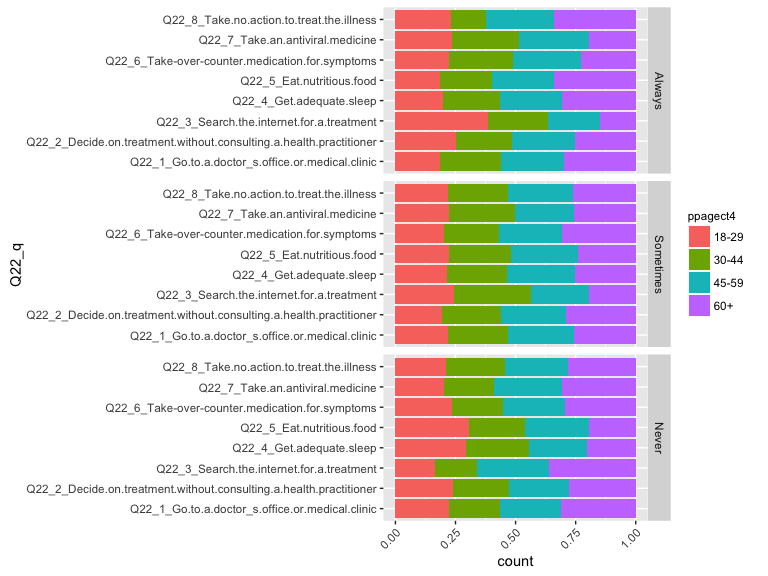<!-- -->

```r
p2 + geom_bar(position = "fill") + aes(ppagecat, fill = Q22_r) + facet_wrap(~Q22_q) 
```

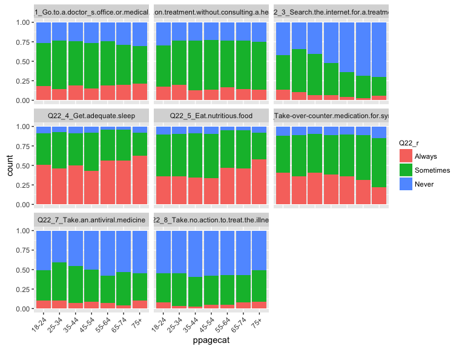<!-- -->

### Ethnicity

```r
# by ethnic group
p2 + geom_bar(position = "fill") + aes(Q22_q, fill = PPETHM) + facet_wrap(~Q22_r) + ggtitle("By ethnic group") + coord_flip()
```

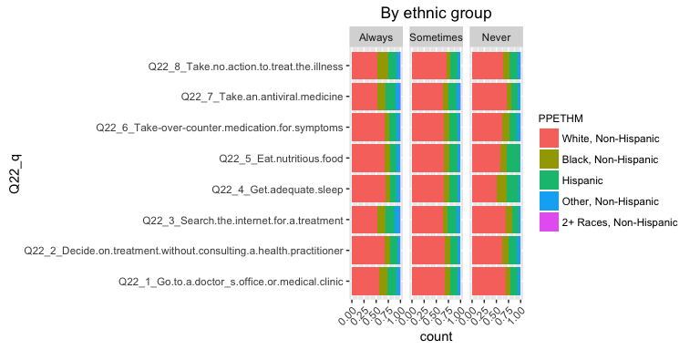<!-- -->


```r
p2 + geom_bar(position = "fill") + aes(Q22_q, fill = PPETHM) + facet_grid(Q22_r ~ .) + coord_flip()
```

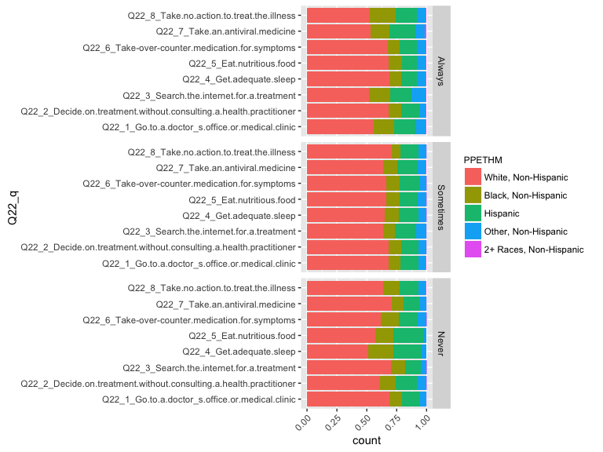<!-- -->

```r
p2 + geom_bar(position = "fill") + aes(PPETHM, fill = Q22_r) + facet_wrap(~Q22_q) 
```

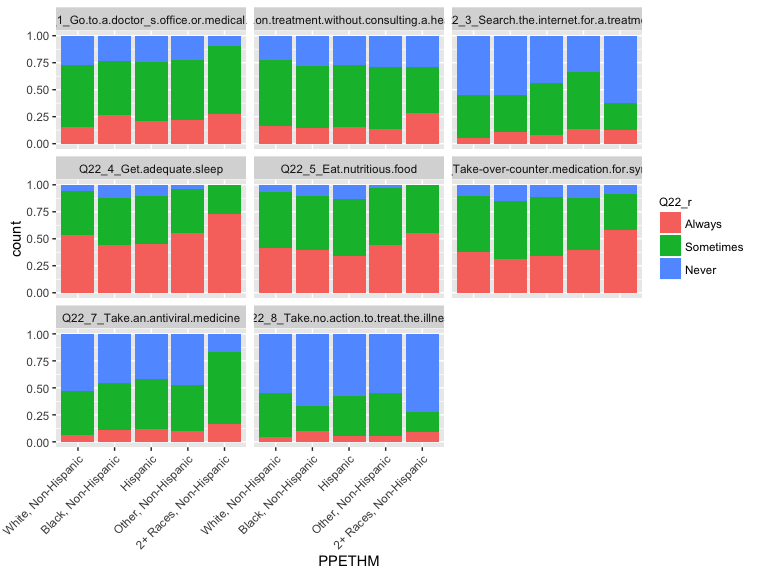<!-- -->

### Income

```r
# by income group
p2 + geom_bar(position = "fill") + aes(Q22_q, fill = PPINCIMP) + facet_wrap(~Q22_r) + ggtitle("By income group") + coord_flip() + ptext3
```

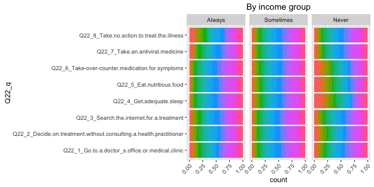<!-- -->


```r
p2 + geom_bar(position = "fill") + aes(Q22_q, fill = PPINCIMP) + facet_grid(Q22_r ~ .) + coord_flip() + ptext3
```

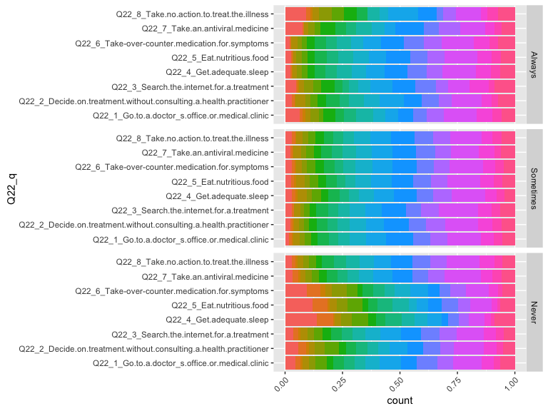<!-- -->

```r
p2 + geom_bar(position = "fill") + aes(PPINCIMP, fill = Q22_r) + facet_wrap(~Q22_q) + ptext2
```

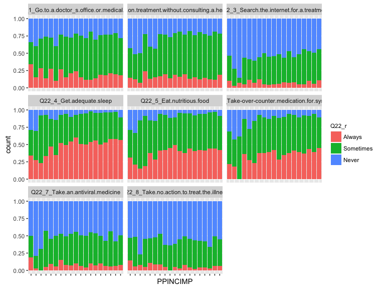<!-- -->


```r
# update weighted data frame
q22.2 <- data.frame(svytable(~Q22_q + Q22_r + PPEDUC + PPEDUCAT + work + PPWORK + marital + PPMARIT, des22, round = T))

# restate plots
p3 <- ggplot(q22.2, aes(Q22_q, weight = Freq)) + ptext

# descending order of labels
#plabel <- scale_x_discrete(limits = rev(levels()))
```

### Education

```r
# by education
p3 + geom_bar(position = "fill") + aes(Q22_q, fill = PPEDUCAT) + facet_wrap(~Q22_r) + ggtitle("By education") + coord_flip()
```

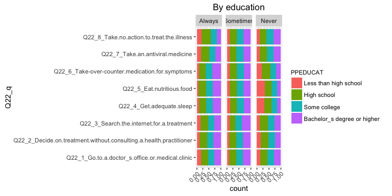<!-- -->


```r
p3 + geom_bar(position = "fill") + aes(Q22_q, fill = PPEDUCAT) + facet_grid(Q22_r ~ .) + coord_flip() #+ ptext3
```

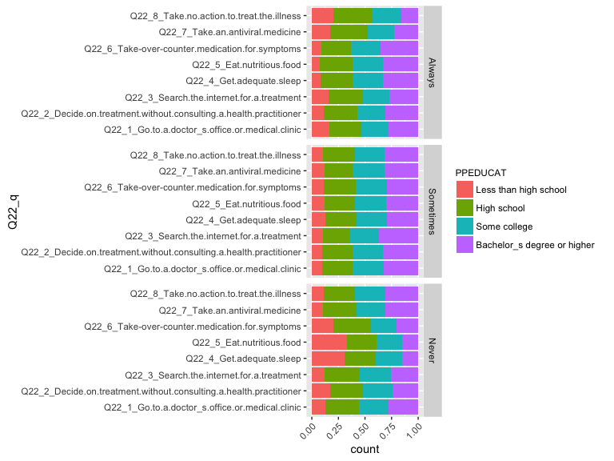<!-- -->

```r
p3 + geom_bar(position = "fill") + aes(PPEDUCAT, fill = Q22_r) + facet_wrap(~Q22_q) + ptext2 + ggtitle("By education")
```

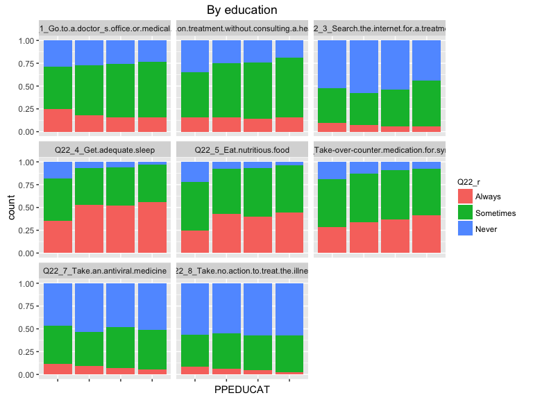<!-- -->


## Q23. Which of the following actions do you take when you have influenza symptoms to avoid someone else from getting sick?


```r
# subset question data, rename columns, gather into single column
q23_df <- df %>%
  select(CaseID, PPGENDER, PPAGE, ppagecat, ppagect4, PPETHM, PPINCIMP, PPEDUC, PPEDUCAT,
         work, PPWORK, marital, PPMARIT, PPMSACAT, ppreg9, PPSTATEN, PPHOUSE, PPRENT, PPNET, Q23_1:Q23_11, weight) %>%
  rename("Q23_1_Stand.away.from.people" = Q23_1,
         "Q23_2_Avoid.public.places" = Q23_2,
         "Q23_3_Avoid.public.transportation" = Q23_3,
         "Q23_4_Stay.at.home" = Q23_4,
         "Q23_5_Wash.my.hands.with.soap.more.often" = Q23_5,
         "Q23_6_Use.hand.sanitizers" = Q23_6,
         "Q23_7_Clean.the.surfaces.in.my.home" = Q23_7,
         "Q23_8_Clean.the.surfaces.I.use.at.work" = Q23_8,
         "Q23_9_Cover.my.nose.and.mouth.with.a.surgical.mask" = Q23_9,
         "Q23_10_Cover.my.nose.and.mouth.when.I.sneeze.or.cough" = Q23_10,
         "Q23_11_Other" = Q23_11) %>%  
  gather(Q23_q, Q23_r, Q23_1_Stand.away.from.people:Q23_10_Cover.my.nose.and.mouth.when.I.sneeze.or.cough, na.rm = T) %>%
  mutate(Q23_q = as.factor(Q23_q)) %>%
  mutate(Q23_r = factor(Q23_r, levels = c("Always", "Sometimes", "Never")))


# survey design
options(digits = 4)
options(survey.lonely.psu = "adjust")
des23 <- svydesign(ids = ~1, weights = ~weight, data = q23_df[is.na(q23_df$weight)==F, ])
```


```r
# weighted data frame
q23 <- data.frame(svytable(~Q23_q + Q23_r + PPGENDER + ppagecat + ppagect4 + PPETHM + PPINCIMP, des23, round = T))

# plot templates
title <- ggtitle("Which of the following actions do you take when you have influenza symptoms \nto avoid someone else from getting sick?")
# descending order

## main plot
p <- ggplot(q23, aes(Q23_q, weight = Freq)) + ptext
p + geom_bar(position = 'fill') + aes(fill = Q23_r) + title + coord_flip()
```

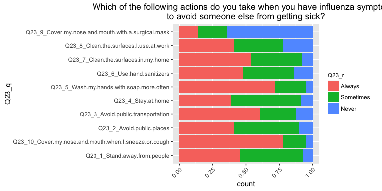<!-- -->

### Gender

```r
# p2
p2 <- ggplot(q23, aes(Q23_q, weight = Freq)) + ptext

# by gender
p2 + geom_bar(position = "fill") + aes(Q23_q, fill = PPGENDER) + facet_wrap(~Q23_r) + ggtitle("By gender") + coord_flip()
```

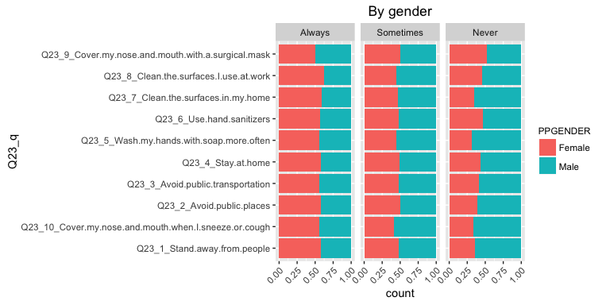<!-- -->

```r
p2 + geom_bar(position = "dodge") + aes(Q23_q, fill = PPGENDER) + facet_wrap(~Q23_r) + ggtitle("By gender") + coord_flip()
```

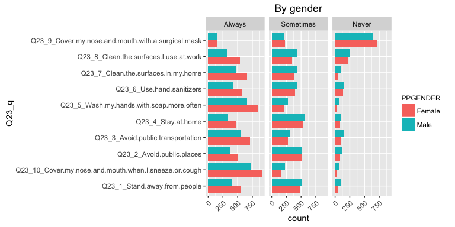<!-- -->

```r
p2 + geom_bar(position = "fill") + aes(PPGENDER, fill = Q23_r) + facet_wrap(~Q23_q) + coord_flip()
```

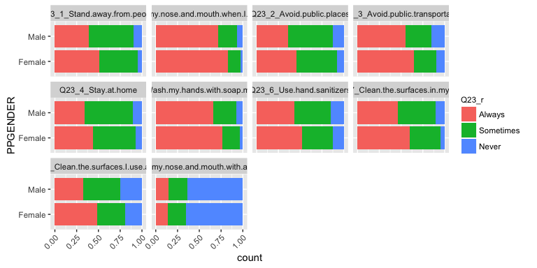<!-- -->

### Age

```r
# by age group
p2 + geom_bar(position = "fill") + aes(Q23_q, fill = ppagect4) + facet_wrap(~Q23_r) + ggtitle("By age group") + coord_flip()
```

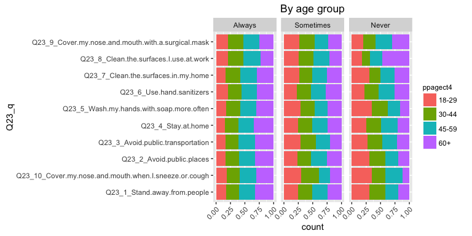<!-- -->


```r
p2 + geom_bar(position = "fill") + aes(Q23_q, fill = ppagect4) + facet_grid(Q23_r ~ .) + coord_flip()
```

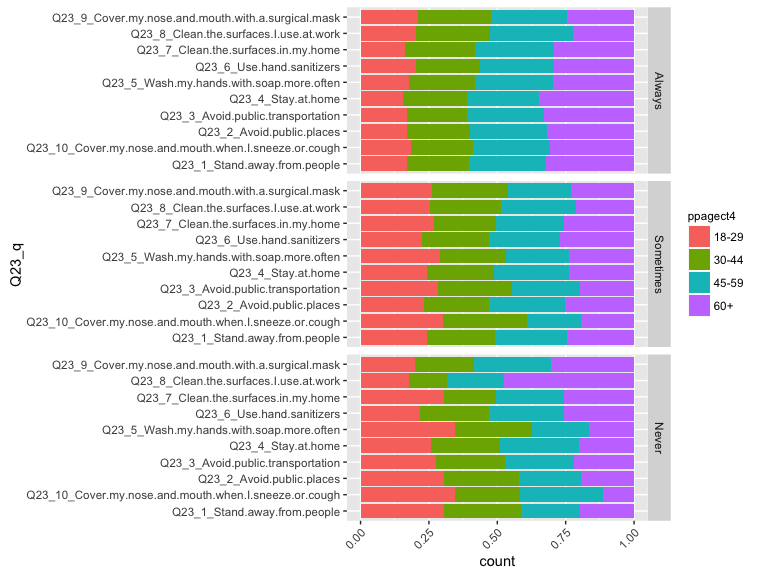<!-- -->

```r
p2 + geom_bar(position = "fill") + aes(ppagecat, fill = Q23_r) + facet_wrap(~Q23_q) 
```

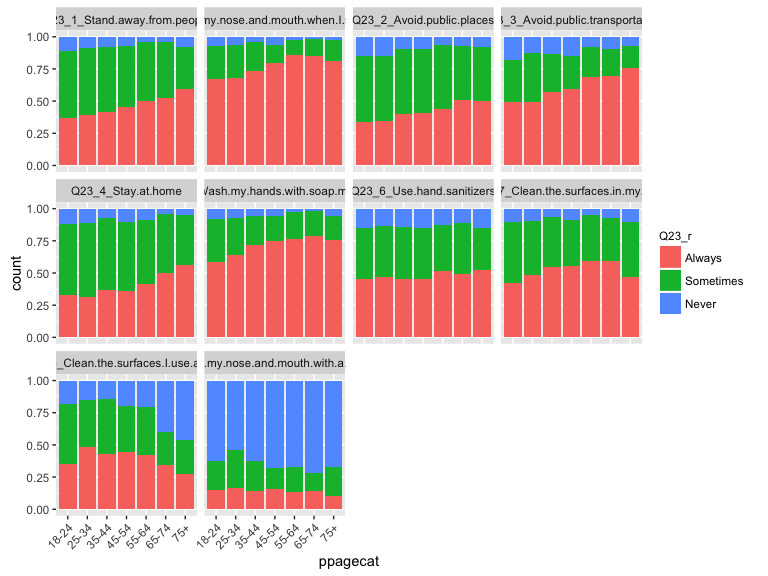<!-- -->


### Ethnicity

```r
# by ethnic group
p2 + geom_bar(position = "fill") + aes(Q23_q, fill = PPETHM) + facet_wrap(~Q23_r) + ggtitle("By ethnic group") + coord_flip()
```

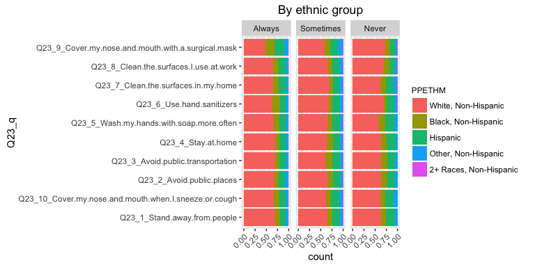<!-- -->


```r
p2 + geom_bar(position = "fill") + aes(Q23_q, fill = PPETHM) + facet_grid(Q23_r ~ .) + coord_flip()
```

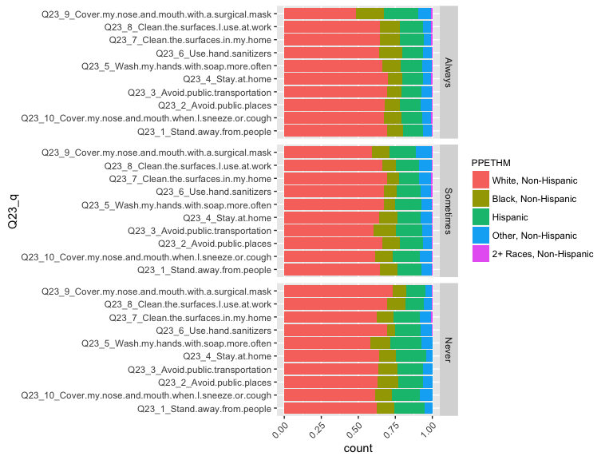<!-- -->

```r
p2 + geom_bar(position = "fill") + aes(PPETHM, fill = Q23_r) + facet_wrap(~Q23_q) 
```

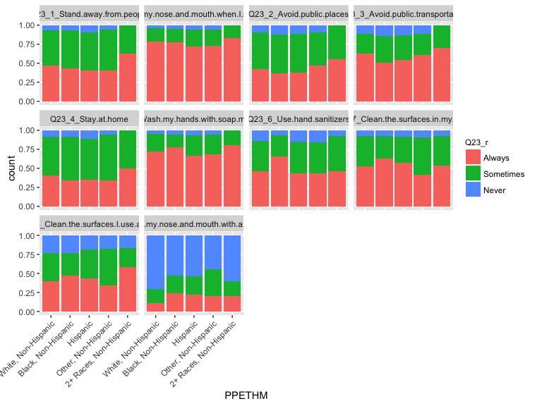<!-- -->


### Income

```r
# by income
p2 + geom_bar(position = "fill") + aes(Q23_q, fill = PPINCIMP) + facet_wrap(~Q23_r) + ggtitle("By income group") + coord_flip() + ptext3
```

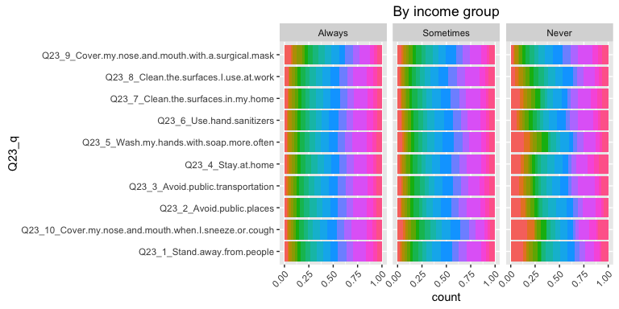<!-- -->


```r
p2 + geom_bar(position = "fill") + aes(Q23_q, fill = PPINCIMP) + facet_grid(Q23_r ~ .) + coord_flip() + ptext3
```

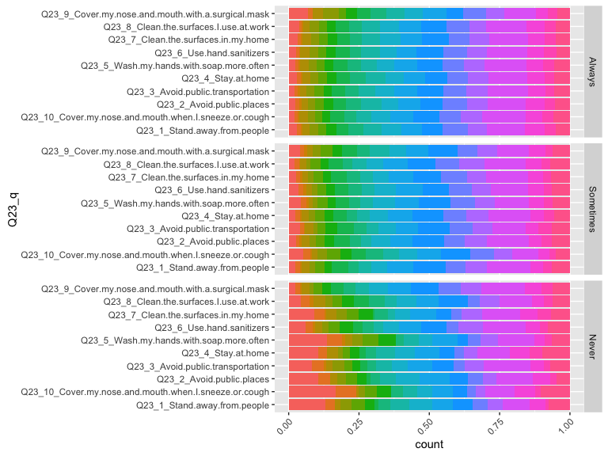<!-- -->

```r
p2 + geom_bar(position = "fill") + aes(PPINCIMP, fill = Q23_r) + facet_wrap(~Q23_q) + ptext2
```

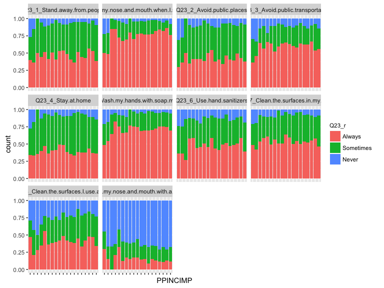<!-- -->


###


```r
# update weighted data frame
q23.2 <- data.frame(svytable(~Q23_q + Q23_r + PPEDUC + PPEDUCAT + work + PPWORK + marital + PPMARIT, des23, round = T))

# restate plots
p3 <- ggplot(q23.2, aes(Q23_q, weight = Freq)) + ptext

# descending order of labels
#plabel <- scale_x_discrete(limits = rev(levels()))
```

### Education

```r
# by education
p3 + geom_bar(position = "fill") + aes(Q23_q, fill = PPEDUCAT) + facet_wrap(~Q23_r) + ggtitle("By education") + coord_flip()
```

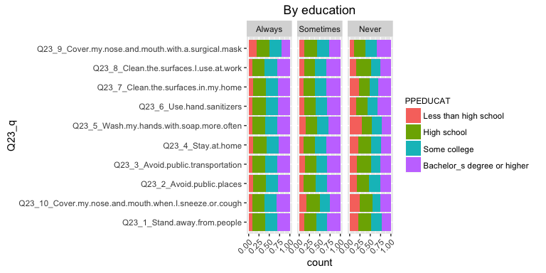<!-- -->


```r
p3 + geom_bar(position = "fill") + aes(Q23_q, fill = PPEDUCAT) + facet_grid(Q23_r ~ .) + coord_flip() #+ ptext3
```

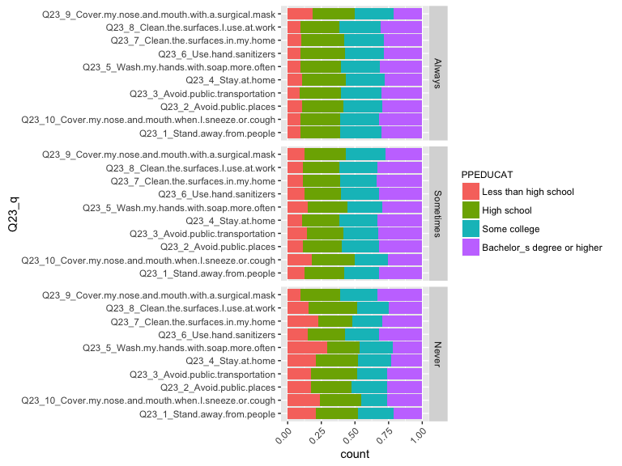<!-- -->

```r
p3 + geom_bar(position = "fill") + aes(PPEDUCAT, fill = Q23_r) + facet_wrap(~Q23_q) + ptext2 + ggtitle("By education")
```

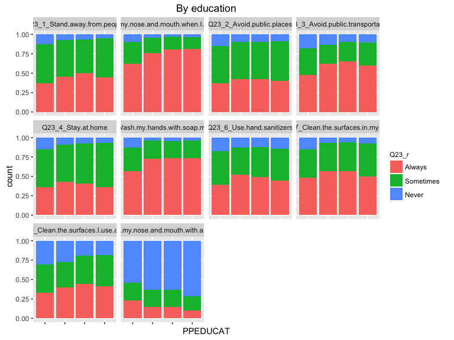<!-- -->

