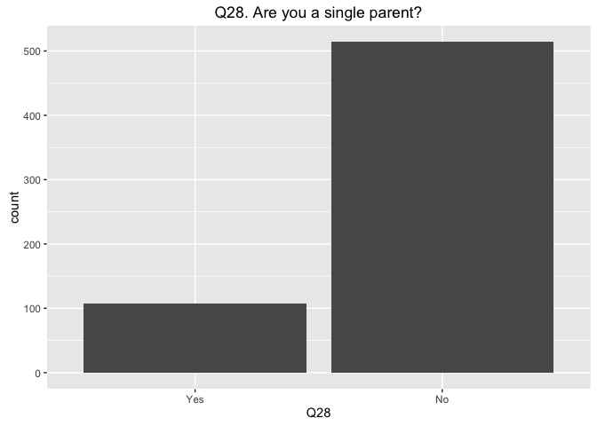
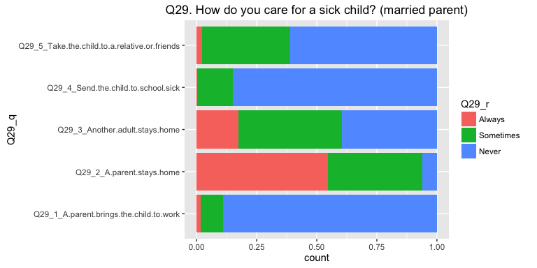
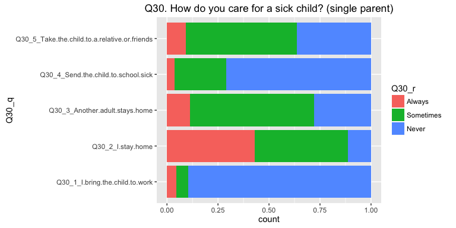

# Q28-30

Questions 28, 29, 30


```r
## Create survey object.
options(digits = 4)
options(survey.lonely.psu = "adjust")

des <- svydesign(ids = ~1, weights = ~weight, data = df[is.na(df$weight)==F, ])
```


## Q28. Are you a single parent?


```r
# weighted data frame
q28 <- as.data.frame(svytable(
  ~Q28 + PPGENDER + ppagecat + ppagect4 + PPETHM + PPINCIMP + PPEDUCAT, des, round = T))

# plot templates
title <- ggtitle("Q28. Are you a single parent?")

## main plot
p <- ggplot(q28, aes(Q28, weight = Freq))
p + geom_bar() + title
```

<!-- -->


## Q29. How do you care for a sick child? (married parent)


```r
# subset question data, rename columns, gather into single column
q29_df <- df %>%
  select(CaseID, PPGENDER, PPAGE, ppagecat, ppagect4, PPETHM, PPINCIMP, PPEDUC, PPEDUCAT, work, PPWORK, marital, PPMARIT, PPMSACAT, ppreg9, PPSTATEN, PPHOUSE, PPRENT, PPNET, Q29_1:Q29_6, weight) %>%
  rename("Q29_1_A.parent.brings.the.child.to.work" = Q29_1,
         "Q29_2_A.parent.stays.home" = Q29_2,
         "Q29_3_Another.adult.stays.home" = Q29_3,
         "Q29_4_Send.the.child.to.school.sick" = Q29_4,
         "Q29_5_Take.the.child.to.a.relative.or.friends" =	Q29_5,
         "Q29_6_Other" = Q29_6) %>%
  gather(Q29_q, Q29_r, Q29_1_A.parent.brings.the.child.to.work:Q29_5_Take.the.child.to.a.relative.or.friends, na.rm = T) %>%
  mutate(Q29_q = as.factor(Q29_q)) %>%
  mutate(Q29_r = factor(Q29_r, levels = c("Always", "Sometimes", "Never")))


# survey design
options(digits = 4)
options(survey.lonely.psu = "adjust")
des29 <- svydesign(ids = ~1, weights = ~weight, data = q29_df[is.na(q29_df$weight)==F, ])
```


```r
# weighted data frame
q29 <- data.frame(svytable(~Q29_q + Q29_r + PPGENDER + ppagecat + ppagect4 + PPETHM + PPINCIMP, des29, round = T))

# plot templates
title <- ggtitle("Q29. How do you care for a sick child? (married parent)")

## main plot
p <- ggplot(q29, aes(Q29_q, weight = Freq))
p + geom_bar(position = "fill") + aes(fill = Q29_r) + title + coord_flip()
```

<!-- -->


## Q30. How do you care for a sick child? (single parent)


```r
# subset question data, rename columns, gather into single column
q30_df <- df %>%
  select(CaseID, PPGENDER, PPAGE, ppagecat, ppagect4, PPETHM, PPINCIMP, PPEDUC, PPEDUCAT, work, PPWORK, marital, PPMARIT, PPMSACAT, ppreg9, PPSTATEN, PPHOUSE, PPRENT, PPNET, Q30_1:Q30_6, weight) %>%
  rename("Q30_1_I.bring.the.child.to.work" = Q30_1,
         "Q30_2_I.stay.home" = Q30_2,
         "Q30_3_Another.adult.stays.home" = Q30_3,
         "Q30_4_Send.the.child.to.school.sick" = Q30_4,
         "Q30_5_Take.the.child.to.a.relative.or.friends" = Q30_5,
         "Q30_6_Other" = Q30_6) %>%
  gather(Q30_q, Q30_r, Q30_1_I.bring.the.child.to.work:Q30_5_Take.the.child.to.a.relative.or.friends, na.rm = T) %>%
  mutate(Q30_q = as.factor(Q30_q)) %>%
  mutate(Q30_r = factor(Q30_r, levels = c("Always", "Sometimes", "Never")))


# survey design
options(digits = 4)
options(survey.lonely.psu = "adjust")
des30 <- svydesign(ids = ~1, weights = ~weight, data = q30_df[is.na(q30_df$weight)==F, ])
```


```r
# weighted data frame
q30 <- data.frame(svytable(~Q30_q + Q30_r + PPGENDER + ppagecat + ppagect4 + PPETHM + PPINCIMP, des30, round = T))

# plot templates
title <- ggtitle("Q30. How do you care for a sick child? (single parent)")
# descending order


## main plot
p <- ggplot(q30, aes(Q30_q, weight = Freq))
p + geom_bar(position = "fill") + aes(fill = Q30_r) + title + coord_flip()
```

<!-- -->

